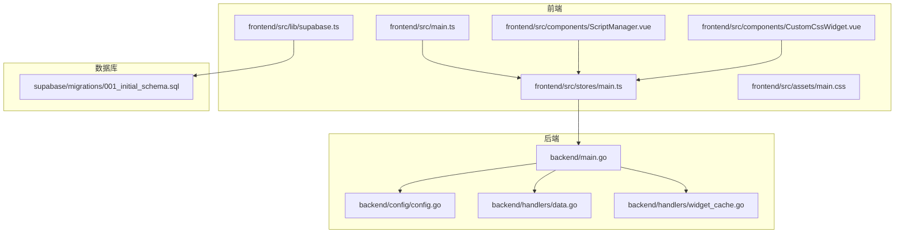
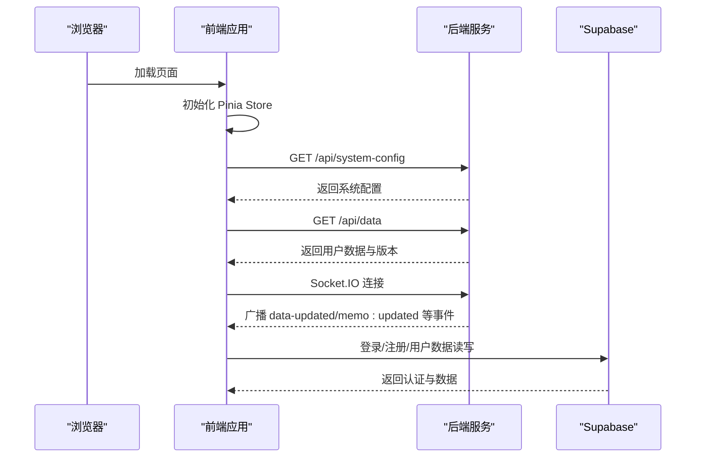
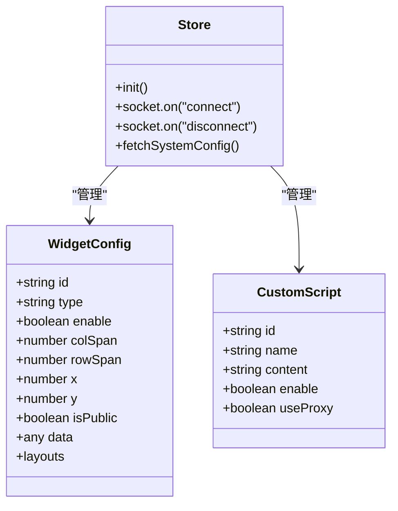
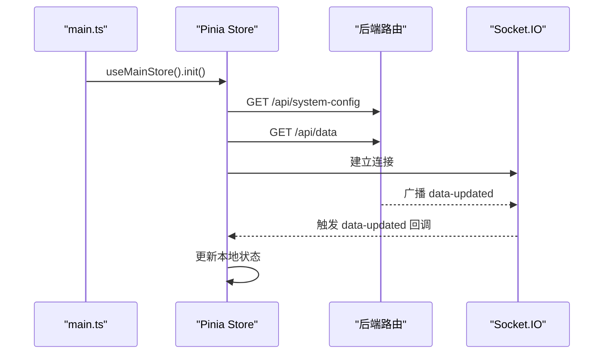
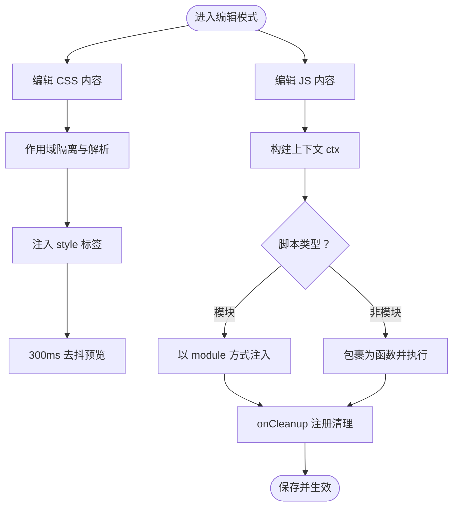
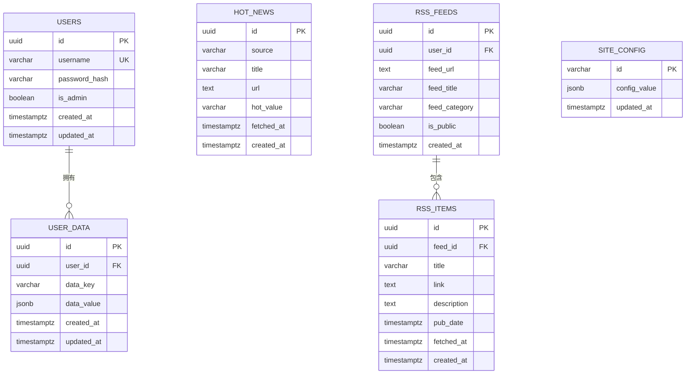
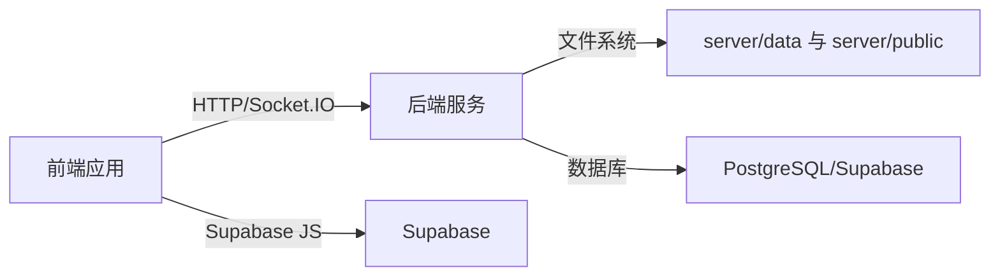

# 扩展开发

<cite>
**本文档引用的文件**
- [backend/main.go](file://backend/main.go)
- [backend/config/config.go](file://backend/config/config.go)
- [backend/handlers/data.go](file://backend/handlers/data.go)
- [backend/handlers/widget_cache.go](file://backend/handlers/widget_cache.go)
- [frontend/src/main.ts](file://frontend/src/main.ts)
- [frontend/src/lib/supabase.ts](file://frontend/src/lib/supabase.ts)
- [frontend/src/components/CustomCssWidget.vue](file://frontend/src/components/CustomCssWidget.vue)
- [frontend/src/components/ScriptManager.vue](file://frontend/src/components/ScriptManager.vue)
- [frontend/src/stores/main.ts](file://frontend/src/stores/main.ts)
- [frontend/src/types.ts](file://frontend/src/types.ts)
- [frontend/src/assets/main.css](file://frontend/src/assets/main.css)
- [supabase/migrations/001_initial_schema.sql](file://supabase/migrations/001_initial_schema.sql)
- [README.md](file://README.md)
</cite>

## 目录
1. [简介](#简介)
2. [项目结构](#项目结构)
3. [核心组件](#核心组件)
4. [架构总览](#架构总览)
5. [详细组件分析](#详细组件分析)
6. [依赖关系分析](#依赖关系分析)
7. [性能考虑](#性能考虑)
8. [故障排查指南](#故障排查指南)
9. [结论](#结论)
10. [附录](#附录)

## 简介
本指南面向希望为 OFlatNas 开发扩展的工程师与高级用户，涵盖自定义组件开发、组件注册与生命周期管理、自定义 CSS/JS 脚本系统与注入机制、沙箱安全限制、插件系统架构、第三方服务集成与 API 扩展、主题与样式定制、Supabase 数据库集成、外部 API 调用与数据同步、性能优化与资源控制、平台适配与兼容性处理，以及扩展发布流程与版本管理。

## 项目结构
- 后端（Go/Gin）负责路由、静态资源、中间件、Socket.IO 通信、缓存与数据持久化。
- 前端（Vue 3/Pinia）负责组件渲染、状态管理、实时通信、脚本管理与主题定制。
- Supabase 提供用户认证、用户数据、热搜与 RSS 缓存等云端能力。
- 静态资源与数据文件位于 server/public 与 server/data，支持自定义脚本与组件。

**图表来源**
- [backend/main.go:25-267](file://backend/main.go#L25-L267)
- [backend/config/config.go:35-86](file://backend/config/config.go#L35-L86)
- [backend/handlers/data.go:159-322](file://backend/handlers/data.go#L159-L322)
- [backend/handlers/widget_cache.go:41-154](file://backend/handlers/widget_cache.go#L41-L154)
- [frontend/src/main.ts:1-37](file://frontend/src/main.ts#L1-L37)
- [frontend/src/stores/main.ts:30-96](file://frontend/src/stores/main.ts#L30-L96)
- [frontend/src/components/ScriptManager.vue:1-322](file://frontend/src/components/ScriptManager.vue#L1-L322)
- [frontend/src/components/CustomCssWidget.vue:1-444](file://frontend/src/components/CustomCssWidget.vue#L1-L444)
- [frontend/src/lib/supabase.ts:1-343](file://frontend/src/lib/supabase.ts#L1-L343)
- [supabase/migrations/001_initial_schema.sql:1-226](file://supabase/migrations/001_initial_schema.sql#L1-L226)

**章节来源**
- [backend/main.go:25-267](file://backend/main.go#L25-L267)
- [backend/config/config.go:35-86](file://backend/config/config.go#L35-L86)
- [frontend/src/main.ts:1-37](file://frontend/src/main.ts#L1-L37)
- [frontend/src/stores/main.ts:30-96](file://frontend/src/stores/main.ts#L30-L96)
- [frontend/src/lib/supabase.ts:1-343](file://frontend/src/lib/supabase.ts#L1-L343)
- [supabase/migrations/001_initial_schema.sql:1-226](file://supabase/migrations/001_initial_schema.sql#L1-L226)

## 核心组件
- 后端主程序与路由：初始化配置、中间件、CORS、Gzip、Socket.IO、静态资源与 API 路由。
- 配置系统：自动探测 BaseDir、创建必要目录、确保系统配置与数据文件存在。
- 数据与版本管理：用户数据读取/保存、版本冲突检测、密码哈希、Memo 文件对齐。
- 组件缓存：统一的 widget_cache.json 管理 RSS/热搜/天气等数据缓存。
- 前端应用入口：平台适配（HarmonyOS/Huawei/Alook）、全局 Store 初始化。
- 实时通信与心跳：Socket.IO 连接、心跳检测、断线重连与版本同步。
- 自定义脚本与组件：脚本管理器、自定义 CSS/JS 注入与作用域隔离。
- Supabase 集成：用户认证、用户数据、热搜与 RSS 缓存、实时订阅。

**章节来源**
- [backend/main.go:25-267](file://backend/main.go#L25-L267)
- [backend/config/config.go:35-256](file://backend/config/config.go#L35-L256)
- [backend/handlers/data.go:159-744](file://backend/handlers/data.go#L159-L744)
- [backend/handlers/widget_cache.go:41-154](file://backend/handlers/widget_cache.go#L41-L154)
- [frontend/src/main.ts:9-31](file://frontend/src/main.ts#L9-L31)
- [frontend/src/stores/main.ts:30-96](file://frontend/src/stores/main.ts#L30-L96)
- [frontend/src/components/ScriptManager.vue:1-322](file://frontend/src/components/ScriptManager.vue#L1-L322)
- [frontend/src/components/CustomCssWidget.vue:1-444](file://frontend/src/components/CustomCssWidget.vue#L1-L444)
- [frontend/src/lib/supabase.ts:1-343](file://frontend/src/lib/supabase.ts#L1-L343)

## 架构总览
OFlatNas 采用前后端分离架构：
- 前端通过 Socket.IO 与后端建立长连接，实现数据与事件的实时推送。
- 后端提供 RESTful API 与静态资源服务，支持自定义脚本与组件的数据持久化。
- Supabase 提供用户认证与数据存储，前端通过 Supabase SDK 访问。

**图表来源**
- [frontend/src/stores/main.ts:122-154](file://frontend/src/stores/main.ts#L122-L154)
- [backend/main.go:166-254](file://backend/main.go#L166-L254)
- [frontend/src/lib/supabase.ts:90-144](file://frontend/src/lib/supabase.ts#L90-L144)

**章节来源**
- [backend/main.go:166-254](file://backend/main.go#L166-L254)
- [frontend/src/stores/main.ts:122-154](file://frontend/src/stores/main.ts#L122-L154)
- [frontend/src/lib/supabase.ts:90-144](file://frontend/src/lib/supabase.ts#L90-L144)

## 详细组件分析

### 自定义组件开发与生命周期
- 组件类型与数据结构：WidgetConfig 描述组件的布局、启用状态、数据与跨设备布局。
- 生命周期钩子：前端 Store 在连接建立、断开、版本变化时触发初始化与重置逻辑。
- 组件渲染：CustomCssWidget 支持 HTML/CSS/JS 的组合，提供作用域隔离与实时预览。

**图表来源**
- [frontend/src/types.ts:202-224](file://frontend/src/types.ts#L202-L224)
- [frontend/src/types.ts:64-70](file://frontend/src/types.ts#L64-L70)
- [frontend/src/stores/main.ts:30-96](file://frontend/src/stores/main.ts#L30-L96)

**章节来源**
- [frontend/src/types.ts:202-224](file://frontend/src/types.ts#L202-L224)
- [frontend/src/types.ts:64-70](file://frontend/src/types.ts#L64-L70)
- [frontend/src/stores/main.ts:30-96](file://frontend/src/stores/main.ts#L30-L96)
- [frontend/src/components/CustomCssWidget.vue:1-444](file://frontend/src/components/CustomCssWidget.vue#L1-L444)

### 组件注册机制与数据流
- 后端路由注册：统一在 main.go 中注册 API 与 Socket.IO 事件。
- 前端 Store 初始化：在 main.ts 中创建应用与 Store，并在 store.init() 中发起系统配置与数据获取。
- 数据流：前端通过 Socket.IO 接收后端广播，实现数据与事件的实时同步。

**图表来源**
- [frontend/src/main.ts:27-29](file://frontend/src/main.ts#L27-L29)
- [frontend/src/stores/main.ts:122-154](file://frontend/src/stores/main.ts#L122-L154)
- [backend/main.go:166-254](file://backend/main.go#L166-L254)

**章节来源**
- [frontend/src/main.ts:27-29](file://frontend/src/main.ts#L27-L29)
- [frontend/src/stores/main.ts:122-154](file://frontend/src/stores/main.ts#L122-L154)
- [backend/main.go:166-254](file://backend/main.go#L166-L254)

### 自定义 CSS/JS 脚本系统与注入机制
- 脚本管理器：支持拖拽上传、排序、启用/禁用、代理开关与内容编辑。
- 自定义 CSS：支持选择器作用域隔离（基于组件 ID），实时预览与自动去抖。
- 自定义 JS：支持模块与非模块两种脚本，提供上下文对象 ctx（el/query/queryAll/onCleanup/on/emit）。
- 全局脚本：通过 AppConfig.customCssList/customJsList 管理全局脚本集合。

**图表来源**
- [frontend/src/components/ScriptManager.vue:1-322](file://frontend/src/components/ScriptManager.vue#L1-L322)
- [frontend/src/components/CustomCssWidget.vue:24-105](file://frontend/src/components/CustomCssWidget.vue#L24-L105)
- [frontend/src/components/CustomCssWidget.vue:107-176](file://frontend/src/components/CustomCssWidget.vue#L107-L176)
- [frontend/src/types.ts:180-184](file://frontend/src/types.ts#L180-L184)

**章节来源**
- [frontend/src/components/ScriptManager.vue:1-322](file://frontend/src/components/ScriptManager.vue#L1-L322)
- [frontend/src/components/CustomCssWidget.vue:24-105](file://frontend/src/components/CustomCssWidget.vue#L24-L105)
- [frontend/src/components/CustomCssWidget.vue:107-176](file://frontend/src/components/CustomCssWidget.vue#L107-L176)
- [frontend/src/types.ts:180-184](file://frontend/src/types.ts#L180-L184)

### 沙箱安全限制与上下文
- 上下文对象 ctx 提供：
  - el：组件容器 DOM
  - query/queryAll：限定于组件内的查询
  - onCleanup：注册清理回调
  - emit/on：通过 flatnas:* 事件总线通信
- 非模块脚本通过包装函数执行，模块脚本以 type="module" 注入。
- 全局 JS 需要用户同意免责声明后启用。

**章节来源**
- [frontend/src/components/CustomCssWidget.vue:139-153](file://frontend/src/components/CustomCssWidget.vue#L139-L153)
- [frontend/src/components/CustomCssWidget.vue:165-176](file://frontend/src/components/CustomCssWidget.vue#L165-L176)
- [README.md:241-283](file://README.md#L241-L283)

### 插件系统架构与第三方服务集成
- 插件形态：自定义组件（HTML/CSS/JS）、全局脚本（CSS/JS 列表）、Marketplace 扩展（类型声明）。
- 第三方服务：Supabase 用户认证与数据存储、天气/热搜/RSS 缓存、Docker 管理、文件传输与缩略图生成。
- API 扩展：后端通过 handlers 包扩展新接口，前端通过 Store 与 Socket.IO 接收事件。

**章节来源**
- [frontend/src/types.ts:191-200](file://frontend/src/types.ts#L191-L200)
- [backend/handlers/data.go:159-322](file://backend/handlers/data.go#L159-L322)
- [frontend/src/lib/supabase.ts:1-343](file://frontend/src/lib/supabase.ts#L1-L343)

### 主题开发与样式定制
- 全局 CSS：通过 AppConfig.customCss 与自定义 CSS 列表实现全局样式增强。
- 响应式语法：支持 <mobile>/<desktop>/<dark>/<light> 标签自动转换为媒体查询。
- 组件样式：CustomCssWidget 为每个组件提供独立作用域，避免样式污染。
- 滚动条与主题变量：main.css 定义玻璃拟态滚动条与 RSS 表单主题变量。

**章节来源**
- [frontend/src/assets/main.css:1-132](file://frontend/src/assets/main.css#L1-L132)
- [frontend/src/components/CustomCssWidget.vue:86-105](file://frontend/src/components/CustomCssWidget.vue#L86-L105)
- [README.md:215-239](file://README.md#L215-L239)

### Supabase 数据库集成与数据同步
- 数据模型：users、user_data、hot_news、rss_feeds、rss_items、site_config。
- 认证与权限：基于 Supabase Auth，启用 RLS 策略限制用户访问范围。
- 实时订阅：前端通过 Supabase Realtime 订阅 user_data 变更，实现跨端同步。
- 数据同步：前端 Store 在连接恢复后检查系统配置变化并触发重初始化。

**图表来源**
- [supabase/migrations/001_initial_schema.sql:10-96](file://supabase/migrations/001_initial_schema.sql#L10-L96)
- [supabase/migrations/001_initial_schema.sql:60-87](file://supabase/migrations/001_initial_schema.sql#L60-L87)
- [supabase/migrations/001_initial_schema.sql:92-96](file://supabase/migrations/001_initial_schema.sql#L92-L96)

**章节来源**
- [supabase/migrations/001_initial_schema.sql:10-96](file://supabase/migrations/001_initial_schema.sql#L10-L96)
- [frontend/src/lib/supabase.ts:146-255](file://frontend/src/lib/supabase.ts#L146-L255)
- [frontend/src/stores/main.ts:58-91](file://frontend/src/stores/main.ts#L58-L91)

### 外部 API 调用与数据同步机制
- 天气/热搜/RSS 缓存：后端通过 widget_cache.json 统一管理缓存项，支持 TTL 与状态标记。
- 数据版本与幂等：后端对用户数据保存进行版本校验与幂等缓存，避免并发写入冲突。
- 代理转发：后端提供代理接口，前端可按需启用代理开关以访问受限资源。

**章节来源**
- [backend/handlers/widget_cache.go:41-154](file://backend/handlers/widget_cache.go#L41-L154)
- [backend/handlers/data.go:638-744](file://backend/handlers/data.go#L638-L744)
- [backend/main.go:135-135](file://backend/main.go#L135-L135)

## 依赖关系分析
- 前端依赖：
  - Vue 3 + Pinia：状态管理与响应式数据。
  - Socket.IO 客户端：实时通信。
  - Supabase JS SDK：用户认证与数据访问。
  - 自定义组件与脚本：通过组件与 Store 管理。
- 后端依赖：
  - Gin：Web 框架与路由。
  - Socket.IO：实时事件。
  - 配置与数据文件：config 包与 handlers 包协作。
- Supabase：
  - 用户与数据表、函数与策略、实时订阅。

**图表来源**
- [backend/main.go:166-254](file://backend/main.go#L166-L254)
- [frontend/src/lib/supabase.ts:1-343](file://frontend/src/lib/supabase.ts#L1-L343)
- [supabase/migrations/001_initial_schema.sql:1-226](file://supabase/migrations/001_initial_schema.sql#L1-L226)

**章节来源**
- [backend/main.go:166-254](file://backend/main.go#L166-L254)
- [frontend/src/lib/supabase.ts:1-343](file://frontend/src/lib/supabase.ts#L1-L343)
- [supabase/migrations/001_initial_schema.sql:1-226](file://supabase/migrations/001_initial_schema.sql#L1-L226)

## 性能考虑
- 网络传输优化：后端启用 Gzip 压缩与请求体大小限制，前端资源带时间戳参数避免缓存问题。
- 缓存策略：后端统一 widget_cache.json 管理外部数据缓存，前端 Store 在连接恢复后进行版本同步。
- 心跳与降级：前端通过 Socket.IO 心跳检测网络状态，支持 polling 降级与白名单模式降低请求频率。
- 资源控制：前端提供资源版本号与缓存失效策略，避免频繁重绘导致闪烁。

**章节来源**
- [backend/main.go:42-46](file://backend/main.go#L42-L46)
- [frontend/src/stores/main.ts:437-467](file://frontend/src/stores/main.ts#L437-L467)
- [frontend/src/stores/main.ts:561-577](file://frontend/src/stores/main.ts#L561-L577)

## 故障排查指南
- 代理配置：检查 PROXY_URL 环境变量格式与可用性，访问 /api/config/proxy-status 查看状态。
- 认证与权限：确认 Supabase Auth 已启用，RLS 策略生效，用户数据仅限本人访问。
- 数据同步：若出现版本冲突，检查前端版本与后端 version 字段一致性。
- 脚本执行：非模块脚本需在 ctx 上下文中运行，模块脚本需导出生命周期钩子。
- 平台适配：HarmonyOS/Huawei/Alook 浏览器会在根节点添加对应类名，便于样式区分。

**章节来源**
- [README.md:71-97](file://README.md#L71-L97)
- [frontend/src/lib/supabase.ts:197-216](file://frontend/src/lib/supabase.ts#L197-L216)
- [frontend/src/stores/main.ts:684-742](file://frontend/src/stores/main.ts#L684-L742)
- [frontend/src/main.ts:14-19](file://frontend/src/main.ts#L14-L19)

## 结论
OFlatNas 提供了完善的扩展开发框架：自定义组件与脚本系统、实时通信与数据同步、Supabase 云服务集成、主题与样式定制、性能优化与平台适配。开发者可基于现有组件与 API 快速扩展功能，同时遵循沙箱安全与版本管理规范，确保扩展的稳定性与安全性。

## 附录
- 发布流程与版本管理：参考 README 中的版本检测与 Docker 更新提示，结合后端版本字段与前端 Store 的版本同步逻辑，确保扩展发布后的兼容性与一致性。
- 向后兼容性：通过系统配置与数据版本控制，避免破坏性变更影响既有用户配置。

**章节来源**
- [README.md:524-559](file://README.md#L524-L559)
- [backend/handlers/data.go:324-343](file://backend/handlers/data.go#L324-L343)
- [frontend/src/stores/main.ts:510-522](file://frontend/src/stores/main.ts#L510-L522)