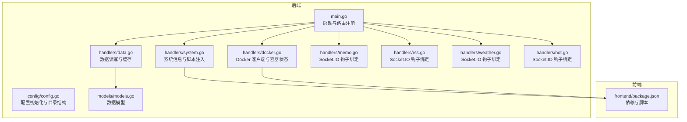
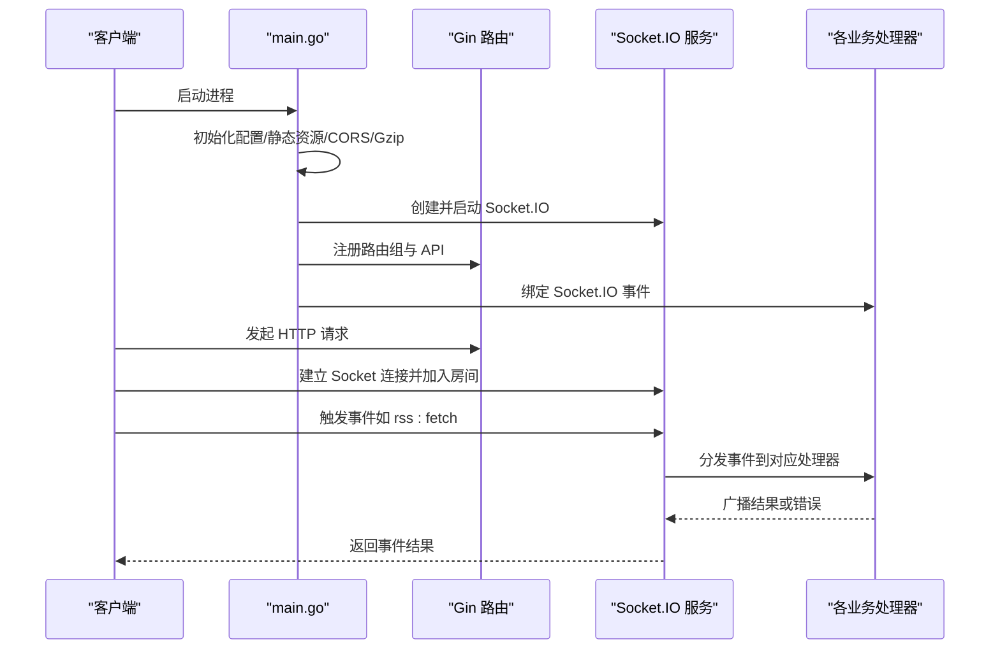
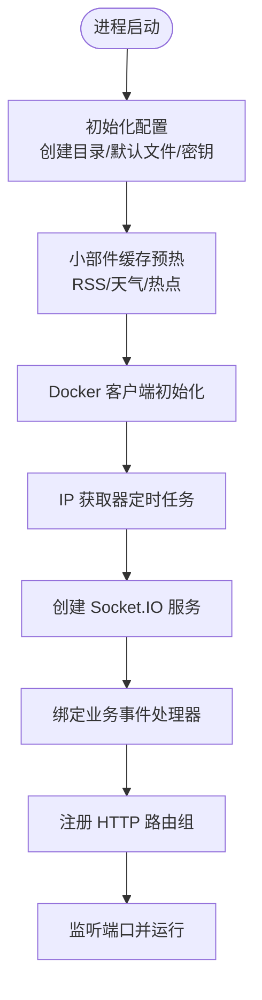
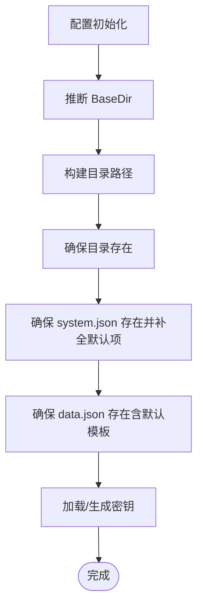
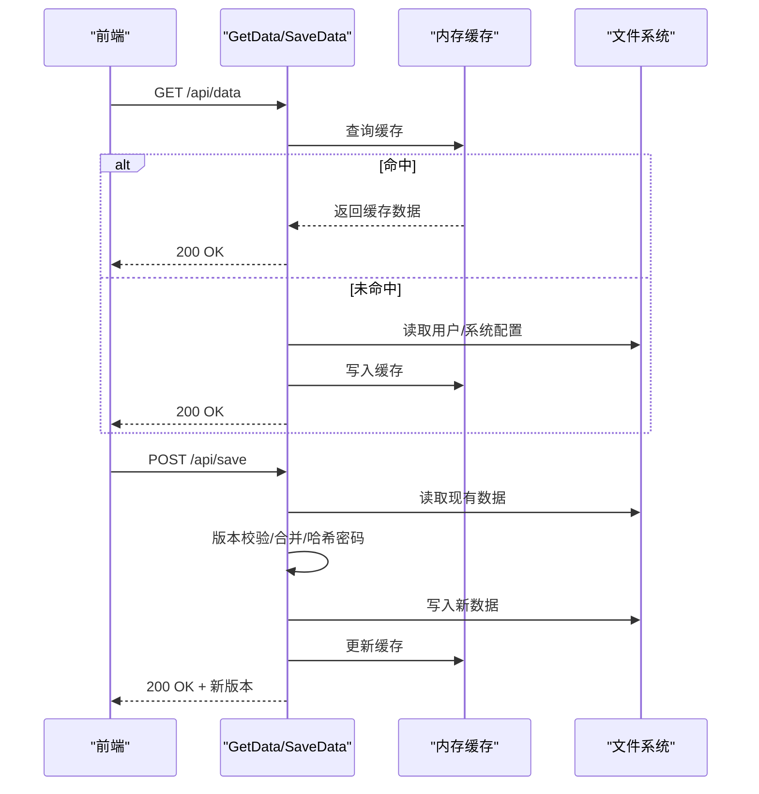
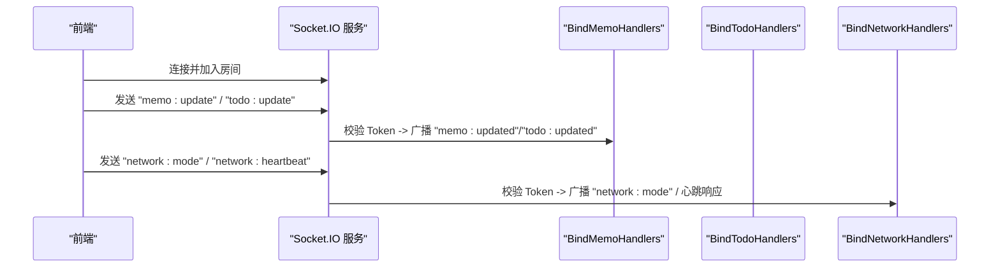
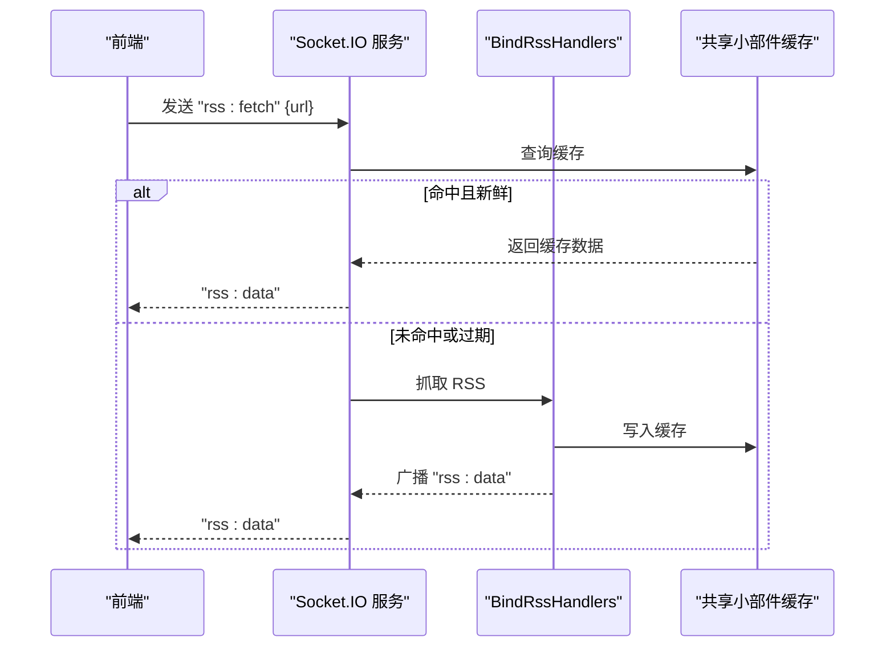
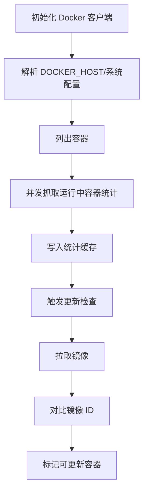
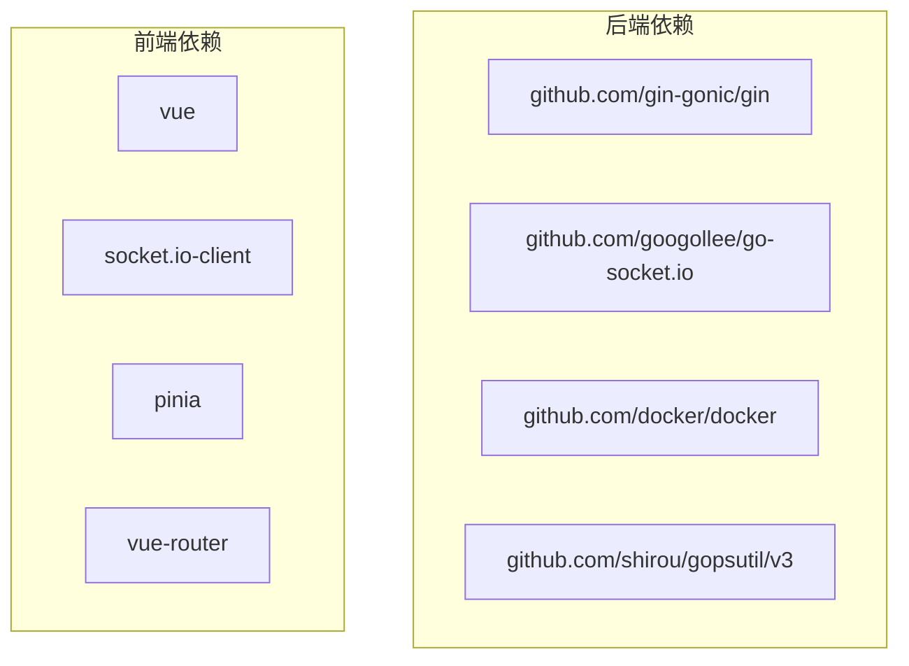

# 插件架构

<cite>
**本文档引用的文件**
- [backend/main.go](file://backend/main.go)
- [backend/go.mod](file://backend/go.mod)
- [backend/config/config.go](file://backend/config/config.go)
- [backend/handlers/data.go](file://backend/handlers/data.go)
- [backend/handlers/system.go](file://backend/handlers/system.go)
- [backend/handlers/docker.go](file://backend/handlers/docker.go)
- [backend/handlers/memo.go](file://backend/handlers/memo.go)
- [backend/handlers/rss.go](file://backend/handlers/rss.go)
- [backend/handlers/weather.go](file://backend/handlers/weather.go)
- [backend/handlers/hot.go](file://backend/handlers/hot.go)
- [backend/models/models.go](file://backend/models/models.go)
- [frontend/package.json](file://frontend/package.json)
</cite>

## 目录
1. [简介](#简介)
2. [项目结构](#项目结构)
3. [核心组件](#核心组件)
4. [架构总览](#架构总览)
5. [详细组件分析](#详细组件分析)
6. [依赖分析](#依赖分析)
7. [性能考虑](#性能考虑)
8. [故障排查指南](#故障排查指南)
9. [结论](#结论)
10. [附录](#附录)

## 简介
本文件面向 OFlatNas 的插件化扩展能力，系统阐述其插件架构设计、插件发现与动态加载机制、接口规范、API 扩展点与钩子系统、生命周期管理、依赖解析与版本兼容性检查，并提供插件开发框架、模板系统与构建工具链建议，以及插件市场机制、安装卸载与配置管理思路、跨平台兼容与多架构支持策略、性能优化方案、测试与调试方法及发布流程指引。需要特别说明的是：当前仓库代码未实现“插件系统”的具体实现，本文在不虚构事实的前提下，基于现有后端路由、Socket.IO 钩子、Docker 容器集成与前端包管理等能力，给出可落地的插件化扩展蓝图与实施路径。

## 项目结构
后端采用 Go Gin Web 框架，通过 Socket.IO 提供实时事件通道；前端使用 Vue 3 + Vite，具备组件化与模块化能力。整体以“后端 API + Socket.IO 事件 + 前端组件”为核心交互方式，为后续插件扩展预留了清晰的扩展点。

**图表来源**
- [backend/main.go:25-267](file://backend/main.go#L25-L267)
- [backend/config/config.go:35-86](file://backend/config/config.go#L35-L86)
- [backend/handlers/data.go:155-157](file://backend/handlers/data.go#L155-L157)
- [backend/handlers/system.go:205-272](file://backend/handlers/system.go#L205-L272)
- [backend/handlers/docker.go:42-66](file://backend/handlers/docker.go#L42-L66)
- [backend/handlers/memo.go:25-39](file://backend/handlers/memo.go#L25-L39)
- [backend/handlers/rss.go:82-135](file://backend/handlers/rss.go#L82-L135)
- [backend/handlers/weather.go:114-146](file://backend/handlers/weather.go#L114-L146)
- [backend/handlers/hot.go:31-79](file://backend/handlers/hot.go#L31-L79)
- [backend/models/models.go:1-118](file://backend/models/models.go#L1-L118)
- [frontend/package.json:1-77](file://frontend/package.json#L1-L77)

**章节来源**
- [backend/main.go:25-267](file://backend/main.go#L25-L267)
- [backend/config/config.go:35-86](file://backend/config/config.go#L35-L86)
- [frontend/package.json:1-77](file://frontend/package.json#L1-L77)

## 核心组件
- 启动与路由注册：后端主程序负责初始化配置、静态资源、CORS、Gzip、Socket.IO、路由组与 API 路由注册。
- 配置系统：集中管理 BASE_DIR、数据目录、用户目录、音乐/背景/图标缓存、公共资源目录与密钥生成。
- 数据层：统一的数据读取、写入、版本控制与缓存，支持访客过滤与敏感字段清理。
- Socket.IO 钩子：为“记事本”“RSS”“天气”“热点”等业务提供事件驱动的实时通信。
- Docker 集成：按系统配置启用/禁用 Docker，解析主机地址，拉取镜像并检测更新。
- 前端生态：Vue 组件化、包管理与构建脚本，便于插件作为独立模块接入。

**章节来源**
- [backend/main.go:25-267](file://backend/main.go#L25-L267)
- [backend/config/config.go:35-256](file://backend/config/config.go#L35-L256)
- [backend/handlers/data.go:155-744](file://backend/handlers/data.go#L155-L744)
- [backend/handlers/memo.go:25-226](file://backend/handlers/memo.go#L25-L226)
- [backend/handlers/rss.go:82-252](file://backend/handlers/rss.go#L82-L252)
- [backend/handlers/weather.go:114-206](file://backend/handlers/weather.go#L114-L206)
- [backend/handlers/hot.go:31-170](file://backend/handlers/hot.go#L31-L170)
- [backend/handlers/docker.go:42-789](file://backend/handlers/docker.go#L42-L789)
- [frontend/package.json:1-77](file://frontend/package.json#L1-L77)

## 架构总览
下图展示了后端启动、路由与 Socket.IO 事件绑定的整体流程，以及与前端的交互关系。

**图表来源**
- [backend/main.go:25-115](file://backend/main.go#L25-L115)
- [backend/main.go:166-254](file://backend/main.go#L166-L254)
- [backend/handlers/memo.go:25-39](file://backend/handlers/memo.go#L25-L39)
- [backend/handlers/rss.go:82-135](file://backend/handlers/rss.go#L82-L135)
- [backend/handlers/weather.go:114-146](file://backend/handlers/weather.go#L114-L146)
- [backend/handlers/hot.go:31-79](file://backend/handlers/hot.go#L31-L79)

## 详细组件分析

### 启动与路由组件
- 初始化顺序：配置 → 小部件缓存 → Docker 初始化 → IP 获取器 → 数据预热 → 缓存同步。
- 中间件：日志、恢复、Gzip、CORS；静态资源映射与 SPA 回退。
- Socket.IO：设置传输与鉴权回调，连接/断开事件处理，绑定业务事件。
- 路由组：公开与受保护 API 分离，支持登录、数据读取/保存、系统配置、Docker 管理、传输、访客统计等。

**图表来源**
- [backend/main.go:25-115](file://backend/main.go#L25-L115)
- [backend/main.go:166-254](file://backend/main.go#L166-L254)
- [backend/config/config.go:35-86](file://backend/config/config.go#L35-L86)

**章节来源**
- [backend/main.go:25-267](file://backend/main.go#L25-L267)
- [backend/config/config.go:35-256](file://backend/config/config.go#L35-L256)

### 配置系统组件
- 目录结构：BaseDir 推断、数据/用户/文档/音乐/背景/图标缓存/公共资源/配置版本目录。
- 默认配置：system.json 默认值与迁移；data.json 默认模板嵌入与回退。
- 密钥管理：随机生成并持久化，用于 Socket.IO Token 验证与签名。

**图表来源**
- [backend/config/config.go:35-256](file://backend/config/config.go#L35-L256)

**章节来源**
- [backend/config/config.go:35-256](file://backend/config/config.go#L35-L256)

### 数据读写与缓存组件
- 缓存策略：基于用户文件与系统配置文件修改时间的内存缓存，命中则直接返回。
- 版本控制：保存时自增版本号，冲突检测；导入复用保存逻辑。
- 敏感信息：访客模式下移除敏感字段；密码哈希存储。
- 记事本：独立 JSON 文件存储，与小部件数据对齐，支持幂等保存与 Socket.IO 实时广播。

**图表来源**
- [backend/handlers/data.go:159-322](file://backend/handlers/data.go#L159-L322)
- [backend/handlers/data.go:638-744](file://backend/handlers/data.go#L638-L744)

**章节来源**
- [backend/handlers/data.go:155-744](file://backend/handlers/data.go#L155-L744)

### Socket.IO 钩子组件
- 记事本：接收“memo:update”，验证 Token 后广播“memo:updated”。
- 待办：接收“todo:update”，验证 Token 后广播“todo:updated”。
- 网络：接收“network:mode”与“network:heartbeat”，广播模式变更与心跳响应。
- 绑定入口：在主程序中调用各处理器的 BindXXXHandlers 方法完成事件注册。

**图表来源**
- [backend/handlers/memo.go:25-96](file://backend/handlers/memo.go#L25-L96)
- [backend/main.go:103-109](file://backend/main.go#L103-L109)

**章节来源**
- [backend/handlers/memo.go:25-226](file://backend/handlers/memo.go#L25-L226)
- [backend/main.go:103-109](file://backend/main.go#L103-L109)

### RSS/天气/热点组件
- 事件驱动：Socket.IO 事件触发抓取，命中缓存则立即返回，否则异步刷新并广播。
- HTTP 接口：支持强制刷新与缓存状态查询。
- 缓存 TTL：RSS/天气/热点分别设定不同 TTL，热点类型按站点区分。
- 代理与字符集：统一构建 HTTP 客户端与请求头，处理字符集编码问题。

**图表来源**
- [backend/handlers/rss.go:82-135](file://backend/handlers/rss.go#L82-L135)
- [backend/handlers/rss.go:201-252](file://backend/handlers/rss.go#L201-L252)

**章节来源**
- [backend/handlers/rss.go:82-479](file://backend/handlers/rss.go#L82-L479)
- [backend/handlers/weather.go:114-206](file://backend/handlers/weather.go#L114-L206)
- [backend/handlers/hot.go:31-170](file://backend/handlers/hot.go#L31-L170)

### Docker 集成组件
- 客户端初始化：根据系统配置与环境变量解析 Docker 主机地址，兼容 Windows/npipe 与类 Unix unix socket。
- 容器列表与状态：批量抓取运行中容器的统计信息，带 TTL 缓存与并发限流。
- 更新检测：拉取镜像并比对镜像 ID，记录更新可用的容器集合与失败明细。
- 调试导出：生成包含 Docker 状态、连接信息与更新状态的诊断文件。

**图表来源**
- [backend/handlers/docker.go:42-789](file://backend/handlers/docker.go#L42-L789)

**章节来源**
- [backend/handlers/docker.go:42-789](file://backend/handlers/docker.go#L42-L789)

### 前端生态与插件化基础
- 依赖与脚本：Node 引擎要求、构建/预览/测试/格式化脚本、Vue 生态与第三方库。
- 插件接入建议：将插件作为独立模块打包，通过前端路由与组件注册接入；利用 Socket.IO 事件与后端扩展点进行数据交互。

**章节来源**
- [frontend/package.json:1-77](file://frontend/package.json#L1-L77)

## 依赖分析
后端依赖以 Gin、Socket.IO、Docker SDK、系统监控库为主，前端依赖 Vue 3、Socket.IO 客户端、UI 与工具库。这些依赖为插件化扩展提供了稳定的基础。

**图表来源**
- [backend/go.mod:5-17](file://backend/go.mod#L5-L17)
- [frontend/package.json:22-47](file://frontend/package.json#L22-L47)

**章节来源**
- [backend/go.mod:1-83](file://backend/go.mod#L1-L83)
- [frontend/package.json:1-77](file://frontend/package.json#L1-L77)

## 性能考虑
- 网络传输：启用 Gzip 压缩，降低内网/慢速网络传输成本。
- 缓存策略：内存缓存 + 小部件缓存（RSS/天气/热点），合理 TTL 与并发刷新。
- 并发控制：Docker 统计抓取使用信号量限流，避免过度并发。
- 延迟检测：提供 Ping/RTT 接口，辅助前端网络质量评估。
- 静态资源：SPA 回退与缓存控制，避免旧 chunk 导致白屏。

**章节来源**
- [backend/main.go:42-46](file://backend/main.go#L42-L46)
- [backend/handlers/rss.go:32-32](file://backend/handlers/rss.go#L32-L32)
- [backend/handlers/docker.go:318-352](file://backend/handlers/docker.go#L318-L352)
- [backend/handlers/system.go:534-628](file://backend/handlers/system.go#L534-L628)

## 故障排查指南
- Socket.IO 鉴权失败：检查 Token 是否携带 Bearer 前缀、密钥是否正确、用户名是否有效。
- Docker 连接异常：查看调试快照中的 EnableDocker、DockerHost、Ping 结果与初始化错误。
- 缓存命中异常：确认缓存键构建规则、TTL 设置与并发刷新状态。
- RSS/天气/热点抓取失败：检查外部 API 可达性、代理配置与字符集处理。

**章节来源**
- [backend/handlers/memo.go:204-226](file://backend/handlers/memo.go#L204-L226)
- [backend/handlers/docker.go:524-575](file://backend/handlers/docker.go#L524-L575)
- [backend/handlers/rss.go:137-199](file://backend/handlers/rss.go#L137-L199)
- [backend/handlers/weather.go:148-206](file://backend/handlers/weather.go#L148-L206)
- [backend/handlers/hot.go:176-194](file://backend/handlers/hot.go#L176-L194)

## 结论
当前仓库未实现“插件系统”的具体实现，但已具备完善的后端启动流程、Socket.IO 事件体系、Docker 集成与前端生态，为插件化扩展提供了天然的基础设施。建议以“事件扩展 + 配置注入 + 模块化前端组件”为路线，逐步引入插件发现、动态加载、生命周期管理与版本兼容性检查机制，最终形成可维护、可扩展、可发布的插件生态。

## 附录

### 插件系统设计蓝图（概念性）
- 插件发现：扫描指定目录，解析元数据（名称、版本、入口、权限声明）。
- 动态加载：按平台/架构选择二进制或脚本入口，建立沙箱隔离。
- 接口规范：定义统一的事件契约、HTTP 扩展点与配置模型。
- 生命周期：加载/初始化/运行/卸载，支持钩子回调。
- 依赖解析：版本约束与冲突检测，自动拉取依赖。
- 兼容性：语义化版本控制、向后兼容策略、灰度发布。
- 市场机制：清单索引、评分与评论、自动更新。
- 安装/卸载：原子操作、备份与回滚、权限校验。
- 配置管理：插件级配置与全局配置分离，导入导出。
- 跨平台：多架构二进制分发、容器化封装。
- 性能：缓存、并发限制、资源占用监控。
- 测试：单元测试、集成测试、端到端测试。
- 调试：日志分级、追踪、诊断工具。
- 发布：CI/CD、签名与完整性校验、渠道分发。

[本节为概念性内容，不直接分析具体源码文件]