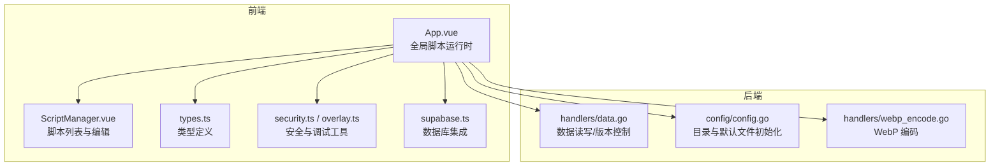
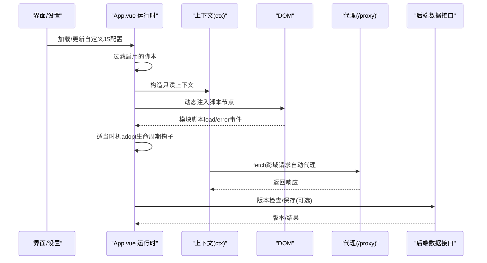
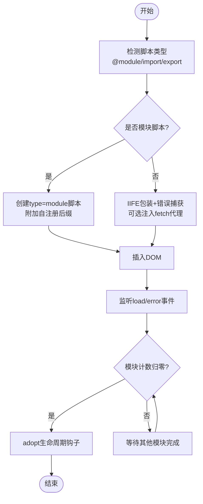
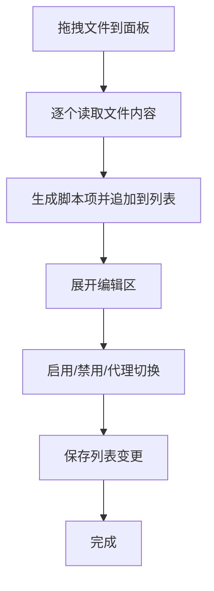
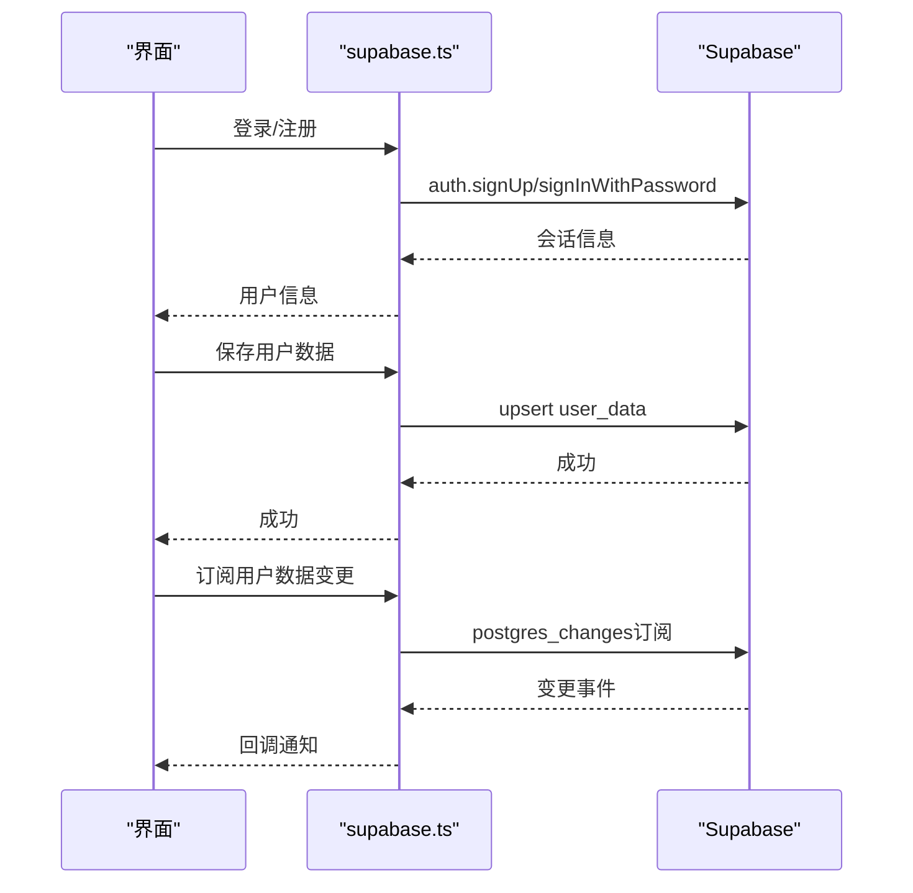
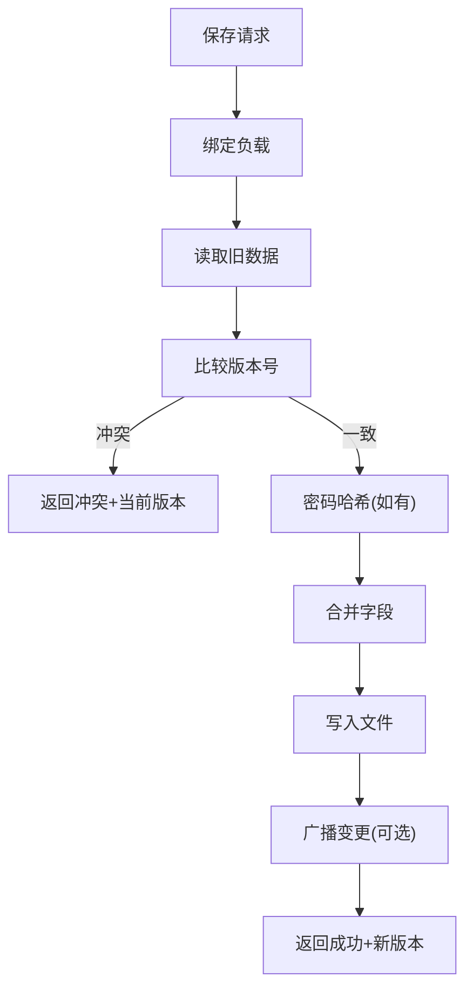
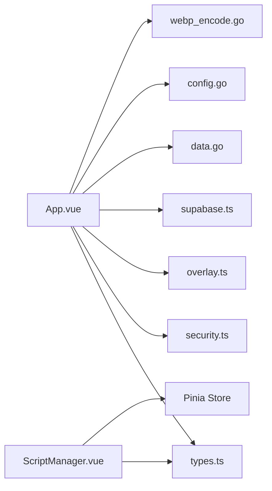

# 脚本系统

<cite>
**本文引用的文件**
- [App.vue](file://frontend/src/App.vue)
- [ScriptManager.vue](file://frontend/src/components/ScriptManager.vue)
- [types.ts](file://frontend/src/types.ts)
- [security.ts](file://frontend/src/utils/security.ts)
- [overlay.ts](file://frontend/src/utils/overlay.ts)
- [supabase.ts](file://frontend/src/lib/supabase.ts)
- [data.go](file://backend/handlers/data.go)
- [config.go](file://backend/config/config.go)
- [webp_encode.go](file://backend/handlers/webp_encode.go)
- [README.md](file://README.md)
</cite>

## 目录
1. [简介](#简介)
2. [项目结构](#项目结构)
3. [核心组件](#核心组件)
4. [架构总览](#架构总览)
5. [详细组件分析](#详细组件分析)
6. [依赖分析](#依赖分析)
7. [性能考量](#性能考量)
8. [故障排查指南](#故障排查指南)
9. [结论](#结论)
10. [附录](#附录)

## 简介
本指南面向 OFlatNas 的“脚本系统”，聚焦以下目标：
- 全局脚本管理机制：脚本的收集、过滤、注入与销毁流程
- 脚本注入与执行环境隔离：模块脚本与非模块脚本的识别、包装与沙箱化
- JavaScript 模块检测、非模块脚本包装与动态脚本加载
- 脚本上下文对象的属性与方法：DOM 查询、事件系统、生命周期钩子
- 安全机制、沙箱限制与错误处理策略
- Supabase 数据库集成、远程脚本加载与数据同步
- WebP 图像编码、性能优化与资源管理
- 调试工具、日志记录与故障排除

## 项目结构
前端采用 Vue 3 + TypeScript，后端采用 Go + Gin。脚本系统主要位于前端应用入口与组件中，后端提供数据持久化、系统配置与图像处理能力。

图表来源
- [App.vue:1-200](file://frontend/src/App.vue#L1-L200)
- [ScriptManager.vue:1-322](file://frontend/src/components/ScriptManager.vue#L1-L322)
- [types.ts:64-70](file://frontend/src/types.ts#L64-L70)
- [security.ts:1-52](file://frontend/src/utils/security.ts#L1-L52)
- [overlay.ts:1-84](file://frontend/src/utils/overlay.ts#L1-L84)
- [supabase.ts:1-343](file://frontend/src/lib/supabase.ts#L1-L343)
- [data.go:159-322](file://backend/handlers/data.go#L159-L322)
- [config.go:35-86](file://backend/config/config.go#L35-L86)
- [webp_encode.go:13-46](file://backend/handlers/webp_encode.go#L13-L46)

章节来源
- [App.vue:1-200](file://frontend/src/App.vue#L1-L200)
- [ScriptManager.vue:1-322](file://frontend/src/components/ScriptManager.vue#L1-L322)
- [types.ts:64-70](file://frontend/src/types.ts#L64-L70)
- [security.ts:1-52](file://frontend/src/utils/security.ts#L1-L52)
- [overlay.ts:1-84](file://frontend/src/utils/overlay.ts#L1-L84)
- [supabase.ts:1-343](file://frontend/src/lib/supabase.ts#L1-L343)
- [data.go:159-322](file://backend/handlers/data.go#L159-L322)
- [config.go:35-86](file://backend/config/config.go#L35-L86)
- [webp_encode.go:13-46](file://backend/handlers/webp_encode.go#L13-L46)

## 核心组件
- 全局脚本运行时：负责脚本检测、注入、上下文构造、生命周期钩子调度与清理
- 脚本管理器：提供脚本列表的拖拽排序、增删改查、启用/禁用与代理开关
- 类型系统：统一脚本实体结构与脚本列表项
- 安全与调试：内部域名白名单、URL 规范化、开发错误捕获与 Vite Overlay 处理
- Supabase 集成：用户认证、用户数据读写、实时订阅与管理员接口
- 后端数据与配置：用户数据版本控制、保存幂等、系统配置与默认模板初始化
- 图像处理：WebP 编码与质量控制

章节来源
- [App.vue:107-203](file://frontend/src/App.vue#L107-L203)
- [ScriptManager.vue:1-118](file://frontend/src/components/ScriptManager.vue#L1-L118)
- [types.ts:64-70](file://frontend/src/types.ts#L64-L70)
- [security.ts:1-52](file://frontend/src/utils/security.ts#L1-L52)
- [overlay.ts:59-83](file://frontend/src/utils/overlay.ts#L59-L83)
- [supabase.ts:45-88](file://frontend/src/lib/supabase.ts#L45-L88)
- [data.go:159-322](file://backend/handlers/data.go#L159-L322)
- [config.go:102-180](file://backend/config/config.go#L102-L180)
- [webp_encode.go:13-46](file://backend/handlers/webp_encode.go#L13-L46)

## 架构总览
脚本系统围绕“前端运行时 + 后端数据/配置 + Supabase”协同工作：
- 前端在应用启动时根据配置加载脚本列表，构造只读上下文，注入脚本并触发生命周期钩子
- 脚本可选择启用代理模式，通过本地代理接口访问外部资源
- 后端提供数据版本控制与保存幂等，保障多端并发一致性
- Supabase 提供用户数据持久化与实时订阅，支持远程脚本加载与数据同步
- 图像处理后端负责 WebP 编码，优化传输体积

图表来源
- [App.vue:270-364](file://frontend/src/App.vue#L270-L364)
- [App.vue:176-203](file://frontend/src/App.vue#L176-L203)
- [data.go:324-343](file://backend/handlers/data.go#L324-L343)

章节来源
- [App.vue:270-364](file://frontend/src/App.vue#L270-L364)
- [data.go:324-343](file://backend/handlers/data.go#L324-L343)

## 详细组件分析

### 全局脚本运行时（App.vue）
- 脚本检测与注入
  - 通过注释标记、import/export 关键字或 @module 注释判断是否为模块脚本
  - 模块脚本使用 type="module"，非模块脚本包裹为 IIFE 并在顶部注入错误捕获
  - 支持 per-script 代理开关，自动将跨域 http 请求重写到 /proxy?url=
- 上下文对象（ctx）
  - 只读 store、DOM 查询、事件系统、清理钩子、跨域 fetch 代理
  - 提供 widgetEl(id)、on(type, handler)、emit(type, detail)、onCleanup(fn)
- 生命周期钩子
  - init：初始化时调用，适合注册事件与一次性逻辑
  - update：DOM 变更后去抖触发，适合响应式更新
  - destroy：销毁时调用，清理定时器、事件监听与副作用
- 资源与代理
  - 通过 /proxy 统一代理跨域请求，避免 CORS 限制
  - 通过 ctx.fetch 自动区分同域/跨域，跨域自动走代理

图表来源
- [App.vue:310-364](file://frontend/src/App.vue#L310-L364)
- [App.vue:258-268](file://frontend/src/App.vue#L258-L268)

章节来源
- [App.vue:107-203](file://frontend/src/App.vue#L107-L203)
- [App.vue:270-364](file://frontend/src/App.vue#L270-L364)

### 脚本管理器（ScriptManager.vue）
- 文件拖拽与批量读取：支持拖拽文件到面板，逐个读取文本内容并生成脚本项
- 列表编辑：支持拖拽排序、启用/禁用、代理开关、删除确认
- 交互反馈：拖拽高亮提示、删除二次确认、新增后自动展开编辑区

图表来源
- [ScriptManager.vue:50-77](file://frontend/src/components/ScriptManager.vue#L50-L77)
- [ScriptManager.vue:149-297](file://frontend/src/components/ScriptManager.vue#L149-L297)

章节来源
- [ScriptManager.vue:1-118](file://frontend/src/components/ScriptManager.vue#L1-L118)
- [ScriptManager.vue:149-297](file://frontend/src/components/ScriptManager.vue#L149-L297)

### 类型系统（types.ts）
- 脚本实体：id、name、content、enable、useProxy
- 应用配置：包含 customJs、customJsList、customCss 等字段，驱动脚本系统

章节来源
- [types.ts:64-70](file://frontend/src/types.ts#L64-L70)

### 安全与调试（security.ts / overlay.ts）
- 内部域名白名单与 URL 规范化：强制 https、绝对地址与编码
- 开发错误捕获：全局监听 error/unhandledrejection，收集日志
- Vite Overlay 处理：等待出现/消失，便于诊断构建错误

章节来源
- [security.ts:1-52](file://frontend/src/utils/security.ts#L1-L52)
- [overlay.ts:15-83](file://frontend/src/utils/overlay.ts#L15-L83)

### Supabase 集成（supabase.ts）
- 用户认证：注册、登录、登出、获取当前用户
- 用户数据：保存/加载/列出用户数据，支持实时订阅
- 热新闻与 RSS：获取热榜、按来源分组、添加订阅
- 管理员接口：获取所有用户、删除用户

图表来源
- [supabase.ts:90-144](file://frontend/src/lib/supabase.ts#L90-L144)
- [supabase.ts:146-255](file://frontend/src/lib/supabase.ts#L146-L255)
- [supabase.ts:297-342](file://frontend/src/lib/supabase.ts#L297-L342)

章节来源
- [supabase.ts:1-343](file://frontend/src/lib/supabase.ts#L1-L343)

### 后端数据与配置（data.go / config.go）
- 数据读取与缓存：基于文件修改时间的缓存命中策略，减少 IO
- 版本控制与冲突检测：保存时比较版本号，冲突返回当前版本
- 保存幂等：基于客户端请求 ID 的幂等缓存，避免重复处理
- 默认模板与系统配置：首次运行初始化 system.json、data.json、secret.key 等

图表来源
- [data.go:638-744](file://backend/handlers/data.go#L638-L744)

章节来源
- [data.go:159-322](file://backend/handlers/data.go#L159-L322)
- [data.go:638-744](file://backend/handlers/data.go#L638-L744)
- [config.go:102-180](file://backend/config/config.go#L102-L180)

### 图像处理（webp_encode.go）
- 输入格式限制：仅对 png/jpg/jpeg 进行转换，gif/svg/ico 保持原样
- 质量范围校验与编码：将图片解码后按质量参数编码为 WebP
- 输出校验：空输出回退原始内容

章节来源
- [webp_encode.go:13-46](file://backend/handlers/webp_encode.go#L13-L46)

## 依赖分析
- 前端依赖
  - App.vue 依赖 store、types、security、overlay、supabase
  - ScriptManager.vue 依赖 store、types、拖拽库
- 后端依赖
  - data.go 依赖 config、models、utils、socket.io
  - config.go 依赖嵌入默认模板、文件系统
  - webp_encode.go 依赖 image、webp 编码库

图表来源
- [App.vue:1-50](file://frontend/src/App.vue#L1-L50)
- [ScriptManager.vue:1-20](file://frontend/src/components/ScriptManager.vue#L1-L20)
- [types.ts:1-20](file://frontend/src/types.ts#L1-L20)
- [security.ts:1-10](file://frontend/src/utils/security.ts#L1-L10)
- [overlay.ts:1-10](file://frontend/src/utils/overlay.ts#L1-L10)
- [supabase.ts:1-10](file://frontend/src/lib/supabase.ts#L1-L10)
- [data.go:1-20](file://backend/handlers/data.go#L1-L20)
- [config.go:1-20](file://backend/config/config.go#L1-L20)
- [webp_encode.go:1-10](file://backend/handlers/webp_encode.go#L1-L10)

章节来源
- [App.vue:1-50](file://frontend/src/App.vue#L1-L50)
- [ScriptManager.vue:1-20](file://frontend/src/components/ScriptManager.vue#L1-L20)
- [types.ts:1-20](file://frontend/src/types.ts#L1-L20)
- [security.ts:1-10](file://frontend/src/utils/security.ts#L1-L10)
- [overlay.ts:1-10](file://frontend/src/utils/overlay.ts#L1-L10)
- [supabase.ts:1-10](file://frontend/src/lib/supabase.ts#L1-L10)
- [data.go:1-20](file://backend/handlers/data.go#L1-L20)
- [config.go:1-20](file://backend/config/config.go#L1-L20)
- [webp_encode.go:1-10](file://backend/handlers/webp_encode.go#L1-L10)

## 性能考量
- 脚本注入
  - 模块脚本使用 type="module"，load 事件可靠，避免竞态
  - 非模块脚本 IIFE 包装，同步执行，减少异步开销
- DOM 观察
  - MutationObserver 仅观察 childList/subtree，降低噪音
  - update 去抖 300ms，避免频繁触发
- 数据保存
  - 保存前进行版本对比，冲突快速返回
  - 幂等缓存避免重复处理
- 缓存与资源
  - 资源版本号参数，避免缓存导致的闪烁
  - 图像 WebP 编码，减小传输体积

章节来源
- [App.vue:238-247](file://frontend/src/App.vue#L238-L247)
- [data.go:638-744](file://backend/handlers/data.go#L638-L744)
- [webp_encode.go:13-46](file://backend/handlers/webp_encode.go#L13-L46)

## 故障排查指南
- 脚本加载失败
  - 检查脚本是否启用、内容是否为空
  - 查看控制台错误，定位具体脚本名称
  - 若为模块脚本，确认导出了生命周期钩子对象
- 跨域请求问题
  - 确认脚本启用了代理开关
  - 使用 ctx.fetch 或通过 /proxy 代理访问
- 开发时 Vite Overlay
  - 使用 overlay 工具等待出现/消失，捕获错误日志
  - 通过 attachErrorCapture 获取全局错误堆栈
- Supabase 连接
  - 检查环境变量是否配置
  - 确认实时订阅回调是否正确注册

章节来源
- [App.vue:353-355](file://frontend/src/App.vue#L353-L355)
- [overlay.ts:59-83](file://frontend/src/utils/overlay.ts#L59-L83)
- [supabase.ts:6-19](file://frontend/src/lib/supabase.ts#L6-L19)

## 结论
OFlatNas 的脚本系统通过“前端运行时 + 后端数据/配置 + Supabase”的组合，提供了灵活、安全、可扩展的自定义能力。其核心在于：
- 明确的脚本检测与注入流程
- 严格的上下文与生命周期管理
- 完善的安全与调试工具链
- 高效的数据版本控制与保存幂等
- 可选的图像优化与资源管理

## 附录
- 脚本上下文 API（ctx）
  - store：只读 store 引用
  - root/query/queryAll/widgetEl：DOM 查询
  - fetch：跨域自动代理
  - on/onCleanup/emit：事件系统
- 生命周期钩子（推荐）
  - init：初始化
  - update：更新
  - destroy：销毁

章节来源
- [App.vue:107-203](file://frontend/src/App.vue#L107-L203)
- [README.md:241-283](file://README.md#L241-L283)