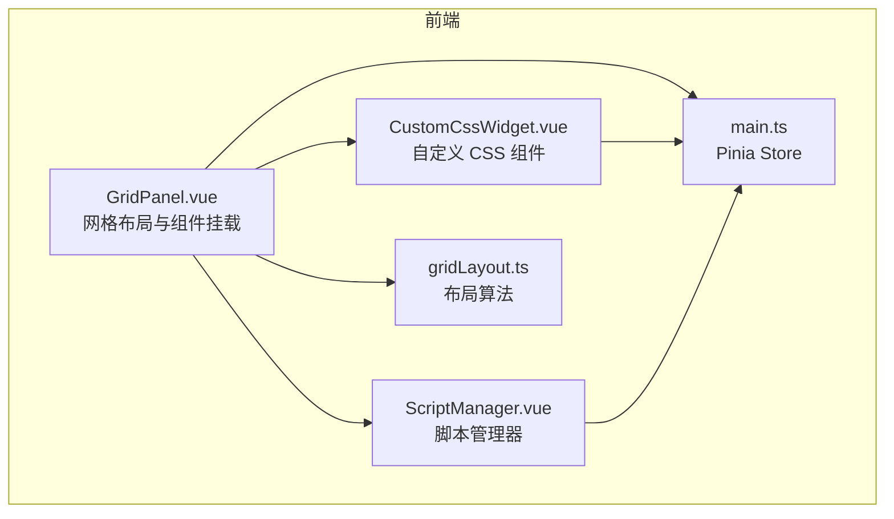
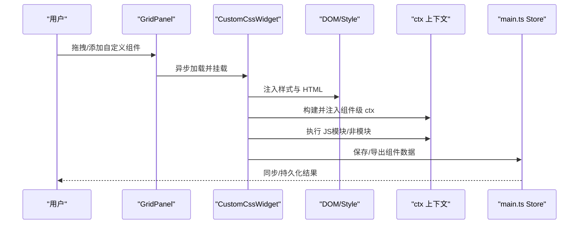
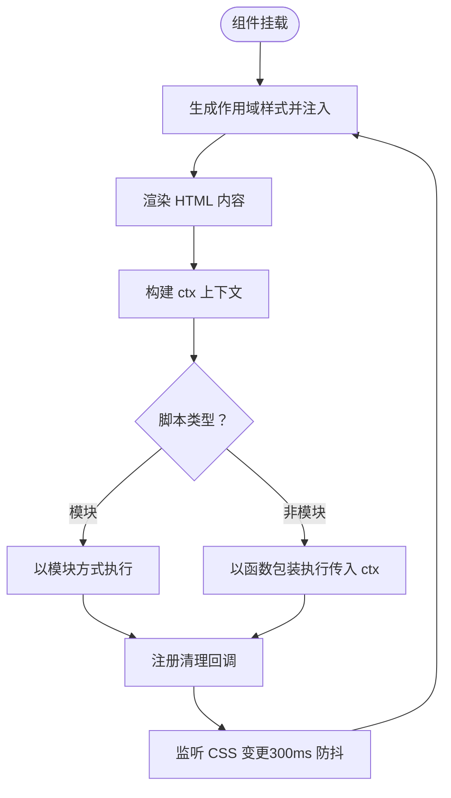
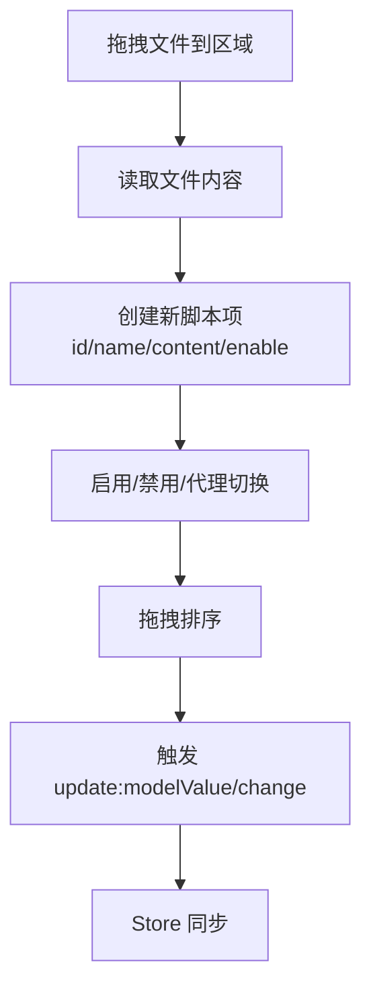
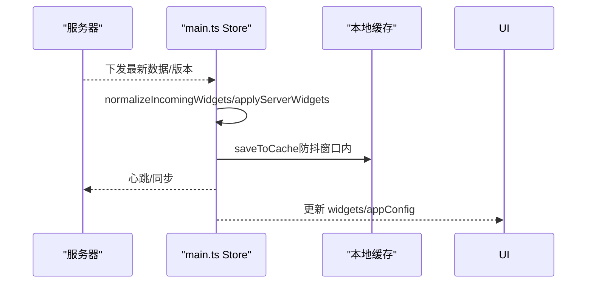
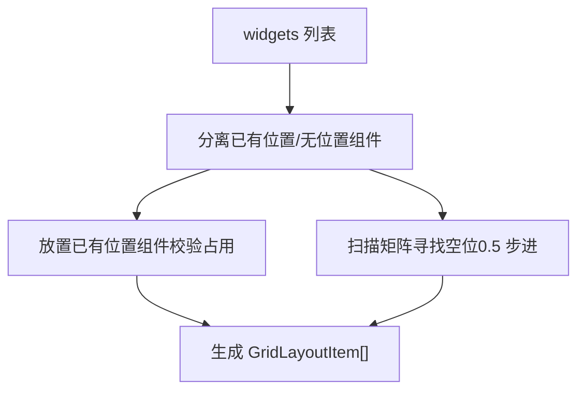
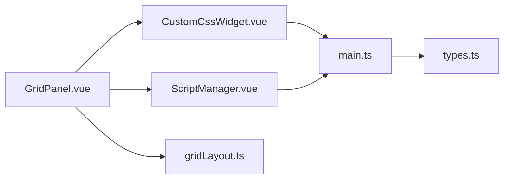

# 自定义组件开发

<cite>
**本文引用的文件**
- [CustomCssWidget.vue](file://frontend/src/components/CustomCssWidget.vue)
- [ScriptManager.vue](file://frontend/src/components/ScriptManager.vue)
- [types.ts](file://frontend/src/types.ts)
- [main.ts](file://frontend/src/stores/main.ts)
- [GridPanel.vue](file://frontend/src/components/GridPanel.vue)
- [gridLayout.ts](file://frontend/src/utils/gridLayout.ts)
</cite>

## 目录
1. [简介](#简介)
2. [项目结构](#项目结构)
3. [核心组件](#核心组件)
4. [架构总览](#架构总览)
5. [详细组件分析](#详细组件分析)
6. [依赖关系分析](#依赖关系分析)
7. [性能考量](#性能考量)
8. [故障排查指南](#故障排查指南)
9. [结论](#结论)
10. [附录](#附录)

## 简介
本指南面向 OFlatNas 的“自定义组件”能力，围绕以下目标展开：
- 组件结构设计与 HTML/CSS/JS 三要素编写规范
- 组件生命周期管理与作用域隔离机制
- CSS 选择器自动前缀与样式冲突规避策略
- 组件上下文对象（ctx）的使用方法（DOM 查询、事件绑定、清理函数注册）
- 组件数据持久化、导入导出与版本管理
- 调试技巧、性能优化建议与最佳实践
- 组件与主应用的数据交互、事件通信与状态同步

## 项目结构
OFlatNas 前端采用 Vue 3 + Pinia 架构，自定义组件能力主要体现在“自定义 CSS 组件”与“脚本管理器”两个方面：
- 自定义 CSS 组件：提供 HTML/CSS/JS 编辑器，支持实时预览与脚本执行
- 脚本管理器：统一管理多段 CSS/JS 片段，支持拖拽排序、启用/禁用、代理开关与批量导入导出
- 应用状态：通过 Pinia Store 管理用户、配置、小组件列表与缓存策略
- 布局系统：网格布局组件负责渲染与编排各类小组件

图表来源
- [GridPanel.vue:58-81](file://frontend/src/components/GridPanel.vue#L58-L81)
- [CustomCssWidget.vue:1-444](file://frontend/src/components/CustomCssWidget.vue#L1-L444)
- [ScriptManager.vue:1-322](file://frontend/src/components/ScriptManager.vue#L1-L322)
- [main.ts:579-1200](file://frontend/src/stores/main.ts#L579-L1200)
- [gridLayout.ts:11-112](file://frontend/src/utils/gridLayout.ts#L11-L112)

章节来源
- [GridPanel.vue:58-81](file://frontend/src/components/GridPanel.vue#L58-L81)
- [main.ts:579-1200](file://frontend/src/stores/main.ts#L579-L1200)

## 核心组件
- 自定义 CSS 组件（CustomCssWidget）
  - 支持 HTML/CSS/JS 三要素编辑与实时预览
  - 自动作用域隔离与样式冲突规避
  - 组件级 JS 执行与上下文（ctx）注入
  - 导入/导出 JSON 数据包
- 脚本管理器（ScriptManager）
  - 多段 CSS/JS 片段管理与排序
  - 拖拽上传文件读取内容
  - 启用/禁用与代理开关
- 应用状态（main.ts Store）
  - 用户认证、配置、小组件列表与缓存
  - 服务器快照与本地缓存协同
- 布局工具（gridLayout.ts）
  - 小组件网格布局生成与紧凑排列

章节来源
- [CustomCssWidget.vue:1-444](file://frontend/src/components/CustomCssWidget.vue#L1-L444)
- [ScriptManager.vue:1-322](file://frontend/src/components/ScriptManager.vue#L1-L322)
- [main.ts:579-1200](file://frontend/src/stores/main.ts#L579-L1200)
- [gridLayout.ts:11-112](file://frontend/src/utils/gridLayout.ts#L11-L112)

## 架构总览
自定义组件的运行时架构如下：
- 渲染层：GridPanel 动态加载并挂载 CustomCssWidget
- 编辑层：CustomCssWidget 提供三要素编辑器与实时预览
- 执行层：CustomCssWidget 在组件容器内注入 ctx 并执行 JS
- 存储层：main.ts Store 管理用户、配置与小组件数据，支持本地缓存与服务器同步
- 工具层：gridLayout.ts 生成网格布局，ScriptManager 管理脚本片段

图表来源
- [GridPanel.vue:58-81](file://frontend/src/components/GridPanel.vue#L58-L81)
- [CustomCssWidget.vue:130-176](file://frontend/src/components/CustomCssWidget.vue#L130-L176)
- [main.ts:1048-1127](file://frontend/src/stores/main.ts#L1048-L1127)

## 详细组件分析

### 自定义 CSS 组件（CustomCssWidget）
- 组件结构设计
  - 容器元素以唯一 ID 命名，作为 CSS 作用域根节点
  - 视图模式与编辑模式双态切换，编辑模式提供标签页与 AI 辅助
- HTML/CSS/JS 三要素
  - HTML：通过 v-html 渲染，注意安全与性能
  - CSS：自动作用域隔离，实时预览（变更后 300ms 生效）
  - JS：支持模块与非模块两种脚本形式，注入 ctx 上下文
- 生命周期管理
  - onMounted：初次渲染样式与脚本
  - onUnmounted：清理脚本与样式
  - watch：监听编辑态与登录态变化
- 作用域隔离与样式冲突规避
  - CSS 解析器逐条解析选择器，为每个选择器添加容器前缀
  - 对 @media/@supports/@layer/@container 等条件规则递归处理
  - 对 :root 选择器映射到容器，避免全局污染
- ctx 上下文对象
  - el：组件容器 DOM
  - query/queryAll：容器内受限查询
  - onCleanup：注册清理回调（定时器、事件监听等）
  - on/emit：基于 window.CustomEvent 的事件总线（命名空间 flatnas:*）
- 数据持久化与导入导出
  - 保存：更新 Store 中对应组件数据并标记脏
  - 导出：生成 JSON（含 title/html/css/js），下载文件
  - 导入：支持 .json/.txt/.html/.css，按字段覆盖
- 版本管理
  - 通过 Store 的版本号与服务器快照协同，避免竞态覆盖

图表来源
- [CustomCssWidget.vue:30-84](file://frontend/src/components/CustomCssWidget.vue#L30-L84)
- [CustomCssWidget.vue:130-176](file://frontend/src/components/CustomCssWidget.vue#L130-L176)
- [CustomCssWidget.vue:180-211](file://frontend/src/components/CustomCssWidget.vue#L180-L211)

章节来源
- [CustomCssWidget.vue:1-444](file://frontend/src/components/CustomCssWidget.vue#L1-L444)

### 脚本管理器（ScriptManager）
- 多段脚本管理
  - 支持 CSS/JS 两类脚本，每段包含 id/name/content/enable/useProxy
  - 拖拽上传文件，自动读取内容并创建新项
  - 排序、启用/禁用、代理开关、删除确认
- 与 Store 的协作
  - 通过双向绑定 modelValue 与 change 事件与 Store 同步
  - 删除采用二次确认，避免误删
- 适用场景
  - 管理全局 CSS/JS 片段，或为自定义组件提供共享脚本

图表来源
- [ScriptManager.vue:41-77](file://frontend/src/components/ScriptManager.vue#L41-L77)
- [ScriptManager.vue:13-16](file://frontend/src/components/ScriptManager.vue#L13-L16)

章节来源
- [ScriptManager.vue:1-322](file://frontend/src/components/ScriptManager.vue#L1-L322)
- [types.ts:64-70](file://frontend/src/types.ts#L64-L70)

### 应用状态与数据持久化（main.ts Store）
- 用户与认证
  - token/username/isLogged 管理登录态
  - Socket 连接与心跳检测，保障网络异常下的可用性
- 配置与小组件
  - appConfig/widgets 管理应用配置与小组件集合
  - normalizeIncomingWidgets 与 applyServerWidgets 合并/校验服务器下发数据
- 缓存与快照
  - 本地缓存（localStorage）与服务器快照协同，避免写入风暴
  - CACHE_WRITE_GUARD_MS 防抖窗口，markServerSnapshotReady 标记快照就绪
- 版本与迁移
  - dataVersion 与版本归一化，兼容旧版配置迁移

图表来源
- [main.ts:1048-1127](file://frontend/src/stores/main.ts#L1048-L1127)
- [main.ts:867-911](file://frontend/src/stores/main.ts#L867-L911)

章节来源
- [main.ts:579-1200](file://frontend/src/stores/main.ts#L579-L1200)

### 布局系统（GridPanel + gridLayout）
- 组件异步加载与可见性控制
  - GridPanel 动态加载各小组件，按 enable/hideOnMobile/isPublic 控制可见
- 网格布局算法
  - gridLayout.ts 以 0.5 步进扫描矩阵，优先保留已有位置，再填补空位
  - 支持紧凑垂直排列，避免重叠与越界

图表来源
- [gridLayout.ts:11-112](file://frontend/src/utils/gridLayout.ts#L11-L112)
- [GridPanel.vue:676-800](file://frontend/src/components/GridPanel.vue#L676-L800)

章节来源
- [gridLayout.ts:11-112](file://frontend/src/utils/gridLayout.ts#L11-L112)
- [GridPanel.vue:676-800](file://frontend/src/components/GridPanel.vue#L676-L800)

## 依赖关系分析
- 组件间依赖
  - GridPanel 依赖 CustomCssWidget 与 ScriptManager
  - CustomCssWidget 依赖 main.ts Store 与 DOM/Style
  - ScriptManager 依赖 main.ts Store 与文件读取
- 类型与接口
  - WidgetConfig/CustomScript/AppConfig 等类型贯穿 Store 与组件
- 外部依赖
  - Pinia（状态管理）、VueUse（工具组合）、grid-layout-plus（布局）

图表来源
- [GridPanel.vue:58-81](file://frontend/src/components/GridPanel.vue#L58-L81)
- [CustomCssWidget.vue:1-444](file://frontend/src/components/CustomCssWidget.vue#L1-L444)
- [ScriptManager.vue:1-322](file://frontend/src/components/ScriptManager.vue#L1-L322)
- [main.ts:579-1200](file://frontend/src/stores/main.ts#L579-L1200)
- [types.ts:202-224](file://frontend/src/types.ts#L202-L224)
- [gridLayout.ts:11-112](file://frontend/src/utils/gridLayout.ts#L11-L112)

章节来源
- [types.ts:64-224](file://frontend/src/types.ts#L64-L224)

## 性能考量
- 渲染与样式
  - CSS 变更采用 300ms 防抖，避免频繁重算
  - 仅在编辑态实时预览，视图态不重复注入样式
- 脚本执行
  - 非模块脚本通过函数包装执行，避免全局污染
  - 严格注册 onCleanup，及时清理定时器与事件监听
- 布局与重绘
  - gridLayout 以 0.5 步进扫描，减少碰撞尝试次数
  - 仅在设备尺寸或列数变化时重建布局
- 缓存与同步
  - 本地缓存写入防抖窗口，避免频繁 IO
  - 服务器快照就绪后才允许写入，避免竞态

## 故障排查指南
- 样式未生效或冲突
  - 检查 CSS 是否包含 @keyframes/@font-face 等特殊规则（这些会被保留原样）
  - 确认选择器是否使用 :root（会被映射到容器）
  - 若样式未随输入更新，确认是否处于编辑态与防抖时间
- 脚本未执行或报错
  - 确认脚本是否为模块（import/export）或非模块
  - 检查 ctx 是否正确使用（el/query/queryAll/onCleanup/on/emit）
  - 查看浏览器控制台错误日志
- 组件未渲染或丢失
  - 检查 enable/hideOnMobile/isPublic 等可见性条件
  - 确认 Store 中 widgets 是否包含该组件
- 数据未保存或丢失
  - 确认本地缓存是否被写入（防抖窗口内不会立即写入）
  - 检查服务器快照是否就绪（markServerSnapshotReady）
- 导入/导出失败
  - 导入时确认文件格式（.json/.txt/.html/.css）
  - 导出时确认文件名与 MIME 类型

章节来源
- [CustomCssWidget.vue:180-211](file://frontend/src/components/CustomCssWidget.vue#L180-L211)
- [CustomCssWidget.vue:130-176](file://frontend/src/components/CustomCssWidget.vue#L130-L176)
- [main.ts:1048-1127](file://frontend/src/stores/main.ts#L1048-L1127)

## 结论
OFlatNas 的自定义组件体系以“作用域隔离 + 上下文注入 + 本地/服务器协同”为核心，既保证了组件的独立性与安全性，又提供了灵活的扩展能力。通过合理的生命周期管理、防抖与清理机制，以及完善的导入导出与版本管理，开发者可以高效地构建与维护高质量的自定义组件。

## 附录
- 最佳实践
  - 优先使用容器前缀与 :root 映射，避免全局污染
  - 在 onCleanup 中统一清理定时器与事件监听
  - 将复杂逻辑拆分为模块脚本，便于测试与复用
  - 使用防抖与节流控制高频变更（如 CSS 实时预览）
  - 通过导出 JSON 快速分享与备份组件配置
- 术语
  - ctx：组件级上下文对象，提供 DOM 查询与事件总线
  - 作用域隔离：为每个组件样式自动添加容器前缀
  - 防抖：对高频操作进行延迟处理，提升性能与稳定性