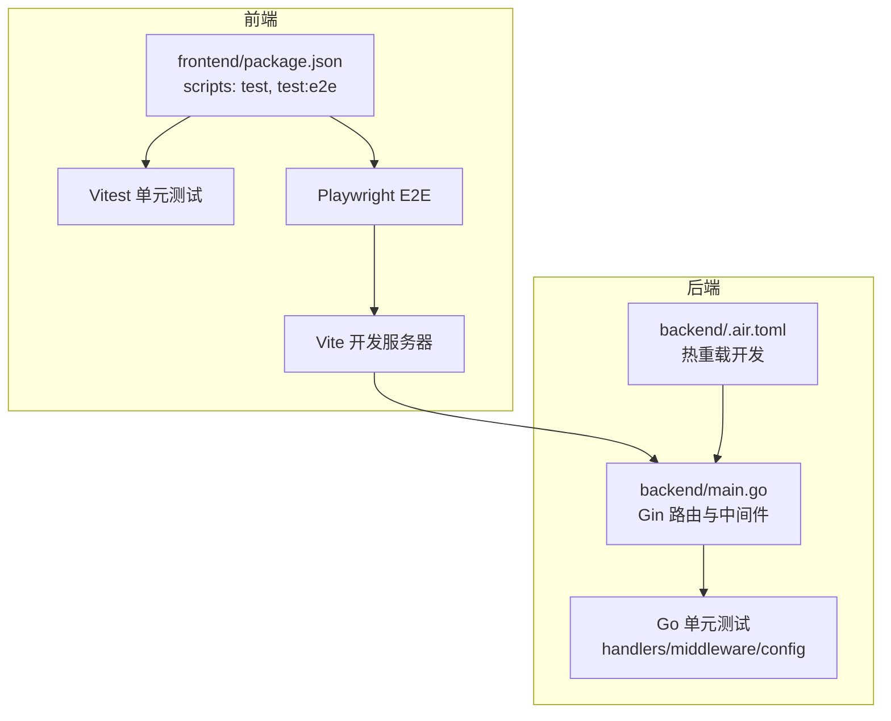
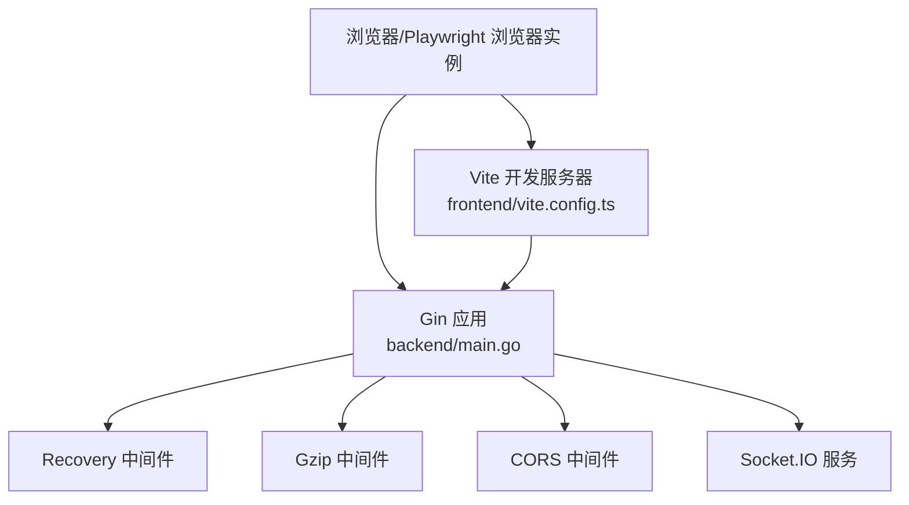
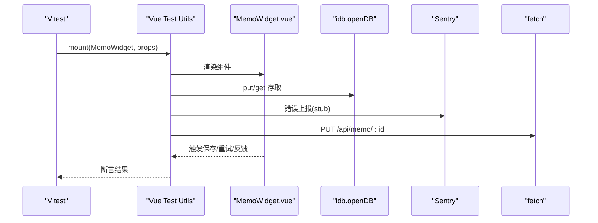
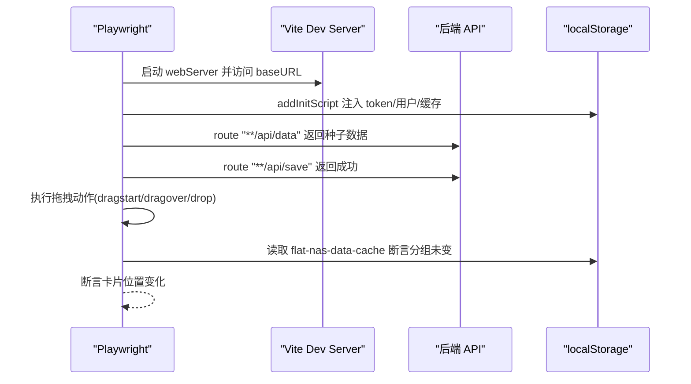
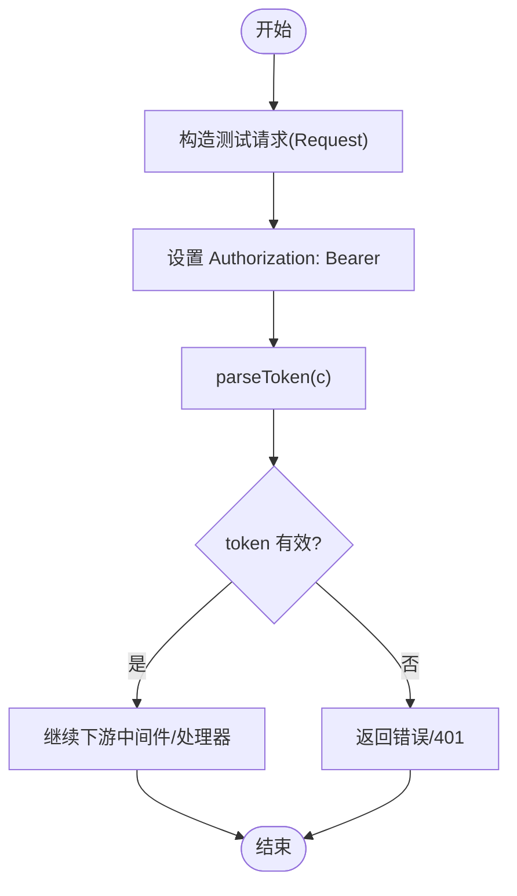
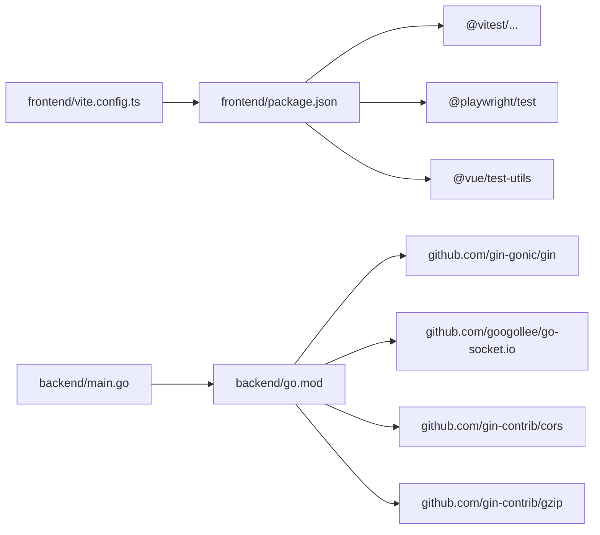

# 测试与调试

<cite>
**本文档引用的文件**
- [frontend/package.json](file://frontend/package.json)
- [frontend/playwright.config.ts](file://frontend/playwright.config.ts)
- [frontend/vite.config.ts](file://frontend/vite.config.ts)
- [frontend/src/components/__tests__/CustomWidgets.spec.ts](file://frontend/src/components/__tests__/CustomWidgets.spec.ts)
- [frontend/src/components/MemoWidget.spec.ts](file://frontend/src/components/MemoWidget.spec.ts)
- [frontend/src/utils/network.spec.ts](file://frontend/src/utils/network.spec.ts)
- [frontend/src/utils/trayDrag.spec.ts](file://frontend/src/utils/trayDrag.spec.ts)
- [frontend/e2e/tray-drag.e2e.ts](file://frontend/e2e/tray-drag.e2e.ts)
- [backend/main.go](file://backend/main.go)
- [backend/go.mod](file://backend/go.mod)
- [backend/.air.toml](file://backend/.air.toml)
- [backend/handlers/transfer_test.go](file://backend/handlers/transfer_test.go)
- [backend/middleware/auth_test.go](file://backend/middleware/auth_test.go)
- [backend/config/config_test.go](file://backend/config/config_test.go)
- [.github/workflows/release.yml](file://.github/workflows/release.yml)
</cite>

## 目录
1. [简介](#简介)
2. [项目结构](#项目结构)
3. [核心组件](#核心组件)
4. [架构总览](#架构总览)
5. [详细组件分析](#详细组件分析)
6. [依赖分析](#依赖分析)
7. [性能考虑](#性能考虑)
8. [故障排查指南](#故障排查指南)
9. [结论](#结论)
10. [附录](#附录)

## 简介
本指南面向 OFlatNas 的测试与调试实践，覆盖前端单元测试、集成测试与端到端测试；后端 Go 单元测试与中间件测试；以及 Playwright 端到端测试的配置与自动化脚本编写。同时提供调试工具使用、断点调试技巧、性能分析建议、常见问题排查、日志分析、错误处理策略、测试覆盖率与持续集成配置思路，以及跨浏览器、移动端与兼容性验证方法。

## 项目结构
- 前端采用 Vue 3 + Vite + Vitest + Playwright 技术栈，测试脚本通过 package.json 中的 test 与 test:e2e 脚本统一入口。
- 后端采用 Gin + Socket.IO，测试集中在 handlers、middleware、config 等包内，使用标准库 testing 包。
- CI 使用 GitHub Actions，构建前后端产物并打包发布。

**图表来源**
- [frontend/package.json:10-21](file://frontend/package.json#L10-L21)
- [frontend/playwright.config.ts:1-23](file://frontend/playwright.config.ts#L1-L23)
- [frontend/vite.config.ts:46-54](file://frontend/vite.config.ts#L46-L54)
- [backend/main.go:25-267](file://backend/main.go#L25-L267)
- [backend/.air.toml:1-25](file://backend/.air.toml#L1-L25)

**章节来源**
- [frontend/package.json:10-21](file://frontend/package.json#L10-L21)
- [frontend/vite.config.ts:1-57](file://frontend/vite.config.ts#L1-L57)
- [backend/main.go:25-267](file://backend/main.go#L25-L267)
- [backend/.air.toml:1-25](file://backend/.air.toml#L1-L25)

## 核心组件
- 前端测试工具链
  - Vitest: 单元测试与集成测试，环境为 jsdom，支持 DOM API 与模块模拟。
  - Vue Test Utils: 组件级测试，支持挂载组件、触发事件、断言渲染结果。
  - Playwright: 端到端测试，支持多浏览器项目与自动 WebServer 启动。
- 后端测试工具链
  - Go testing: 标准库单元测试，配合 httptest、gin.TestMode 进行路由与中间件测试。
  - Gin Logger/Recovery/Gzip 中间件在测试中保持真实行为，便于集成测试。
- CI/CD
  - GitHub Actions: 构建后端二进制与前端静态资源，打包发布。

**章节来源**
- [frontend/package.json:19-20](file://frontend/package.json#L19-L20)
- [frontend/playwright.config.ts:1-23](file://frontend/playwright.config.ts#L1-L23)
- [backend/go.mod:1-83](file://backend/go.mod#L1-L83)
- [.github/workflows/release.yml:18-91](file://.github/workflows/release.yml#L18-L91)

## 架构总览
前端通过 Vite 提供开发服务器，Playwright 在测试时复用该服务器；后端 Gin 提供 REST API 与 Socket.IO 事件通道，中间件负责认证、恢复、Gzip 解压等横切关注点。

**图表来源**
- [frontend/vite.config.ts:46-54](file://frontend/vite.config.ts#L46-L54)
- [backend/main.go:34-115](file://backend/main.go#L34-L115)

**章节来源**
- [frontend/vite.config.ts:46-54](file://frontend/vite.config.ts#L46-L54)
- [backend/main.go:34-115](file://backend/main.go#L34-L115)

## 详细组件分析

### 前端单元测试与组件测试
- 测试框架与环境
  - Vitest + jsdom 环境，适合 DOM 操作与组件渲染测试。
  - Vue Test Utils 用于挂载组件、触发交互、断言 UI。
- 典型测试场景
  - 自定义组件校验：扫描 win/组件 目录，校验 JSON 结构与 JS 在 mock 上下文下的可执行性。
  - Memo 组件：模拟 IDB、Sentry、全局 fetch、Pinia store，覆盖富文本/简单模式切换、离线重试、隧道延迟场景。
  - 工具函数测试：网络规则匹配、托盘卡片重排等纯函数逻辑。
- 最佳实践
  - 使用 hoisted mocks 与 vi.stubGlobal 管理全局依赖。
  - 使用 fake timers 控制异步与定时任务。
  - 通过 nextTick 等待异步更新完成。
  - 将复杂逻辑抽离为纯函数以便独立测试。

**图表来源**
- [frontend/src/components/MemoWidget.spec.ts:18-45](file://frontend/src/components/MemoWidget.spec.ts#L18-L45)
- [frontend/src/components/MemoWidget.spec.ts:80-194](file://frontend/src/components/MemoWidget.spec.ts#L80-L194)

**章节来源**
- [frontend/src/components/__tests__/CustomWidgets.spec.ts:1-125](file://frontend/src/components/__tests__/CustomWidgets.spec.ts#L1-L125)
- [frontend/src/components/MemoWidget.spec.ts:1-195](file://frontend/src/components/MemoWidget.spec.ts#L1-L195)
- [frontend/src/utils/network.spec.ts:1-25](file://frontend/src/utils/network.spec.ts#L1-L25)
- [frontend/src/utils/trayDrag.spec.ts:1-33](file://frontend/src/utils/trayDrag.spec.ts#L1-L33)

### 前端端到端测试（Playwright）
- 配置要点
  - testDir 与 testMatch 指定 E2E 目录与匹配模式。
  - baseURL 与 webServer 自动启动 Vite 开发服务器。
  - 多项目：Chrome、Edge、Safari，便于跨浏览器验证。
  - trace 保留失败时的截图/视频，便于回溯。
- 典型用例
  - 拖拽托盘卡片：拦截 /api/data 与 /api/save，注入本地存储，断言分组数据不变、位置更新。
- 最佳实践
  - 使用 page.route 拦截关键 API，返回稳定响应。
  - 使用 addInitScript 注入 localStorage，模拟登录态。
  - 使用 waitForTimeout 或显式等待确保异步操作完成。
  - 为每个用例设置独立的 beforeEach 初始化。

**图表来源**
- [frontend/playwright.config.ts:1-23](file://frontend/playwright.config.ts#L1-L23)
- [frontend/e2e/tray-drag.e2e.ts:51-115](file://frontend/e2e/tray-drag.e2e.ts#L51-L115)

**章节来源**
- [frontend/playwright.config.ts:1-23](file://frontend/playwright.config.ts#L1-L23)
- [frontend/e2e/tray-drag.e2e.ts:1-116](file://frontend/e2e/tray-drag.e2e.ts#L1-L116)

### 后端单元测试与中间件测试
- 测试范围
  - handlers：上传校验、数据导入导出等业务逻辑。
  - middleware：鉴权中间件解析 JWT、拒绝非预期算法、接受 HS256。
  - config：密钥加载与空白字符裁剪。
- 最佳实践
  - 使用 gin.SetMode(gin.TestMode) 与 httptest.NewRecorder/Request 构造上下文。
  - 使用 jwt.NewWithClaims 生成签名令牌，验证 parseToken 行为。
  - 通过临时目录写入 secret.key，断言 SecretKey 被正确裁剪。

**图表来源**
- [backend/middleware/auth_test.go:12-61](file://backend/middleware/auth_test.go#L12-L61)

**章节来源**
- [backend/handlers/transfer_test.go:1-23](file://backend/handlers/transfer_test.go#L1-L23)
- [backend/middleware/auth_test.go:1-62](file://backend/middleware/auth_test.go#L1-L62)
- [backend/config/config_test.go:1-25](file://backend/config/config_test.go#L1-L25)

### 后端 API 与中间件测试最佳实践
- 中间件测试
  - RecoveryMiddleware：确保 panic 不崩溃服务，记录日志。
  - GzipDecompressMiddleware：验证解压逻辑与请求体大小限制。
  - CORS：根据环境变量动态允许来源，测试 AllowOriginFunc。
- API 测试
  - 登录、数据获取、系统配置、RSS/天气/热点、Docker 状态、文件传输等接口。
  - 使用 gin.CreateTestContext 与 httptest 构造最小化请求上下文。
- 数据库测试
  - 当前代码未见直接数据库驱动依赖，主要通过文件系统与外部服务交互。
  - 若引入数据库，请使用内存数据库或容器化数据库进行隔离测试。

**章节来源**
- [backend/main.go:34-115](file://backend/main.go#L34-L115)
- [backend/go.mod:1-83](file://backend/go.mod#L1-L83)

## 依赖分析
- 前端依赖
  - Vitest、@vue/test-utils、@playwright/test、jsdom 等。
  - Vite 插件与开发服务器配置影响测试环境。
- 后端依赖
  - Gin、Socket.IO、JWT、gzip、cors 等。
  - 中间件顺序影响日志、错误恢复与跨域行为。

**图表来源**
- [frontend/package.json:49-76](file://frontend/package.json#L49-L76)
- [frontend/vite.config.ts:1-57](file://frontend/vite.config.ts#L1-L57)
- [backend/go.mod:5-17](file://backend/go.mod#L5-L17)
- [backend/main.go:15-23](file://backend/main.go#L15-L23)

**章节来源**
- [frontend/package.json:49-76](file://frontend/package.json#L49-L76)
- [backend/go.mod:5-17](file://backend/go.mod#L5-L17)
- [backend/main.go:15-23](file://backend/main.go#L15-L23)

## 性能考虑
- 前端
  - 使用 Vitest 的 fake timers 控制异步，缩短测试时间。
  - 合理拆分测试文件，避免单文件过大导致冷启动慢。
  - 使用 jsdom 环境减少浏览器实例开销。
- 后端
  - 使用 .air.toml 热重载开发，提升迭代效率。
  - Gin Logger 记录请求耗时，结合 Recovery 快速定位异常。
- E2E
  - 复用 webServer，避免重复启动 Vite。
  - 适当使用 waitForTimeout 或明确等待条件，减少超时浪费。

**章节来源**
- [frontend/vite.config.ts:46-54](file://frontend/vite.config.ts#L46-L54)
- [backend/.air.toml:1-25](file://backend/.air.toml#L1-L25)
- [backend/main.go:38-39](file://backend/main.go#L38-L39)

## 故障排查指南
- 日志与追踪
  - Gin Logger 输出请求信息；RecoveryMiddleware 捕获 panic 并记录。
  - Playwright trace 在失败时保留快照，便于回放。
- 常见问题
  - CORS 跨域：检查环境变量与 AllowOriginFunc。
  - 静态资源 404：确认 Vite publicDir 与后端 Static 路径映射。
  - E2E 无法连接：确认 webServer 命令与端口、reuseExistingServer。
  - 组件测试 DOM 异步：使用 nextTick 或显式等待。
- 错误处理策略
  - 中间件层统一错误返回格式，便于前端统一提示。
  - 对外暴露 /rtt 与 /ping 接口，便于前端做延迟与连通性检测。

**章节来源**
- [backend/main.go:67-77](file://backend/main.go#L67-L77)
- [backend/main.go:116-163](file://backend/main.go#L116-L163)
- [frontend/playwright.config.ts:8-16](file://frontend/playwright.config.ts#L8-L16)

## 结论
本指南提供了从前端到后端、从单元测试到端到端测试的完整实践路径。通过 Vitest/Vue Test Utils、Playwright、Go testing 与 Gin 中间件，结合 CI/CD 自动化，能够高效地保障质量与稳定性。建议在团队内推广统一的测试规范与断点/性能调试流程，持续优化测试覆盖率与回归效率。

## 附录

### 测试命令与脚本
- 前端
  - 单元测试：npm run test
  - 端到端测试：npm run test:e2e
- 后端
  - go test ./... 或针对特定包：go test ./handlers -run TestIsValidUploadID
- 开发与热重载
  - 后端 air：参考 backend/.air.toml

**章节来源**
- [frontend/package.json:19-20](file://frontend/package.json#L19-L20)
- [backend/handlers/transfer_test.go:5-22](file://backend/handlers/transfer_test.go#L5-L22)
- [backend/.air.toml:4-12](file://backend/.air.toml#L4-L12)

### 覆盖率与持续集成
- 覆盖率
  - 前端：可在 Vitest 中启用覆盖率报告（需在 vitest.config 中配置），建议对关键模块开启。
  - 后端：go test -coverprofile=coverage.out ./...，结合 go tool cover 查看报告。
- CI/CD
  - release.yml 已包含构建与打包步骤，可扩展添加测试阶段与覆盖率上传。

**章节来源**
- [.github/workflows/release.yml:33-51](file://.github/workflows/release.yml#L33-L51)

### 调试工具与技巧
- 前端
  - Vitest：断点调试、fake timers、全局 stub。
  - Vue Devtools：组件树与状态检查。
- 后端
  - Gin Logger：查看请求/响应与耗时。
  - air：热重载，快速迭代。
- E2E
  - Playwright Trace：截图/视频/日志三合一。

**章节来源**
- [backend/main.go:38-39](file://backend/main.go#L38-L39)
- [backend/.air.toml:1-25](file://backend/.air.toml#L1-L25)
- [frontend/playwright.config.ts:10](file://frontend/playwright.config.ts#L10)

### 跨浏览器与移动端测试
- 跨浏览器
  - Playwright projects 配置 Chrome、Edge、Safari，建议在 CI 中并行运行。
- 移动端与兼容性
  - 可在 Playwright 中新增 mobile 设备项目；对关键组件进行断点测试与交互验证。
  - 前端构建输出路径与静态资源映射需在不同宿主环境下验证。

**章节来源**
- [frontend/playwright.config.ts:17-22](file://frontend/playwright.config.ts#L17-L22)
- [frontend/vite.config.ts:13-23](file://frontend/vite.config.ts#L13-L23)