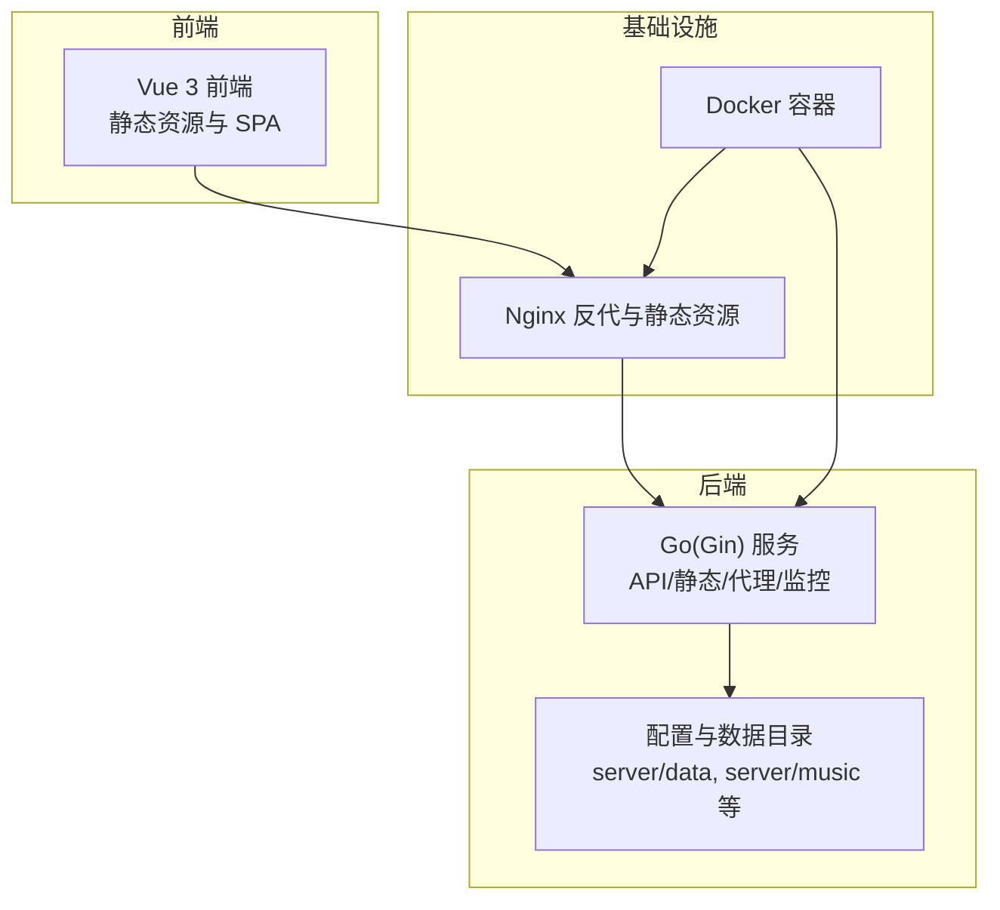
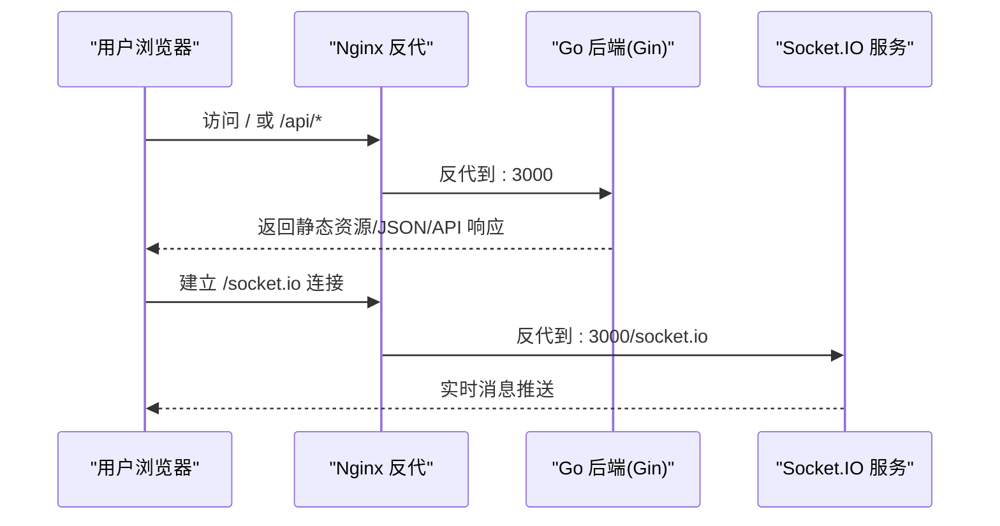
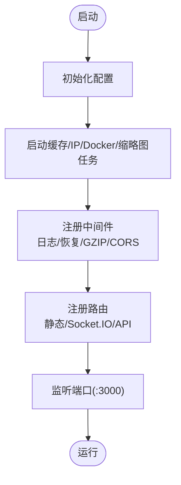
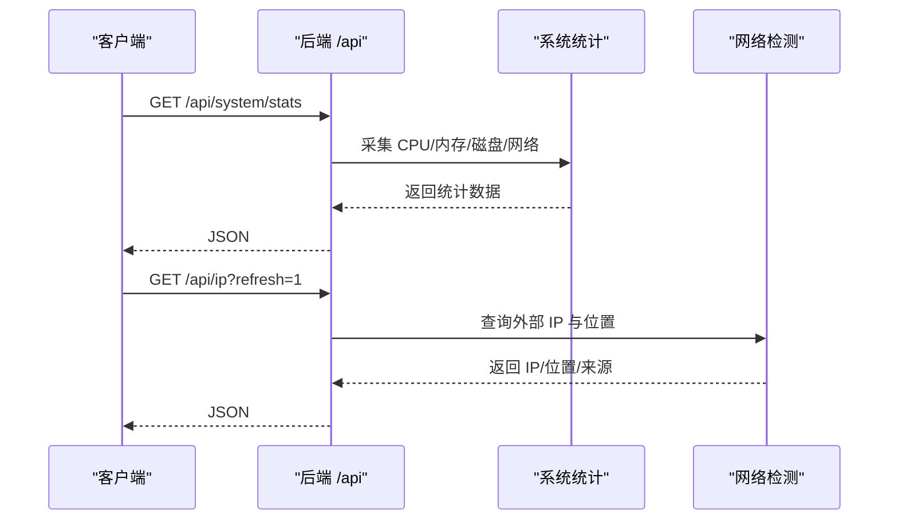
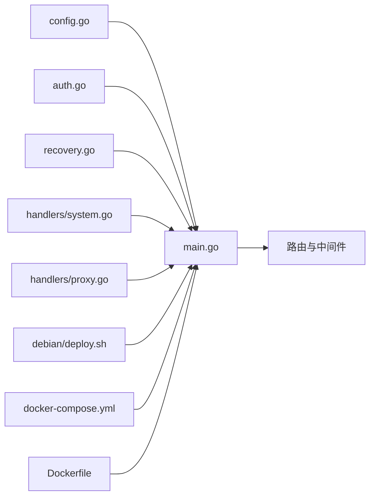

# 故障排除

<cite>
**本文档引用的文件**
- [README.md](file://README.md)
- [main.go](file://backend/main.go)
- [config.go](file://backend/config/config.go)
- [system.go](file://backend/handlers/system.go)
- [proxy.go](file://backend/handlers/proxy.go)
- [auth.go](file://backend/middleware/auth.go)
- [recovery.go](file://backend/middleware/recovery.go)
- [deploy.sh](file://debian/deploy.sh)
- [manage.sh](file://manage.sh)
- [Dockerfile](file://Dockerfile)
- [docker-compose.yml](file://docker-compose.yml)
- [default.json](file://backend/config/default.json)
- [start_backend.ps1](file://backend/start_backend.ps1)
- [start_frontend.ps1](file://frontend/start_frontend.ps1)
</cite>

## 目录
1. [简介](#简介)
2. [项目结构](#项目结构)
3. [核心组件](#核心组件)
4. [架构总览](#架构总览)
5. [详细组件分析](#详细组件分析)
6. [依赖关系分析](#依赖关系分析)
7. [性能考虑](#性能考虑)
8. [故障排除指南](#故障排除指南)
9. [结论](#结论)
10. [附录](#附录)

## 简介
本指南面向 OFlatNas 的用户与管理员，提供系统化的故障排除流程与调试技巧，覆盖安装问题、运行异常、性能问题、配置错误、网络连接、权限与资源限制、日志分析与错误解读、性能瓶颈识别与优化建议，并给出问题反馈与社区支持渠道，帮助快速定位与解决问题，降低系统停机时间。

## 项目结构
OFlatNas 采用前后端分离架构：前端为 Vue 3 应用，后端为 Go(Gin) 服务，提供 API、静态资源、代理与系统监控等功能。部署支持 Docker 与 Debian 一键脚本两种方式，同时提供 Nginx 反向代理与静态资源服务。

**图表来源**
- [main.go:116-164](file://backend/main.go#L116-L164)
- [deploy.sh:198-284](file://debian/deploy.sh#L198-L284)
- [Dockerfile:65-92](file://Dockerfile#L65-L92)

**章节来源**
- [README.md:106-196](file://README.md#L106-L196)
- [main.go:116-164](file://backend/main.go#L116-L164)
- [Dockerfile:65-92](file://Dockerfile#L65-L92)
- [docker-compose.yml:1-17](file://docker-compose.yml#L1-L17)

## 核心组件
- 后端主程序：初始化配置、注册路由、CORS/压缩/认证中间件、Socket.IO、静态资源与 API 路由。
- 配置模块：解析 BASE_DIR、构造数据/音乐/背景/图标缓存/公共目录路径，确保必要文件与目录存在。
- 系统处理器：系统统计、IP 查询、延迟与 Ping 检测、音乐列表等。
- 代理处理器：支持 HTTP/HTTPS/SOCKS5 代理，白名单墙纸主机，SSRF 阻断与错误处理。
- 认证中间件：JWT 解析与校验，区分强制与可选认证。
- Debian 部署脚本：安装依赖、创建用户、写入 systemd 与 Nginx 配置、健康检查与日志输出。
- Docker 配置：多阶段构建、运行时环境变量、端口暴露与卷挂载。

**章节来源**
- [main.go:25-115](file://backend/main.go#L25-L115)
- [config.go:35-86](file://backend/config/config.go#L35-L86)
- [system.go:51-203](file://backend/handlers/system.go#L51-L203)
- [proxy.go:132-198](file://backend/handlers/proxy.go#L132-L198)
- [auth.go:33-60](file://backend/middleware/auth.go#L33-L60)
- [deploy.sh:168-291](file://debian/deploy.sh#L168-L291)
- [Dockerfile:65-92](file://Dockerfile#L65-L92)

## 架构总览
后端通过 Gin 路由对外提供 API 与静态资源，Socket.IO 支持实时通信；Nginx 作为反向代理，负责静态资源缓存、SPA 路由回退与 API/Socket.IO 代理；Docker 容器封装运行环境与卷挂载，便于部署与迁移。

**图表来源**
- [main.go:116-164](file://backend/main.go#L116-L164)
- [deploy.sh:238-247](file://debian/deploy.sh#L238-L247)

**章节来源**
- [main.go:116-164](file://backend/main.go#L116-L164)
- [deploy.sh:198-284](file://debian/deploy.sh#L198-L284)

## 详细组件分析

### 后端主流程与路由
- 初始化顺序：配置加载、小部件缓存、Docker 状态、IP 获取、缩略图同步。
- 中间件：日志、恢复、GZIP 解压、CORS、Socket.IO 检查来源。
- 静态资源：/assets、/icons、/music、/backgrounds、/icon-cache、/public；SPA 回退。
- API 分组：公开接口与受保护接口，含数据、系统、Docker、代理、文件传输、访客统计等。

**图表来源**
- [main.go:25-115](file://backend/main.go#L25-L115)

**章节来源**
- [main.go:25-115](file://backend/main.go#L25-L115)

### 配置与数据目录
- 目录解析：BASE_DIR 推断，server/data、server/music、server/PC、server/APP、server/doc、server/public、config_versions。
- 确保目录存在、系统配置默认值、默认数据模板、密钥生成、附加数据文件（天气统计、访客统计、自定义脚本、小部件缓存）。

**章节来源**
- [config.go:35-86](file://backend/config/config.go#L35-L86)
- [config.go:102-180](file://backend/config/config.go#L102-L180)
- [config.go:210-256](file://backend/config/config.go#L210-L256)

### 系统监控与网络检测
- 系统统计：CPU/内存/磁盘/网络接口速率、主机信息、运行时长。
- IP 查询：缓存机制、外部 API 回退、客户端 IP 提取与规范化。
- Ping/RTT：跨平台 ping 命令调用与结果解析，RTT 时间戳。
- 音乐列表：遍历 server/music 目录，返回相对路径列表。

**图表来源**
- [system.go:51-203](file://backend/handlers/system.go#L51-L203)

**章节来源**
- [system.go:51-203](file://backend/handlers/system.go#L51-L203)

### 代理与 SSRF 防护
- 支持环境变量 PROXY_URL/HTTP_PROXY/HTTPS_PROXY/http_proxy/https_proxy，自动解析与共享客户端。
- 代理类型：HTTP/HTTPS 透明代理；SOCKS5/socks5h 代理拨号。
- 主机白名单：墙纸主机白名单与动态扩展，阻断 localhost/私有/链路本地等。
- 请求转发：校验 URL、禁止 CONNECT 方法、透传/过滤头部、流式响应。

**章节来源**
- [proxy.go:132-198](file://backend/handlers/proxy.go#L132-L198)
- [proxy.go:200-312](file://backend/handlers/proxy.go#L200-L312)
- [proxy.go:314-342](file://backend/handlers/proxy.go#L314-L342)

### 认证与可选认证
- 强制认证：Authorization 头或查询参数 token，HS256 校验，失败返回 401。
- 可选认证：若携带有效 JWT，注入用户名上下文，否则放行。

**章节来源**
- [auth.go:33-60](file://backend/middleware/auth.go#L33-L60)

### Debian 部署与健康检查
- 安装依赖、创建用户、写入 systemd 与 Nginx 配置、权限修正、卷挂载。
- 健康检查：后端 /api/ping、前端首页校验、开发产物检测、端口监听检查。
- 日志：systemd journald 输出，支持实时跟踪。

**章节来源**
- [deploy.sh:168-291](file://debian/deploy.sh#L168-L291)
- [manage.sh:420-449](file://manage.sh#L420-L449)

### Docker 部署与环境变量
- 多阶段构建：前端构建、后端构建、最终镜像。
- 运行时环境：BASE_DIR、GIN_MODE、时区、端口 3000。
- 卷挂载：server/data、server/music、server/PC、server/APP、server/doc、/var/run/docker.sock。

**章节来源**
- [Dockerfile:1-93](file://Dockerfile#L1-L93)
- [docker-compose.yml:1-17](file://docker-compose.yml#L1-L17)

## 依赖关系分析
后端依赖关系与耦合点：
- 配置模块独立，被 handlers 与中间件广泛使用。
- 中间件层提供横切能力（日志、恢复、GZIP、CORS、认证）。
- Handlers 与 Socket.IO 服务紧密耦合，共同提供实时与 API 能力。
- Debian/Compose 与 Dockerfile 影响运行时环境与卷挂载。

**图表来源**
- [main.go:25-115](file://backend/main.go#L25-L115)
- [config.go:35-86](file://backend/config/config.go#L35-L86)
- [auth.go:33-60](file://backend/middleware/auth.go#L33-L60)
- [recovery.go:9-15](file://backend/middleware/recovery.go#L9-L15)
- [system.go:51-203](file://backend/handlers/system.go#L51-L203)
- [proxy.go:132-198](file://backend/handlers/proxy.go#L132-L198)
- [deploy.sh:168-291](file://debian/deploy.sh#L168-L291)
- [docker-compose.yml:1-17](file://docker-compose.yml#L1-L17)
- [Dockerfile:65-92](file://Dockerfile#L65-L92)

**章节来源**
- [main.go:25-115](file://backend/main.go#L25-L115)

## 性能考虑
- GZIP 压缩：减少传输体积，适合内网/慢速网络。
- 请求体大小限制：提升大配置文件上传稳定性。
- 系统统计：CPU/内存/磁盘/网络指标采集，避免频繁 IO。
- 代理客户端复用：共享 http.Client，减少连接开销。
- Nginx 缓存与静态资源：长期缓存、SPA 回退、gzip。

**章节来源**
- [main.go:42-46](file://backend/main.go#L42-L46)
- [main.go:42-46](file://backend/main.go#L42-L46)
- [system.go:51-203](file://backend/handlers/system.go#L51-L203)
- [proxy.go:247-308](file://backend/handlers/proxy.go#L247-L308)
- [deploy.sh:208-217](file://debian/deploy.sh#L208-L217)

## 故障排除指南

### 一、安装与部署问题
- Debian 一键部署失败
  - 现象：Nginx 配置测试失败、端口占用、服务未运行。
  - 排查步骤：
    - 检查端口占用与防火墙：[端口占用检查:98-123](file://debian/deploy.sh#L98-L123)
    - 验证 Nginx 配置：[配置生成与测试:198-263](file://debian/deploy.sh#L198-L263)
    - 健康检查：[后端 /api/ping 检查与日志:276-321](file://debian/deploy.sh#L276-L321)
    - 查看 systemd 日志：[日志输出:297-298](file://debian/deploy.sh#L297-L298)
  - 建议：确保端口不冲突、依赖安装成功、卷目录权限正确。

- Docker 部署异常
  - 现象：容器启动失败、端口映射冲突、卷挂载权限不足。
  - 排查步骤：
    - 检查镜像与端口：[compose 端口映射:8-9](file://docker-compose.yml#L8-L9)
    - 查看容器日志：docker logs 容器名
    - 卷权限：确认宿主机目录权限与 SELinux/AppArmor 策略
  - 建议：使用 compose 管理，确保卷路径存在且可写。

**章节来源**
- [deploy.sh:98-123](file://debian/deploy.sh#L98-L123)
- [deploy.sh:198-263](file://debian/deploy.sh#L198-L263)
- [deploy.sh:276-321](file://debian/deploy.sh#L276-L321)
- [docker-compose.yml:1-17](file://docker-compose.yml#L1-L17)

### 二、运行异常与服务不可达
- 前端空白页/白屏
  - 现象：浏览器缓存导致引用旧 chunk。
  - 排查：后端禁用静态资源强缓存，SPA 回退到 index.html。
  - 参考：[静态资源与 SPA 回退:116-164](file://backend/main.go#L116-L164)

- API 401 未授权
  - 现象：受保护接口返回 401。
  - 排查：确认 Authorization 头或查询参数 token，HS256 签名校验。
  - 参考：[认证中间件:33-60](file://backend/middleware/auth.go#L33-L60)

- Socket.IO 连接失败
  - 现象：实时消息不通。
  - 排查：检查 CORS 检查来源、Nginx 反代 /socket.io/ 升级头。
  - 参考：[Socket.IO 注册与反代:79-115](file://backend/main.go#L79-L115), [Nginx 反代:238-247](file://debian/deploy.sh#L238-L247)

**章节来源**
- [main.go:116-164](file://backend/main.go#L116-L164)
- [auth.go:33-60](file://backend/middleware/auth.go#L33-L60)
- [main.go:79-115](file://backend/main.go#L79-L115)
- [deploy.sh:238-247](file://debian/deploy.sh#L238-L247)

### 三、网络连接与代理问题
- 代理不可用/请求失败
  - 现象：/api/proxy 返回 502 或 403。
  - 排查：
    - 环境变量 PROXY_URL 格式与协议：[代理 URL 解析:200-239](file://backend/handlers/proxy.go#L200-L239)
    - 代理客户端复用与超时：[共享代理客户端:247-308](file://backend/handlers/proxy.go#L247-L308)
    - SSRF 阻断：禁止 localhost/私有/链路本地：[阻断规则:314-342](file://backend/handlers/proxy.go#L314-L342)
  - 建议：核对代理可达性、协议支持、目标 URL 白名单。

- 墙纸图片加载失败
  - 现象：/api/wallpaper/proxy 返回错误。
  - 排查：墙纸主机白名单扩展、User-Agent 设置、上游响应头透传。
  - 参考：[墙纸代理:53-121](file://backend/handlers/proxy.go#L53-L121)

**章节来源**
- [proxy.go:200-312](file://backend/handlers/proxy.go#L200-L312)
- [proxy.go:314-342](file://backend/handlers/proxy.go#L314-L342)
- [proxy.go:53-121](file://backend/handlers/proxy.go#L53-L121)

### 四、权限与资源限制问题
- 权限不足
  - 现象：无法写入 server/data、music、PC、APP、doc 目录。
  - 排查：确认运行用户对卷目录的读写权限。
  - 建议：使用 Debian 脚本自动修正权限，或手动 chown/chmod。

- 资源限制
  - 现象：内存/CPU/磁盘占用过高。
  - 排查：系统统计接口 /api/system/stats，关注 CPU/内存/磁盘使用率。
  - 建议：优化前端静态资源缓存、减少不必要的缩略图生成、合理设置 GZIP。

**章节来源**
- [deploy.sh:439-454](file://debian/deploy.sh#L439-L454)
- [system.go:51-203](file://backend/handlers/system.go#L51-L203)

### 五、配置错误与数据丢失
- 配置文件损坏/缺失
  - 现象：系统配置未生效或默认值回退。
  - 排查：检查 server/data/system.json、default.json 初始化逻辑。
  - 建议：使用 /api/system-config 接口读取/更新配置，必要时回滚到默认模板。

- 数据文件异常
  - 现象：访客统计、自定义脚本、小部件缓存异常。
  - 排查：确认附加数据文件存在与权限正常。
  - 参考：[附加数据文件初始化:210-256](file://backend/config/config.go#L210-L256)

**章节来源**
- [config.go:102-180](file://backend/config/config.go#L102-L180)
- [config.go:210-256](file://backend/config/config.go#L210-L256)

### 六、日志分析与错误解读
- 后端日志
  - systemd journald：[日志查看:297-298](file://debian/deploy.sh#L297-L298), [状态检查:445-448](file://manage.sh#L445-L448)
  - Gin 日志中间件：请求/响应、错误输出
  - 恢复中间件：内部错误统一返回 500 JSON

- 前端与 Nginx
  - Nginx 访问/错误日志：检查 499/502/504 等错误码
  - SPA 回退：确认 /index.html 能正常返回且无缓存问题

**章节来源**
- [deploy.sh:297-298](file://debian/deploy.sh#L297-L298)
- [manage.sh:445-448](file://manage.sh#L445-L448)
- [recovery.go:9-15](file://backend/middleware/recovery.go#L9-L15)

### 七、性能瓶颈识别与优化
- 瓶颈识别
  - 系统统计：CPU/内存/磁盘/网络接口速率
  - 延迟检测：/api/rtt 与 /api/ping
  - 代理性能：共享客户端、连接池、超时设置

- 优化建议
  - 启用 GZIP 压缩，合理设置静态资源缓存
  - 减少不必要的缩略图生成，控制图片尺寸
  - 优化 Docker 镜像拉取策略与磁盘阈值

**章节来源**
- [system.go:51-203](file://backend/handlers/system.go#L51-L203)
- [main.go:42-46](file://backend/main.go#L42-L46)
- [proxy.go:247-308](file://backend/handlers/proxy.go#L247-L308)

### 八、开发与调试技巧
- 本地开发
  - 后端热更新：使用 air 工具
    - [后端热更新脚本:1-5](file://backend/start_backend.ps1#L1-L5)
  - 前端开发：npm run dev
    - [前端开发脚本:1-2](file://frontend/start_frontend.ps1#L1-L2)

- 常用诊断命令
  - 查看服务状态与日志：systemctl status/ journalctl
  - 端口监听检查：ss/lsof
  - 健康检查：curl http://127.0.0.1:3000/api/ping

**章节来源**
- [start_backend.ps1:1-5](file://backend/start_backend.ps1#L1-L5)
- [start_frontend.ps1:1-2](file://frontend/start_frontend.ps1#L1-L2)

### 九、问题反馈与社区支持
- 参考官方文档与部署说明，定位问题范围
- 提供最小可复现步骤、日志片段、环境信息（系统、Docker/Debian、版本）
- 社区渠道：README 中提供的交流群与仓库链接

**章节来源**
- [README.md:1-292](file://README.md#L1-L292)

## 结论
通过系统化的安装检查、运行状态监控、网络与代理诊断、权限与资源审查、日志分析与性能优化，可显著缩短故障定位时间，提高系统稳定性与可用性。建议在生产环境中启用健康检查、日志轮转与定期备份，配合社区支持与版本升级，持续改进系统表现。

## 附录
- 常用 API 与端口
  - 后端端口：3000（Docker 默认）
  - 健康检查：/api/ping
  - 系统统计：/api/system-stats
  - 代理状态：/api/config/proxy-status
- 常用命令
  - Debian：./manage.sh 查看状态/修改端口/配置 HTTPS/查看日志/重启服务/卸载
  - Docker：docker-compose up/down/logs

**章节来源**
- [main.go:166-254](file://backend/main.go#L166-L254)
- [docker-compose.yml:1-17](file://docker-compose.yml#L1-L17)
- [manage.sh:420-531](file://manage.sh#L420-L531)