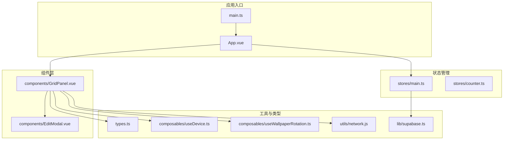
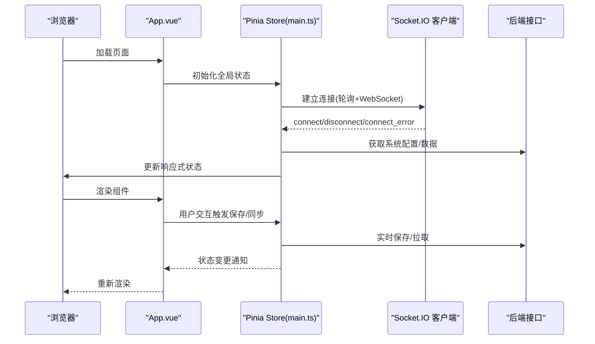
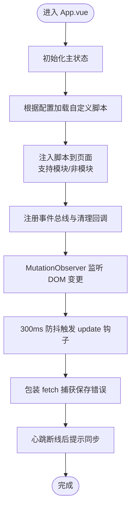
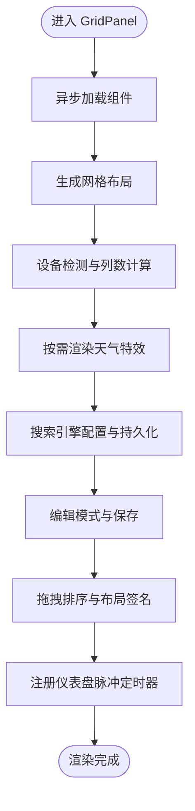
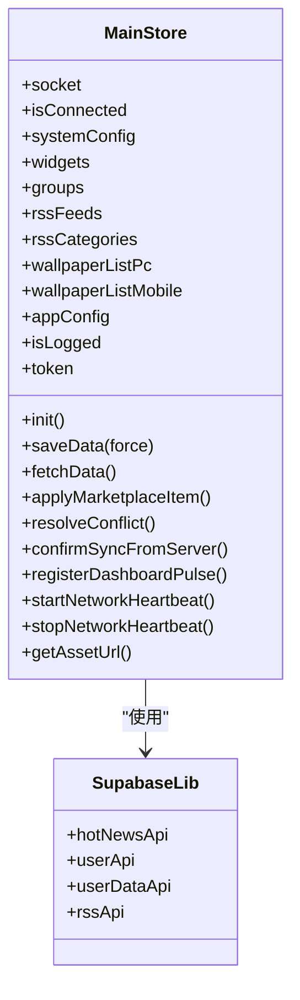
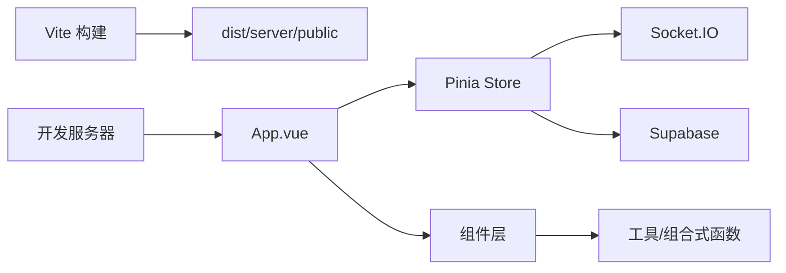

# 前端架构

<cite>
**本文引用的文件**
- [main.ts](file://frontend/src/main.ts)
- [App.vue](file://frontend/src/App.vue)
- [vite.config.ts](file://frontend/vite.config.ts)
- [package.json](file://frontend/package.json)
- [tsconfig.json](file://frontend/tsconfig.json)
- [main.ts（状态管理）](file://frontend/src/stores/main.ts)
- [types.ts](file://frontend/src/types.ts)
- [GridPanel.vue](file://frontend/src/components/GridPanel.vue)
- [EditModal.vue](file://frontend/src/components/EditModal.vue)
- [network.js](file://frontend/src/utils/network.js)
- [supabase.ts](file://frontend/src/lib/supabase.ts)
- [useDevice.ts](file://frontend/src/composables/useDevice.ts)
- [useWallpaperRotation.ts](file://frontend/src/composables/useWallpaperRotation.ts)
- [counter.ts](file://frontend/src/stores/counter.ts)
- [CustomWidgets.spec.ts](file://frontend/src/components/__tests__/CustomWidgets.spec.ts)
</cite>

## 目录
1. [简介](#简介)
2. [项目结构](#项目结构)
3. [核心组件](#核心组件)
4. [架构总览](#架构总览)
5. [详细组件分析](#详细组件分析)
6. [依赖关系分析](#依赖关系分析)
7. [性能考量](#性能考量)
8. [故障排查指南](#故障排查指南)
9. [结论](#结论)
10. [附录](#附录)

## 简介
本文件面向前端开发者，系统性梳理 OFlatNas 的前端架构，涵盖 Vue 3 + TypeScript 技术栈、Composition API 使用模式、组件化设计、Pinia 状态管理、路由系统、响应式数据绑定、Socket.IO 实时同步、事件驱动模式、构建与打包优化以及性能与可维护性建议。文档以“渐进加深”的方式呈现，既适合初学者快速上手，也为资深开发者提供深入参考。

## 项目结构
前端位于 frontend 目录，采用“按功能域 + 层次化”组织方式：
- 应用入口与主应用：main.ts、App.vue
- 组件层：components/*，包含网格面板、小部件、设置、侧边栏等
- 状态层：stores/*，Pinia Store（main.ts、counter.ts）
- 工具与组合式函数：utils/*、composables/*
- 类型定义：types.ts
- 构建与配置：vite.config.ts、package.json、tsconfig.json
- 第三方库封装：lib/supabase.ts（Supabase 客户端）

图表来源
- [main.ts:1-37](file://frontend/src/main.ts#L1-L37)
- [App.vue:1-666](file://frontend/src/App.vue#L1-L666)
- [GridPanel.vue:1-800](file://frontend/src/components/GridPanel.vue#L1-L800)
- [EditModal.vue:1-200](file://frontend/src/components/EditModal.vue#L1-L200)
- [main.ts（状态管理）:1-800](file://frontend/src/stores/main.ts#L1-L800)
- [types.ts:1-298](file://frontend/src/types.ts#L1-L298)
- [useDevice.ts:1-72](file://frontend/src/composables/useDevice.ts#L1-L72)
- [useWallpaperRotation.ts:1-116](file://frontend/src/composables/useWallpaperRotation.ts#L1-L116)
- [network.js:1-176](file://frontend/src/utils/network.js#L1-L176)
- [supabase.ts:1-343](file://frontend/src/lib/supabase.ts#L1-L343)

章节来源
- [main.ts:1-37](file://frontend/src/main.ts#L1-L37)
- [vite.config.ts:1-57](file://frontend/vite.config.ts#L1-L57)
- [package.json:1-77](file://frontend/package.json#L1-L77)
- [tsconfig.json:1-12](file://frontend/tsconfig.json#L1-L12)

## 核心组件
- 应用根组件 App.vue：负责全局状态监听、自定义脚本注入运行时、错误捕获与遮罩处理、版本轮询与保存错误提示、状态监控挂载等。
- 网格面板 GridPanel.vue：负责布局生成、拖拽排序、设备适配、天气特效渲染、壁纸轮播、搜索引擎切换、分页模式、编辑模式等。
- 编辑弹窗 EditModal.vue：负责导航项/分组编辑、图标选择、备份地址配置、描述多行合并显示等。
- 主状态仓库 main.ts：集中管理 Socket.IO 连接、心跳与网络模式、系统配置、用户认证、小部件布局与 UI 状态、壁纸列表、天气网络状态、仪表盘脉冲定时器、资源版本与缓存、市场组件安装与同步等。
- 设备检测 useDevice.ts：基于窗口尺寸与 UA 判定设备类型，支持 Harmony/Alook 等特殊浏览器识别。
- 壁纸轮播 useWallpaperRotation.ts：基于配置周期切换桌面/移动端壁纸，支持随机与顺序两种模式。
- Supabase 封装 supabase.ts：提供热点新闻、用户认证、用户数据读写与实时订阅等能力。
- 网络规则 network.js：解析用户规则与预设，判断目标 URL 的内网/外网/覆盖网络类别，辅助网络模式决策。

章节来源
- [App.vue:1-666](file://frontend/src/App.vue#L1-L666)
- [GridPanel.vue:1-800](file://frontend/src/components/GridPanel.vue#L1-L800)
- [EditModal.vue:1-200](file://frontend/src/components/EditModal.vue#L1-L200)
- [main.ts（状态管理）:1-800](file://frontend/src/stores/main.ts#L1-L800)
- [useDevice.ts:1-72](file://frontend/src/composables/useDevice.ts#L1-L72)
- [useWallpaperRotation.ts:1-116](file://frontend/src/composables/useWallpaperRotation.ts#L1-L116)
- [supabase.ts:1-343](file://frontend/src/lib/supabase.ts#L1-L343)
- [network.js:1-176](file://frontend/src/utils/network.js#L1-L176)

## 架构总览
整体采用“单页应用 + 组合式架构 + 状态中心 + 实时通信”的设计：
- 单页应用：通过 Vite 开发服务器与产物部署，统一入口 main.ts 初始化应用与 Pinia。
- 组合式架构：大量使用 Composition API（ref/computed/watch/effect）、VueUse 提供的响应式工具与设备检测、拖拽与布局库。
- 状态中心：Pinia Store（main.ts）集中管理全局状态、网络模式、认证、布局、UI 状态、资源版本等。
- 实时通信：Socket.IO 客户端连接后，通过心跳与断线重连策略保障数据同步；同时结合 HTTP 轮询兜底。
- 事件驱动：App.vue 中的自定义脚本运行时通过事件总线与 MutationObserver 驱动组件生命周期钩子。

图表来源
- [main.ts:1-37](file://frontend/src/main.ts#L1-L37)
- [App.vue:1-666](file://frontend/src/App.vue#L1-L666)
- [main.ts（状态管理）:1-800](file://frontend/src/stores/main.ts#L1-L800)

## 详细组件分析

### 组件 A：App.vue（应用根与自定义脚本运行时）
- 职责
  - 全局状态监听与标题/样式注入
  - 自定义脚本注入运行时：支持模块与非模块脚本、跨域代理、事件总线、清理回调
  - 保存错误提示与心跳断线后的同步确认
  - 全局拖拽初始化与 fetch 包装
- 关键点
  - 自定义脚本运行时通过 MutationObserver 与防抖策略在 DOM 变更后触发 update 钩子
  - 通过事件总线实现组件间解耦通信
  - fetch 包装自动对跨域请求走代理路径

图表来源
- [App.vue:1-666](file://frontend/src/App.vue#L1-L666)

章节来源
- [App.vue:1-666](file://frontend/src/App.vue#L1-L666)

### 组件 B：GridPanel.vue（网格布局与交互）
- 职责
  - 动态异步组件加载，避免生产环境 Chunk 失败导致登录框不可用
  - 基于 grid-layout-plus 的响应式网格布局，支持缩放与紧凑排列
  - 设备模式与列数自适应，夜间/白天背景遮罩控制
  - 天气特效（Canvas/Rain）按条件渲染
  - 搜索引擎配置与持久化，分页模式与活动分组
  - 编辑模式与保存流程，拖拽排序与布局签名
- 关键点
  - 异步组件加载失败时自动刷新页面，提升健壮性
  - 布局缩放与反缩放保持一致，避免精度丢失
  - 通过 store.registerDashboardPulse 统一调度多个子组件轮询

图表来源
- [GridPanel.vue:1-800](file://frontend/src/components/GridPanel.vue#L1-L800)
- [useDevice.ts:1-72](file://frontend/src/composables/useDevice.ts#L1-L72)
- [useWallpaperRotation.ts:1-116](file://frontend/src/composables/useWallpaperRotation.ts#L1-L116)

章节来源
- [GridPanel.vue:1-800](file://frontend/src/components/GridPanel.vue#L1-L800)
- [useDevice.ts:1-72](file://frontend/src/composables/useDevice.ts#L1-L72)
- [useWallpaperRotation.ts:1-116](file://frontend/src/composables/useWallpaperRotation.ts#L1-L116)

### 组件 C：EditModal.vue（编辑与配置）
- 职责
  - 导航项/分组编辑表单，支持多行描述、图标选择、备份地址
  - 本地与 API 图标源检索，Fuse 搜索
  - 分组选择与保存回调
- 关键点
  - 描述字段三行合并/拆分，保持 UI 一致性
  - 图标上传与本地图标列表加载
  - 与 GridPanel 的分组联动

章节来源
- [EditModal.vue:1-200](file://frontend/src/components/EditModal.vue#L1-L200)

### 组件 D：状态管理（Pinia Store main.ts）
- 职责
  - Socket.IO 连接与心跳：轮询+WebSocket 双通道，断线重连与超时检测
  - 系统配置与鉴权：获取/更新系统配置、令牌与登录状态
  - 小部件与布局：标准化、UI 状态映射、布局签名、服务器布局同步
  - 壁纸列表与轮播：PC/移动端壁纸列表与轮换
  - 天气网络状态：在线/降级/离线检测与缓存
  - 仪表盘脉冲：统一定时器，减少分散请求
  - 资源版本：资源 URL 时间戳参数，避免缓存问题
  - 市场组件：安装、同步与冲突处理
- 关键点
  - 心跳间隔与超时随网络模式动态调整
  - UI 状态与业务数据分离，通过 strip/apply 方法保持一致性
  - 服务器布局签名用于增量同步与冲突检测

图表来源
- [main.ts（状态管理）:1-800](file://frontend/src/stores/main.ts#L1-L800)
- [supabase.ts:1-343](file://frontend/src/lib/supabase.ts#L1-L343)

章节来源
- [main.ts（状态管理）:1-800](file://frontend/src/stores/main.ts#L1-L800)
- [supabase.ts:1-343](file://frontend/src/lib/supabase.ts#L1-L343)

### 组件 E：网络与设备（network.js、useDevice.ts、useWallpaperRotation.ts）
- network.js：解析用户规则与预设，判断目标 URL 的网络类别（LAN/OVERLAY/WAN），支持延迟阈值与强制模式
- useDevice.ts：综合窗口尺寸与 UA 判定设备类型，支持多种浏览器标识
- useWallpaperRotation.ts：按配置周期切换壁纸，支持随机与顺序模式

章节来源
- [network.js:1-176](file://frontend/src/utils/network.js#L1-L176)
- [useDevice.ts:1-72](file://frontend/src/composables/useDevice.ts#L1-L72)
- [useWallpaperRotation.ts:1-116](file://frontend/src/composables/useWallpaperRotation.ts#L1-L116)

### 组件 F：类型与测试（types.ts、CustomWidgets.spec.ts）
- types.ts：定义导航项、分组、小部件、应用配置、RSS、书签、待办、天气等核心类型
- CustomWidgets.spec.ts：验证自定义组件 JSON 结构与 JS 安全执行，确保 mock 上下文下的稳定性

章节来源
- [types.ts:1-298](file://frontend/src/types.ts#L1-L298)
- [CustomWidgets.spec.ts:1-125](file://frontend/src/components/__tests__/CustomWidgets.spec.ts#L1-L125)

## 依赖关系分析
- 构建与打包
  - Vite 作为构建工具，开发服务器、插件与别名配置；生产构建输出至 dist 或 server/public
  - 源码映射关闭，Rollup 警告过滤避免外部依赖警告导致构建失败
- 依赖生态
  - Vue 3 + TypeScript + Pinia + VueUse + Socket.IO + grid-layout-plus + vue-draggable-plus
  - Supabase 用于用户数据与实时订阅
- 开发与测试
  - Vitest + jsdom + Playwright 测试套件
  - ESLint + Prettier + TailwindCSS

图表来源
- [vite.config.ts:1-57](file://frontend/vite.config.ts#L1-L57)
- [main.ts:1-37](file://frontend/src/main.ts#L1-L37)
- [package.json:1-77](file://frontend/package.json#L1-L77)

章节来源
- [vite.config.ts:1-57](file://frontend/vite.config.ts#L1-L57)
- [package.json:1-77](file://frontend/package.json#L1-L77)

## 性能考量
- 响应式与渲染
  - 使用 computed/ref/watch 精准追踪状态变化，避免不必要的重渲染
  - GridPanel 采用缩放布局与紧凑排列算法，减少重排与重绘
- 资源与缓存
  - 资源版本参数避免缓存导致的覆盖闪烁
  - 壁纸预加载与完成回调，提升首屏体验
- 网络与实时
  - Socket.IO 轮询+WebSocket 双通道，断线重连与心跳超时检测
  - 仪表盘脉冲统一调度，降低分散请求频率
- 构建优化
  - 生产关闭源码映射，Rollup 警告过滤
  - 异步组件按需加载，Chunk 失败自动刷新

[本节为通用性能建议，无需特定文件引用]

## 故障排查指南
- 自定义脚本加载失败
  - 检查脚本是否为模块脚本，确保通过 FlatNasCustomRegister 注册
  - 非模块脚本会包裹 fetch 代理，确认 useProxy 配置
- 保存失败
  - App.vue 中对 /api/save 的 fetch 包装会提示错误信息（如 413/网络异常）
- 心跳断线
  - Store 中的心跳定时器会在超时后标记网络同步状态，页面会提示同步确认
- 布局错乱
  - 检查布局签名与 UI 状态映射，确保保存/恢复流程正确
- 壁纸不轮换
  - 确认配置开关与轮换间隔，检查壁纸列表获取是否成功

章节来源
- [App.vue:420-481](file://frontend/src/App.vue#L420-L481)
- [main.ts（状态管理）:444-467](file://frontend/src/stores/main.ts#L444-L467)

## 结论
OFlatNas 前端以 Vue 3 + TypeScript 为基础，结合 Composition API、Pinia 状态管理与 Socket.IO 实时通信，构建了高可用、可扩展的仪表盘系统。通过设备检测、网络规则、异步组件与统一脉冲调度，系统在复杂环境下仍能保持稳定与高性能。建议后续持续完善测试覆盖率与可观测性，进一步优化首屏与交互细节。

[本节为总结性内容，无需特定文件引用]

## 附录
- 开发与构建命令
  - 开发：npm run dev
  - 构建：npm run build
  - 预览：npm run preview
  - 类型检查：npm run type-check
  - 单元测试：npm run test
  - E2E 测试：npm run test:e2e
- 关键配置
  - Vite 别名 @ -> src
  - 开发主机与端口、忽略目录、Windows 文件监听
  - 生产输出目录与 public 目录策略

章节来源
- [package.json:10-21](file://frontend/package.json#L10-L21)
- [vite.config.ts:46-54](file://frontend/vite.config.ts#L46-L54)