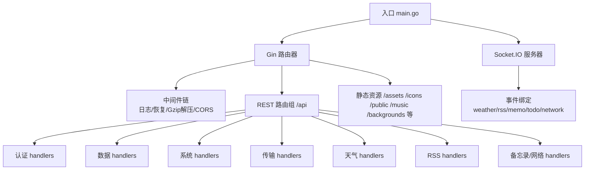
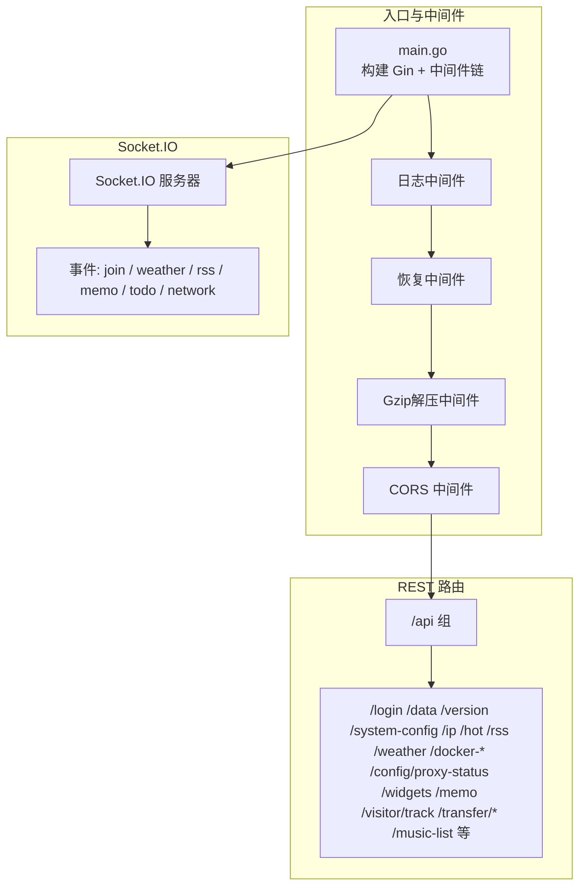
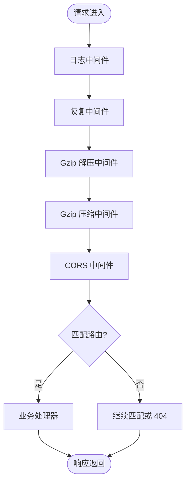
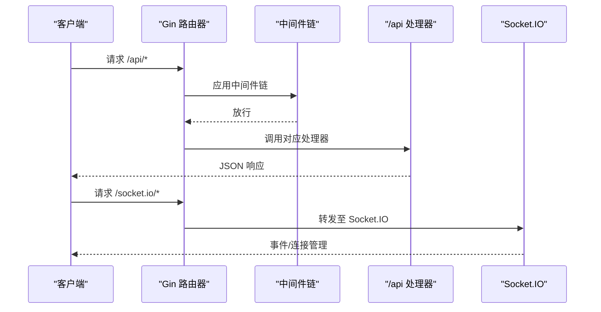
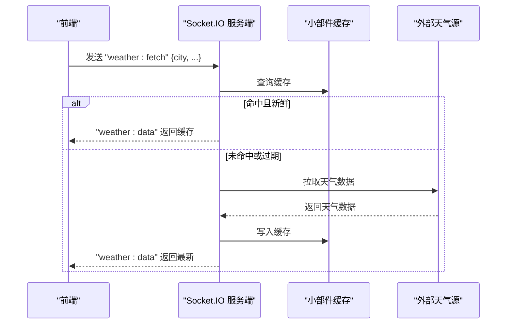
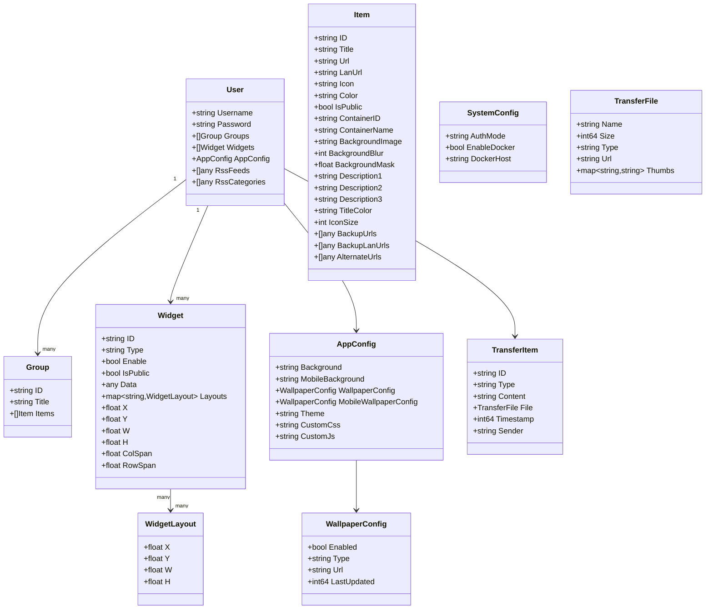
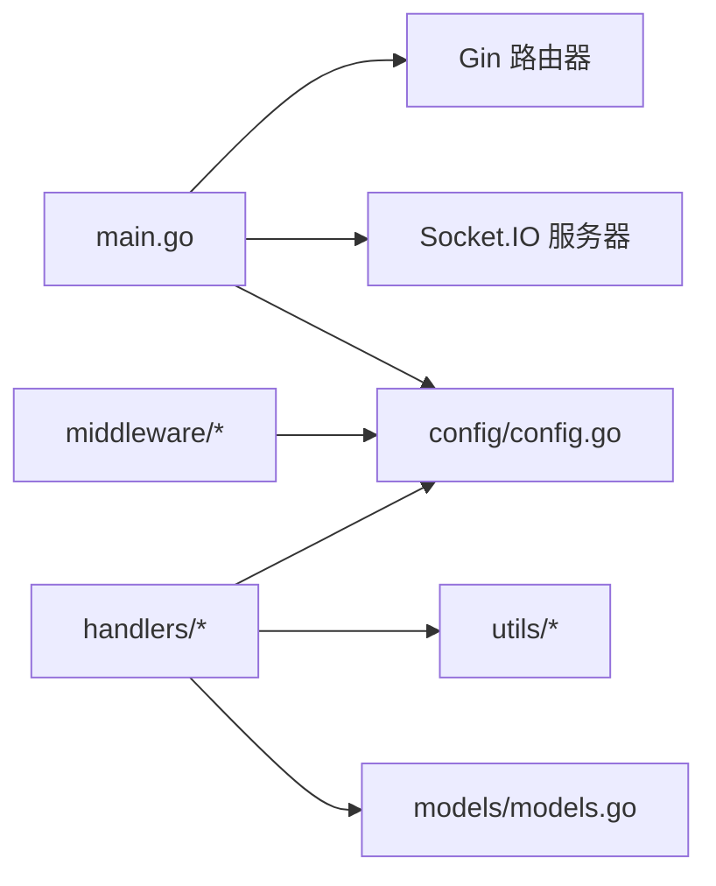

# 后端架构

<cite>
**本文档引用的文件**
- [backend/main.go](file://backend/main.go)
- [backend/go.mod](file://backend/go.mod)
- [backend/config/config.go](file://backend/config/config.go)
- [backend/models/models.go](file://backend/models/models.go)
- [backend/middleware/auth.go](file://backend/middleware/auth.go)
- [backend/middleware/recovery.go](file://backend/middleware/recovery.go)
- [backend/middleware/gzip_decompress.go](file://backend/middleware/gzip_decompress.go)
- [backend/utils/crypto.go](file://backend/utils/crypto.go)
- [backend/utils/utils.go](file://backend/utils/utils.go)
- [backend/handlers/auth.go](file://backend/handlers/auth.go)
- [backend/handlers/data.go](file://backend/handlers/data.go)
- [backend/handlers/system.go](file://backend/handlers/system.go)
- [backend/handlers/transfer.go](file://backend/handlers/transfer.go)
- [backend/handlers/weather.go](file://backend/handlers/weather.go)
- [backend/handlers/rss.go](file://backend/handlers/rss.go)
- [backend/handlers/memo.go](file://backend/handlers/memo.go)
</cite>

## 目录
1. [简介](#简介)
2. [项目结构](#项目结构)
3. [核心组件](#核心组件)
4. [架构总览](#架构总览)
5. [详细组件分析](#详细组件分析)
6. [依赖分析](#依赖分析)
7. [性能考量](#性能考量)
8. [故障排查指南](#故障排查指南)
9. [结论](#结论)
10. [附录](#附录)

## 简介
本文件面向后端开发者，系统性梳理 OFlatNas 的 Go Gin 后端架构，覆盖 MVC 模式实现、中间件链、路由设计、RESTful API、Socket.IO 实时通信、数据模型、配置管理与中间件链设计，并提供服务层架构图、数据流图与组件关系图，帮助快速理解与高效开发。

## 项目结构
后端采用分层与按功能域组织的结构：
- config：应用启动初始化、路径与默认配置管理
- models：领域数据模型定义
- middleware：通用中间件（认证、恢复、Gzip解压）
- utils：通用工具（文件锁、原子写入、密码哈希）
- handlers：业务处理器（按功能模块划分，如 auth、data、system、transfer、weather、rss、memo 等）
- main.go：入口程序，构建 Gin 路由、Socket.IO 服务、静态资源与中间件链

图表来源
- [backend/main.go:25-267](file://backend/main.go#L25-L267)

章节来源
- [backend/main.go:25-267](file://backend/main.go#L25-L267)
- [backend/go.mod:1-83](file://backend/go.mod#L1-L83)

## 核心组件
- 入口与中间件链
  - 初始化配置、启动后台任务、构建 Gin 实例与中间件链（日志、恢复、Gzip解压、CORS），随后挂载 Socket.IO、静态资源与 REST 路由组。
- 配置管理
  - 自动推断 BaseDir，确保数据目录存在，生成或校验 system.json、data.json、secret.key 等；支持多环境变量控制（如 BASE_DIR、CORS_ALLOW_ORIGINS、PORT）。
- 数据模型
  - 用户、分组、条目、小部件、应用配置、系统配置、访客统计、传输项等模型，支撑前端布局与状态持久化。
- 中间件
  - 认证中间件（JWT）、可选认证中间件（用于公开接口）、恢复中间件（统一 500）、Gzip 解压中间件（处理压缩请求体）。
- 工具库
  - 文件锁与原子写入，保障并发安全；bcrypt 密码哈希与校验。
- 处理器（Handlers）
  - 按功能域拆分，覆盖登录/用户管理、数据读取/保存/导入/重置、系统信息、传输文件、天气、RSS、备忘录与网络模式等。

章节来源
- [backend/config/config.go:35-257](file://backend/config/config.go#L35-L257)
- [backend/models/models.go:1-118](file://backend/models/models.go#L1-L118)
- [backend/middleware/auth.go:12-61](file://backend/middleware/auth.go#L12-L61)
- [backend/middleware/recovery.go:9-16](file://backend/middleware/recovery.go#L9-L16)
- [backend/middleware/gzip_decompress.go:11-38](file://backend/middleware/gzip_decompress.go#L11-L38)
- [backend/utils/crypto.go:7-16](file://backend/utils/crypto.go#L7-L16)
- [backend/utils/utils.go:9-76](file://backend/utils/utils.go#L9-L76)

## 架构总览
后端采用“入口程序 + 中间件链 + REST 路由组 + Socket.IO 实时通道”的混合架构。REST 接口负责数据与系统管理，Socket.IO 提供实时事件广播与交互。

图表来源
- [backend/main.go:34-267](file://backend/main.go#L34-L267)

章节来源
- [backend/main.go:34-267](file://backend/main.go#L34-L267)

## 详细组件分析

### MVC 模式实现
- Model（模型）
  - 定义用户、分组、条目、小部件、应用配置、系统配置、访客统计、传输项等结构，支撑前后端数据契约。
- View（视图）
  - 通过 JSON 响应返回给前端；静态资源通过 Gin Static 提供前端页面与资源。
- Controller（控制器）
  - handlers 包含各业务控制器逻辑，负责参数解析、鉴权、调用工具与存储、返回响应；部分实时事件通过 Socket.IO 处理。

章节来源
- [backend/models/models.go:1-118](file://backend/models/models.go#L1-L118)
- [backend/handlers/auth.go:18-211](file://backend/handlers/auth.go#L18-L211)
- [backend/handlers/data.go:159-322](file://backend/handlers/data.go#L159-L322)

### 中间件架构
- 中间件链顺序
  - 日志 → 恢复 → Gzip 解压 → Gzip 压缩（全局）→ CORS → 路由匹配
- 关键中间件职责
  - 认证中间件：从 Header 或查询参数提取 JWT，校验签名与方法，注入用户名上下文
  - 可选认证中间件：仅在有效时注入用户名，允许匿名访问
  - 恢复中间件：捕获 panic，返回统一 500 错误
  - Gzip 解压中间件：识别 Content-Encoding: gzip，解压请求体并清理头部
  - Gzip 压缩中间件：对响应进行压缩（默认压缩级别）
  - CORS 中间件：动态允许来源，支持凭证与常用头

图表来源
- [backend/main.go:34-77](file://backend/main.go#L34-L77)
- [backend/middleware/auth.go:33-61](file://backend/middleware/auth.go#L33-L61)
- [backend/middleware/recovery.go:9-16](file://backend/middleware/recovery.go#L9-L16)
- [backend/middleware/gzip_decompress.go:11-38](file://backend/middleware/gzip_decompress.go#L11-L38)

章节来源
- [backend/main.go:34-115](file://backend/main.go#L34-L115)
- [backend/middleware/auth.go:12-61](file://backend/middleware/auth.go#L12-L61)
- [backend/middleware/recovery.go:9-16](file://backend/middleware/recovery.go#L9-L16)
- [backend/middleware/gzip_decompress.go:11-38](file://backend/middleware/gzip_decompress.go#L11-L38)

### 路由设计原理
- 分组路由
  - /api 下分为公开与受保护两层：公开接口使用可选认证中间件；受保护接口使用强制认证中间件
- 静态资源
  - /assets、/icons、/music、/backgrounds、/icon-cache、/public 等静态目录映射
  - SPA 回退：非 /api 且非 /socket.io 的请求回退到 index.html，并禁用缓存
- Socket.IO
  - 将 /socket.io/*any 路径交由 Socket.IO 处理，事件在服务端绑定并广播

图表来源
- [backend/main.go:165-254](file://backend/main.go#L165-L254)
- [backend/main.go:113-115](file://backend/main.go#L113-L115)

章节来源
- [backend/main.go:165-254](file://backend/main.go#L165-L254)
- [backend/main.go:113-164](file://backend/main.go#L113-L164)

### RESTful API 架构
- 登录与用户管理
  - /api/login：支持单/多用户模式，生成 JWT
  - /api/admin/users：管理员查询、新增、删除用户
- 数据读取与保存
  - /api/data、/api/version：获取用户数据与版本号
  - /api/save、/api/import、/api/reset、/api/default/save：保存、导入、重置与保存默认模板
  - /api/widgets/:id、/api/memo/:id：按小部件或备忘录读取数据
- 系统与网络
  - /api/system-config、/api/system/stats、/api/ip、/api/ping、/api/rtt、/api/music-list
  - /api/custom-scripts、/api/config/proxy-status
- Docker 与代理
  - /api/docker-*、/api/amap/weather、/api/amap/ip、/api/proxy
- 传输与缓存
  - /api/transfer/*：上传/下载/缩略图生成与管理
- 访客追踪
  - /api/visitor/track：公开接口记录访客

章节来源
- [backend/handlers/auth.go:18-211](file://backend/handlers/auth.go#L18-L211)
- [backend/handlers/data.go:159-322](file://backend/handlers/data.go#L159-L322)
- [backend/handlers/system.go:51-203](file://backend/handlers/system.go#L51-L203)
- [backend/handlers/transfer.go:200-968](file://backend/handlers/transfer.go#L200-L968)

### Socket.IO 服务端集成与实时通信
- 连接与房间
  - 建立连接后，客户端通过 “join” 加入房间
- 事件绑定
  - 天气：weather:fetch → 缓存命中则直接返回，否则拉取并缓存，再通过 weather:data 广播
  - RSS：rss:fetch → 缓存命中则返回，否则拉取并缓存，再通过 rss:data 广播
  - 备忘录：memo:update → 校验令牌后广播 memo:updated
  - 待办：todo:update → 校验令牌后广播 todo:updated
  - 网络：network:mode、network:heartbeat → 校验令牌后广播网络模式与心跳
- 服务端与处理器协作
  - handlers 中绑定事件，必要时通过 SetSocketServer 注入 Socket.IO 实例，实现跨处理器共享

图表来源
- [backend/main.go:94-111](file://backend/main.go#L94-L111)
- [backend/handlers/weather.go:114-146](file://backend/handlers/weather.go#L114-L146)

章节来源
- [backend/main.go:79-111](file://backend/main.go#L79-L111)
- [backend/handlers/weather.go:114-146](file://backend/handlers/weather.go#L114-L146)
- [backend/handlers/rss.go:82-135](file://backend/handlers/rss.go#L82-L135)
- [backend/handlers/memo.go:25-55](file://backend/handlers/memo.go#L25-L55)

### 数据模型设计
- 用户与权限
  - 用户名、密码（哈希）、分组、条目、小部件、应用配置、RSS 列表等
- 小部件与布局
  - 小部件类型、启用状态、公开性、数据、布局坐标与尺寸
- 系统配置
  - 认证模式、Docker 开关与主机地址
- 传输与缓存
  - 传输项、文件元信息、缩略图映射
- 备忘录与网络
  - 备忘录内容、模式与服务端时间戳；网络模式枚举

图表来源
- [backend/models/models.go:3-118](file://backend/models/models.go#L3-L118)

章节来源
- [backend/models/models.go:1-118](file://backend/models/models.go#L1-L118)

### 配置管理架构
- 初始化流程
  - 推断 BaseDir，设置 DataDir/UsersDir/DocDir/MusicDir/...，确保目录存在
  - 确保 system.json、data.json、secret.key 存在并校验/生成
  - 创建额外数据文件（如 amap_stats.json、visitors.json、custom_scripts.json、widget_cache.json）
- 环境变量
  - BASE_DIR：根目录覆盖
  - CORS_ALLOW_ORIGINS：逗号分隔允许来源，空表示允许全部
  - PORT：监听端口，默认 3000
- 密钥管理
  - secret.key 自动生成与读取，用于 JWT 签名

章节来源
- [backend/config/config.go:35-257](file://backend/config/config.go#L35-L257)

### 中间件链设计
- 设计要点
  - 中间件按“越靠前越通用”的原则排列，确保日志、恢复、Gzip 解压与 CORS 在路由匹配之前生效
  - 可选认证与强制认证分别用于公开与受保护接口，避免重复鉴权逻辑
- 扩展建议
  - 可引入限流、速率限制、审计日志等中间件，按需插入中间件链

章节来源
- [backend/main.go:34-115](file://backend/main.go#L34-L115)
- [backend/middleware/auth.go:33-61](file://backend/middleware/auth.go#L33-L61)

### 错误处理策略
- 统一恢复
  - 恢复中间件捕获 panic，返回统一 500 JSON
- 明确状态码
  - 认证失败返回 401，参数错误返回 400，权限不足返回 403，资源不存在返回 404，冲突返回 409
- 事件错误
  - Socket.IO 事件通过 “*-error” 事件向客户端反馈错误

章节来源
- [backend/middleware/recovery.go:9-16](file://backend/middleware/recovery.go#L9-L16)
- [backend/handlers/auth.go:18-211](file://backend/handlers/auth.go#L18-L211)
- [backend/handlers/weather.go:134-145](file://backend/handlers/weather.go#L134-L145)
- [backend/handlers/rss.go:116-134](file://backend/handlers/rss.go#L116-L134)

### 日志记录机制
- 记录内容
  - GetData 缓存命中/未命中耗时统计
  - SaveData 慢请求告警（超过 5 秒）
- 建议
  - 引入结构化日志（如 JSON）与采样日志，区分 INFO/WARN/ERROR 级别

章节来源
- [backend/handlers/data.go:200-322](file://backend/handlers/data.go#L200-L322)
- [backend/handlers/data.go:728-744](file://backend/handlers/data.go#L728-L744)

### 性能优化考虑
- 压缩传输
  - 全局启用 Gzip 压缩，显著降低内网/慢速网络传输体积
- 缓存策略
  - GetData 基于文件修改时间的内存缓存；天气/RSS 使用小部件缓存与异步刷新
- 文件操作
  - 原子写入与文件锁，避免并发写冲突
- 网络统计
  - CPU/内存/磁盘/网络统计计算使用互斥锁与时间窗口，避免频繁系统调用

章节来源
- [backend/main.go:42-46](file://backend/main.go#L42-L46)
- [backend/handlers/data.go:22-32](file://backend/handlers/data.go#L22-L32)
- [backend/handlers/weather.go:121-145](file://backend/handlers/weather.go#L121-L145)
- [backend/handlers/system.go:51-203](file://backend/handlers/system.go#L51-L203)
- [backend/utils/utils.go:43-55](file://backend/utils/utils.go#L43-L55)

## 依赖分析
- 外部依赖
  - Gin、Socket.IO、JWT、gopsutil、bcrypt、image 等
- 模块耦合
  - handlers 依赖 config 与 utils；中间件依赖 config；main 负责装配与调度
- 潜在风险
  - Socket.IO 与 handlers 的耦合度较高，建议抽象出事件总线以降低耦合

图表来源
- [backend/go.mod:5-17](file://backend/go.mod#L5-L17)
- [backend/main.go:3-23](file://backend/main.go#L3-L23)

章节来源
- [backend/go.mod:1-83](file://backend/go.mod#L1-L83)
- [backend/main.go:3-23](file://backend/main.go#L3-L23)

## 性能考量
- 网络与传输
  - 启用 Gzip 压缩与合理的 MaxMultipartMemory，适配大配置文件与图片/音乐资源
- 缓存与热点
  - 对高频读取的数据（用户数据、天气、RSS）实施缓存与预热，减少 IO 与外部依赖
- 并发与锁
  - 文件写入使用原子写入与锁，避免竞态；统计数据计算加锁与时间窗口
- 响应时间
  - 对慢请求进行日志告警，便于后续优化

章节来源
- [backend/main.go:42-46](file://backend/main.go#L42-L46)
- [backend/handlers/data.go:22-32](file://backend/handlers/data.go#L22-L32)
- [backend/handlers/weather.go:148-161](file://backend/handlers/weather.go#L148-L161)
- [backend/handlers/system.go:51-203](file://backend/handlers/system.go#L51-L203)
- [backend/utils/utils.go:43-55](file://backend/utils/utils.go#L43-L55)

## 故障排查指南
- 认证失败
  - 检查 Authorization 头或查询参数 token 是否正确；确认 secret.key 一致
- 500 错误
  - 查看恢复中间件日志；定位具体处理器异常
- 401/403/404/409
  - 根据处理器返回的错误码与消息定位问题（用户不存在、权限不足、版本冲突等）
- Socket.IO 事件无响应
  - 检查事件名称、令牌校验、房间加入与广播目标命名空间
- 静态资源 404 或白屏
  - 确认 SPA 回退规则与 index.html 缓存策略；检查 PublicDir 路径

章节来源
- [backend/middleware/auth.go:12-61](file://backend/middleware/auth.go#L12-L61)
- [backend/middleware/recovery.go:9-16](file://backend/middleware/recovery.go#L9-L16)
- [backend/handlers/auth.go:18-211](file://backend/handlers/auth.go#L18-L211)
- [backend/main.go:157-163](file://backend/main.go#L157-L163)

## 结论
该后端以 Gin 为核心，结合 Socket.IO 实现实时能力，采用清晰的分层与中间件链设计，配合配置管理与工具库，满足多场景需求。建议在现有基础上进一步抽象事件总线、增强日志与指标采集，并完善限流与审计机制，持续提升稳定性与可观测性。

## 附录
- 关键路径参考
  - 入口与中间件链：[backend/main.go:34-115](file://backend/main.go#L34-L115)
  - 配置初始化：[backend/config/config.go:35-257](file://backend/config/config.go#L35-L257)
  - 认证中间件：[backend/middleware/auth.go:33-61](file://backend/middleware/auth.go#L33-L61)
  - 数据处理器：[backend/handlers/data.go:159-322](file://backend/handlers/data.go#L159-L322)
  - 系统处理器：[backend/handlers/system.go:51-203](file://backend/handlers/system.go#L51-L203)
  - 传输处理器：[backend/handlers/transfer.go:200-968](file://backend/handlers/transfer.go#L200-L968)
  - 天气处理器：[backend/handlers/weather.go:114-146](file://backend/handlers/weather.go#L114-L146)
  - RSS 处理器：[backend/handlers/rss.go:82-135](file://backend/handlers/rss.go#L82-L135)
  - 备忘录处理器：[backend/handlers/memo.go:25-55](file://backend/handlers/memo.go#L25-L55)