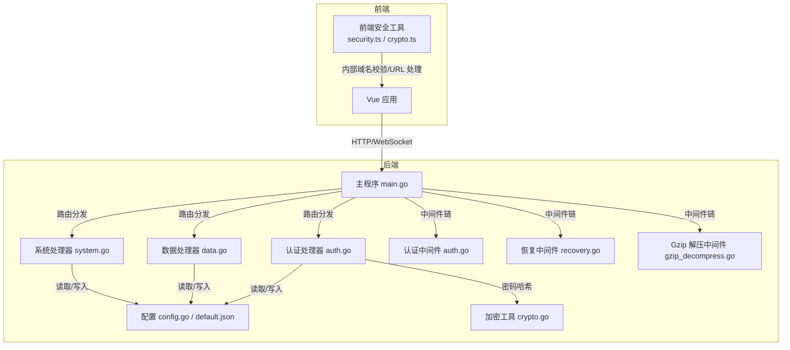
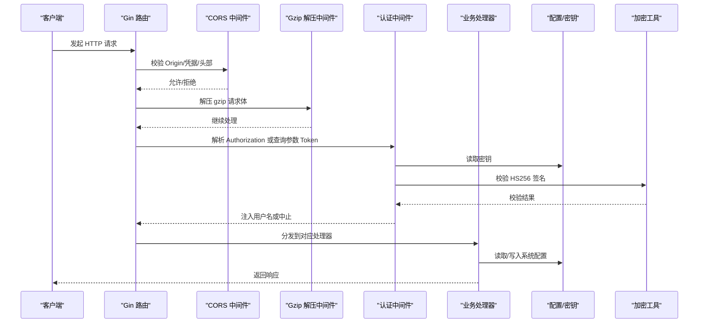
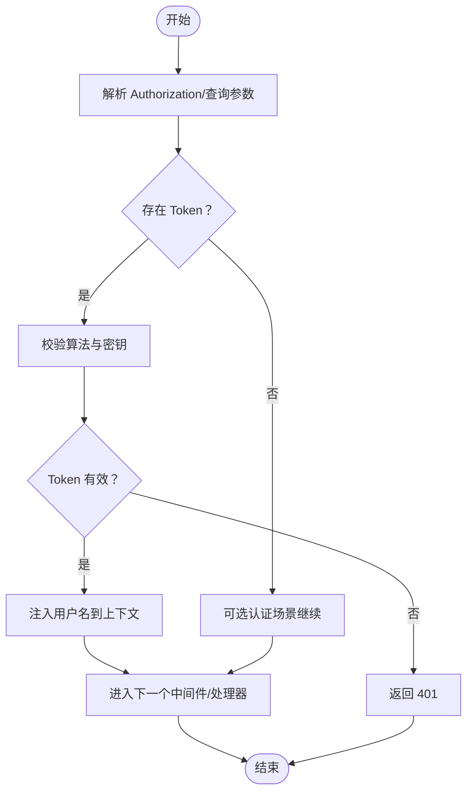
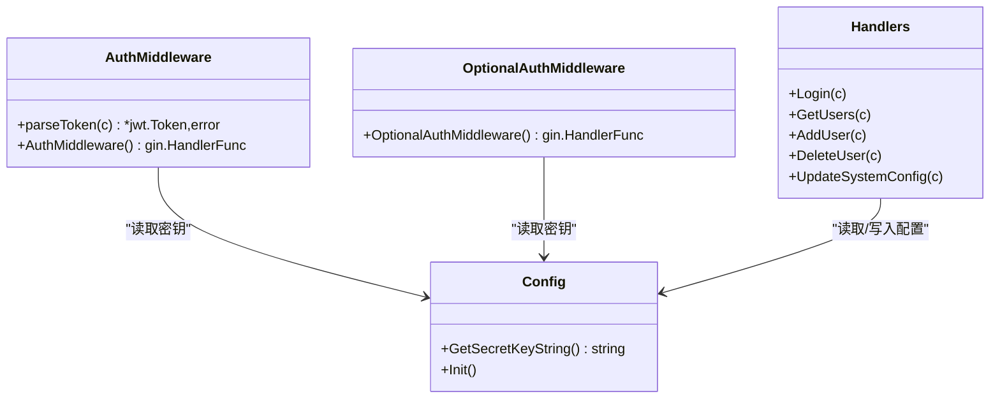
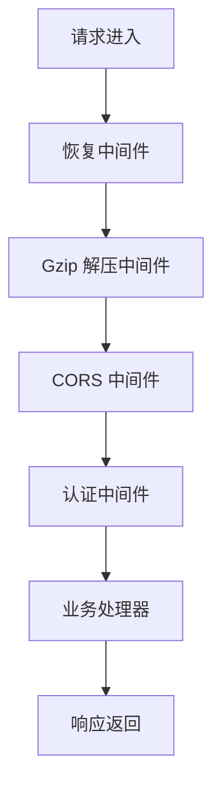
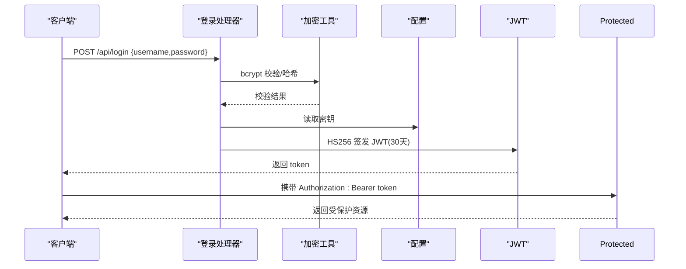
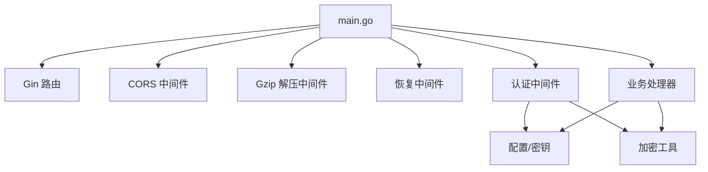

# 安全架构

<cite>
**本文档引用的文件**
- [backend/main.go](file://backend/main.go)
- [backend/middleware/auth.go](file://backend/middleware/auth.go)
- [backend/middleware/recovery.go](file://backend/middleware/recovery.go)
- [backend/middleware/gzip_decompress.go](file://backend/middleware/gzip_decompress.go)
- [backend/handlers/auth.go](file://backend/handlers/auth.go)
- [backend/handlers/data.go](file://backend/handlers/data.go)
- [backend/handlers/system.go](file://backend/handlers/system.go)
- [backend/config/config.go](file://backend/config/config.go)
- [backend/config/default.json](file://backend/config/default.json)
- [backend/utils/crypto.go](file://backend/utils/crypto.go)
- [frontend/src/utils/security.ts](file://frontend/src/utils/security.ts)
- [frontend/src/utils/crypto.ts](file://frontend/src/utils/crypto.ts)
</cite>

## 目录
1. [简介](#简介)
2. [项目结构](#项目结构)
3. [核心组件](#核心组件)
4. [架构总览](#架构总览)
5. [详细组件分析](#详细组件分析)
6. [依赖关系分析](#依赖关系分析)
7. [性能考虑](#性能考虑)
8. [故障排除指南](#故障排除指南)
9. [结论](#结论)
10. [附录](#附录)

## 简介
本文件面向系统管理员与开发者，全面阐述 OFlatNas 的安全架构，包括 JWT 认证机制、权限控制、安全中间件设计、CORS 配置、请求验证与数据加密策略，并提供认证流程图、威胁模型分析、安全配置选项与漏洞防护建议。

## 项目结构
后端采用 Go Gin 框架，前端使用 Vue 技术栈。安全相关实现主要集中在：
- 后端安全中间件：JWT 认证、可选认证、恢复中间件、Gzip 解压
- 认证与授权处理器：登录、用户管理、系统配置
- 配置与密钥管理：系统配置、密钥生成与持久化
- 前端安全工具：内部域名白名单、URL 安全处理、前端加密工具

**图表来源**
- [backend/main.go:25-267](file://backend/main.go#L25-L267)
- [backend/middleware/auth.go:1-61](file://backend/middleware/auth.go#L1-61)
- [backend/middleware/recovery.go:1-16](file://backend/middleware/recovery.go#L1-16)
- [backend/middleware/gzip_decompress.go:1-38](file://backend/middleware/gzip_decompress.go#L1-38)
- [backend/handlers/auth.go:1-211](file://backend/handlers/auth.go#L1-211)
- [backend/handlers/data.go:159-868](file://backend/handlers/data.go#L159-L868)
- [backend/handlers/system.go:1-200](file://backend/handlers/system.go#L1-L200)
- [backend/config/config.go:1-257](file://backend/config/config.go#L1-L257)
- [backend/utils/crypto.go:1-16](file://backend/utils/crypto.go#L1-L16)
- [frontend/src/utils/security.ts:1-52](file://frontend/src/utils/security.ts#L1-L52)
- [frontend/src/utils/crypto.ts:90-161](file://frontend/src/utils/crypto.ts#L90-L161)

**章节来源**
- [backend/main.go:25-267](file://backend/main.go#L25-L267)

## 核心组件
- JWT 认证中间件：解析 Authorization 头或查询参数中的 Bearer Token，校验签名算法与密钥，提取用户名并注入上下文
- 登录处理器：支持单用户/多用户模式，bcrypt 密码哈希，签发 HS256 JWT，设置 30 天有效期
- 权限控制：受保护路由组强制认证；部分公开接口支持可选认证
- CORS 配置：基于环境变量动态允许来源，支持凭据与头部暴露
- 请求安全中间件：Gzip 解压防爆破、统一异常恢复
- 密钥与配置：自动生成随机密钥并持久化，系统配置默认值与迁移
- 前端安全：内部域名白名单、URL 强制 HTTPS、编码处理；前端 AES-GCM 加密工具

**章节来源**
- [backend/middleware/auth.go:12-47](file://backend/middleware/auth.go#L12-L47)
- [backend/handlers/auth.go:18-114](file://backend/handlers/auth.go#L18-L114)
- [backend/main.go:48-95](file://backend/main.go#L48-L95)
- [backend/middleware/gzip_decompress.go:11-37](file://backend/middleware/gzip_decompress.go#L11-L37)
- [backend/middleware/recovery.go:9-15](file://backend/middleware/recovery.go#L9-L15)
- [backend/config/config.go:182-208](file://backend/config/config.go#L182-L208)
- [frontend/src/utils/security.ts:1-52](file://frontend/src/utils/security.ts#L1-L52)
- [frontend/src/utils/crypto.ts:90-161](file://frontend/src/utils/crypto.ts#L90-L161)

## 架构总览
下图展示从客户端到后端的典型安全交互路径，包括认证、授权、CORS、中间件与处理器的关系。

**图表来源**
- [backend/main.go:34-95](file://backend/main.go#L34-L95)
- [backend/middleware/auth.go:12-47](file://backend/middleware/auth.go#L12-L47)
- [backend/middleware/gzip_decompress.go:12-37](file://backend/middleware/gzip_decompress.go#L12-L37)
- [backend/handlers/auth.go:18-114](file://backend/handlers/auth.go#L18-L114)
- [backend/config/config.go:182-208](file://backend/config/config.go#L182-L208)
- [backend/utils/crypto.go:7-15](file://backend/utils/crypto.go#L7-L15)

## 详细组件分析

### JWT 认证机制
- Token 来源：Authorization 头（Bearer 前缀）或查询参数 token
- 签名算法：仅允许 HS256，防止弱算法攻击
- 密钥管理：从文件读取或首次运行自动生成随机密钥并持久化
- Claims 注入：成功解析后将 username 写入上下文，供后续处理器使用
- 登录流程：接收用户名/密码，bcrypt 校验或首次创建默认 admin，签发带过期时间的 JWT

**图表来源**
- [backend/middleware/auth.go:12-47](file://backend/middleware/auth.go#L12-L47)
- [backend/handlers/auth.go:18-114](file://backend/handlers/auth.go#L18-L114)
- [backend/config/config.go:182-208](file://backend/config/config.go#L182-L208)

**章节来源**
- [backend/middleware/auth.go:12-47](file://backend/middleware/auth.go#L12-L47)
- [backend/handlers/auth.go:18-114](file://backend/handlers/auth.go#L18-L114)
- [backend/config/config.go:182-208](file://backend/config/config.go#L182-L208)

### 权限控制系统
- 受保护路由组：所有 /api/... 路由在受保护组中，强制通过 AuthMiddleware
- 可选认证接口：部分公开接口使用 OptionalAuthMiddleware，允许未登录访问
- 管理员权限：用户管理、系统配置更新等操作要求管理员身份
- 单/多用户模式：系统配置支持 single/multi 模式，影响默认用户行为

**图表来源**
- [backend/middleware/auth.go:33-60](file://backend/middleware/auth.go#L33-L60)
- [backend/handlers/auth.go:116-208](file://backend/handlers/auth.go#L116-L208)
- [backend/config/config.go:206-208](file://backend/config/config.go#L206-L208)

**章节来源**
- [backend/main.go:199-254](file://backend/main.go#L199-L254)
- [backend/handlers/auth.go:116-208](file://backend/handlers/auth.go#L116-L208)

### 安全中间件设计
- 恢复中间件：捕获 panic 并返回统一错误响应，避免服务崩溃
- Gzip 解压中间件：自动解压 gzip 请求体，限制最大解压大小，移除 Content-Encoding 头防止重复解压
- CORS 中间件：动态允许来源列表，支持凭据与头部暴露，限制方法与头部

**图表来源**
- [backend/middleware/recovery.go:9-15](file://backend/middleware/recovery.go#L9-L15)
- [backend/middleware/gzip_decompress.go:12-37](file://backend/middleware/gzip_decompress.go#L12-L37)
- [backend/main.go:48-95](file://backend/main.go#L48-L95)

**章节来源**
- [backend/middleware/recovery.go:1-16](file://backend/middleware/recovery.go#L1-L16)
- [backend/middleware/gzip_decompress.go:1-38](file://backend/middleware/gzip_decompress.go#L1-L38)
- [backend/main.go:48-95](file://backend/main.go#L48-L95)

### CORS 配置与跨域策略
- 动态来源：通过环境变量 CROS_ALLOW_ORIGINS 指定允许的来源列表，默认允许全部
- 支持凭据：允许携带 Cookie/Authorization
- 方法与头部：显式允许常见方法与必要头部
- WebSocket：Socket.IO 传输层同样应用相同的来源检查逻辑

**章节来源**
- [backend/main.go:48-95](file://backend/main.go#L48-L95)

### 请求验证与输入处理
- 登录请求绑定：对 JSON 请求体进行绑定与基础校验
- 用户管理：用户名非空校验、唯一性检查、管理员权限校验
- 文件上传：会话校验、权限检查、索引范围校验
- 数据保存：版本冲突检测、密码字段哈希处理、敏感字段清理

**章节来源**
- [backend/handlers/auth.go:18-114](file://backend/handlers/auth.go#L18-L114)
- [backend/handlers/data.go:672-744](file://backend/handlers/data.go#L672-L744)
- [backend/handlers/data.go:746-837](file://backend/handlers/data.go#L746-L837)

### 数据加密策略
- 后端密码存储：bcrypt 哈希，支持明文迁移至哈希
- JWT 签名：HS256，密钥来自配置文件
- 前端敏感数据：AES-GCM 对称加密，PBKDF2 导出密钥，含校验摘要与时间戳

**章节来源**
- [backend/utils/crypto.go:7-15](file://backend/utils/crypto.go#L7-L15)
- [backend/handlers/auth.go:46-96](file://backend/handlers/auth.go#L46-L96)
- [frontend/src/utils/crypto.ts:90-161](file://frontend/src/utils/crypto.ts#L90-L161)

### 用户认证流程与会话管理
- 认证流程：客户端提交用户名/密码 → 后端校验 → 成功签发 JWT → 客户端后续携带 Token 访问
- 会话管理：JWT 作为无状态会话载体，服务端不维护会话状态
- 令牌刷新：当前实现未提供刷新机制，建议在生产环境引入刷新令牌与黑名单机制

**图表来源**
- [backend/handlers/auth.go:18-114](file://backend/handlers/auth.go#L18-L114)
- [backend/utils/crypto.go:7-15](file://backend/utils/crypto.go#L7-L15)
- [backend/config/config.go:182-208](file://backend/config/config.go#L182-L208)

**章节来源**
- [backend/handlers/auth.go:18-114](file://backend/handlers/auth.go#L18-L114)

### 访问控制机制
- 路由级控制：/api/admin/* 受保护组强制认证
- 操作级控制：用户管理、系统配置更新需管理员身份
- 可选认证：部分公开接口允许未登录访问，便于访客浏览

**章节来源**
- [backend/main.go:199-254](file://backend/main.go#L199-L254)
- [backend/handlers/auth.go:116-208](file://backend/handlers/auth.go#L116-L208)

### 威胁模型分析
- 未授权访问：通过强制认证中间件与受保护路由组缓解
- 重放攻击：JWT 过期时间较短，结合黑名单策略可进一步降低风险
- CORS 配置不当：严格限制来源与凭据使用，避免跨站脚本与 CSRF
- 请求体过大：Gzip 解压中间件限制最大解压大小，防止内存耗尽
- 密钥泄露：密钥文件权限严格控制，定期轮换
- 前端敏感数据：前端加密仅用于本地保护，网络传输仍需 HTTPS

[本节为概念性分析，无需列出具体文件来源]

## 依赖关系分析
后端模块之间的依赖关系如下：

**图表来源**
- [backend/main.go:34-95](file://backend/main.go#L34-L95)
- [backend/middleware/auth.go:1-61](file://backend/middleware/auth.go#L1-L61)
- [backend/handlers/auth.go:1-211](file://backend/handlers/auth.go#L1-L211)
- [backend/config/config.go:1-257](file://backend/config/config.go#L1-L257)
- [backend/utils/crypto.go:1-16](file://backend/utils/crypto.go#L1-L16)

**章节来源**
- [backend/main.go:25-267](file://backend/main.go#L25-L267)

## 性能考虑
- Gzip 压缩：启用 gzip 中间件以减少传输体积，适配内网与慢速网络
- 请求体大小限制：提升 MaxMultipartMemory 以支持大配置文件上传
- 中间件顺序：恢复与解压中间件应置于路由之前，确保异常可控且请求体正确解析
- 日志与监控：集成日志中间件便于审计与问题定位

[本节提供通用指导，无需列出具体文件来源]

## 故障排除指南
- 401 未授权：检查 Authorization 头是否包含有效的 Bearer Token，确认密钥一致
- CORS 失败：检查 CROS_ALLOW_ORIGINS 环境变量配置，确保来源匹配
- gzip 解压错误：确认 Content-Encoding 为 gzip，且请求体大小未超过限制
- 密码错误：确认使用 bcrypt 校验，必要时重新注册或迁移明文密码
- 系统配置异常：检查 system.json 是否存在默认值，确认权限与格式正确

**章节来源**
- [backend/middleware/auth.go:33-47](file://backend/middleware/auth.go#L33-L47)
- [backend/main.go:48-95](file://backend/main.go#L48-L95)
- [backend/middleware/gzip_decompress.go:19-28](file://backend/middleware/gzip_decompress.go#L19-L28)
- [backend/handlers/auth.go:72-98](file://backend/handlers/auth.go#L72-L98)
- [backend/config/config.go:102-151](file://backend/config/config.go#L102-L151)

## 结论
OFlatNas 的安全架构以 JWT 为核心，结合严格的中间件链、CORS 控制与配置管理，提供了基础但实用的安全保障。建议在生产环境中补充刷新令牌、黑名单、更细粒度的权限控制与审计日志，以进一步提升安全性与可运维性。

[本节为总结性内容，无需列出具体文件来源]

## 附录

### 安全配置选项
- CORS 允许来源：通过环境变量 CROS_ALLOW_ORIGINS 指定来源列表
- 端口配置：通过 PORT 环境变量设置监听端口
- 静态文件缓存：禁用 index.html 强缓存，避免版本升级后的缓存问题

**章节来源**
- [backend/main.go:48-95](file://backend/main.go#L48-L95)
- [backend/main.go:119-128](file://backend/main.go#L119-L128)
- [backend/main.go:256-259](file://backend/main.go#L256-L259)

### 漏洞防护措施
- 签名算法限制：仅允许 HS256，防止降级攻击
- 密钥管理：自动生成随机密钥并严格权限控制
- 请求体安全：限制 gzip 最大解压大小，防止内存耗尽
- CORS 严格控制：仅允许指定来源，避免跨站滥用
- 前端安全：内部域名白名单与 URL 编码处理，降低 SSRF 风险

**章节来源**
- [backend/middleware/auth.go:24-30](file://backend/middleware/auth.go#L24-L30)
- [backend/config/config.go:193-204](file://backend/config/config.go#L193-L204)
- [backend/middleware/gzip_decompress.go:28-33](file://backend/middleware/gzip_decompress.go#L28-L33)
- [frontend/src/utils/security.ts:1-52](file://frontend/src/utils/security.ts#L1-L52)

### 安全审计机制
- 日志记录：集成 Gin 日志中间件，记录请求与响应信息
- 异常恢复：统一异常恢复中间件，避免崩溃并记录错误
- 系统统计：提供系统资源与网络统计接口，辅助安全监控

**章节来源**
- [backend/main.go:38-39](file://backend/main.go#L38-L39)
- [backend/middleware/recovery.go:9-15](file://backend/middleware/recovery.go#L9-L15)
- [backend/handlers/system.go:51-200](file://backend/handlers/system.go#L51-L200)