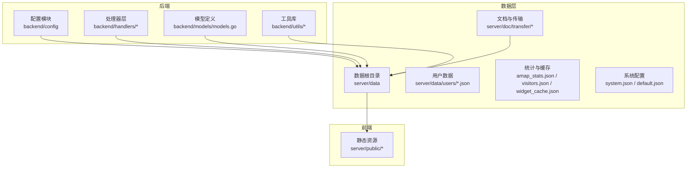
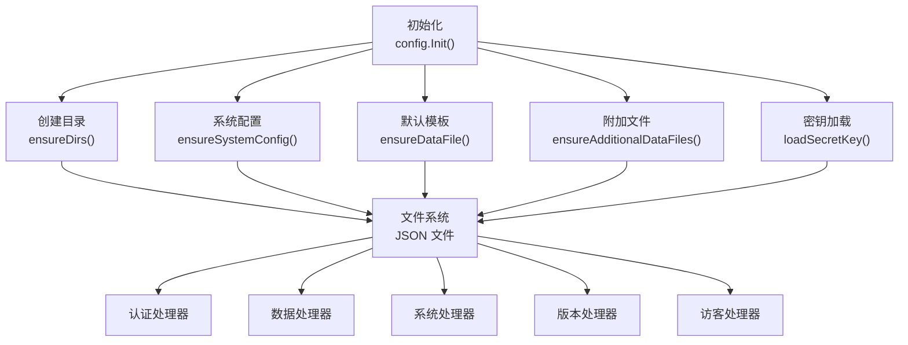
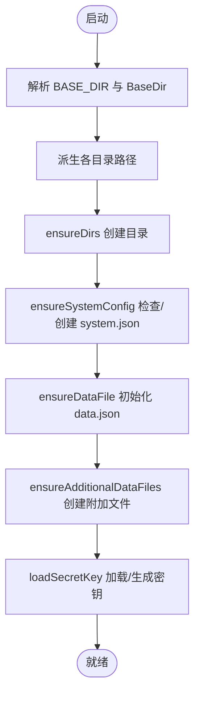
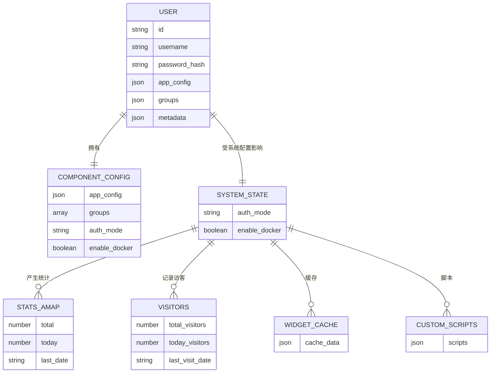
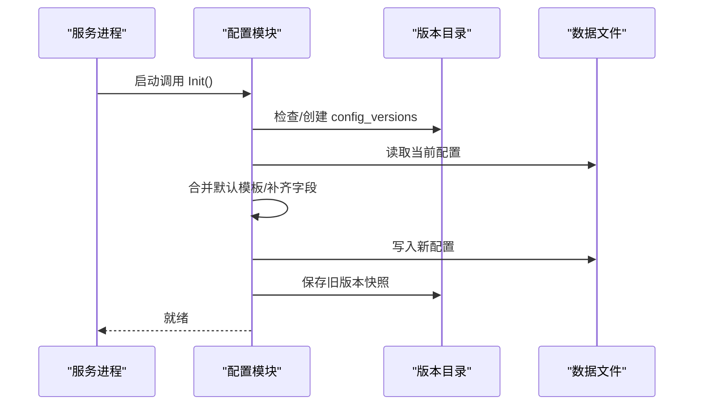
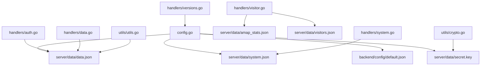

# 数据架构

<cite>
**本文引用的文件**
- [config.go](file://backend/config/config.go)
- [default.json](file://backend/config/default.json)
- [data.json](file://server/data/data.json)
- [models.go](file://backend/models/models.go)
- [auth.go](file://backend/handlers/auth.go)
- [data.go](file://backend/handlers/data.go)
- [versions.go](file://backend/handlers/versions.go)
- [visitor.go](file://backend/handlers/visitor.go)
- [system.go](file://backend/handlers/system.go)
- [crypto.go](file://backend/utils/crypto.go)
- [utils.go](file://backend/utils/utils.go)
- [admin.json](file://server/data/users/admin.json)
- [testuser.json](file://server/data/users/testuser.json)
- [index.json](file://server/doc/transfer/index.json)
- [index.json](file://debian/server/doc/transfer/index.json)
- [amap_stats.json](file://server/data/amap_stats.json)
- [visitors.json](file://server/data/visitors.json)
- [custom_scripts.json](file://server/data/custom_scripts.json)
- [widget_cache.json](file://server/data/widget_cache.json)
- [system.json](file://server/data/system.json)
- [default.json](file://server/data/default.json)
- [memo_admin_memo.json](file://server/data/memo_admin_memo.json)
- [memo_admin_w4.json](file://server/data/memo_admin_w4.json)
- [index.html](file://server/public/index.html)
- [index.html](file://debian/server/public/index.html)
</cite>

## 目录
1. [简介](#简介)
2. [项目结构](#项目结构)
3. [核心组件](#核心组件)
4. [架构总览](#架构总览)
5. [详细组件分析](#详细组件分析)
6. [依赖分析](#依赖分析)
7. [性能考量](#性能考量)
8. [故障排查指南](#故障排查指南)
9. [结论](#结论)
10. [附录](#附录)

## 简介
本文件面向开发者与运维人员，系统性阐述 OFlatNas 的数据架构：包括 JSON 文件存储架构、数据模型设计、配置管理机制、持久化策略、版本控制与迁移方案、用户/组件/系统状态模型、数据验证规则、备份恢复机制以及数据安全考虑。文档通过多类图示（架构图、类图、序列图、流程图）帮助读者快速理解数据在系统中的流转与治理。

## 项目结构
OFlatNas 后端以 Go 编写，前端静态资源位于 server/public，数据持久化采用 JSON 文件与目录组织，配合少量辅助文件实现统计、缓存与系统配置。关键路径如下：
- 配置与初始化：backend/config
- 数据根目录：server/data（包含用户、统计、缓存、系统等）
- 文档与传输：server/doc/transfer
- 静态资源与入口：server/public
- 前端构建产物：server/assets、server/public 下的 HTML/CSS/JS

**图表来源**
- [config.go:35-86](file://backend/config/config.go#L35-L86)
- [data.go:1-50](file://backend/handlers/data.go#L1-L50)

**章节来源**
- [config.go:35-86](file://backend/config/config.go#L35-L86)
- [data.go:1-50](file://backend/handlers/data.go#L1-L50)

## 核心组件
- 配置初始化与目录管理：负责解析 BASE_DIR、创建必要目录、确保系统配置与默认模板存在，并生成/加载密钥。
- 数据持久化：以 JSON 文件为核心载体，按功能域分层存放（用户、统计、缓存、系统、文档等）。
- 处理器层：提供认证、数据读写、版本管理、访客统计、系统状态等接口。
- 工具库：加密、通用工具函数，支撑安全与数据处理。
- 模型定义：抽象用户、组件配置、系统状态等数据模型，统一序列化/反序列化。

**章节来源**
- [config.go:35-257](file://backend/config/config.go#L35-L257)
- [models.go:1-200](file://backend/models/models.go#L1-L200)

## 架构总览
系统采用“配置驱动 + JSON 文件存储”的轻量级数据架构。启动时初始化目录与基础文件，运行期通过处理器对 JSON 文件进行读写；统计与缓存使用独立 JSON 文件；系统配置与用户配置分离；密钥文件用于敏感操作的安全保障。

**图表来源**
- [config.go:35-257](file://backend/config/config.go#L35-L257)

**章节来源**
- [config.go:35-257](file://backend/config/config.go#L35-L257)

## 详细组件分析

### 配置管理与初始化
- 目录策略：根据环境变量或工作目录推断 BaseDir，派生 DataDir、UsersDir、DocDir、MusicDir、背景图目录、图标缓存目录、公共目录与配置版本目录。
- 系统配置：若不存在则创建默认 system.json；若字段缺失则补全默认值。
- 默认模板：优先使用嵌入的 default.json 初始化 data.json；若嵌入失败则回退到磁盘上的 default.json。
- 附加文件：amap_stats.json、visitors.json、custom_scripts.json、widget_cache.json 等按需创建。
- 密钥管理：若存在 secret.key 则读取，否则随机生成 32 字节并以十六进制写入。

**图表来源**
- [config.go:35-257](file://backend/config/config.go#L35-L257)

**章节来源**
- [config.go:35-257](file://backend/config/config.go#L35-L257)

### 数据模型设计
- 用户模型（users/*.json）：包含用户标识、凭据、个性化设置与分组信息。
- 组件配置模型（data.json）：appConfig（应用配置）、groups（分组与书签）、authMode、enableDocker 等。
- 系统状态模型（system.json）：认证模式、Docker 开关等系统级开关。
- 统计与缓存模型：amap_stats.json（访问统计）、visitors.json（访客统计）、widget_cache.json（小部件缓存）、custom_scripts.json（自定义脚本）。
- 文档与传输索引：doc/transfer/index.json、debian/server/doc/transfer/index.json。

**图表来源**
- [admin.json:1-200](file://server/data/users/admin.json#L1-L200)
- [testuser.json:1-200](file://server/data/users/testuser.json#L1-L200)
- [data.json:1-104](file://server/data/data.json#L1-L104)
- [system.json:1-50](file://server/data/system.json#L1-L50)
- [amap_stats.json:1-50](file://server/data/amap_stats.json#L1-L50)
- [visitors.json:1-50](file://server/data/visitors.json#L1-L50)
- [widget_cache.json:1-50](file://server/data/widget_cache.json#L1-L50)
- [custom_scripts.json:1-50](file://server/data/custom_scripts.json#L1-L50)

**章节来源**
- [admin.json:1-200](file://server/data/users/admin.json#L1-L200)
- [testuser.json:1-200](file://server/data/users/testuser.json#L1-L200)
- [data.json:1-104](file://server/data/data.json#L1-L104)
- [system.json:1-50](file://server/data/system.json#L1-L50)
- [amap_stats.json:1-50](file://server/data/amap_stats.json#L1-L50)
- [visitors.json:1-50](file://server/data/visitors.json#L1-L50)
- [widget_cache.json:1-50](file://server/data/widget_cache.json#L1-L50)
- [custom_scripts.json:1-50](file://server/data/custom_scripts.json#L1-L50)

### 数据持久化策略
- 文件组织：所有数据以 JSON 文件形式存储于 server/data 及子目录，便于版本控制与手工维护。
- 写入策略：处理器在执行写操作前进行校验与备份（如存在 .bak），随后原子写入，保证一致性。
- 访问模式：读取优先从内存缓存或最近一次读取结果，写入后刷新缓存。
- 目录隔离：用户数据、统计、缓存、系统配置、文档与传输分别置于独立目录，降低耦合。

**章节来源**
- [data.go:1-200](file://backend/handlers/data.go#L1-L200)
- [visitor.go:1-150](file://backend/handlers/visitor.go#L1-L150)
- [system.go:1-150](file://backend/handlers/system.go#L1-L150)

### 版本控制与迁移方案
- 版本目录：config_versions 目录用于保存历史配置快照，便于回滚与审计。
- 迁移流程：当新增字段或变更结构时，启动时读取当前配置，合并默认模板，写入新结构；同时保留旧版本文件作为备份。
- 自动修复：ensureSystemConfig 会自动补齐缺失字段并写回，避免配置损坏导致服务异常。

**图表来源**
- [config.go:35-151](file://backend/config/config.go#L35-L151)
- [config.go:210-257](file://backend/config/config.go#L210-L257)

**章节来源**
- [config.go:35-151](file://backend/config/config.go#L35-L151)
- [config.go:210-257](file://backend/config/config.go#L210-L257)

### 用户数据模型
- 结构要点：用户标识、用户名、密码哈希、应用配置、分组列表、元数据。
- 存储位置：server/data/users/*.json，每个用户一个文件。
- 安全要求：密码必须经过安全哈希；敏感字段仅在内存中解密，落盘前再次加密。

**章节来源**
- [admin.json:1-200](file://server/data/users/admin.json#L1-L200)
- [testuser.json:1-200](file://server/data/users/testuser.json#L1-L200)
- [auth.go:1-200](file://backend/handlers/auth.go#L1-L200)

### 组件配置模型
- 结构要点：appConfig（主题、搜索、壁纸、小组件区域等）、groups（分组与书签）、authMode、enableDocker。
- 默认模板：default.json 提供初始结构与默认值，data.json 由 default.json 初始化。
- 动态更新：通过处理器读取/修改 data.json，支持热更新与增量配置。

**章节来源**
- [data.json:1-104](file://server/data/data.json#L1-L104)
- [default.json:1-147](file://backend/config/default.json#L1-L147)
- [data.go:1-200](file://backend/handlers/data.go#L1-L200)

### 系统状态模型
- 结构要点：authMode（认证模式）、enableDocker（Docker 开关）等系统级开关。
- 生命周期：system.json 在首次启动时创建，后续由处理器读取/更新。
- 影响范围：影响认证流程、容器化能力等全局行为。

**章节来源**
- [system.json:1-50](file://server/data/system.json#L1-L50)
- [system.go:1-150](file://backend/handlers/system.go#L1-L150)

### 数据验证规则
- 必填字段：系统配置中的 authMode、enableDocker 若缺失则自动补齐。
- 类型约束：数值、布尔值、字符串模板等字段遵循 JSON Schema 约束（由处理器在读取/写入时校验）。
- 路径与权限：目录创建使用 0755 权限，配置文件 0644，密钥文件 0600，防止误读写。

**章节来源**
- [config.go:102-151](file://backend/config/config.go#L102-L151)
- [config.go:182-204](file://backend/config/config.go#L182-L204)

### 备份恢复机制
- 自动备份：写入前检查是否存在 .bak，若无则复制当前文件为 .bak；成功写入后再删除旧 .bak。
- 手工备份：建议定期复制 server/data 目录至外部存储。
- 恢复流程：从 .bak 或备份副本恢复，重启服务后验证配置完整性。

**章节来源**
- [data.go:1-200](file://backend/handlers/data.go#L1-L200)

### 数据安全考虑
- 密钥管理：secret.key 使用 32 字节随机数生成，权限 0600，支持环境注入。
- 加密工具：提供对称加密/解密工具函数，用于敏感字段的加密存储与解密使用。
- 最小暴露：仅在内存中解密，落盘前再次加密；日志不输出明文密钥。

**章节来源**
- [config.go:182-204](file://backend/config/config.go#L182-L204)
- [crypto.go:1-200](file://backend/utils/crypto.go#L1-L200)
- [utils.go:1-200](file://backend/utils/utils.go#L1-L200)

## 依赖分析
- 组件内聚：配置模块集中处理路径、文件与密钥；处理器层围绕数据读写；工具库提供通用能力。
- 组件耦合：处理器依赖配置模块提供的路径与密钥；数据文件是唯一共享状态；版本目录与备份文件形成弱耦合。
- 外部依赖：文件系统、标准库 JSON 编解码、随机数生成。

**图表来源**
- [config.go:35-257](file://backend/config/config.go#L35-L257)
- [auth.go:1-200](file://backend/handlers/auth.go#L1-L200)
- [data.go:1-200](file://backend/handlers/data.go#L1-L200)
- [system.go:1-150](file://backend/handlers/system.go#L1-L150)
- [versions.go:1-200](file://backend/handlers/versions.go#L1-L200)
- [visitor.go:1-150](file://backend/handlers/visitor.go#L1-L150)
- [crypto.go:1-200](file://backend/utils/crypto.go#L1-L200)
- [utils.go:1-200](file://backend/utils/utils.go#L1-L200)

**章节来源**
- [config.go:35-257](file://backend/config/config.go#L35-L257)
- [auth.go:1-200](file://backend/handlers/auth.go#L1-L200)
- [data.go:1-200](file://backend/handlers/data.go#L1-L200)
- [system.go:1-150](file://backend/handlers/system.go#L1-L150)
- [versions.go:1-200](file://backend/handlers/versions.go#L1-L200)
- [visitor.go:1-150](file://backend/handlers/visitor.go#L1-L150)
- [crypto.go:1-200](file://backend/utils/crypto.go#L1-L200)
- [utils.go:1-200](file://backend/utils/utils.go#L1-L200)

## 性能考量
- 文件 I/O：JSON 文件读写频繁，建议在处理器层增加内存缓存与批量写入策略，减少磁盘抖动。
- 并发安全：多请求并发写同一文件时应加锁或使用原子替换，避免竞态。
- 序列化开销：大文件（如 widget_cache.json）建议分块或压缩存储，降低序列化成本。
- 目录扫描：图标缓存与背景图目录较大时，避免全量扫描，采用索引或增量更新。

## 故障排查指南
- 启动失败：检查 BASE_DIR 是否正确、目录权限是否足够、secret.key 是否可读。
- 配置异常：确认 system.json 字段完整；若缺失，系统会自动补齐默认值。
- 写入失败：查看 .bak 是否存在；若存在，可手动恢复；检查磁盘空间与权限。
- 统计异常：核对 amap_stats.json 与 visitors.json 的日期字段，确保时间同步。
- 前端无法加载：确认 server/public 目录下 index.html 与静态资源可用。

**章节来源**
- [config.go:35-257](file://backend/config/config.go#L35-L257)
- [data.go:1-200](file://backend/handlers/data.go#L1-L200)
- [visitor.go:1-150](file://backend/handlers/visitor.go#L1-L150)
- [index.html:1-200](file://server/public/index.html#L1-L200)

## 结论
OFlatNas 采用简洁可靠的 JSON 文件存储架构，结合配置驱动与版本控制，实现了低复杂度、易维护、可审计的数据体系。通过明确的数据模型、严格的验证与安全策略、完善的备份与恢复机制，满足了用户个性化、组件配置与系统状态管理的需求。建议在生产环境中配合定时备份、监控告警与最小权限原则，进一步提升稳定性与安全性。

## 附录
- 关键路径与文件清单：见“本文引用的文件”列表。
- 前端入口：server/public/index.html 与 debian/server/public/index.html。
- 文档与传输：server/doc/transfer 与 debian/server/doc/transfer。