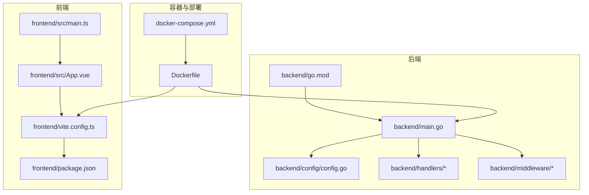
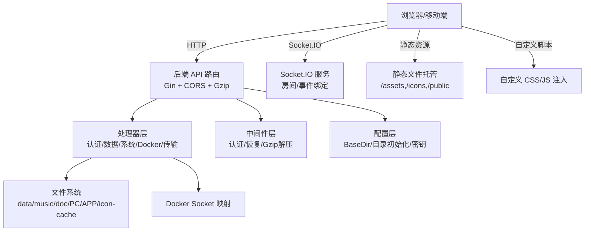
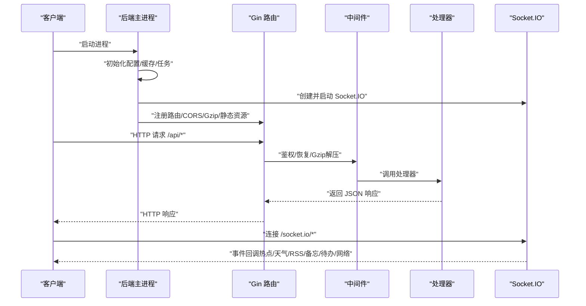
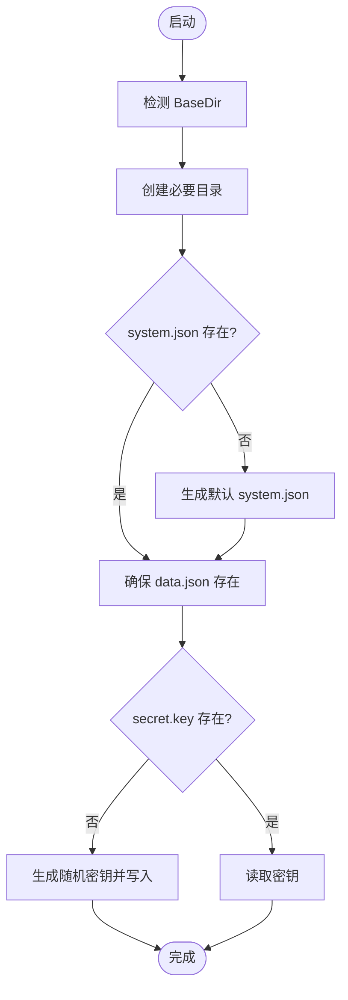
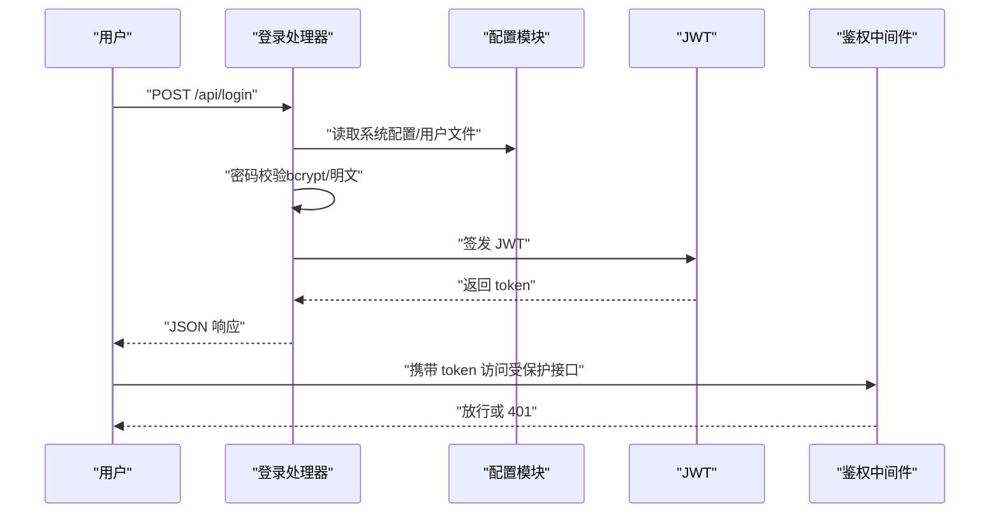
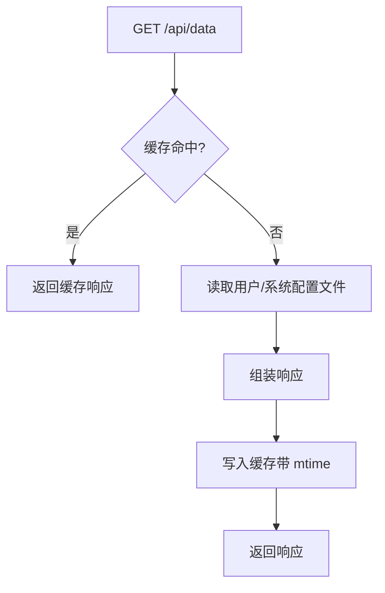
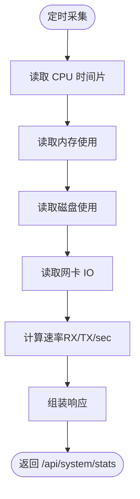
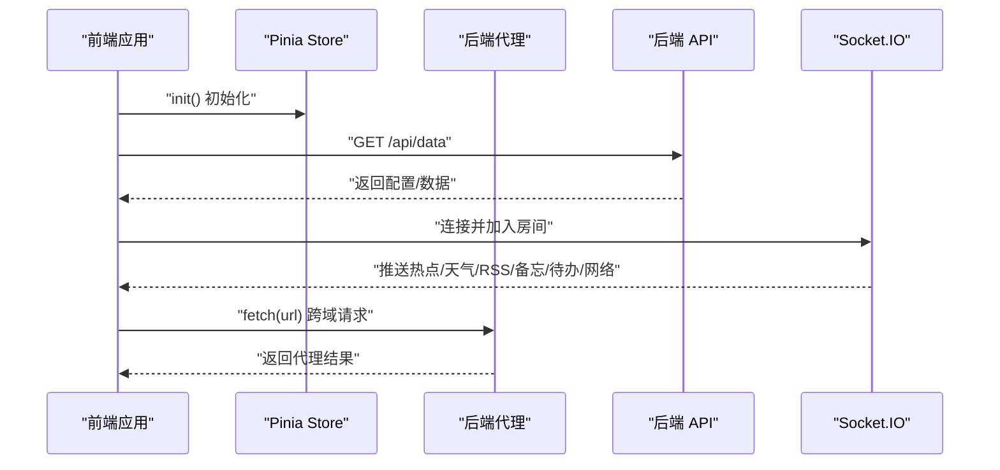
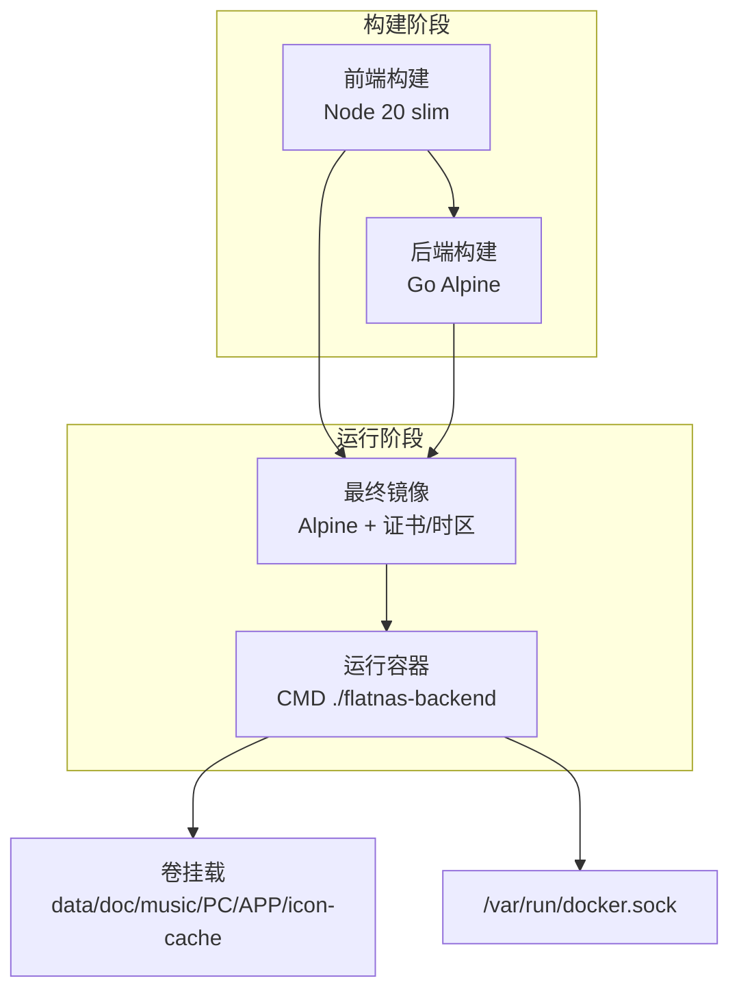
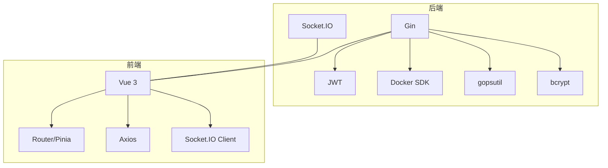

# 架构设计

<cite>
**本文档引用的文件**
- [backend/main.go](file://backend/main.go)
- [backend/go.mod](file://backend/go.mod)
- [backend/config/config.go](file://backend/config/config.go)
- [backend/handlers/auth.go](file://backend/handlers/auth.go)
- [backend/middleware/auth.go](file://backend/middleware/auth.go)
- [backend/handlers/data.go](file://backend/handlers/data.go)
- [backend/handlers/system.go](file://backend/handlers/system.go)
- [frontend/package.json](file://frontend/package.json)
- [frontend/src/main.ts](file://frontend/src/main.ts)
- [frontend/src/App.vue](file://frontend/src/App.vue)
- [frontend/vite.config.ts](file://frontend/vite.config.ts)
- [Dockerfile](file://Dockerfile)
- [docker-compose.yml](file://docker-compose.yml)
- [README.md](file://README.md)
</cite>

## 目录
1. [引言](#引言)
2. [项目结构](#项目结构)
3. [核心组件](#核心组件)
4. [架构总览](#架构总览)
5. [详细组件分析](#详细组件分析)
6. [依赖分析](#依赖分析)
7. [性能考虑](#性能考虑)
8. [故障排查指南](#故障排查指南)
9. [结论](#结论)
10. [附录](#附录)

## 引言
本架构设计文档面向系统管理员与开发者，系统性阐述 OFlatNas 的整体架构模式、前后端分离设计原理、组件交互关系、技术栈选择与架构决策、系统边界与数据流、实时通信机制、可扩展性设计、安全架构、中间件设计、错误处理策略、基础设施与部署拓扑以及性能优化要点。目标是帮助读者快速理解并高效运维与扩展该系统。

## 项目结构
OFlatNas 采用前后端分离的单体式架构，后端使用 Go 语言（Gin 框架）提供 REST API 与 Socket.IO 实时通信，前端使用 Vue 3 + Vite 构建静态资源并通过 Axios 发起 HTTP 请求，Dockerfile 与 docker-compose.yml 提供容器化部署方案。

**图表来源**
- [backend/main.go:25-267](file://backend/main.go#L25-L267)
- [backend/config/config.go:35-86](file://backend/config/config.go#L35-L86)
- [frontend/src/main.ts:1-37](file://frontend/src/main.ts#L1-L37)
- [frontend/src/App.vue:1-666](file://frontend/src/App.vue#L1-L666)
- [frontend/vite.config.ts:1-65](file://frontend/vite.config.ts#L1-L65)
- [Dockerfile:1-93](file://Dockerfile#L1-L93)
- [docker-compose.yml:1-17](file://docker-compose.yml#L1-L17)

**章节来源**
- [backend/main.go:25-267](file://backend/main.go#L25-L267)
- [backend/config/config.go:35-86](file://backend/config/config.go#L35-L86)
- [frontend/src/main.ts:1-37](file://frontend/src/main.ts#L1-L37)
- [frontend/src/App.vue:1-666](file://frontend/src/App.vue#L1-L666)
- [frontend/vite.config.ts:1-65](file://frontend/vite.config.ts#L1-L65)
- [Dockerfile:1-93](file://Dockerfile#L1-L93)
- [docker-compose.yml:1-17](file://docker-compose.yml#L1-L17)

## 核心组件
- 后端主进程与路由
  - Gin 路由注册、CORS、Gzip 压缩、静态资源托管、Socket.IO 实时通信接入。
- 配置模块
  - 基于环境变量与工作目录推断 BaseDir，初始化数据目录、用户目录、音视频与图标缓存目录，确保系统配置文件与默认数据文件存在。
- 中间件
  - 统一恢复中间件、Gzip 解压中间件、认证中间件（JWT）、可选认证中间件。
- 处理器（Handlers）
  - 认证与用户管理、系统配置与版本、数据读取与缓存、系统统计、Docker 管理、文件传输、代理与访客统计等。
- 前端应用
  - Vue 3 应用入口、Pinia 状态管理、网格布局与组件系统、自定义 CSS/JS 注入、代理请求封装、版本冲突与同步提示、系统状态监控组件等。
- 容器化与部署
  - 多阶段构建（前端、后端、最终镜像）、Alpine 运行时、公开端口、卷挂载、Docker Socket 映射。

**章节来源**
- [backend/main.go:34-267](file://backend/main.go#L34-L267)
- [backend/config/config.go:35-257](file://backend/config/config.go#L35-L257)
- [backend/middleware/auth.go:1-61](file://backend/middleware/auth.go#L1-L61)
- [backend/handlers/auth.go:1-211](file://backend/handlers/auth.go#L1-L211)
- [backend/handlers/data.go:159-200](file://backend/handlers/data.go#L159-L200)
- [backend/handlers/system.go:51-200](file://backend/handlers/system.go#L51-L200)
- [frontend/src/main.ts:1-37](file://frontend/src/main.ts#L1-L37)
- [frontend/src/App.vue:1-666](file://frontend/src/App.vue#L1-L666)
- [Dockerfile:1-93](file://Dockerfile#L1-L93)
- [docker-compose.yml:1-17](file://docker-compose.yml#L1-L17)

## 架构总览
系统采用“单体后端 + 前端静态资源”的前后端分离模式，后端提供 REST API 与 Socket.IO 实时通道，前端通过 HTTP 与 Socket.IO 与后端交互。容器化部署通过 Dockerfile 与 docker-compose.yml 实现，支持卷挂载与 Docker Socket 映射以实现 Docker 管理能力。

**图表来源**
- [backend/main.go:34-164](file://backend/main.go#L34-L164)
- [backend/main.go:166-254](file://backend/main.go#L166-L254)
- [backend/config/config.go:68-86](file://backend/config/config.go#L68-L86)
- [frontend/src/App.vue:162-174](file://frontend/src/App.vue#L162-L174)

**章节来源**
- [backend/main.go:34-267](file://backend/main.go#L34-L267)
- [backend/config/config.go:68-86](file://backend/config/config.go#L68-L86)
- [frontend/src/App.vue:162-174](file://frontend/src/App.vue#L162-L174)

## 详细组件分析

### 后端主进程与路由
- 初始化流程
  - 加载配置、初始化小部件缓存、Docker 状态、IP 获取、数据预热与缩略图同步。
  - 注册 Gin 日志、恢复、Gzip 解压中间件，设置请求体大小上限。
  - CORS 配置支持动态允许来源，Socket.IO 使用轮询与 WebSocket 传输并复用 CORS 来源校验。
- 静态资源与 SPA 回退
  - 静态目录映射：/assets、/icons、/music、/backgrounds、/mobile_backgrounds、/icon-cache、/public。
  - 未命中 API/Socket.IO 的路由回退到 index.html，禁用缓存避免 chunk 变更导致白屏。
- API 分组与鉴权
  - /api 登录、数据获取、版本、系统配置、IP、热点、RSS、天气、Docker 状态、自定义脚本、图标、Amap 代理、Ping/RTT、访客追踪、音乐列表、文件传输、配置版本等。
  - 受保护路由通过 AuthMiddleware 鉴权，可选鉴权通过 OptionalAuthMiddleware。
- Socket.IO
  - 房间加入、事件绑定（热点、天气、RSS、备忘、待办、网络），服务端启动与关闭。

**图表来源**
- [backend/main.go:25-164](file://backend/main.go#L25-L164)
- [backend/main.go:166-254](file://backend/main.go#L166-L254)

**章节来源**
- [backend/main.go:25-267](file://backend/main.go#L25-L267)

### 配置模块
- 目录初始化
  - BaseDir 依据运行环境推断，确保 data、users、doc、music、PC、APP、icon-cache、public、config_versions 等目录存在。
- 系统配置与默认数据
  - system.json 默认项（authMode/single、enableDocker=true），缺失时自动创建。
  - data.json 默认模板（来自嵌入资源或备用文件），缺失时初始化。
- 密钥管理
  - secret.key 自动生成与持久化，用于 JWT 签名。
- 额外数据文件
  - amap_stats.json、visitors.json、custom_scripts.json、widget_cache.json 初始化。

**图表来源**
- [backend/config/config.go:35-257](file://backend/config/config.go#L35-L257)

**章节来源**
- [backend/config/config.go:35-257](file://backend/config/config.go#L35-L257)

### 认证与授权
- 登录流程
  - 支持 single 模式与多用户模式，admin 用户在 single 模式下指向 data.json。
  - 密码兼容明文与 bcrypt，首次登录自动哈希并保存。
  - 成功后签发 JWT（HS256），有效期 30 天。
- 中间件
  - AuthMiddleware：强制鉴权，解析 Authorization 或查询参数 token。
  - OptionalAuthMiddleware：可选鉴权，用于公开接口。
- 用户管理
  - 仅 admin 可列出、新增、删除用户；禁止手动添加 admin。

**图表来源**
- [backend/handlers/auth.go:18-114](file://backend/handlers/auth.go#L18-L114)
- [backend/middleware/auth.go:12-61](file://backend/middleware/auth.go#L12-L61)

**章节来源**
- [backend/handlers/auth.go:1-211](file://backend/handlers/auth.go#L1-L211)
- [backend/middleware/auth.go:1-61](file://backend/middleware/auth.go#L1-L61)

### 数据读取与缓存
- 缓存策略
  - 以用户文件与系统配置文件的修改时间为键，缓存 GET /api/data 的响应，降低频繁读取开销。
  - 读写锁保护缓存并发安全。
- 幂等性与去重
  - 备忘录保存引入幂等缓存（client_request_id 规范化），10 分钟 TTL，避免重复写入与重复响应。
- 敏感字段过滤
  - 递归移除敏感字段，保障返回数据安全。

**图表来源**
- [backend/handlers/data.go:22-157](file://backend/handlers/data.go#L22-L157)

**章节来源**
- [backend/handlers/data.go:159-200](file://backend/handlers/data.go#L159-L200)
- [backend/handlers/data.go:72-121](file://backend/handlers/data.go#L72-L121)

### 系统统计与网络监控
- 系统指标
  - CPU 使用率（用户/系统/总）、核心数、品牌/厂商/主频；内存总量/使用/活跃/可用；磁盘使用率与挂载点；主机信息与运行时长。
- 网络速率
  - 基于 gopsutil 统计网卡 RX/TX 字节，计算每秒速率，带互斥锁保证并发安全。
- 接口
  - /api/system/stats 返回聚合指标。

**图表来源**
- [backend/handlers/system.go:51-200](file://backend/handlers/system.go#L51-L200)

**章节来源**
- [backend/handlers/system.go:51-200](file://backend/handlers/system.go#L51-L200)

### 前端应用与实时通信
- 应用入口
  - 创建 Vue 应用、Pinia、初始化全局 store。
- 自定义脚本注入
  - 支持模块与非模块脚本，自动注入上下文（store 只读、DOM 查询、事件系统、fetch 代理）。
  - 通过 /proxy 实现跨域请求代理，避免同源限制。
- 版本冲突与同步
  - 服务端配置版本变化时弹窗确认同步；实时保存失败时提示错误信息。
- 系统状态监控
  - 可选展示状态监控组件，结合后端系统统计接口。

**图表来源**
- [frontend/src/main.ts:22-31](file://frontend/src/main.ts#L22-L31)
- [frontend/src/App.vue:162-174](file://frontend/src/App.vue#L162-L174)
- [backend/main.go:100-111](file://backend/main.go#L100-L111)

**章节来源**
- [frontend/src/main.ts:1-37](file://frontend/src/main.ts#L1-L37)
- [frontend/src/App.vue:1-666](file://frontend/src/App.vue#L1-L666)
- [backend/main.go:100-111](file://backend/main.go#L100-L111)

### 容器化与部署
- 多阶段构建
  - 前端：Node 20 slim，构建产物输出到 dist。
  - 后端：Go Alpine，交叉编译二进制，剥离符号。
  - 最终镜像：Alpine，安装证书与时区，复制二进制与前端 dist，创建必要目录，暴露 3000 端口。
- docker-compose
  - 映射数据、文档、音乐、PC、APP 目录，映射 Docker Socket 以启用 Docker 管理。
- 环境变量
  - PORT、BASE_DIR、CORS_ALLOW_ORIGINS、PROXY_URL 等影响运行行为。

**图表来源**
- [Dockerfile:1-93](file://Dockerfile#L1-L93)
- [docker-compose.yml:1-17](file://docker-compose.yml#L1-L17)

**章节来源**
- [Dockerfile:1-93](file://Dockerfile#L1-L93)
- [docker-compose.yml:1-17](file://docker-compose.yml#L1-L17)

## 依赖分析
- 技术栈与依赖
  - 后端：Gin、Socket.IO、JWT、gopsutil、bcrypt、WEBP、Docker SDK 等。
  - 前端：Vue 3、Pinia、Vue Router、Axios、Socket.IO Client、TailwindCSS、Party Town 等。
- 模块耦合
  - 后端处理器依赖配置模块与工具模块；中间件独立于业务处理器；前端通过 API 与 Socket.IO 与后端交互。
- 外部集成
  - Docker 管理依赖 /var/run/docker.sock；代理功能依赖 PROXY_URL；静态资源依赖 server/public。

**图表来源**
- [backend/go.mod:5-17](file://backend/go.mod#L5-L17)
- [frontend/package.json:21-47](file://frontend/package.json#L21-L47)

**章节来源**
- [backend/go.mod:1-83](file://backend/go.mod#L1-L83)
- [frontend/package.json:1-76](file://frontend/package.json#L1-L76)

## 性能考虑
- 网络传输优化
  - 启用 Gzip 压缩，显著降低静态资源与 JSON 响应体积；请求体上限提升至 50MB 以支持大配置文件。
- 缓存策略
  - GET /api/data 基于 mtime 的响应缓存，减少磁盘 IO；备忘录保存幂等缓存避免重复写入。
- 资源加载
  - 前端构建产物输出到 dist，开发模式下忽略 data/server 目录，避免不必要的文件监听。
- 实时通信
  - Socket.IO 同时支持轮询与 WebSocket，自动降级与回退，保障弱网与内网穿透场景的稳定性。
- 容器运行时
  - Alpine 基础镜像 + 去符号二进制，减小镜像体积与启动时间。

**章节来源**
- [backend/main.go:42-46](file://backend/main.go#L42-L46)
- [backend/main.go:43](file://backend/main.go#L43)
- [backend/handlers/data.go:22-34](file://backend/handlers/data.go#L22-L34)
- [frontend/vite.config.ts:28-40](file://frontend/vite.config.ts#L28-L40)
- [Dockerfile:65-92](file://Dockerfile#L65-L92)

## 故障排查指南
- 代理配置
  - 确认 PROXY_URL 格式正确，访问 /api/config/proxy-status 检查代理可用状态；查看后端日志中的 [Proxy Error] 获取详细错误。
- CORS 与来源校验
  - CORS 允许来源通过环境变量动态配置；Socket.IO 传输同样使用 CheckOrigin 校验 Origin。
- 认证问题
  - 通过 OptionalAuthMiddleware 的可选鉴权接口区分公开与受保护接口；检查 Authorization 头或 token 查询参数。
- 文件传输与缩略图
  - 上传/下载/缩略图生成接口需确保对应目录可写；缩略图生成失败时检查图像库与 WEBP 支持。
- Docker 管理
  - 确认 /var/run/docker.sock 已映射；容器列表、日志导出、容器动作接口依赖 Docker Socket 权限。
- 前端跨域与代理
  - 自定义脚本 fetch 通过 /proxy 实现代理；确认后端代理配置与目标 URL 不触发 SSRF 限制。

**章节来源**
- [README.md:71-97](file://README.md#L71-L97)
- [backend/main.go:68-93](file://backend/main.go#L68-L93)
- [backend/middleware/auth.go:12-61](file://backend/middleware/auth.go#L12-L61)
- [backend/handlers/system.go:51-200](file://backend/handlers/system.go#L51-L200)

## 结论
OFlatNas 采用简洁高效的前后端分离单体架构，后端以 Gin + Socket.IO 提供稳定的服务能力，前端以 Vue 3 实现高度可定制的可视化界面。通过容器化部署与卷挂载，系统具备良好的可移植性与可扩展性。安全方面采用 JWT、可选认证与 CORS 控制，配合代理与跨域处理，满足内网与公网混合场景需求。建议在生产环境中启用 HTTPS、合理配置 CORS 与代理、定期备份 data 目录，并按需扩展微组件与自定义脚本以满足业务演进。

## 附录
- 系统边界
  - 内部：后端 API、Socket.IO、文件系统、Docker Socket。
  - 外部：浏览器/移动端客户端、第三方天气/热点/代理服务。
- 集成模式
  - REST API + Socket.IO 实时推送；静态资源与自定义脚本注入；Docker 管理与日志导出。
- 微服务化程度
  - 当前为单体部署，未拆分为独立微服务；可通过容器编排与 API 网关在未来演进为多服务架构。
- 实时通信机制
  - Socket.IO 房间与事件模型，支持热点、天气、RSS、备忘、待办、网络等主题推送。
- 可扩展性设计
  - 插件化自定义 CSS/JS、组件市场安装、Docker 管理、文件传输与缩略图生成、系统统计接口。
- 安全架构
  - JWT 签名密钥管理、bcrypt 密码存储、CORS 白名单、可选认证、代理 SSRF 防护。
- 中间件设计
  - 统一恢复、Gzip 解压、认证与可选认证，贯穿所有请求处理链路。
- 错误处理策略
  - 统一 401/403/500 响应；前端实时保存失败提示；Socket.IO 断线重连与事件回退。
- 基础设施要求
  - CPU/内存占用低，适合 NAS 场景；Alpine 运行时，镜像小；卷挂载支持持久化。
- 部署拓扑
  - 单机部署（docker-compose）或 Debian/Ubuntu 一键脚本；支持 HTTPS 与 Nginx 反代。

**章节来源**
- [README.md:106-196](file://README.md#L106-L196)
- [Dockerfile:65-92](file://Dockerfile#L65-L92)
- [docker-compose.yml:1-17](file://docker-compose.yml#L1-L17)