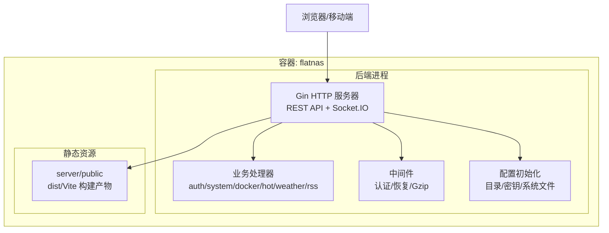
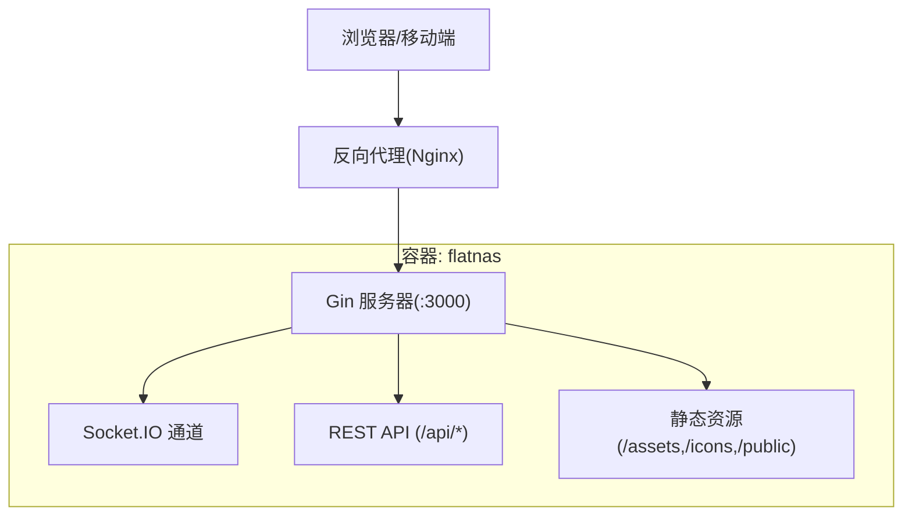
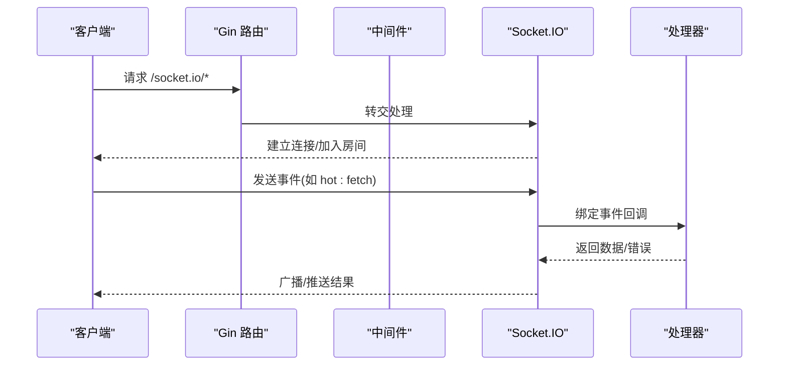
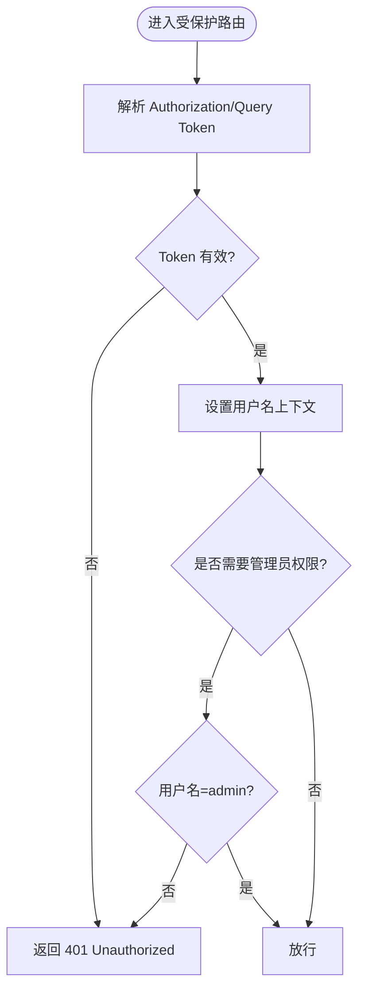
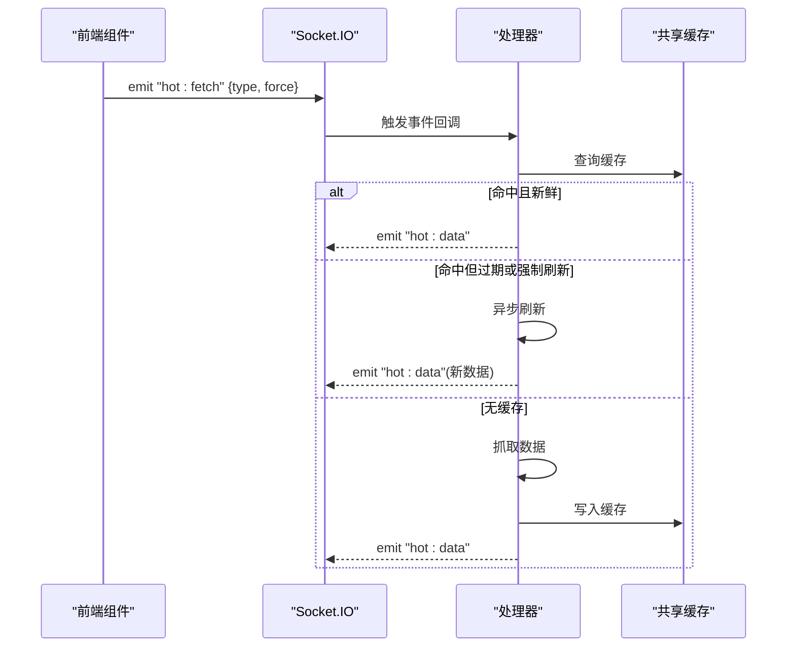
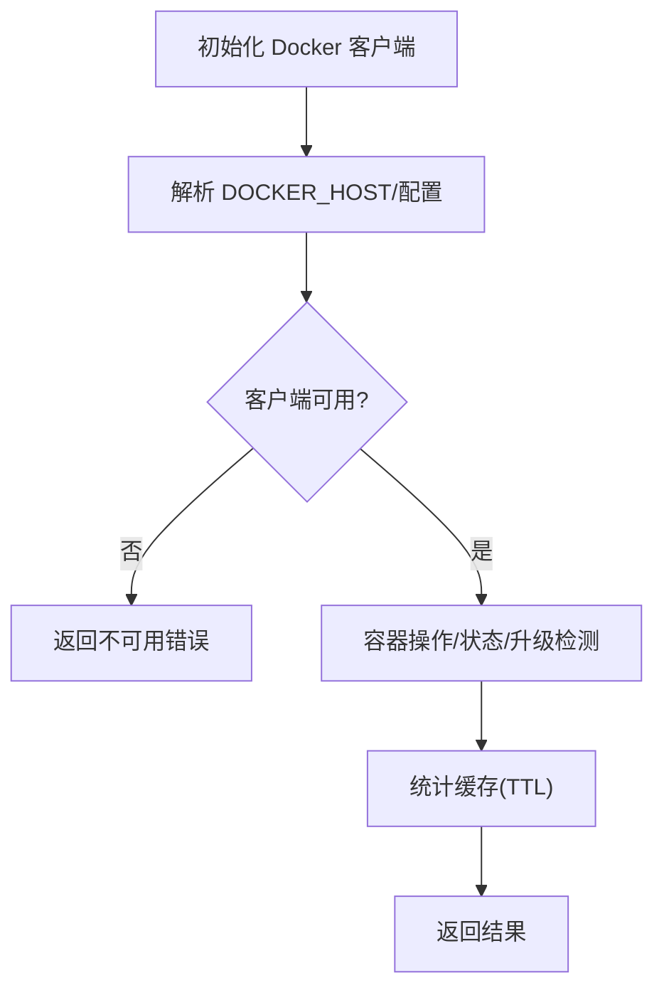
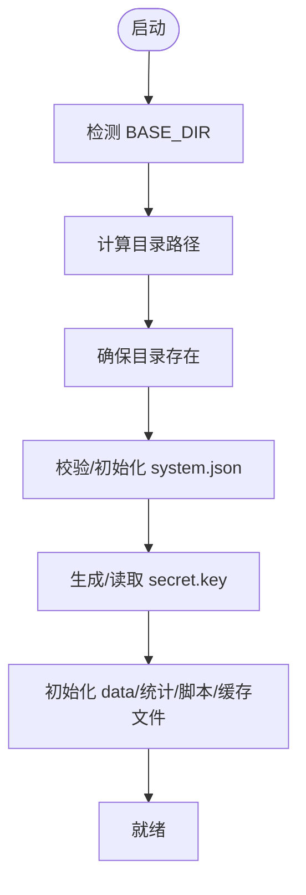
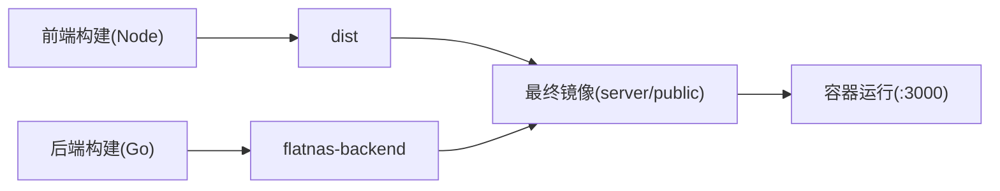
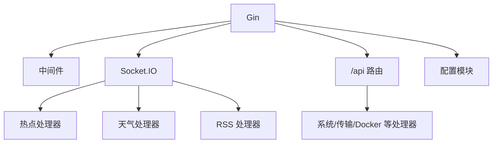

# 系统架构

<cite>
**本文档引用的文件**
- [backend/main.go](file://backend/main.go)
- [backend/config/config.go](file://backend/config/config.go)
- [backend/middleware/auth.go](file://backend/middleware/auth.go)
- [backend/handlers/auth.go](file://backend/handlers/auth.go)
- [backend/handlers/system.go](file://backend/handlers/system.go)
- [backend/handlers/docker.go](file://backend/handlers/docker.go)
- [backend/handlers/hot.go](file://backend/handlers/hot.go)
- [backend/handlers/weather.go](file://backend/handlers/weather.go)
- [backend/handlers/rss.go](file://backend/handlers/rss.go)
- [Dockerfile](file://Dockerfile)
- [docker-compose.yml](file://docker-compose.yml)
- [frontend/vite.config.ts](file://frontend/vite.config.ts)
- [README.md](file://README.md)
</cite>

## 目录
1. [引言](#引言)
2. [项目结构](#项目结构)
3. [核心组件](#核心组件)
4. [架构总览](#架构总览)
5. [详细组件分析](#详细组件分析)
6. [依赖关系分析](#依赖关系分析)
7. [性能考量](#性能考量)
8. [故障排查指南](#故障排查指南)
9. [结论](#结论)
10. [附录](#附录)

## 引言
本文件面向系统管理员与运维工程师，系统性梳理 OFlatNas 的整体架构与运行机制，重点覆盖：
- 前后端分离架构与微服务化程度
- Gin 作为后端核心的作用与路由组织
- Socket.IO 实时通信机制与事件模型
- Docker 容器化与 docker-compose 编排
- Nginx 反向代理与静态资源分发
- 数据流与组件交互关系
- 基础设施要求、部署架构与可扩展性设计

## 项目结构
OFlatNas 采用前后端分离的单体容器化部署模式：
- 前端：Vue 3 + Vite 构建产物，静态资源位于 server/public
- 后端：Go + Gin 提供 REST API 与 Socket.IO 实时通道
- 容器：Dockerfile 多阶段构建，产出最小镜像；docker-compose 管理服务编排

图表来源
- [backend/main.go:25-267](file://backend/main.go#L25-L267)
- [backend/config/config.go:35-86](file://backend/config/config.go#L35-L86)
- [Dockerfile:64-93](file://Dockerfile#L64-L93)

章节来源
- [backend/main.go:25-267](file://backend/main.go#L25-L267)
- [Dockerfile:1-93](file://Dockerfile#L1-L93)
- [docker-compose.yml:1-17](file://docker-compose.yml#L1-L17)
- [frontend/vite.config.ts:1-57](file://frontend/vite.config.ts#L1-L57)

## 核心组件
- Gin HTTP 与路由
  - 注册静态文件服务、CORS、Gzip、日志与恢复中间件
  - 定义 /api 分组路由与鉴权中间件
  - 暴露 Socket.IO 端点，桥接至 Gin
- Socket.IO 实时通道
  - 统一命名空间 "/"，事件类型包括热榜、天气、RSS、便签/待办、网络模式/心跳
  - 通过房间机制实现按房间广播
- 配置与数据
  - 初始化 BASE_DIR、数据目录、密钥、系统配置与基础数据文件
  - 支持动态生成默认配置与校验
- 认证与授权
  - JWT 令牌解析与校验，支持可选认证中间件
  - 管理员权限控制（如 Docker 管理、用户管理）
- 业务处理器
  - 系统信息采集、IP 与延迟检测、音乐列表、访客统计
  - Docker 客户端封装、容器列表/状态/动作、镜像升级检测
  - 热点、天气、RSS 的数据抓取与缓存
- 容器化与编排
  - 多阶段构建：前端构建、后端构建、最终精简镜像
  - docker-compose 映射数据卷与 Docker Socket

章节来源
- [backend/main.go:34-163](file://backend/main.go#L34-L163)
- [backend/middleware/auth.go:12-61](file://backend/middleware/auth.go#L12-L61)
- [backend/handlers/auth.go:18-114](file://backend/handlers/auth.go#L18-L114)
- [backend/handlers/system.go:51-203](file://backend/handlers/system.go#L51-L203)
- [backend/handlers/docker.go:42-167](file://backend/handlers/docker.go#L42-L167)
- [backend/handlers/hot.go:31-79](file://backend/handlers/hot.go#L31-L79)
- [backend/handlers/weather.go:114-146](file://backend/handlers/weather.go#L114-L146)
- [backend/handlers/rss.go:82-135](file://backend/handlers/rss.go#L82-L135)
- [backend/config/config.go:35-257](file://backend/config/config.go#L35-L257)

## 架构总览
OFlatNas 采用“单体后端 + 前端静态资源”的前后端分离架构，后端以 Gin 为核心承载 REST API 与 Socket.IO 实时通道，容器化部署并通过 docker-compose 管理。

图表来源
- [backend/main.go:113-135](file://backend/main.go#L113-L135)
- [backend/main.go:166-254](file://backend/main.go#L166-L254)
- [docker-compose.yml:8-16](file://docker-compose.yml#L8-L16)

章节来源
- [backend/main.go:113-163](file://backend/main.go#L113-L163)
- [docker-compose.yml:1-17](file://docker-compose.yml#L1-17)

## 详细组件分析

### Gin 与路由组织
- 中间件链路
  - 日志、恢复、Gzip 解压、Gzip 压缩
  - CORS：允许来源可配置，支持通配与白名单
- 静态资源
  - /assets、/icons、/music、/backgrounds、/icon-cache、/public
  - SPA 回退：未命中 API/Socket.IO 的路径回退到 index.html（禁用缓存）
- Socket.IO
  - 将 /socket.io/*any 桥接到 Socket.IO 服务器
  - 传输层支持轮询与 WebSocket，均受 CORS 来源校验
- 路由分组
  - /api 登录、数据、版本、系统配置、IP、热点、RSS、天气、Docker、代理、访客统计、传输、配置版本等
  - /api/authorized 为受保护路由，含用户管理、系统统计、Docker 管理、壁纸/背景上传、传输管理、配置版本管理

图表来源
- [backend/main.go:79-115](file://backend/main.go#L79-L115)
- [backend/main.go:100-109](file://backend/main.go#L100-L109)
- [backend/handlers/hot.go:31-79](file://backend/handlers/hot.go#L31-L79)

章节来源
- [backend/main.go:34-163](file://backend/main.go#L34-L163)
- [backend/main.go:166-254](file://backend/main.go#L166-L254)

### 认证与授权
- JWT 解析
  - Authorization 头或查询参数 token
  - HS256 校验，密钥来自配置模块
- 中间件
  - AuthMiddleware：强制认证
  - OptionalAuthMiddleware：可选认证，仅透传用户名
- 管理员权限
  - 仅 admin 用户可执行 Docker 管理、用户管理、系统配置更新等敏感操作

图表来源
- [backend/middleware/auth.go:12-61](file://backend/middleware/auth.go#L12-L61)
- [backend/handlers/auth.go:18-114](file://backend/handlers/auth.go#L18-L114)
- [backend/handlers/docker.go:438-483](file://backend/handlers/docker.go#L438-L483)

章节来源
- [backend/middleware/auth.go:12-61](file://backend/middleware/auth.go#L12-L61)
- [backend/handlers/auth.go:18-114](file://backend/handlers/auth.go#L18-L114)

### Socket.IO 实时通信
- 事件模型
  - 热点：hot:fetch -> hot:data / hot:error
  - 天气：weather:fetch -> weather:data / weather:error
  - RSS：rss:fetch -> rss:data / rss:error
  - 便签/待办：memo:update / todo:update -> 广播 updated
  - 网络：network:mode -> 广播模式；network:heartbeat -> 心跳回执
- 房间与广播
  - 客户端 join 指定房间，服务端按房间广播
- 缓存与刷新
  - 各组件使用共享缓存，支持 TTL 与异步刷新

图表来源
- [backend/handlers/hot.go:31-79](file://backend/handlers/hot.go#L31-L79)
- [backend/handlers/weather.go:114-146](file://backend/handlers/weather.go#L114-L146)
- [backend/handlers/rss.go:82-135](file://backend/handlers/rss.go#L82-L135)
- [backend/handlers/memo.go:25-55](file://backend/handlers/memo.go#L25-L55)

章节来源
- [backend/main.go:94-111](file://backend/main.go#L94-L111)
- [backend/handlers/hot.go:31-175](file://backend/handlers/hot.go#L31-L175)
- [backend/handlers/weather.go:114-200](file://backend/handlers/weather.go#L114-L200)
- [backend/handlers/rss.go:82-200](file://backend/handlers/rss.go#L82-L200)
- [backend/handlers/memo.go:25-96](file://backend/handlers/memo.go#L25-L96)

### Docker 管理与系统监控
- Docker 客户端初始化
  - 支持 DOCKER_HOST 环境变量与系统配置，兼容 Windows/npipe 与 Unix socket
- 容器管理
  - 列表、状态、动作（start/stop/restart）、信息查询、调试快照、日志导出
- 镜像升级检测
  - 拉取镜像并比对镜像 ID，维护升级状态与失败列表
- 系统监控
  - CPU/内存/磁盘/网络采集，带速率计算与排序

图表来源
- [backend/handlers/docker.go:42-167](file://backend/handlers/docker.go#L42-L167)
- [backend/handlers/docker.go:354-421](file://backend/handlers/docker.go#L354-L421)
- [backend/handlers/system.go:51-203](file://backend/handlers/system.go#L51-L203)

章节来源
- [backend/handlers/docker.go:42-167](file://backend/handlers/docker.go#L42-L167)
- [backend/handlers/docker.go:354-421](file://backend/handlers/docker.go#L354-L421)
- [backend/handlers/system.go:51-203](file://backend/handlers/system.go#L51-L203)

### 配置与数据持久化
- 目录结构
  - BASE_DIR 下 server/data、server/music、server/PC、server/APP、server/doc、server/icon-cache、server/public
- 系统配置
  - system.json 默认项与校验，支持 authMode/single、enableDocker
- 密钥与文件
  - secret.key 自动生成与读取
  - data.json、amap_stats.json、visitors.json、custom_scripts.json、widget_cache.json 初始化

图表来源
- [backend/config/config.go:35-86](file://backend/config/config.go#L35-L86)
- [backend/config/config.go:102-151](file://backend/config/config.go#L102-L151)
- [backend/config/config.go:182-204](file://backend/config/config.go#L182-L204)
- [backend/config/config.go:210-256](file://backend/config/config.go#L210-L256)

章节来源
- [backend/config/config.go:35-257](file://backend/config/config.go#L35-L257)

### 容器化与部署
- 多阶段构建
  - 前端：Node 20 slim，构建 dist
  - 后端：Go Alpine，交叉编译二进制
  - 最终镜像：Alpine，安装时区与证书，暴露 3000，挂载必要目录
- docker-compose
  - 映射数据卷：server/data、server/music、server/PC、server/APP、server/doc
  - 映射 Docker Socket：/var/run/docker.sock
  - 端口映射：23000:3000
- 前端构建差异
  - Vite 配置区分本地开发、Docker/Vercel 输出目录，公共目录指向 server/public

图表来源
- [Dockerfile:1-93](file://Dockerfile#L1-L93)
- [docker-compose.yml:10-16](file://docker-compose.yml#L10-L16)
- [frontend/vite.config.ts:13-23](file://frontend/vite.config.ts#L13-L23)

章节来源
- [Dockerfile:1-93](file://Dockerfile#L1-L93)
- [docker-compose.yml:1-17](file://docker-compose.yml#L1-L17)
- [frontend/vite.config.ts:1-57](file://frontend/vite.config.ts#L1-L57)

## 依赖关系分析
- 组件耦合
  - Gin 作为入口，集中注册中间件、静态资源与路由
  - Socket.IO 与处理器通过事件绑定解耦
  - 配置模块被各模块复用，降低耦合
- 外部依赖
  - Docker 客户端库、Socket.IO、CORS、Gzip、JWT、gopsutil
- 潜在风险
  - Socket.IO 事件与处理器绑定集中在主流程，需关注事件命名冲突与广播范围
  - Docker 客户端初始化与主机兼容性需在不同平台测试

图表来源
- [backend/main.go:34-163](file://backend/main.go#L34-L163)
- [backend/handlers/hot.go:31-79](file://backend/handlers/hot.go#L31-L79)
- [backend/handlers/weather.go:114-146](file://backend/handlers/weather.go#L114-L146)
- [backend/handlers/rss.go:82-135](file://backend/handlers/rss.go#L82-L135)

章节来源
- [backend/main.go:34-163](file://backend/main.go#L34-L163)

## 性能考量
- 网络传输优化
  - Gzip 压缩中间件显著降低传输体积，适合内网/慢速网络
  - 静态资源禁用缓存策略，避免前端升级后 chunk 不一致导致白屏
- 缓存策略
  - 热点/天气/RSS 使用共享缓存与 TTL，异步刷新避免阻塞请求
- 资源占用
  - 文档声明 NAS 端内存占用低，适合资源受限环境
- 并发与限流
  - Docker 统计采集使用信号量与 WaitGroup 控制并发
  - Socket.IO 传输层支持轮询与 WebSocket，按来源校验提升安全性

章节来源
- [backend/main.go:42-46](file://backend/main.go#L42-L46)
- [backend/main.go:119-128](file://backend/main.go#L119-L128)
- [backend/handlers/hot.go:24-29](file://backend/handlers/hot.go#L24-L29)
- [backend/handlers/docker.go:318-352](file://backend/handlers/docker.go#L318-L352)

## 故障排查指南
- 认证失败
  - 检查 Authorization 头或 token 参数格式
  - 确认 secret.key 存在且未被意外删除
- Socket.IO 无法连接
  - 校验 CORS 允许来源，确认 /socket.io/*any 已桥接
  - 检查传输层轮询/WS 的 CheckOrigin 行为
- Docker 功能不可用
  - 查看 /api/docker/debug 输出的诊断快照
  - 确认 /var/run/docker.sock 已映射且权限正确
- 静态资源 404 或白屏
  - 确认 server/public 已正确复制到镜像
  - 检查前端构建输出目录与 publicDir 配置
- 代理与网络
  - 参考 README 的代理配置与智能网络环境检测说明
  - 使用 /api/rtt 与 /api/ping 检测延迟与连通性

章节来源
- [backend/middleware/auth.go:12-61](file://backend/middleware/auth.go#L12-L61)
- [backend/config/config.go:182-204](file://backend/config/config.go#L182-L204)
- [backend/main.go:79-115](file://backend/main.go#L79-L115)
- [backend/handlers/docker.go:572-575](file://backend/handlers/docker.go#L572-L575)
- [frontend/vite.config.ts:13-23](file://frontend/vite.config.ts#L13-L23)
- [README.md:71-97](file://README.md#L71-L97)
- [backend/handlers/system.go:621-628](file://backend/handlers/system.go#L621-L628)
- [backend/handlers/system.go:534-592](file://backend/handlers/system.go#L534-L592)

## 结论
OFlatNas 以 Gin 为核心，结合 Socket.IO 实现实时交互，采用前后端分离与容器化部署，具备良好的可运维性与可扩展性。通过合理的中间件、缓存与并发控制，系统在资源受限环境下仍能提供稳定的服务能力。建议在生产环境中配合 Nginx 反向代理与 SSL 终端，强化安全与性能。

## 附录
- 基础设施要求
  - CPU/内存/磁盘：参考系统监控接口输出字段
  - Docker：映射 /var/run/docker.sock 以启用容器管理
- 部署建议
  - 使用 docker-compose 管理服务与数据卷
  - 前端静态资源与后端二进制分离构建，确保 publicDir 与输出目录一致
- 可扩展性设计
  - 新增业务可通过新增处理器与 Socket.IO 事件扩展
  - 配置模块集中化，便于后续拆分与微服务演进

章节来源
- [backend/handlers/system.go:51-203](file://backend/handlers/system.go#L51-L203)
- [docker-compose.yml:10-16](file://docker-compose.yml#L10-L16)
- [frontend/vite.config.ts:13-23](file://frontend/vite.config.ts#L13-L23)
- [README.md:106-196](file://README.md#L106-L196)