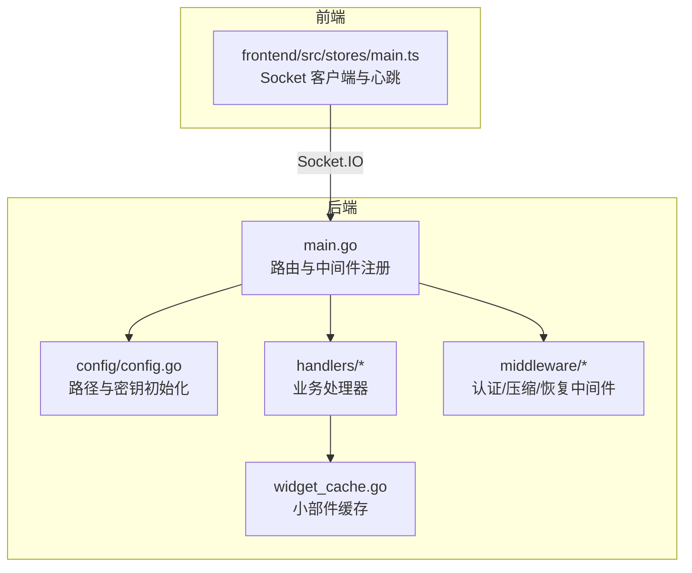
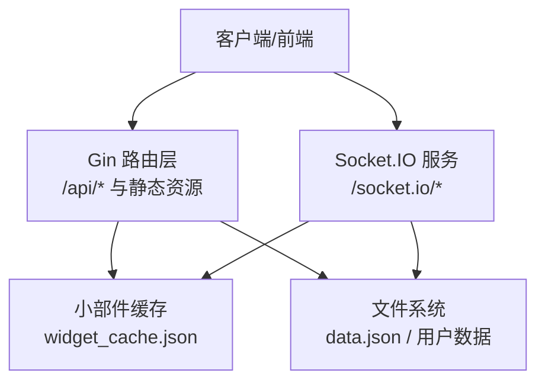
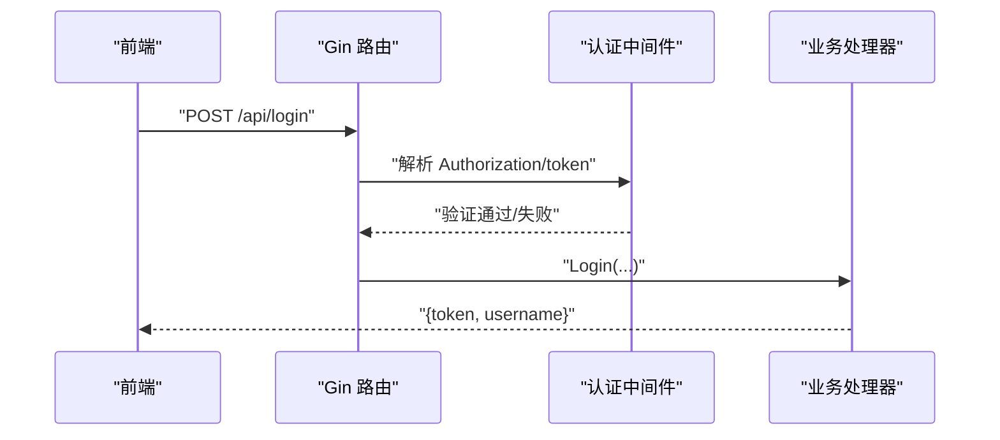
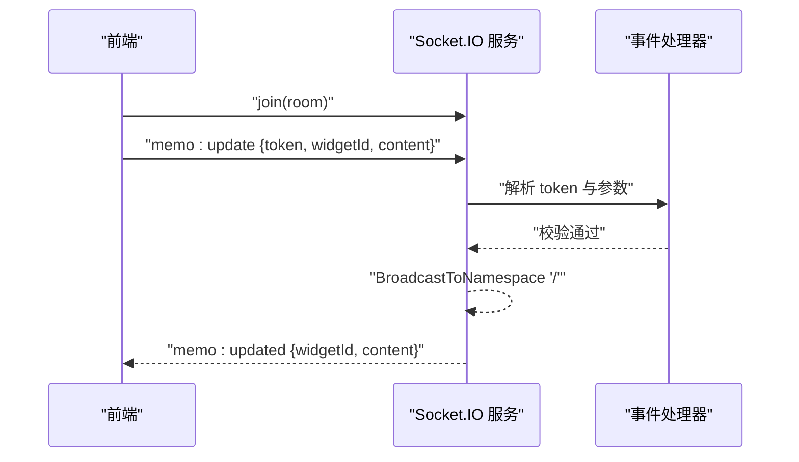
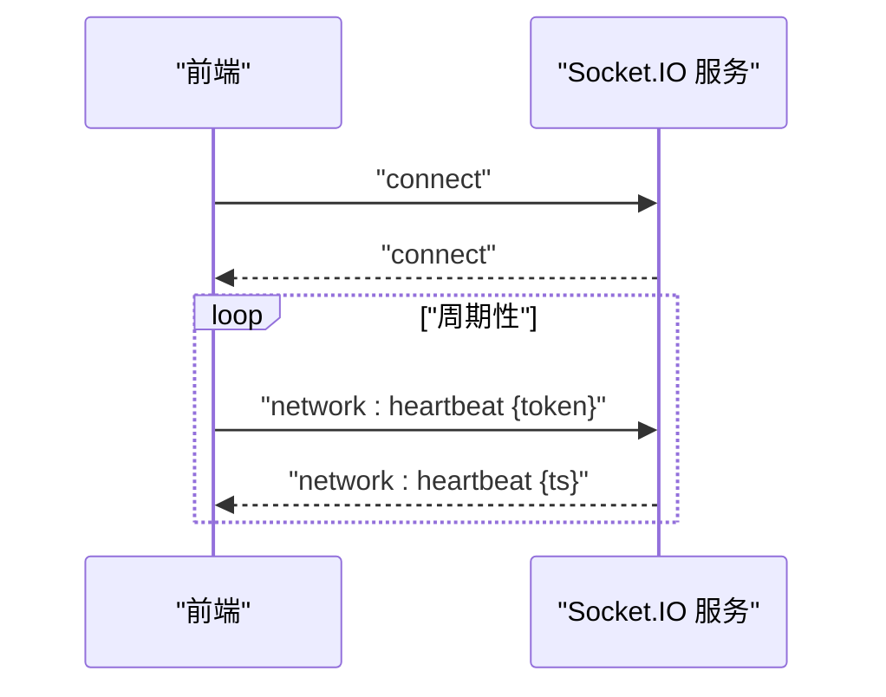
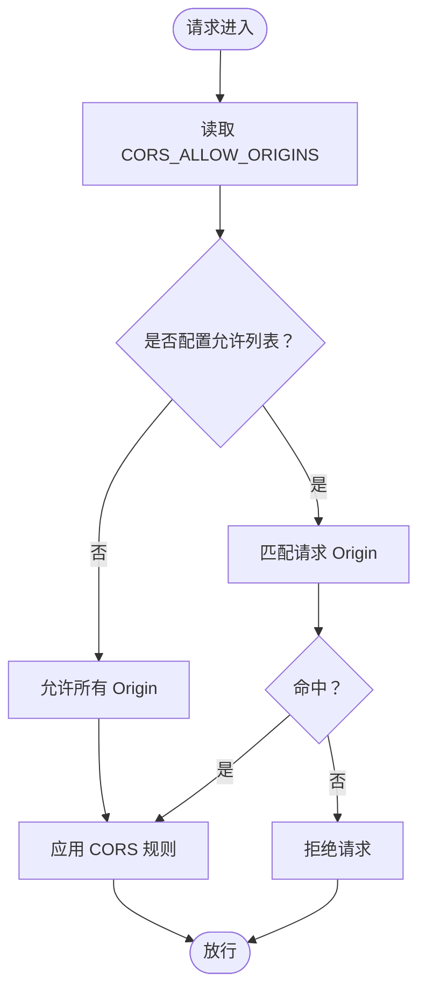
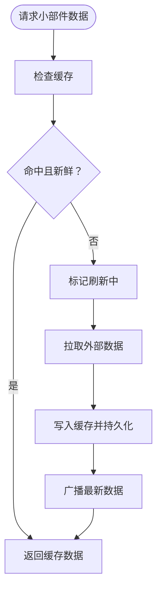
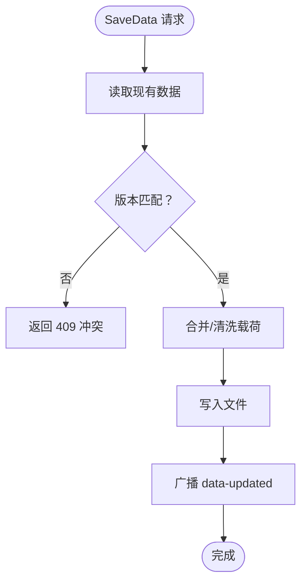
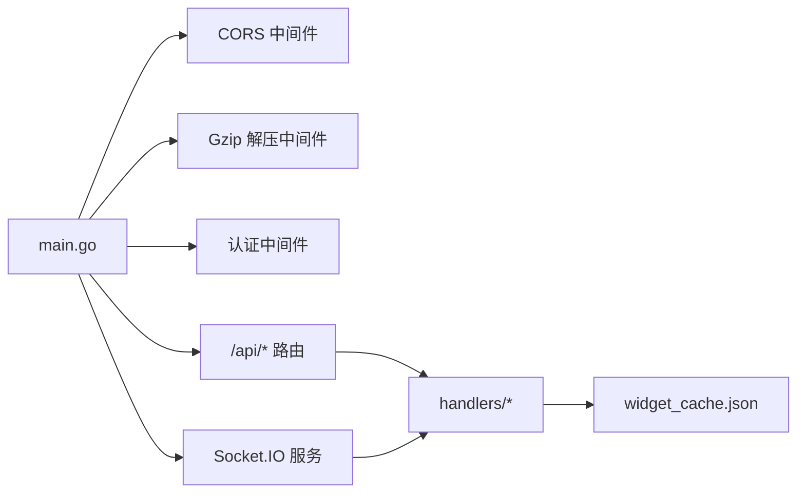

# 通信架构

<cite>
**本文档引用的文件**
- [backend/main.go](file://backend/main.go)
- [backend/config/config.go](file://backend/config/config.go)
- [backend/handlers/data.go](file://backend/handlers/data.go)
- [backend/handlers/auth.go](file://backend/handlers/auth.go)
- [backend/middleware/auth.go](file://backend/middleware/auth.go)
- [backend/middleware/gzip_decompress.go](file://backend/middleware/gzip_decompress.go)
- [backend/middleware/recovery.go](file://backend/middleware/recovery.go)
- [backend/handlers/widget_cache.go](file://backend/handlers/widget_cache.go)
- [backend/handlers/hot.go](file://backend/handlers/hot.go)
- [backend/handlers/weather.go](file://backend/handlers/weather.go)
- [backend/handlers/rss.go](file://backend/handlers/rss.go)
- [backend/handlers/memo.go](file://backend/handlers/memo.go)
- [frontend/src/stores/main.ts](file://frontend/src/stores/main.ts)
</cite>

## 目录
1. [引言](#引言)
2. [项目结构](#项目结构)
3. [核心组件](#核心组件)
4. [架构总览](#架构总览)
5. [详细组件分析](#详细组件分析)
6. [依赖分析](#依赖分析)
7. [性能考量](#性能考量)
8. [故障排查指南](#故障排查指南)
9. [结论](#结论)
10. [附录](#附录)

## 引言
本文件系统性梳理 OFlatNas 的通信架构，覆盖 HTTP RESTful API、Socket.IO 实时通信与 WebSocket 连接管理、CORS 配置、缓存与负载策略、以及事件驱动的数据同步机制。文档面向开发者与运维人员，既提供高层架构视图，也给出代码级细节与可视化图示，帮助快速理解与集成。

## 项目结构
后端采用 Gin Web 框架作为 HTTP 入口，结合 Socket.IO 提供实时事件通道；静态资源通过 Gin 路由分发；配置与数据持久化位于 server/data 目录。前端通过 Socket.IO 客户端与后端建立长连接，实现事件驱动的实时交互。

**图表来源**
- [backend/main.go:34-164](file://backend/main.go#L34-L164)
- [backend/config/config.go:35-86](file://backend/config/config.go#L35-L86)
- [backend/handlers/widget_cache.go:41-44](file://backend/handlers/widget_cache.go#L41-L44)
- [frontend/src/stores/main.ts:45-74](file://frontend/src/stores/main.ts#L45-L74)

**章节来源**
- [backend/main.go:34-164](file://backend/main.go#L34-L164)
- [backend/config/config.go:35-86](file://backend/config/config.go#L35-L86)

## 核心组件
- HTTP RESTful API
  - 统一前缀 /api，按功能分组（登录、数据、系统配置、RSS、天气、热点、传输等）
  - 支持可选认证与强制认证两类接口，鉴权基于 JWT
- Socket.IO 实时通信
  - 事件命名空间统一为根 "/"，支持 join 房间、广播与点对点通知
  - 事件类型包括 data-updated、memo:updated、weather:data、rss:data、hot:data、network:* 等
- CORS 与安全
  - CORS 动态允许列表，支持凭据与缓存控制
  - Origin 校验贯穿 HTTP 与 Socket.IO
- 缓存与一致性
  - 小部件缓存（RSS/热点/天气）统一存储于 widget_cache.json，带 TTL 与并发刷新锁
  - 数据保存采用幂等键与版本冲突检测，确保多端编辑一致性
- 中间件体系
  - 日志、恢复、Gzip 解压、认证与可选认证

**章节来源**
- [backend/main.go:165-254](file://backend/main.go#L165-L254)
- [backend/middleware/auth.go:33-60](file://backend/middleware/auth.go#L33-L60)
- [backend/handlers/widget_cache.go:80-123](file://backend/handlers/widget_cache.go#L80-L123)
- [backend/handlers/data.go:638-744](file://backend/handlers/data.go#L638-L744)

## 架构总览
后端以 Gin 为核心入口，Socket.IO 在同一进程中运行并通过 /socket.io/* 路由接入。静态资源与 SPA 路由回退在 Gin 中统一处理。认证中间件在受保护路由生效，未认证请求可走可选认证路径。

**图表来源**
- [backend/main.go:113-114](file://backend/main.go#L113-L114)
- [backend/main.go:165-254](file://backend/main.go#L165-L254)
- [backend/handlers/widget_cache.go:41-44](file://backend/handlers/widget_cache.go#L41-L44)

## 详细组件分析

### HTTP RESTful API 设计
- 路由组织
  - 登录与公开信息：/api/login、/api/data、/api/version、/api/system-config、/api/hot、/api/rss、/api/weather、/api/custom-scripts、/api/docker-*、/api/widgets/:id、/api/memo/:id、/api/amap/*、/api/ping、/api/rtt、/api/visitor/track、/api/transfer/*
  - 受保护路由：/api/admin/*、/api/save、/api/system-config、/api/config-versions/*、/api/backgrounds/*、/api/music/*、/api/transfer/*（上传/下载/缩略图）
- 鉴权模型
  - 可选认证：携带 Authorization 或查询参数 token 即可传递用户名上下文
  - 强制认证：仅持有有效 JWT 的请求可访问
- 请求体压缩
  - 自动识别 gzip 并解压，防止超大配置文件传输问题
- 错误处理
  - 全局恢复中间件返回统一错误结构

**图表来源**
- [backend/main.go:168-169](file://backend/main.go#L168-L169)
- [backend/middleware/auth.go:33-60](file://backend/middleware/auth.go#L33-L60)
- [backend/handlers/auth.go:18-114](file://backend/handlers/auth.go#L18-L114)

**章节来源**
- [backend/main.go:165-254](file://backend/main.go#L165-L254)
- [backend/middleware/auth.go:33-60](file://backend/middleware/auth.go#L33-L60)
- [backend/middleware/gzip_decompress.go:11-37](file://backend/middleware/gzip_decompress.go#L11-L37)
- [backend/middleware/recovery.go:9-15](file://backend/middleware/recovery.go#L9-L15)

### Socket.IO 实时通信与事件驱动
- 连接与房间
  - 客户端加入房间后，服务端广播相关事件
- 事件类型
  - 数据更新：data-updated（版本号）
  - 备忘录：memo:update → memo:updated
  - 网络：network:mode、network:heartbeat
  - 小部件：weather:data、rss:data、hot:data
- 令牌校验
  - 所有 Socket 事件均要求携带有效 JWT，服务端解析并校验
- 广播与点对点
  - 使用 BroadcastToNamespace 对全连接广播
  - 心跳事件直接回显服务器时间戳

**图表来源**
- [backend/main.go:100-109](file://backend/main.go#L100-L109)
- [backend/handlers/memo.go:25-38](file://backend/handlers/memo.go#L25-L38)
- [backend/handlers/memo.go:204-225](file://backend/handlers/memo.go#L204-L225)

**章节来源**
- [backend/main.go:79-111](file://backend/main.go#L79-L111)
- [backend/handlers/memo.go:25-96](file://backend/handlers/memo.go#L25-L96)

### WebSocket 连接管理与心跳
- 连接生命周期
  - OnConnect：设置空上下文
  - OnDisconnect：清理与回调
- 心跳机制
  - 前端在连接成功后启动心跳定时器
  - 后端收到 network:heartbeat 后立即回显时间戳
  - 前端根据心跳结果判定网络状态与重连策略

**图表来源**
- [backend/main.go:94-99](file://backend/main.go#L94-L99)
- [backend/handlers/memo.go:84-95](file://backend/handlers/memo.go#L84-L95)
- [frontend/src/stores/main.ts:45-74](file://frontend/src/stores/main.ts#L45-L74)

**章节来源**
- [backend/main.go:94-99](file://backend/main.go#L94-L99)
- [backend/handlers/memo.go:84-95](file://backend/handlers/memo.go#L84-L95)
- [frontend/src/stores/main.ts:45-74](file://frontend/src/stores/main.ts#L45-L74)

### 跨域资源共享（CORS）与 Origin 校验
- CORS 配置
  - 动态允许列表来自环境变量 CORS_ALLOW_ORIGINS，逗号分隔
  - 默认允许所有或精确匹配
  - 支持凭据、常用方法与头部、缓存时长
- Socket.IO Origin 校验
  - Polling 与 WebSocket 传输均执行 CheckOrigin，逻辑与 CORS 一致

**图表来源**
- [backend/main.go:48-77](file://backend/main.go#L48-L77)
- [backend/main.go:80-93](file://backend/main.go#L80-L93)

**章节来源**
- [backend/main.go:48-77](file://backend/main.go#L48-L77)
- [backend/main.go:80-93](file://backend/main.go#L80-L93)

### 小部件缓存与实时数据同步
- 缓存结构
  - 统一文件 widget_cache.json，按 kind/key 存储数据、更新时间、TTL 与来源状态
  - 并发刷新锁避免重复拉取
- 刷新策略
  - 首次命中缓存即回传，若过期则异步刷新并广播最新数据
  - HTTP 接口同样复用缓存，支持 force 参数强制刷新
- 实时同步
  - Socket 事件触发后，服务端广播最新数据，前端即时更新

**图表来源**
- [backend/handlers/widget_cache.go:80-123](file://backend/handlers/widget_cache.go#L80-L123)
- [backend/handlers/rss.go:82-135](file://backend/handlers/rss.go#L82-L135)
- [backend/handlers/hot.go:31-79](file://backend/handlers/hot.go#L31-L79)
- [backend/handlers/weather.go:114-146](file://backend/handlers/weather.go#L114-L146)

**章节来源**
- [backend/handlers/widget_cache.go:41-154](file://backend/handlers/widget_cache.go#L41-L154)
- [backend/handlers/rss.go:82-135](file://backend/handlers/rss.go#L82-L135)
- [backend/handlers/hot.go:31-79](file://backend/handlers/hot.go#L31-L79)
- [backend/handlers/weather.go:114-146](file://backend/handlers/weather.go#L114-L146)

### 数据一致性与幂等性
- 版本冲突检测
  - 保存数据时比较客户端与服务端版本，冲突返回 409
- 幂等性
  - 备忘录保存支持 X-Idempotency-Key，10 分钟窗口内去重
- 文件锁定
  - 备忘录文件写入使用互斥锁，避免并发写冲突

**图表来源**
- [backend/handlers/data.go:638-744](file://backend/handlers/data.go#L638-L744)
- [backend/handlers/data.go:535-636](file://backend/handlers/data.go#L535-L636)

**章节来源**
- [backend/handlers/data.go:638-744](file://backend/handlers/data.go#L638-L744)
- [backend/handlers/data.go:535-636](file://backend/handlers/data.go#L535-L636)

## 依赖分析
- 组件耦合
  - main.go 作为装配中心，集中注册中间件、CORS、Socket.IO 与路由
  - handlers 通过共享的 Socket.IO Server 与缓存进行广播与数据同步
- 外部依赖
  - Gin、Socket.IO、JWT、Gzip、CORS
- 潜在风险
  - 缓存文件 I/O 与并发刷新锁需关注磁盘压力
  - Socket.IO 广播规模增大时的内存与带宽开销

**图表来源**
- [backend/main.go:34-164](file://backend/main.go#L34-L164)
- [backend/handlers/widget_cache.go:41-44](file://backend/handlers/widget_cache.go#L41-L44)

**章节来源**
- [backend/main.go:34-164](file://backend/main.go#L34-L164)
- [backend/handlers/widget_cache.go:41-44](file://backend/handlers/widget_cache.go#L41-L44)

## 性能考量
- 网络压缩
  - Gzip 压缩传输，Gzip 解压中间件自动处理
- 缓存命中
  - 小部件缓存显著降低外部 API 压力与响应延迟
- 广播优化
  - 仅在缓存过期时触发异步刷新与广播，避免频繁推送
- 前端心跳
  - 根据网络模式动态调整心跳间隔，降低带宽占用

[本节为通用建议，无需特定文件引用]

## 故障排查指南
- CORS 拒绝
  - 检查 CORS_ALLOW_ORIGINS 是否包含前端地址，确认凭据与方法允许
- 认证失败
  - 确认 Authorization 头或查询参数 token 正确，JWT 未过期
- Socket 连接异常
  - 查看连接日志与断开回调，确认 Origin 校验与传输类型
- 缓存异常
  - 检查 widget_cache.json 权限与磁盘空间，确认 TTL 与刷新锁状态
- 保存冲突
  - 客户端应重试并提示版本冲突，必要时拉取最新数据

**章节来源**
- [backend/main.go:48-77](file://backend/main.go#L48-L77)
- [backend/middleware/auth.go:33-60](file://backend/middleware/auth.go#L33-L60)
- [backend/handlers/widget_cache.go:138-153](file://backend/handlers/widget_cache.go#L138-L153)
- [backend/handlers/data.go:675-678](file://backend/handlers/data.go#L675-L678)

## 结论
OFlatNas 采用“HTTP REST + Socket.IO 实时”的混合通信架构：REST 负责稳定的数据交换与鉴权，Socket.IO 提供低延迟的事件驱动同步。通过统一的 CORS 策略、可配置的 Origin 校验、小部件缓存与版本/幂等机制，系统在复杂网络环境下实现了高可用与一致性。建议在生产环境中结合负载均衡与连接池策略进一步提升吞吐与稳定性。

[本节为总结，无需特定文件引用]

## 附录

### API 与事件一览
- HTTP
  - GET /api/data、/api/version、/api/system-config、/api/hot、/api/rss、/api/weather、/api/widgets/:id、/api/memo/:id
  - POST /api/login、/api/save、/api/system-config、/api/config-versions/*
- Socket.IO
  - 事件：join、memo:update、memo:updated、weather:data、rss:data、hot:data、network:mode、network:heartbeat
  - 广播：data-updated

**章节来源**
- [backend/main.go:165-254](file://backend/main.go#L165-L254)
- [backend/handlers/memo.go:25-96](file://backend/handlers/memo.go#L25-L96)