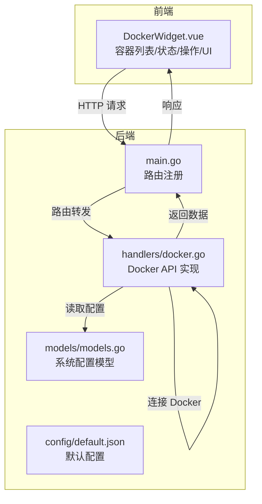
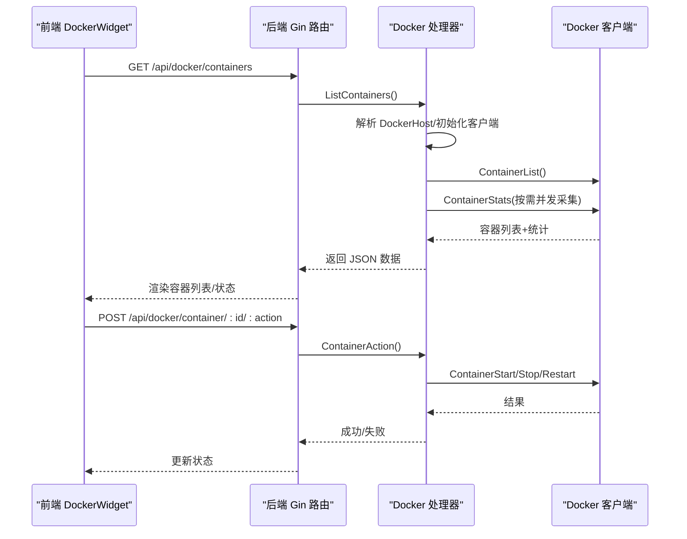
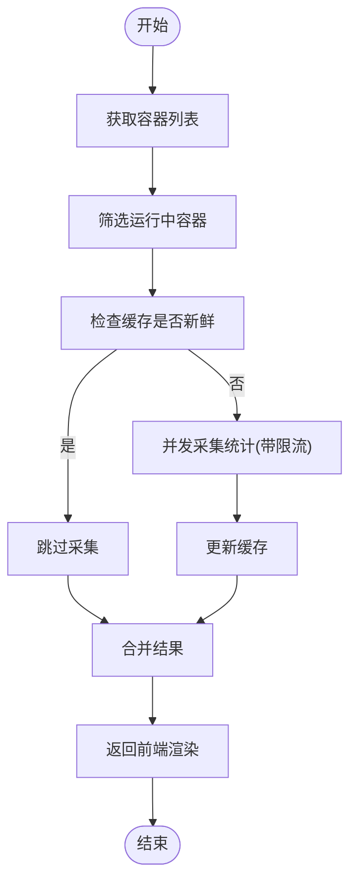
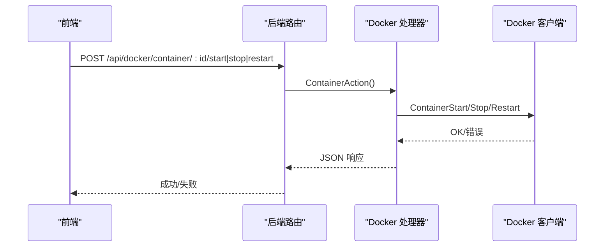
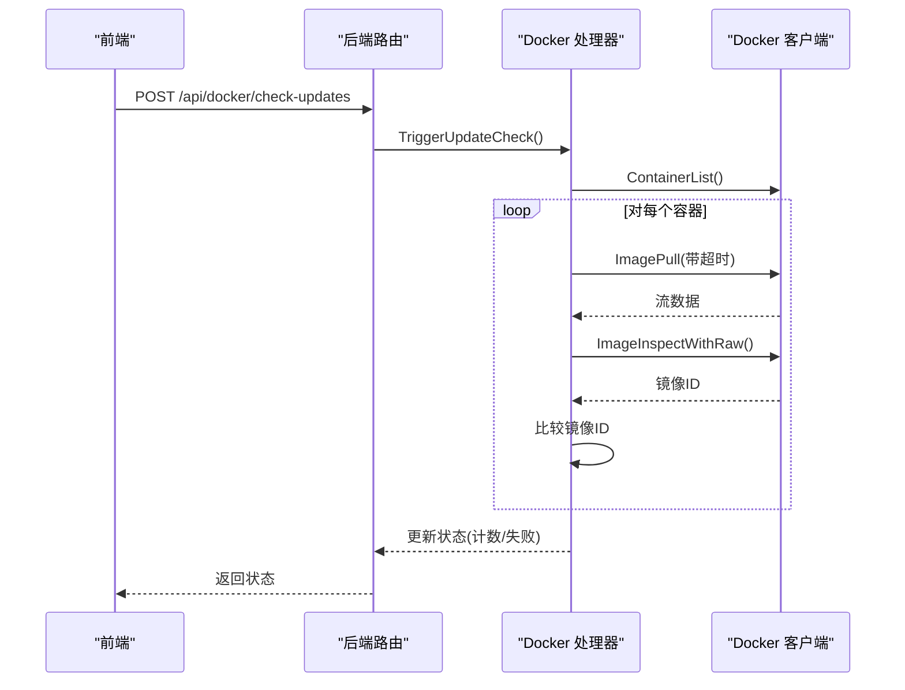
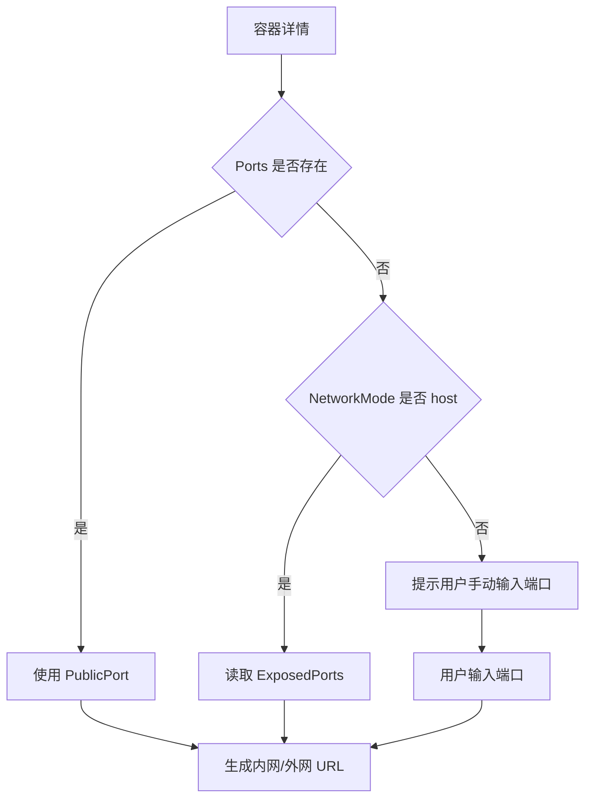
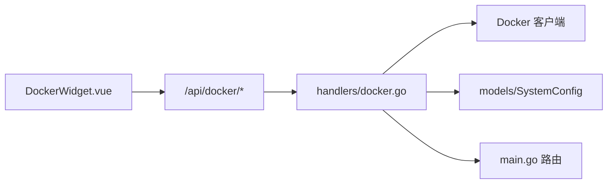

# Docker 管理

<cite>
**本文档引用的文件**
- [backend/handlers/docker.go](file://backend/handlers/docker.go)
- [backend/main.go](file://backend/main.go)
- [backend/models/models.go](file://backend/models/models.go)
- [frontend/src/components/DockerWidget.vue](file://frontend/src/components/DockerWidget.vue)
- [backend/config/default.json](file://backend/config/default.json)
</cite>

## 目录
1. [简介](#简介)
2. [项目结构](#项目结构)
3. [核心组件](#核心组件)
4. [架构总览](#架构总览)
5. [详细组件分析](#详细组件分析)
6. [依赖分析](#依赖分析)
7. [性能考虑](#性能考虑)
8. [故障排除指南](#故障排除指南)
9. [结论](#结论)
10. [附录](#附录)

## 简介
本文件面向 OFlatNas 的 Docker 管理功能，系统性阐述容器状态监控、生命周期管理、镜像管理、网络配置与 Docker API 集成等能力，并提供安全配置建议、最佳实践与故障排除指南。目标是帮助用户在本地或容器化环境中安全高效地管理 Docker 环境。

## 项目结构
- 后端采用 Go Gin 框架，提供 Docker 相关 API（容器列表、状态、操作、信息、镜像检查等）。
- 前端使用 Vue 组件展示容器列表、资源使用、端口检测与一键操作。
- 配置项支持启用/禁用 Docker 功能及自定义 Docker 守护进程连接地址。

图表来源
- [backend/main.go:165-254](file://backend/main.go#L165-L254)
- [backend/handlers/docker.go:354-421](file://backend/handlers/docker.go#L354-L421)
- [backend/models/models.go:81-85](file://backend/models/models.go#L81-L85)
- [backend/config/default.json:142](file://backend/config/default.json#L142)

章节来源
- [backend/main.go:165-254](file://backend/main.go#L165-L254)
- [backend/handlers/docker.go:354-421](file://backend/handlers/docker.go#L354-L421)
- [backend/models/models.go:81-85](file://backend/models/models.go#L81-L85)
- [backend/config/default.json:142](file://backend/config/default.json#L142)

## 核心组件
- Docker 客户端初始化与连接解析：支持从系统配置、环境变量或默认路径解析 Docker 守护进程地址，兼容 Windows 与 Linux/macOS。
- 容器状态监控：拉取容器列表，按需采集 CPU、内存、网络 IO、块 IO 等指标，带 TTL 缓存与并发限流。
- 生命周期管理：提供启动、停止、重启容器的受保护接口。
- 镜像管理：触发镜像更新检查，对比镜像 ID 判断是否有新版本可用。
- 网络配置：检测端口映射与暴露端口，支持主机网络模式下的端口识别与外网/内网访问链接生成。
- Docker API 集成：封装 Docker Engine 客户端，统一错误处理与调试导出。

章节来源
- [backend/handlers/docker.go:42-66](file://backend/handlers/docker.go#L42-L66)
- [backend/handlers/docker.go:354-421](file://backend/handlers/docker.go#L354-L421)
- [backend/handlers/docker.go:438-483](file://backend/handlers/docker.go#L438-L483)
- [backend/handlers/docker.go:664-759](file://backend/handlers/docker.go#L664-L759)
- [backend/handlers/docker.go:613-662](file://backend/handlers/docker.go#L613-L662)

## 架构总览
后端通过 Gin 路由暴露 Docker 管理接口；前端 DockerWidget 组件通过 HTTP 与后端交互，实现容器状态展示、资源监控、一键操作与端口检测。

图表来源
- [backend/main.go:215-221](file://backend/main.go#L215-L221)
- [backend/handlers/docker.go:354-421](file://backend/handlers/docker.go#L354-L421)
- [backend/handlers/docker.go:438-483](file://backend/handlers/docker.go#L438-L483)

## 详细组件分析

### 容器状态监控机制
- 指标采集
  - CPU 使用率：基于 CPU delta/system delta 与在线 CPU 数计算百分比。
  - 内存使用：扣除缓存/非活跃页后用量，计算使用百分比。
  - 网络 IO：聚合多网络接口 RX/TX 字节。
  - 块设备 IO：聚合读写字节。
- 缓存与并发
  - 运行中容器统计缓存带 TTL，避免频繁查询。
  - 并发限制采集通道，防止高并发下对 Docker 守护进程造成压力。
- 前端展示
  - CPU/内存进度条、网络上下行、磁盘读写可视化。
  - 容器状态颜色区分（运行/退出/未知）。

图表来源
- [backend/handlers/docker.go:292-352](file://backend/handlers/docker.go#L292-L352)
- [backend/handlers/docker.go:228-290](file://backend/handlers/docker.go#L228-L290)

章节来源
- [backend/handlers/docker.go:292-352](file://backend/handlers/docker.go#L292-L352)
- [backend/handlers/docker.go:228-290](file://backend/handlers/docker.go#L228-L290)
- [frontend/src/components/DockerWidget.vue:1111-1162](file://frontend/src/components/DockerWidget.vue#L1111-L1162)

### 容器生命周期管理
- 受保护接口：仅管理员可执行启动/停止/重启。
- 行为语义：
  - start：启动指定容器。
  - stop：停止指定容器。
  - restart：重启指定容器。
- 前端操作：运行中容器显示停止/重启按钮；非运行中显示启动按钮。

图表来源
- [backend/main.go:220](file://backend/main.go#L220)
- [backend/handlers/docker.go:438-483](file://backend/handlers/docker.go#L438-L483)

章节来源
- [backend/handlers/docker.go:438-483](file://backend/handlers/docker.go#L438-L483)
- [backend/main.go:220](file://backend/main.go#L220)
- [frontend/src/components/DockerWidget.vue:1244-1304](file://frontend/src/components/DockerWidget.vue#L1244-L1304)

### 镜像管理与更新检查
- 触发检查：后端遍历运行中容器，解析镜像标签，拉取镜像并比对镜像 ID。
- 结果反馈：统计检查总数、更新数量、失败项与最后检查时间。
- 前端交互：提供“检测更新”按钮，支持禁用特定容器的自动升级。

图表来源
- [backend/main.go:219](file://backend/main.go#L219)
- [backend/handlers/docker.go:664-759](file://backend/handlers/docker.go#L664-L759)

章节来源
- [backend/handlers/docker.go:664-759](file://backend/handlers/docker.go#L664-L759)
- [frontend/src/components/DockerWidget.vue:910-947](file://frontend/src/components/DockerWidget.vue#L910-L947)

### 网络配置与端口映射
- 端口检测策略
  - 优先使用容器已映射的端口。
  - 若无映射且网络模式为 host，则读取容器暴露端口。
  - 若仍无端口，前端可提示用户手动输入端口。
- 访问链接
  - 内网/外网打开按钮根据检测到的端口与用户配置生成 URL。
  - 支持为单个容器配置公网域名映射。

图表来源
- [backend/handlers/docker.go:613-662](file://backend/handlers/docker.go#L613-L662)
- [frontend/src/components/DockerWidget.vue:800-859](file://frontend/src/components/DockerWidget.vue#L800-L859)
- [frontend/src/components/DockerWidget.vue:861-887](file://frontend/src/components/DockerWidget.vue#L861-L887)

章节来源
- [backend/handlers/docker.go:613-662](file://backend/handlers/docker.go#L613-L662)
- [frontend/src/components/DockerWidget.vue:800-859](file://frontend/src/components/DockerWidget.vue#L800-L859)
- [frontend/src/components/DockerWidget.vue:861-887](file://frontend/src/components/DockerWidget.vue#L861-L887)

### Docker API 集成
- 客户端初始化
  - 支持从系统配置、环境变量或默认路径解析 Docker 主机地址。
  - 自动判断平台差异（Windows npipe、Linux unix）。
- 连接建立
  - 通过 WithAPIVersionNegotiation 与可选 WithHost 初始化客户端。
- 命令执行与结果解析
  - 列表、状态、操作、信息、镜像检查等均通过 Docker 客户端方法完成。
  - 统一错误处理与调试快照导出。

章节来源
- [backend/handlers/docker.go:42-66](file://backend/handlers/docker.go#L42-L66)
- [backend/handlers/docker.go:354-421](file://backend/handlers/docker.go#L354-L421)
- [backend/handlers/docker.go:523-606](file://backend/handlers/docker.go#L523-L606)

## 依赖分析
- 后端依赖
  - Gin 路由：注册 Docker 相关 API。
  - Docker 客户端：与 Docker Engine 交互。
  - 配置模型：SystemConfig 控制 Docker 开关与连接地址。
- 前端依赖
  - DockerWidget 组件：负责 UI、轮询、端口检测与操作。
  - 与后端 API 的契约：容器列表、状态、操作、信息、镜像检查等。

图表来源
- [backend/main.go:165-254](file://backend/main.go#L165-L254)
- [backend/handlers/docker.go:354-421](file://backend/handlers/docker.go#L354-L421)
- [backend/models/models.go:81-85](file://backend/models/models.go#L81-L85)

章节来源
- [backend/main.go:165-254](file://backend/main.go#L165-L254)
- [backend/handlers/docker.go:354-421](file://backend/handlers/docker.go#L354-L421)
- [backend/models/models.go:81-85](file://backend/models/models.go#L81-L85)

## 性能考虑
- 采集并发控制：使用信号量限制并发采集数量，避免对 Docker 守护进程造成压力。
- 缓存策略：运行中容器统计带 TTL，降低重复查询成本。
- 轮询策略：前端根据可见性与错误状态动态调整轮询间隔，弱网环境下降频。
- 资源开销：统计计算在后端进行，前端仅做展示，减少前端计算负担。

章节来源
- [backend/handlers/docker.go:292-352](file://backend/handlers/docker.go#L292-L352)
- [frontend/src/components/DockerWidget.vue:452-494](file://frontend/src/components/DockerWidget.vue#L452-L494)

## 故障排除指南
- Docker 未启用或连接失败
  - 现象：后端返回“Docker not available”，前端显示连接错误。
  - 排查：确认系统配置 enableDocker 为 true，dockerHost 地址正确。
- 无法连接 Docker Socket
  - 现象：提示无法连接 /var/run/docker.sock 或 Windows 管道。
  - 排查：确认宿主机 Docker 已启动，容器已挂载 /var/run/docker.sock。
- Windows 权限问题
  - 现象：提示需要管理员权限访问 Docker 引擎。
  - 排查：以管理员身份运行容器或提升权限。
- 端口未映射/未暴露
  - 现象：无法生成内网/外网访问链接。
  - 处理：在前端手动输入端口，或在容器网络配置中添加映射。
- 镜像更新检查失败
  - 现象：部分容器检查失败或无可用更新。
  - 处理：检查镜像仓库可达性、认证与网络策略。

章节来源
- [frontend/src/components/DockerWidget.vue:169-189](file://frontend/src/components/DockerWidget.vue#L169-L189)
- [backend/handlers/docker.go:523-606](file://backend/handlers/docker.go#L523-L606)

## 结论
OFlatNas 的 Docker 管理模块通过前后端协作，提供了容器状态监控、生命周期管理、镜像更新检查与网络配置检测等完整能力。其设计兼顾易用性与性能，配合安全配置与故障排除流程，能够帮助用户在不同平台上稳定高效地管理 Docker 环境。

## 附录

### 安全配置建议与最佳实践
- 仅在可信网络中启用 Docker 功能，避免暴露敏感 Socket。
- 使用最小权限原则：容器仅挂载必要目录，避免使用特权模式。
- 定期检查镜像来源与签名，启用镜像扫描与漏洞检测。
- 限制容器网络访问，使用防火墙与网络策略隔离服务。
- 定期备份配置与数据卷，验证恢复流程。

### 常用 API 一览（后端）
- GET /api/docker/containers：获取容器列表与状态、统计。
- POST /api/docker/container/:id/start|stop|restart：容器生命周期操作。
- GET /api/docker/info：获取 Docker 信息与版本。
- POST /api/docker/check-updates：触发镜像更新检查。
- GET /api/docker/container/:id/inspect-lite：轻量级容器检查（网络模式/端口）。
- GET /api/docker/debug：调试快照（连接状态、错误信息）。
- GET /api/docker/export-logs：导出调试日志。

章节来源
- [backend/main.go:215-221](file://backend/main.go#L215-L221)
- [backend/handlers/docker.go:523-606](file://backend/handlers/docker.go#L523-L606)