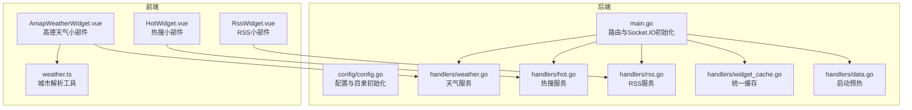
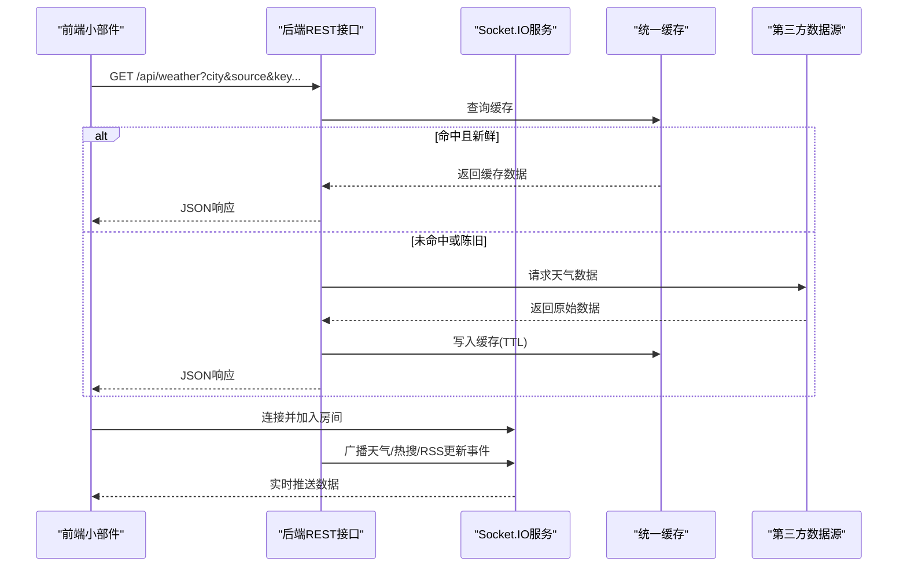
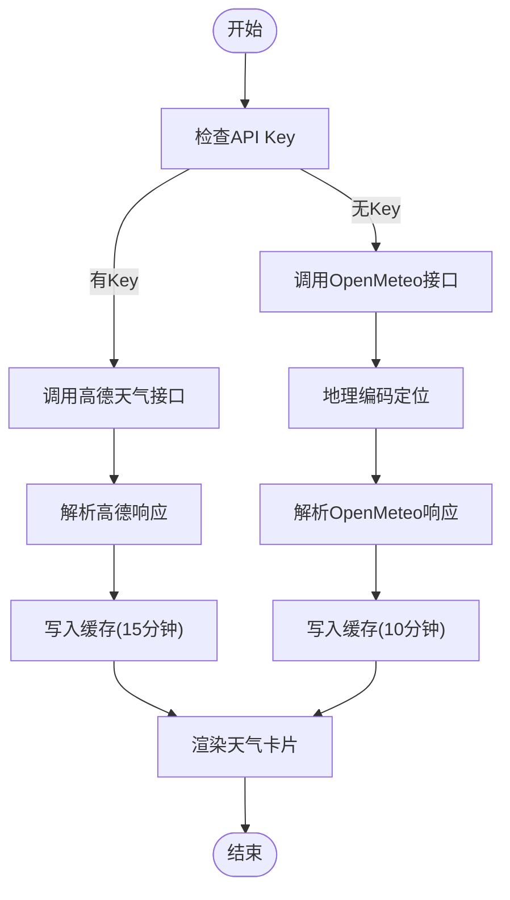
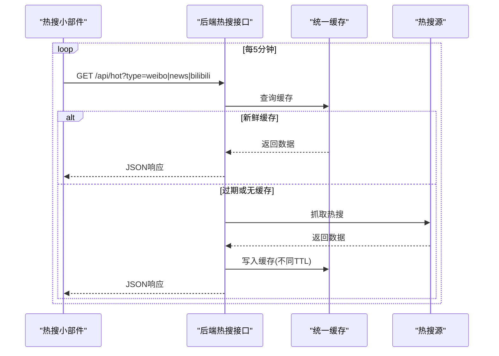
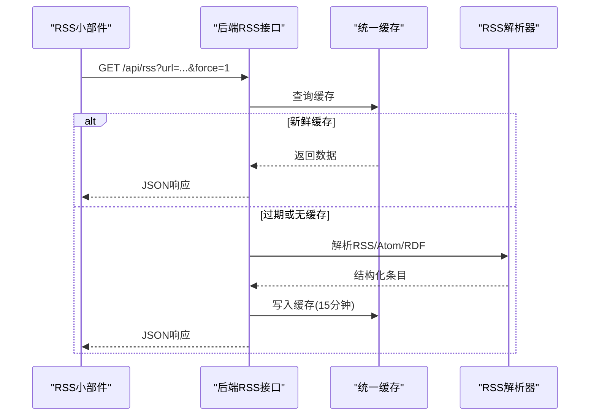
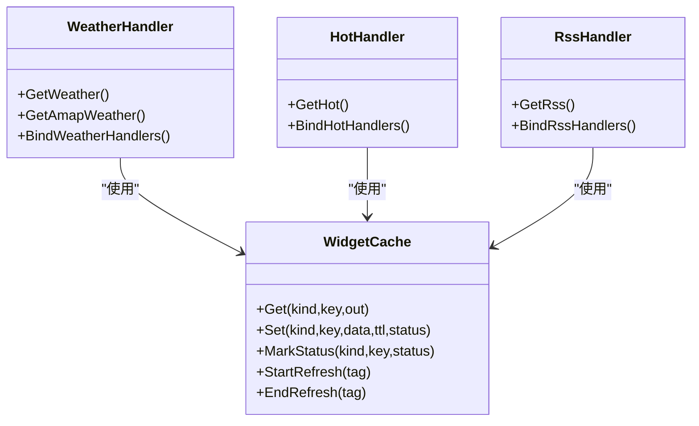
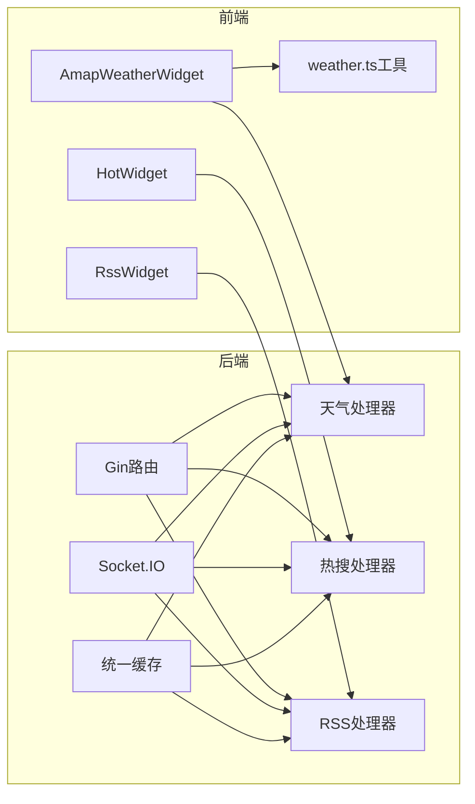

# 内容服务

<cite>
**本文档引用的文件**
- [backend/main.go](file://backend/main.go)
- [backend/config/config.go](file://backend/config/config.go)
- [backend/config/default.json](file://backend/config/default.json)
- [backend/handlers/weather.go](file://backend/handlers/weather.go)
- [backend/handlers/hot.go](file://backend/handlers/hot.go)
- [backend/handlers/rss.go](file://backend/handlers/rss.go)
- [backend/handlers/widget_cache.go](file://backend/handlers/widget_cache.go)
- [backend/handlers/data.go](file://backend/handlers/data.go)
- [frontend/src/components/AmapWeatherWidget.vue](file://frontend/src/components/AmapWeatherWidget.vue)
- [frontend/src/components/HotWidget.vue](file://frontend/src/components/HotWidget.vue)
- [frontend/src/components/RssWidget.vue](file://frontend/src/components/RssWidget.vue)
- [frontend/src/utils/weather.ts](file://frontend/src/utils/weather.ts)
</cite>

## 目录
1. [简介](#简介)
2. [项目结构](#项目结构)
3. [核心组件](#核心组件)
4. [架构总览](#架构总览)
5. [详细组件分析](#详细组件分析)
6. [依赖分析](#依赖分析)
7. [性能考虑](#性能考虑)
8. [故障排查指南](#故障排查指南)
9. [结论](#结论)
10. [附录](#附录)

## 简介
本文件面向 OFlatNas 的内容服务功能，围绕以下能力提供系统化文档：
- 天气服务：实时天气数据获取、多城市支持、天气效果渲染
- 热搜追踪：热门话题抓取、数据更新与展示优化
- RSS 订阅管理：订阅源添加、内容聚合与阅读体验优化
- 第三方 API 集成：配置管理、数据缓存与错误处理
- 配置选项：API 密钥设置、更新频率、显示样式
- 数据源选择建议与性能优化策略

## 项目结构
后端采用 Go Gin 框架，通过 Socket.IO 提供实时事件通信，并以 REST API 暴露内容服务接口。前端使用 Vue 3 组件化实现各小部件，结合本地缓存与定时刷新提升用户体验。

**图表来源**
- [backend/main.go:25-111](file://backend/main.go#L25-L111)
- [backend/handlers/weather.go:114-146](file://backend/handlers/weather.go#L114-L146)
- [backend/handlers/hot.go:31-79](file://backend/handlers/hot.go#L31-L79)
- [backend/handlers/rss.go:82-135](file://backend/handlers/rss.go#L82-L135)
- [frontend/src/components/AmapWeatherWidget.vue:192-213](file://frontend/src/components/AmapWeatherWidget.vue#L192-L213)
- [frontend/src/components/HotWidget.vue:146-150](file://frontend/src/components/HotWidget.vue#L146-L150)
- [frontend/src/components/RssWidget.vue:183-190](file://frontend/src/components/RssWidget.vue#L183-L190)

**章节来源**
- [backend/main.go:25-111](file://backend/main.go#L25-L111)
- [backend/config/config.go:35-86](file://backend/config/config.go#L35-L86)

## 核心组件
- 天气服务：支持高德天气与 OpenMeteo 两种数据源，提供实时天气与多日预报，具备缓存与刷新机制。
- 热搜服务：聚合微博、新闻、B站等热点，按类别轮询更新，前端 Tab 切换与滚动隔离优化体验。
- RSS 服务：统一解析 RSS/Atom/RDF，支持多订阅源拖拽排序与定时刷新。
- 统一缓存：基于内存与磁盘的统一缓存，支持 TTL、状态标记与并发刷新控制。
- 启动预热：根据配置文件预热 RSS 与天气缓存，降低首次访问延迟。

**章节来源**
- [backend/handlers/weather.go:114-146](file://backend/handlers/weather.go#L114-L146)
- [backend/handlers/hot.go:31-79](file://backend/handlers/hot.go#L31-L79)
- [backend/handlers/rss.go:82-135](file://backend/handlers/rss.go#L82-L135)
- [backend/handlers/widget_cache.go:13-34](file://backend/handlers/widget_cache.go#L13-L34)
- [backend/handlers/data.go:884-910](file://backend/handlers/data.go#L884-L910)

## 架构总览
后端通过 Socket.IO 与前端建立双向通信，REST 接口负责数据获取与缓存管理。前端小部件通过 API 或 Socket 事件驱动数据更新，同时维护本地缓存与定时刷新。

**图表来源**
- [backend/main.go:103-111](file://backend/main.go#L103-L111)
- [backend/handlers/weather.go:163-206](file://backend/handlers/weather.go#L163-L206)
- [backend/handlers/widget_cache.go:80-105](file://backend/handlers/widget_cache.go#L80-L105)

## 详细组件分析

### 天气服务
- 数据源选择
  - 高德天气：需提供 key，支持 base/all 两套接口，分别获取实况与预报。
  - OpenMeteo：无需密钥，通过地理编码定位城市并获取预报。
- 缓存策略
  - 高德 key 存在时缓存 15 分钟，否则 10 分钟。
  - 支持异步刷新与广播更新。
- 前端集成
  - 自动 IP 定位城市（可选），并支持手动选择 Adcode。
  - 动态背景与天气粒子效果，按天气类型切换动画层。
- 错误处理
  - 优先读取本地缓存，保证弱网下可用性。
  - 显示友好错误信息并提供重试。

**图表来源**
- [backend/handlers/weather.go:345-380](file://backend/handlers/weather.go#L345-L380)
- [backend/handlers/weather.go:382-491](file://backend/handlers/weather.go#L382-L491)
- [frontend/src/components/AmapWeatherWidget.vue:215-295](file://frontend/src/components/AmapWeatherWidget.vue#L215-L295)

**章节来源**
- [backend/handlers/weather.go:114-146](file://backend/handlers/weather.go#L114-L146)
- [backend/handlers/weather.go:163-206](file://backend/handlers/weather.go#L163-L206)
- [backend/handlers/weather.go:208-275](file://backend/handlers/weather.go#L208-L275)
- [frontend/src/components/AmapWeatherWidget.vue:192-213](file://frontend/src/components/AmapWeatherWidget.vue#L192-L213)

### 热搜追踪
- 支持类型：微博、新闻、B站
- 更新策略：Tab 级别缓存与轮询刷新，后台可见性变化时自动恢复
- 展示优化：Tab 拖拽排序、列表滚动隔离、热度序号高亮

**图表来源**
- [backend/handlers/hot.go:132-170](file://backend/handlers/hot.go#L132-L170)
- [backend/handlers/hot.go:81-105](file://backend/handlers/hot.go#L81-L105)
- [frontend/src/components/HotWidget.vue:123-144](file://frontend/src/components/HotWidget.vue#L123-L144)

**章节来源**
- [backend/handlers/hot.go:31-79](file://backend/handlers/hot.go#L31-L79)
- [backend/handlers/hot.go:132-170](file://backend/handlers/hot.go#L132-L170)
- [frontend/src/components/HotWidget.vue:146-150](file://frontend/src/components/HotWidget.vue#L146-L150)

### RSS 订阅管理
- 订阅源添加：在全局设置中启用并配置 RSS 源
- 内容聚合：统一解析 RSS/Atom/RDF，提取标题、链接、摘要与发布时间
- 阅读体验：订阅源横向滚动标签、定时刷新、滚动隔离与错误提示

**图表来源**
- [backend/handlers/rss.go:201-252](file://backend/handlers/rss.go#L201-L252)
- [backend/handlers/rss.go:254-300](file://backend/handlers/rss.go#L254-L300)
- [frontend/src/components/RssWidget.vue:183-190](file://frontend/src/components/RssWidget.vue#L183-L190)

**章节来源**
- [backend/handlers/rss.go:82-135](file://backend/handlers/rss.go#L82-L135)
- [backend/handlers/rss.go:201-252](file://backend/handlers/rss.go#L201-L252)
- [frontend/src/components/RssWidget.vue:183-190](file://frontend/src/components/RssWidget.vue#L183-L190)

### 第三方 API 集成机制
- 配置管理：通过系统配置文件与运行时参数管理 API Key 与行为开关
- 数据缓存：统一缓存结构支持 TTL 与状态标记，避免重复请求
- 错误处理：优先本地缓存回退，网络异常时保持界面可用

**图表来源**
- [backend/handlers/widget_cache.go:26-34](file://backend/handlers/widget_cache.go#L26-L34)
- [backend/handlers/weather.go:163-206](file://backend/handlers/weather.go#L163-L206)
- [backend/handlers/hot.go:132-170](file://backend/handlers/hot.go#L132-L170)
- [backend/handlers/rss.go:201-252](file://backend/handlers/rss.go#L201-L252)

**章节来源**
- [backend/handlers/widget_cache.go:80-136](file://backend/handlers/widget_cache.go#L80-L136)
- [backend/config/default.json:88-90](file://backend/config/default.json#L88-L90)

## 依赖分析
- 后端依赖
  - Gin 路由与中间件、Socket.IO 传输层、统一缓存模块
  - 第三方天气与热搜接口
- 前端依赖
  - 小部件组件与工具函数，本地存储与定时器
  - 与后端 API 的交互与错误处理

**图表来源**
- [backend/main.go:103-111](file://backend/main.go#L103-L111)
- [backend/handlers/widget_cache.go:36-44](file://backend/handlers/widget_cache.go#L36-L44)
- [frontend/src/components/AmapWeatherWidget.vue:192-213](file://frontend/src/components/AmapWeatherWidget.vue#L192-L213)

**章节来源**
- [backend/main.go:103-111](file://backend/main.go#L103-L111)
- [backend/handlers/widget_cache.go:36-44](file://backend/handlers/widget_cache.go#L36-L44)

## 性能考虑
- 缓存策略
  - 天气：高德 key 存在时 15 分钟，否则 10 分钟；支持异步刷新与广播
  - 热搜：微博 3 分钟、新闻 8 分钟、知乎 5 分钟、B站 4 分钟
  - RSS：15 分钟固定 TTL
- 网络优化
  - 启用 Gzip 压缩与跨域配置，适配内网穿透与慢速网络
  - 前端请求超时与 AbortController 控制，避免阻塞
- 前端体验
  - Tab 级缓存与滚动隔离，减少重绘与滚动抖动
  - 动画层按天气类型懒加载，避免不必要的渲染

[本节为通用指导，无需具体文件分析]

## 故障排查指南
- 天气服务
  - 高德 Key 缺失：前端提示“请配置 API Key”，或后端返回错误
  - IP 定位失败：检查 /api/amap/ip 是否返回成功状态码
  - 缓存失效：开启 force 参数强制刷新，或等待 TTL 过期
- 热搜服务
  - 类型不支持：确认 type 在 weibo/news/zhihu/bilibili 范围内
  - 请求超时：前端提供重试按钮，后端 TTL 保障旧数据回显
- RSS 服务
  - 订阅源为空：检查设置中是否启用至少一个 RSS 源
  - 解析失败：确认 URL 正确且可公开访问，查看后端日志
- 统一缓存
  - 状态异常：可通过 MarkStatus 标记错误状态，便于诊断

**章节来源**
- [backend/handlers/weather.go:208-275](file://backend/handlers/weather.go#L208-L275)
- [backend/handlers/hot.go:132-170](file://backend/handlers/hot.go#L132-L170)
- [backend/handlers/rss.go:201-252](file://backend/handlers/rss.go#L201-L252)
- [backend/handlers/widget_cache.go:125-136](file://backend/handlers/widget_cache.go#L125-L136)

## 结论
内容服务通过统一缓存与多数据源策略，在保证实时性的同时兼顾性能与稳定性。前端小部件以最小交互成本实现丰富的展示与体验优化，配合后端 Socket.IO 实现实时推送。建议在生产环境中合理设置 TTL 与刷新频率，并结合本地缓存策略提升弱网环境下的可用性。

[本节为总结性内容，无需具体文件分析]

## 附录

### 配置选项
- 系统配置文件字段
  - 高德 Key：用于高德天气服务
  - 天气效果开关：控制天气小部件的动态效果
  - 默认搜索引擎与分组布局等应用级配置
- 运行时环境变量
  - CORS 允许来源、端口等网络相关配置

**章节来源**
- [backend/config/default.json:88-90](file://backend/config/default.json#L88-L90)
- [backend/config/config.go:35-86](file://backend/config/config.go#L35-L86)

### 数据源选择建议
- 天气
  - 国内场景优先高德，需 Key；国际场景可选 OpenMeteo
- 热搜
  - 微博适合热点追踪；新闻适合时事资讯；B站适合二次元与科技类
- RSS
  - 选择权威媒体与技术博客源，避免私人性质过强的订阅

[本节为概念性建议，无需具体文件分析]