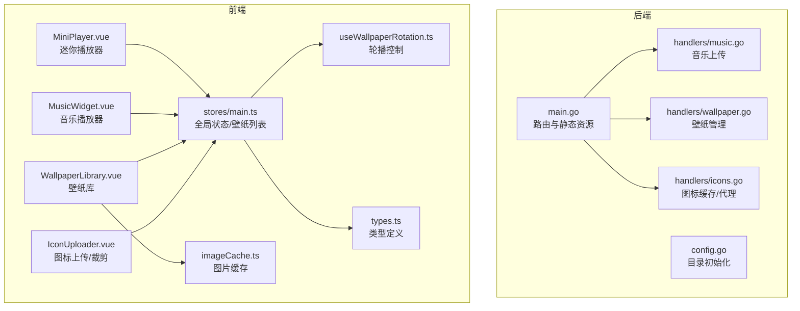
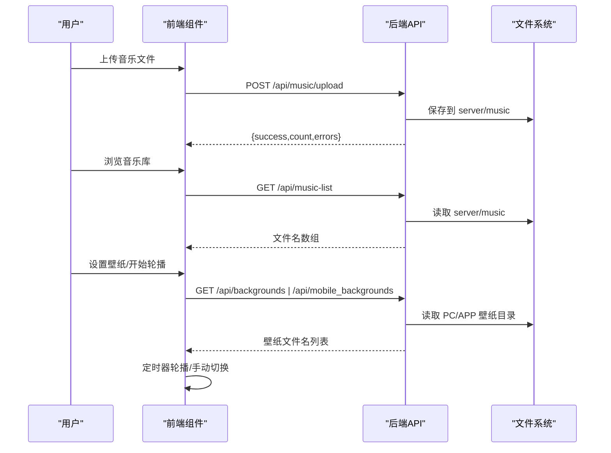
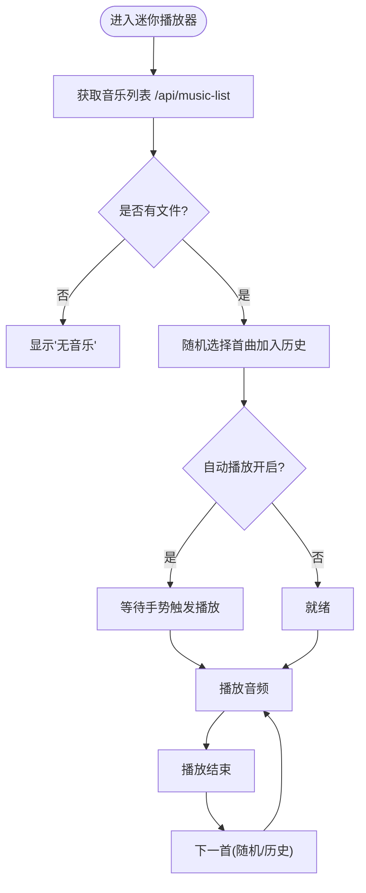
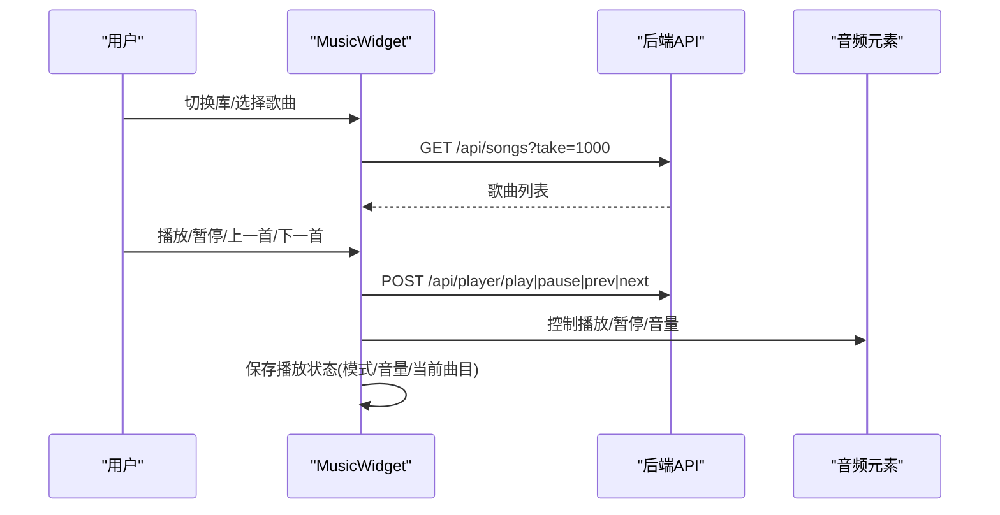
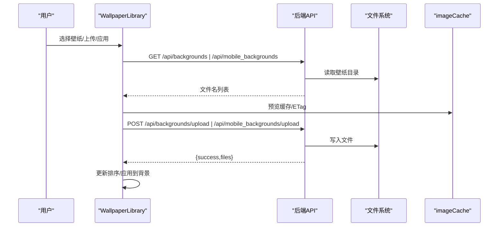
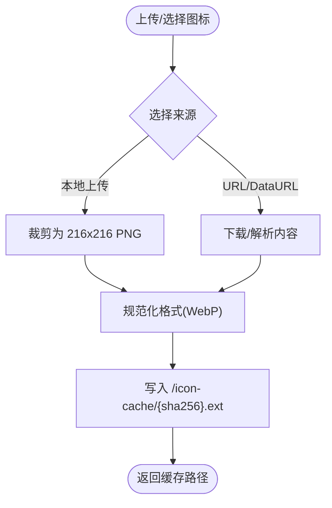
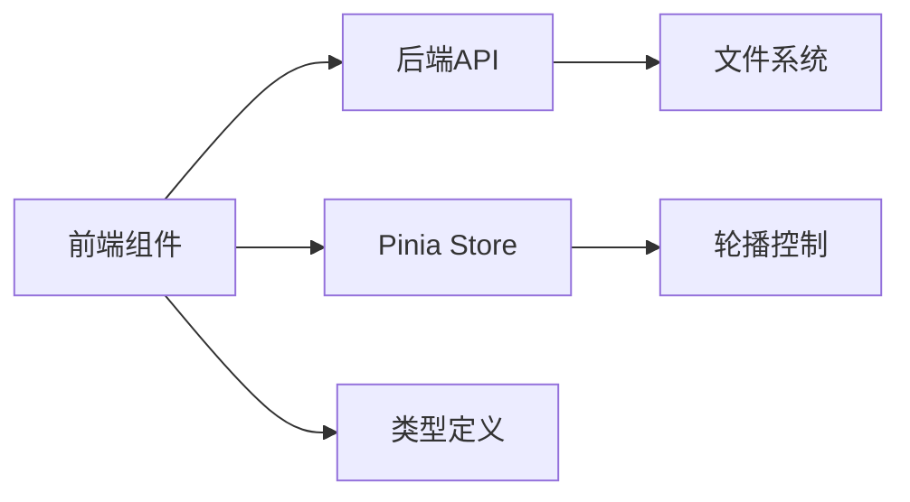

# 媒体管理

<cite>
**本文引用的文件**
- [backend/main.go](file://backend/main.go)
- [backend/config/config.go](file://backend/config/config.go)
- [backend/handlers/music.go](file://backend/handlers/music.go)
- [backend/handlers/wallpaper.go](file://backend/handlers/wallpaper.go)
- [backend/handlers/icons.go](file://backend/handlers/icons.go)
- [frontend/src/components/MiniPlayer.vue](file://frontend/src/components/MiniPlayer.vue)
- [frontend/src/components/MusicWidget.vue](file://frontend/src/components/MusicWidget.vue)
- [frontend/src/components/WallpaperLibrary.vue](file://frontend/src/components/WallpaperLibrary.vue)
- [frontend/src/utils/imageCache.ts](file://frontend/src/utils/imageCache.ts)
- [frontend/src/stores/main.ts](file://frontend/src/stores/main.ts)
- [frontend/src/composables/useWallpaperRotation.ts](file://frontend/src/composables/useWallpaperRotation.ts)
- [frontend/src/types.ts](file://frontend/src/types.ts)
- [README.md](file://README.md)
</cite>

## 目录
1. [简介](#简介)
2. [项目结构](#项目结构)
3. [核心组件](#核心组件)
4. [架构总览](#架构总览)
5. [详细组件分析](#详细组件分析)
6. [依赖关系分析](#依赖关系分析)
7. [性能考量](#性能考量)
8. [故障排除指南](#故障排除指南)
9. [结论](#结论)
10. [附录](#附录)

## 简介
本文件面向 OFlatNas 的媒体管理功能，围绕音乐播放器、背景音乐管理、壁纸管理、图标库管理与媒体文件组织策略展开，结合后端 API 与前端组件，提供从架构到使用实践的完整说明。读者可据此理解播放列表管理、音量控制、播放模式切换、歌曲搜索、音乐库扫描、自动播放与播放历史、壁纸库浏览与定时更换、缩略图生成与手动设置、图标上传与分类管理、自定义图标设置，以及媒体文件的组织与缓存机制。

## 项目结构
- 后端采用 Go Gin 框架，提供静态资源服务、API 路由与 Socket.IO 通信。
- 前端基于 Vue 3，提供迷你播放器、音乐播放器组件、壁纸库与旋转控制、图标上传与裁剪、图片缓存等能力。
- 配置模块负责后端目录结构初始化与路径解析，确保媒体文件存放位置一致。

**图表来源**
- [backend/main.go:1-267](file://backend/main.go#L1-L267)
- [backend/config/config.go:1-257](file://backend/config/config.go#L1-L257)
- [backend/handlers/music.go:1-56](file://backend/handlers/music.go#L1-L56)
- [backend/handlers/wallpaper.go:1-268](file://backend/handlers/wallpaper.go#L1-L268)
- [backend/handlers/icons.go:1-533](file://backend/handlers/icons.go#L1-L533)
- [frontend/src/components/MiniPlayer.vue:1-400](file://frontend/src/components/MiniPlayer.vue#L1-L400)
- [frontend/src/components/MusicWidget.vue:1-800](file://frontend/src/components/MusicWidget.vue#L1-L800)
- [frontend/src/components/WallpaperLibrary.vue:1-800](file://frontend/src/components/WallpaperLibrary.vue#L1-L800)
- [frontend/src/utils/imageCache.ts:1-132](file://frontend/src/utils/imageCache.ts#L1-L132)
- [frontend/src/stores/main.ts:1-800](file://frontend/src/stores/main.ts#L1-L800)
- [frontend/src/composables/useWallpaperRotation.ts:1-72](file://frontend/src/composables/useWallpaperRotation.ts#L1-L72)
- [frontend/src/types.ts:1-298](file://frontend/src/types.ts#L1-L298)

**章节来源**
- [backend/main.go:116-135](file://backend/main.go#L116-L135)
- [backend/config/config.go:68-86](file://backend/config/config.go#L68-L86)
- [README.md:13-70](file://README.md#L13-L70)

## 核心组件
- 音乐播放器（迷你播放器与音乐播放器）
  - 迷你播放器：自动播放、播放历史、上一首/下一首、音量控制、标题跑马灯。
  - 音乐播放器：播放列表浏览、播放模式（顺序/随机/单曲循环）、音量控制、歌词/频谱/抽象动画/黑胶封面可视化。
- 背景音乐管理
  - 音乐库扫描：后端提供音乐列表 API，前端按需拉取并随机播放。
  - 自动播放与播放历史：根据配置自动播放，维护播放历史以便上一首/下一首。
- 壁纸管理系统
  - 壁纸库浏览：PC/手机壁纸库分离，支持排序与拖拽。
  - 定时更换：轮播开关、间隔与播放方式（随机/顺序）。
  - 缩略图生成与手动设置：通过上传与代理接口生成与应用壁纸。
- 图标库管理
  - 图标上传与裁剪：支持 5MB 以内图片，自动裁剪为 216x216 PNG。
  - 分类管理与自定义图标设置：通过内置图标库与上传图标组合使用。
- 媒体文件组织与缓存
  - 目录结构：音乐、PC 壁纸、APP 壁纸、图标缓存、公共资源等。
  - 缓存机制：IndexedDB 图片缓存，支持 ETag 与过期清理。

**章节来源**
- [frontend/src/components/MiniPlayer.vue:1-400](file://frontend/src/components/MiniPlayer.vue#L1-L400)
- [frontend/src/components/MusicWidget.vue:1-800](file://frontend/src/components/MusicWidget.vue#L1-L800)
- [frontend/src/components/WallpaperLibrary.vue:1-800](file://frontend/src/components/WallpaperLibrary.vue#L1-L800)
- [backend/handlers/music.go:13-56](file://backend/handlers/music.go#L13-L56)
- [backend/handlers/wallpaper.go:145-186](file://backend/handlers/wallpaper.go#L145-L186)
- [backend/handlers/icons.go:109-228](file://backend/handlers/icons.go#L109-L228)
- [frontend/src/utils/imageCache.ts:1-132](file://frontend/src/utils/imageCache.ts#L1-L132)
- [backend/config/config.go:68-86](file://backend/config/config.go#L68-L86)

## 架构总览
后端负责：
- 静态资源映射（音乐、壁纸、图标缓存、公共资源）。
- 音乐上传与壁纸列表/上传/删除/解析/抓取等 API。
- 图标缓存与代理、阿里图标代理与基础校验。

前端负责：
- 音乐播放器 UI 与交互（播放/暂停、上一首/下一首、音量、播放模式）。
- 壁纸库 UI 与轮播控制（开启/停止、播放方式、间隔、排序）。
- 图标上传与裁剪、图片缓存与预览。
- 全局状态管理与轮播定时器。

**图表来源**
- [backend/main.go:130-134](file://backend/main.go#L130-L134)
- [backend/handlers/music.go:13-56](file://backend/handlers/music.go#L13-L56)
- [backend/handlers/wallpaper.go:145-186](file://backend/handlers/wallpaper.go#L145-L186)
- [frontend/src/components/MiniPlayer.vue:46-69](file://frontend/src/components/MiniPlayer.vue#L46-L69)

**章节来源**
- [backend/main.go:165-254](file://backend/main.go#L165-L254)
- [backend/handlers/music.go:13-56](file://backend/handlers/music.go#L13-L56)
- [backend/handlers/wallpaper.go:223-267](file://backend/handlers/wallpaper.go#L223-L267)

## 详细组件分析

### 音乐播放器（迷你播放器）
- 自动播放：根据配置决定是否自动播放，若浏览器阻止需手势触发。
- 播放历史：维护历史索引，支持上一首/下一首。
- 音量控制：持久化音量，随播放器变化同步。
- 标题跑马灯：当标题超出宽度时启用横向滚动展示。
- URL 处理：对音乐文件名进行编码，拼接静态资源路径。

**图表来源**
- [frontend/src/components/MiniPlayer.vue:46-103](file://frontend/src/components/MiniPlayer.vue#L46-L103)
- [frontend/src/components/MiniPlayer.vue:118-142](file://frontend/src/components/MiniPlayer.vue#L118-L142)

**章节来源**
- [frontend/src/components/MiniPlayer.vue:18-27](file://frontend/src/components/MiniPlayer.vue#L18-L27)
- [frontend/src/components/MiniPlayer.vue:208-218](file://frontend/src/components/MiniPlayer.vue#L208-L218)
- [frontend/src/components/MiniPlayer.vue:222-276](file://frontend/src/components/MiniPlayer.vue#L222-L276)

### 音乐播放器（音乐播放器）
- 播放列表管理：支持歌曲、歌单、艺人、专辑四类库浏览与切换。
- 播放模式：顺序/随机/单曲循环，支持切换与状态保存。
- 音量控制：滑块调节，支持同步到全局状态。
- 歌词与可视化：支持歌词、频谱、抽象动画、黑胶封面等模式。
- 搜索与播放：支持搜索关键词，自动回退到 tracks 接口。

**图表来源**
- [frontend/src/components/MusicWidget.vue:585-662](file://frontend/src/components/MusicWidget.vue#L585-L662)
- [frontend/src/components/MusicWidget.vue:1323-1371](file://frontend/src/components/MusicWidget.vue#L1323-L1371)
- [frontend/src/components/MusicWidget.vue:2018-2050](file://frontend/src/components/MusicWidget.vue#L2018-L2050)

**章节来源**
- [frontend/src/components/MusicWidget.vue:664-800](file://frontend/src/components/MusicWidget.vue#L664-L800)
- [frontend/src/components/MusicWidget.vue:1323-1371](file://frontend/src/components/MusicWidget.vue#L1323-L1371)
- [frontend/src/components/MusicWidget.vue:2018-2050](file://frontend/src/components/MusicWidget.vue#L2018-L2050)

### 背景音乐管理（音乐库扫描、自动播放与播放历史）
- 音乐库扫描：后端提供音乐列表 API，前端按需拉取。
- 自动播放：根据配置决定是否自动播放，必要时等待手势。
- 播放历史：维护历史队列，支持上一首/下一首切换。

**章节来源**
- [backend/handlers/music.go:13-56](file://backend/handlers/music.go#L13-L56)
- [frontend/src/components/MiniPlayer.vue:46-69](file://frontend/src/components/MiniPlayer.vue#L46-L69)
- [frontend/src/components/MiniPlayer.vue:80-115](file://frontend/src/components/MiniPlayer.vue#L80-L115)

### 壁纸管理系统（浏览、定时更换、缩略图与手动设置）
- 壁纸库浏览：分别列出 PC 与手机壁纸，支持排序与拖拽。
- 定时更换：轮播开关、间隔与播放方式（随机/顺序），支持锁定当前壁纸。
- 缩略图与手动设置：上传壁纸、代理抓取、解析 URL、缓存预览。
- 预览与应用：支持预览、缓存、保存到库或直接应用。

**图表来源**
- [frontend/src/components/WallpaperLibrary.vue:58-87](file://frontend/src/components/WallpaperLibrary.vue#L58-L87)
- [frontend/src/components/WallpaperLibrary.vue:163-198](file://frontend/src/components/WallpaperLibrary.vue#L163-L198)
- [frontend/src/components/WallpaperLibrary.vue:200-244](file://frontend/src/components/WallpaperLibrary.vue#L200-L244)
- [frontend/src/utils/imageCache.ts:72-94](file://frontend/src/utils/imageCache.ts#L72-L94)

**章节来源**
- [frontend/src/components/WallpaperLibrary.vue:1-800](file://frontend/src/components/WallpaperLibrary.vue#L1-L800)
- [backend/handlers/wallpaper.go:145-186](file://backend/handlers/wallpaper.go#L145-L186)
- [backend/handlers/wallpaper.go:233-267](file://backend/handlers/wallpaper.go#L233-L267)
- [frontend/src/utils/imageCache.ts:1-132](file://frontend/src/utils/imageCache.ts#L1-L132)

### 图标库管理（上传、分类与自定义图标）
- 图标上传与裁剪：支持 5MB 以内图片，自动裁剪为 216x216 PNG。
- 图标缓存：后端将图标转换为 WebP（可配置），并以 SHA256 命名缓存。
- 阿里图标代理：绕过 CORS，缓存 24 小时，支持 SVG 安全校验。

**图表来源**
- [frontend/src/components/IconUploader.vue:49-104](file://frontend/src/components/IconUploader.vue#L49-L104)
- [backend/handlers/icons.go:109-228](file://backend/handlers/icons.go#L109-L228)
- [backend/handlers/icons.go:230-277](file://backend/handlers/icons.go#L230-L277)

**章节来源**
- [frontend/src/components/IconUploader.vue:1-209](file://frontend/src/components/IconUploader.vue#L1-L209)
- [backend/handlers/icons.go:109-228](file://backend/handlers/icons.go#L109-L228)
- [backend/handlers/icons.go:230-277](file://backend/handlers/icons.go#L230-L277)

### 媒体文件组织与缓存策略
- 目录结构：音乐、PC 壁纸、APP 壁纸、图标缓存、公共资源等，均由配置模块初始化。
- 缓存策略：前端图片缓存使用 IndexedDB，支持最大条目与过期时间清理，localStorage 辅助元数据。

**章节来源**
- [backend/config/config.go:68-86](file://backend/config/config.go#L68-L86)
- [frontend/src/utils/imageCache.ts:32-94](file://frontend/src/utils/imageCache.ts#L32-L94)

## 依赖关系分析
- 后端路由与静态资源
  - 静态映射：/music、/backgrounds、/mobile_backgrounds、/icon-cache、/public。
  - API：音乐上传、壁纸列表/上传/删除/解析/抓取、图标缓存/代理。
- 前端状态与轮播
  - 全局状态：壁纸列表、背景配置、轮播开关与间隔。
  - 轮播控制：定时器驱动，支持随机/顺序两种模式。
- 类型定义
  - AppConfig、WallpaperConfig 等类型支撑配置项与接口契约。

**图表来源**
- [backend/main.go:116-135](file://backend/main.go#L116-L135)
- [frontend/src/stores/main.ts:248-281](file://frontend/src/stores/main.ts#L248-L281)
- [frontend/src/composables/useWallpaperRotation.ts:1-72](file://frontend/src/composables/useWallpaperRotation.ts#L1-L72)
- [frontend/src/types.ts:86-189](file://frontend/src/types.ts#L86-L189)

**章节来源**
- [backend/main.go:165-254](file://backend/main.go#L165-L254)
- [frontend/src/stores/main.ts:248-281](file://frontend/src/stores/main.ts#L248-L281)
- [frontend/src/composables/useWallpaperRotation.ts:1-72](file://frontend/src/composables/useWallpaperRotation.ts#L1-L72)
- [frontend/src/types.ts:86-189](file://frontend/src/types.ts#L86-L189)

## 性能考量
- 静态资源压缩：后端启用 Gzip 压缩，减少传输体积。
- 图片缓存：IndexedDB 缓存与 ETag 元数据，避免重复请求。
- 轮播优化：定时器按分钟级间隔轮播，避免高频切换。
- 图标缓存：WebP 转换与 5MB 限制，兼顾质量与体积。

**章节来源**
- [backend/main.go:42-46](file://backend/main.go#L42-L46)
- [frontend/src/utils/imageCache.ts:1-132](file://frontend/src/utils/imageCache.ts#L1-L132)
- [backend/handlers/icons.go:89-92](file://backend/handlers/icons.go#L89-L92)

## 故障排除指南
- 音乐播放失败
  - 检查浏览器自动播放策略，尝试手势触发。
  - 确认音乐文件格式与路径正确。
- 壁纸上传失败
  - 确认文件大小与类型限制，检查后端权限与目录写入。
  - 若使用代理，检查代理状态与目标 URL 可达性。
- 图标缓存异常
  - 检查后端日志与缓存目录权限。
  - 确认 SVG 安全校验与 WebP 转换配置。
- 轮播不生效
  - 检查轮播开关、间隔与播放方式配置。
  - 确认壁纸列表非空且排序正确。

**章节来源**
- [frontend/src/components/MiniPlayer.vue:144-148](file://frontend/src/components/MiniPlayer.vue#L144-L148)
- [backend/handlers/wallpaper.go:233-267](file://backend/handlers/wallpaper.go#L233-L267)
- [backend/handlers/icons.go:146-148](file://backend/handlers/icons.go#L146-L148)
- [frontend/src/composables/useWallpaperRotation.ts:69-72](file://frontend/src/composables/useWallpaperRotation.ts#L69-L72)

## 结论
OFlatNas 的媒体管理功能通过清晰的前后端分工与合理的缓存策略，实现了音乐播放、壁纸管理与图标库的高效使用。后端提供稳定的静态资源与 API，前端以组件化方式实现丰富的交互体验。遵循本文的配置与使用建议，可获得流畅、可靠的媒体管理体验。

## 附录
- 实际使用案例
  - 配置自动播放：在应用配置中开启自动播放，首次播放需手势触发。
  - 设置壁纸轮播：在壁纸库中开启轮播，设置间隔与播放方式，支持锁定当前壁纸。
  - 图标上传：通过图标上传组件选择本地图片，自动裁剪为 216x216 PNG 并缓存。
- 配置示例
  - 音乐目录：将 MP3 文件放入 server/music，刷新页面后可见。
  - 壁纸目录：PC 壁纸位于 server/PC，手机壁纸位于 server/APP。
  - 图标缓存：后端将图标缓存于 server/data/icon-cache。

**章节来源**
- [README.md:199-201](file://README.md#L199-L201)
- [backend/config/config.go:68-86](file://backend/config/config.go#L68-L86)