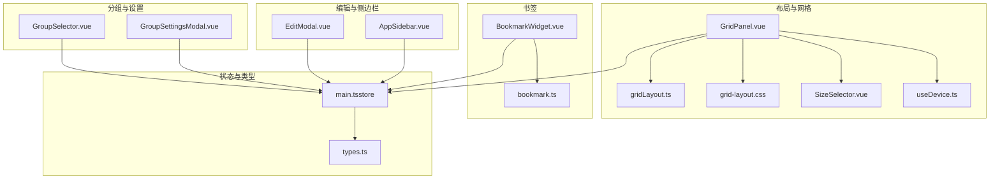
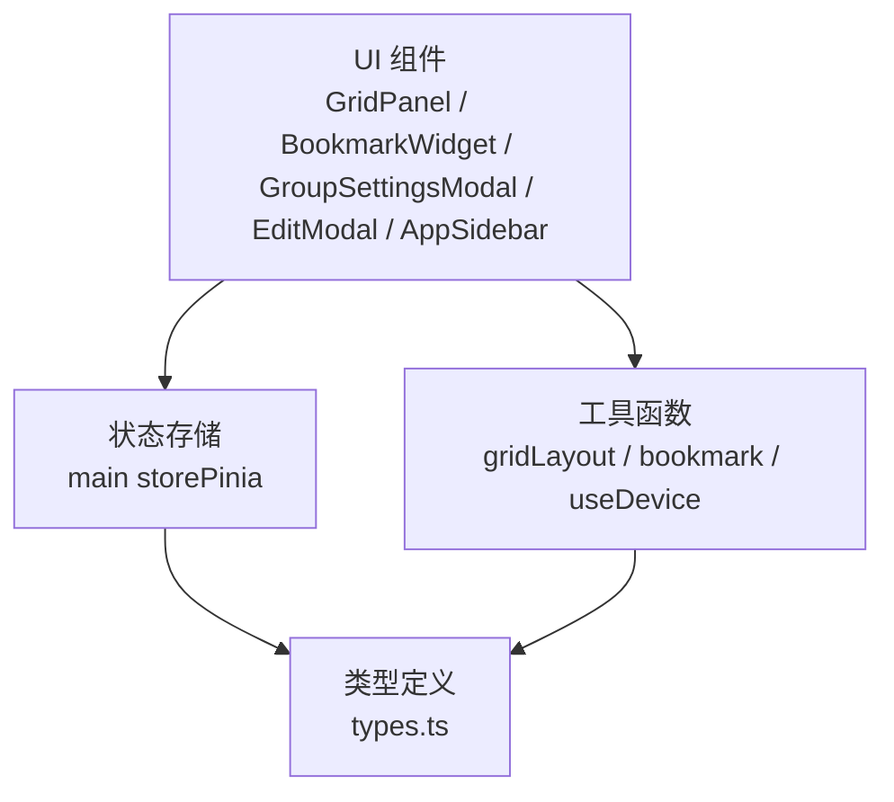
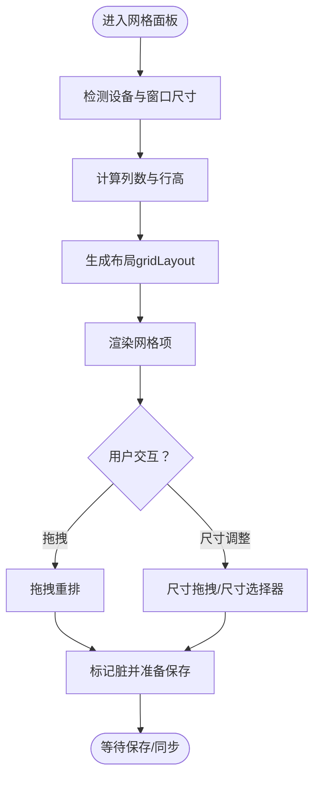
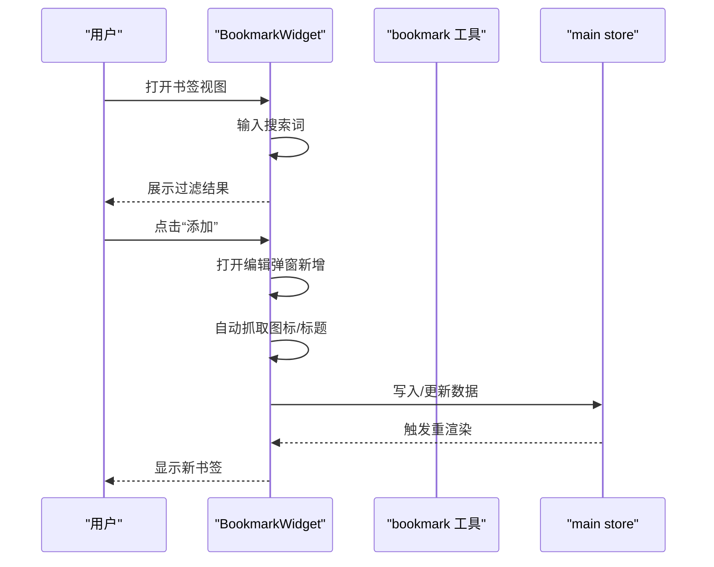
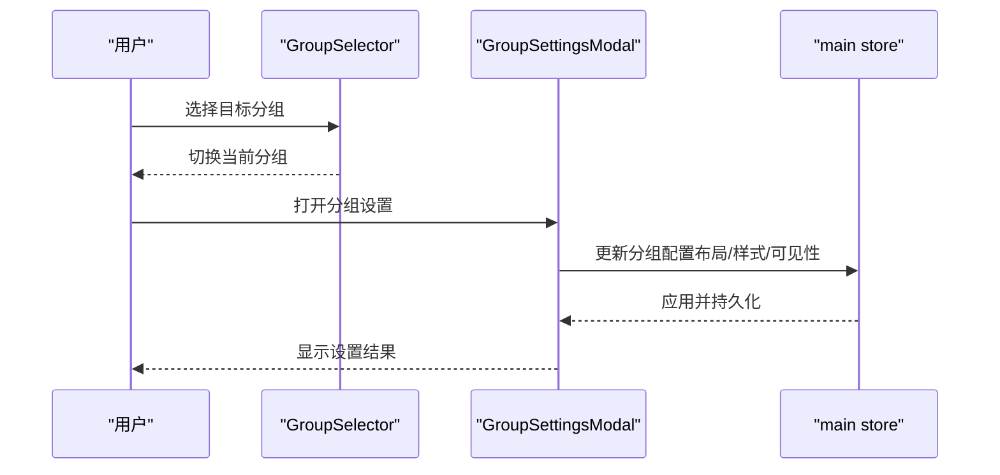
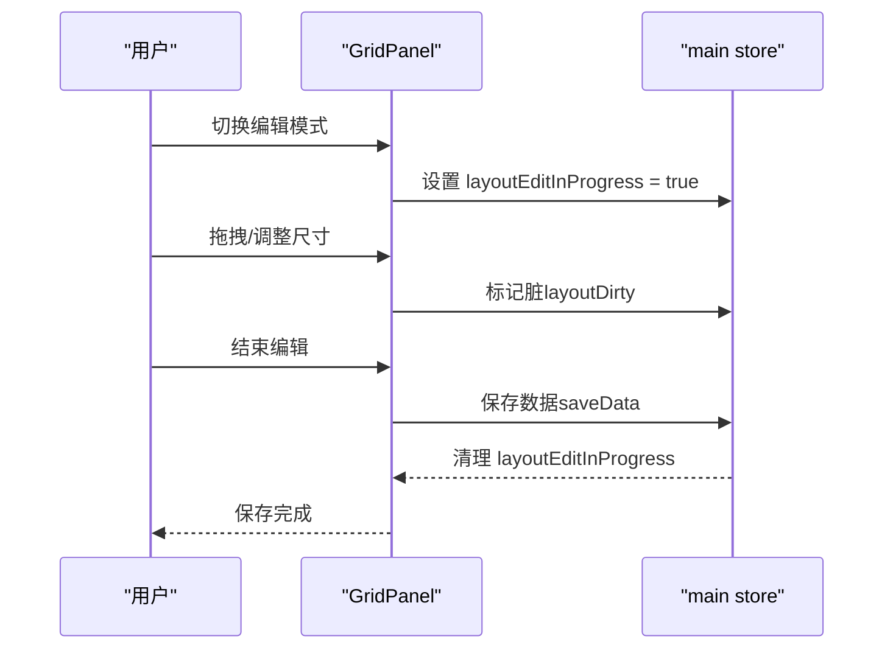
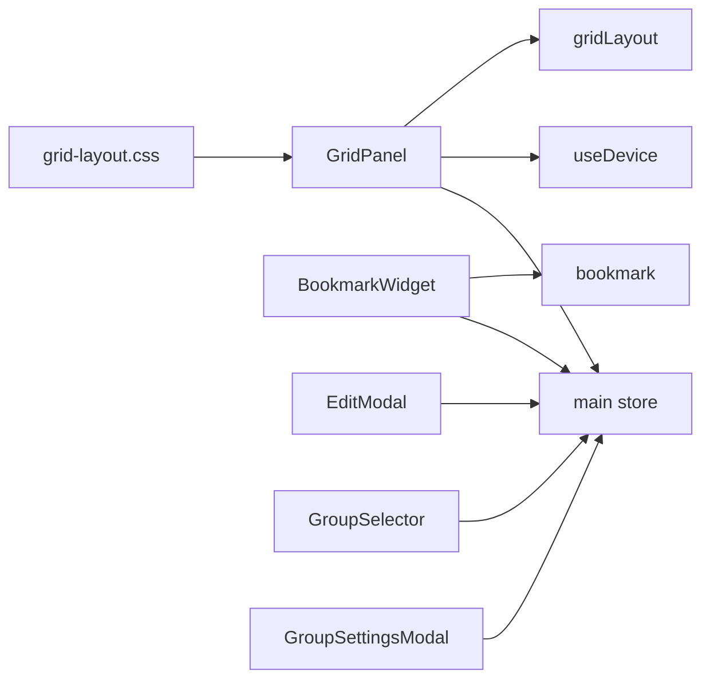

# 导航页管理

<cite>
**本文引用的文件**
- [GridPanel.vue](file://frontend/src/components/GridPanel.vue)
- [gridLayout.ts](file://frontend/src/utils/gridLayout.ts)
- [BookmarkWidget.vue](file://frontend/src/components/BookmarkWidget.vue)
- [bookmark.ts](file://frontend/src/utils/bookmark.ts)
- [GroupSelector.vue](file://frontend/src/components/GroupSelector.vue)
- [GroupSettingsModal.vue](file://frontend/src/components/GroupSettingsModal.vue)
- [EditModal.vue](file://frontend/src/components/EditModal.vue)
- [AppSidebar.vue](file://frontend/src/components/AppSidebar.vue)
- [SizeSelector.vue](file://frontend/src/components/SizeSelector.vue)
- [main.ts（store）](file://frontend/src/stores/main.ts)
- [types.ts](file://frontend/src/types.ts)
- [grid-layout.css](file://frontend/src/assets/grid-layout.css)
- [useDevice.ts](file://frontend/src/composables/useDevice.ts)
</cite>

## 目录
1. [简介](#简介)
2. [项目结构](#项目结构)
3. [核心组件](#核心组件)
4. [架构总览](#架构总览)
5. [详细组件分析](#详细组件分析)
6. [依赖关系分析](#依赖关系分析)
7. [性能考量](#性能考量)
8. [故障排查指南](#故障排查指南)
9. [结论](#结论)
10. [附录](#附录)

## 简介
本文件面向 OFlatNas 的“导航页管理”能力，围绕以下目标展开：
- 解释网格布局系统的工作原理：拖拽重排、响应式设计与设备适配、尺寸调整与可见性控制。
- 详解书签管理：添加、编辑、删除、导入导出、搜索与过滤。
- 说明分组管理：创建、切换、设置与批量公开/私有化。
- 描述布局编辑模式的启用/禁用流程与数据保存机制。
- 给出网格组件的配置项、尺寸调节与可见性控制方法，并提供使用示例与最佳实践。

## 项目结构
导航页管理涉及前端组件、工具函数、状态存储与类型定义，核心文件分布如下：
- 布局与网格：GridPanel、gridLayout、grid-layout.css、SizeSelector、useDevice
- 书签：BookmarkWidget、bookmark
- 分组与设置：GroupSelector、GroupSettingsModal
- 编辑与通用：EditModal、AppSidebar
- 状态与持久化：main store（Pinia）、types

图表来源
- [GridPanel.vue:1-120](file://frontend/src/components/GridPanel.vue#L1-L120)
- [gridLayout.ts:1-113](file://frontend/src/utils/gridLayout.ts#L1-L113)
- [grid-layout.css:1-109](file://frontend/src/assets/grid-layout.css#L1-L109)
- [SizeSelector.vue:1-99](file://frontend/src/components/SizeSelector.vue#L1-L99)
- [useDevice.ts:1-72](file://frontend/src/composables/useDevice.ts#L1-L72)
- [BookmarkWidget.vue:1-120](file://frontend/src/components/BookmarkWidget.vue#L1-L120)
- [bookmark.ts:1-109](file://frontend/src/utils/bookmark.ts#L1-L109)
- [GroupSelector.vue:1-124](file://frontend/src/components/GroupSelector.vue#L1-L124)
- [GroupSettingsModal.vue:1-120](file://frontend/src/components/GroupSettingsModal.vue#L1-L120)
- [EditModal.vue:1-120](file://frontend/src/components/EditModal.vue#L1-L120)
- [AppSidebar.vue:1-120](file://frontend/src/components/AppSidebar.vue#L1-L120)
- [main.ts（store）:1-120](file://frontend/src/stores/main.ts#L1-L120)
- [types.ts:1-120](file://frontend/src/types.ts#L1-L120)

章节来源
- [GridPanel.vue:1-120](file://frontend/src/components/GridPanel.vue#L1-L120)
- [gridLayout.ts:1-113](file://frontend/src/utils/gridLayout.ts#L1-L113)
- [grid-layout.css:1-109](file://frontend/src/assets/grid-layout.css#L1-L109)
- [SizeSelector.vue:1-99](file://frontend/src/components/SizeSelector.vue#L1-L99)
- [useDevice.ts:1-72](file://frontend/src/composables/useDevice.ts#L1-L72)
- [BookmarkWidget.vue:1-120](file://frontend/src/components/BookmarkWidget.vue#L1-L120)
- [bookmark.ts:1-109](file://frontend/src/utils/bookmark.ts#L1-L109)
- [GroupSelector.vue:1-124](file://frontend/src/components/GroupSelector.vue#L1-L124)
- [GroupSettingsModal.vue:1-120](file://frontend/src/components/GroupSettingsModal.vue#L1-L120)
- [EditModal.vue:1-120](file://frontend/src/components/EditModal.vue#L1-L120)
- [AppSidebar.vue:1-120](file://frontend/src/components/AppSidebar.vue#L1-L120)
- [main.ts（store）:1-120](file://frontend/src/stores/main.ts#L1-L120)
- [types.ts:1-120](file://frontend/src/types.ts#L1-L120)

## 核心组件
- 网格面板与布局生成：GridPanel 负责渲染网格、响应式列数、行高与缩放、拖拽与尺寸调整；gridLayout 提供布局算法。
- 书签组件：BookmarkWidget 提供书签的增删改查、导入、搜索与本地备份。
- 分组与设置：GroupSelector 用于分组切换；GroupSettingsModal 提供分组级别的布局、样式与可见性设置。
- 编辑弹窗：EditModal 提供导航项的编辑、图标智能适配与备份地址管理。
- 侧边栏：AppSidebar 提供书签/分组视图切换与导航。
- 状态与持久化：main store 管理数据版本、脏标记、缓存与服务端同步；types 定义数据模型。

章节来源
- [GridPanel.vue:1-800](file://frontend/src/components/GridPanel.vue#L1-L800)
- [gridLayout.ts:1-113](file://frontend/src/utils/gridLayout.ts#L1-L113)
- [BookmarkWidget.vue:1-574](file://frontend/src/components/BookmarkWidget.vue#L1-L574)
- [GroupSelector.vue:1-124](file://frontend/src/components/GroupSelector.vue#L1-L124)
- [GroupSettingsModal.vue:1-582](file://frontend/src/components/GroupSettingsModal.vue#L1-L582)
- [EditModal.vue:1-800](file://frontend/src/components/EditModal.vue#L1-L800)
- [AppSidebar.vue:1-200](file://frontend/src/components/AppSidebar.vue#L1-L200)
- [main.ts（store）:1-1200](file://frontend/src/stores/main.ts#L1-L1200)
- [types.ts:1-298](file://frontend/src/types.ts#L1-L298)

## 架构总览
导航页管理采用“组件-工具-状态-类型”的分层设计：
- 组件负责 UI 行为与交互（拖拽、弹窗、尺寸选择等）
- 工具函数负责布局算法与数据解析
- 状态存储负责数据版本、脏标记、缓存与服务端同步
- 类型定义统一数据结构与约束

图表来源
- [GridPanel.vue:1-120](file://frontend/src/components/GridPanel.vue#L1-L120)
- [gridLayout.ts:1-113](file://frontend/src/utils/gridLayout.ts#L1-L113)
- [bookmark.ts:1-109](file://frontend/src/utils/bookmark.ts#L1-L109)
- [useDevice.ts:1-72](file://frontend/src/composables/useDevice.ts#L1-L72)
- [main.ts（store）:1-120](file://frontend/src/stores/main.ts#L1-L120)
- [types.ts:1-120](file://frontend/src/types.ts#L1-L120)

## 详细组件分析

### 网格布局系统（拖拽、响应式、设备适配）
- 布局算法
  - 采用二维网格与半单位刻度（0.5）进行占位与紧凑排列，避免重叠并自动填充空隙。
  - 对已有位置的组件优先保留，否则按列数从左至右、从上至下扫描空位。
- 响应式与设备适配
  - 通过设备检测与窗口尺寸计算列数、行高与缩放比例，移动端/平板/桌面差异化处理。
  - 支持“扩展模式”在桌面端扩大列数上限。
- 拖拽与尺寸调整
  - 使用第三方网格库与拖拽组件实现拖拽重排与尺寸拖拽。
  - 尺寸选择器以 8×8 的网格呈现可选的列/行跨度，便于直观选择。
- 可见性控制
  - 通过“隐藏移动端”等开关控制组件在不同设备上的显示。

图表来源
- [GridPanel.vue:676-800](file://frontend/src/components/GridPanel.vue#L676-L800)
- [gridLayout.ts:11-113](file://frontend/src/utils/gridLayout.ts#L11-L113)
- [SizeSelector.vue:1-99](file://frontend/src/components/SizeSelector.vue#L1-L99)
- [useDevice.ts:1-72](file://frontend/src/composables/useDevice.ts#L1-L72)

章节来源
- [GridPanel.vue:676-800](file://frontend/src/components/GridPanel.vue#L676-L800)
- [gridLayout.ts:11-113](file://frontend/src/utils/gridLayout.ts#L11-L113)
- [SizeSelector.vue:1-99](file://frontend/src/components/SizeSelector.vue#L1-L99)
- [useDevice.ts:1-72](file://frontend/src/composables/useDevice.ts#L1-L72)

### 书签管理（添加、编辑、删除、导入）
- 添加与编辑
  - 弹出编辑表单，支持标题、URL、图标、描述与公共性等字段。
  - 支持自动抓取网站图标与标题，亦可手动上传或选择本地图标。
- 删除
  - 支持删除分类或单项，带二次确认。
- 导入与备份
  - 支持从浏览器导出的 HTML 导入书签，自动拆分文件夹与链接。
  - 本地备份与恢复，保障数据安全。
- 搜索与过滤
  - 支持对分类与链接标题/URL进行实时搜索过滤。

图表来源
- [BookmarkWidget.vue:1-574](file://frontend/src/components/BookmarkWidget.vue#L1-L574)
- [bookmark.ts:1-109](file://frontend/src/utils/bookmark.ts#L1-L109)
- [main.ts（store）:1-1200](file://frontend/src/stores/main.ts#L1-L1200)

章节来源
- [BookmarkWidget.vue:1-574](file://frontend/src/components/BookmarkWidget.vue#L1-L574)
- [bookmark.ts:1-109](file://frontend/src/utils/bookmark.ts#L1-L109)
- [main.ts（store）:1-1200](file://frontend/src/stores/main.ts#L1-L1200)

### 分组管理（创建、切换、设置）
- 创建与切换
  - 在侧边栏或编辑弹窗中创建分组；通过分组选择器在界面顶部切换当前分组。
- 设置项
  - 标题、标题颜色、公开性、自动隐藏标题、卡片布局（垂直/水平）、卡片间距、卡片大小、图标大小、卡片背景色/透明度、背景图与遮罩、图标形状等。
  - 支持批量公开/私有化分组内的所有项。
- 删除
  - 支持删除分组及其全部内容，带二次确认。

图表来源
- [GroupSelector.vue:1-124](file://frontend/src/components/GroupSelector.vue#L1-L124)
- [GroupSettingsModal.vue:1-582](file://frontend/src/components/GroupSettingsModal.vue#L1-L582)
- [main.ts（store）:1-1200](file://frontend/src/stores/main.ts#L1-L1200)

章节来源
- [GroupSelector.vue:1-124](file://frontend/src/components/GroupSelector.vue#L1-L124)
- [GroupSettingsModal.vue:1-582](file://frontend/src/components/GroupSettingsModal.vue#L1-L582)
- [main.ts（store）:1-1200](file://frontend/src/stores/main.ts#L1-L1200)

### 布局编辑模式与数据保存
- 启用/禁用
  - 切换编辑模式时，设置“布局编辑进行中”，禁用服务端布局覆盖；退出时保存并清理标志。
- 保存机制
  - 本地脏标记与服务端版本号联动，避免并发覆盖；支持缓存写入与服务端快照同步。
  - 保存前会对比布局签名，仅在变更时提交；同时持久化应用配置与小部件布局。

图表来源
- [GridPanel.vue:386-400](file://frontend/src/components/GridPanel.vue#L386-L400)
- [main.ts（store）:1592-1600](file://frontend/src/stores/main.ts#L1592-L1600)

章节来源
- [GridPanel.vue:386-400](file://frontend/src/components/GridPanel.vue#L386-L400)
- [main.ts（store）:1592-1600](file://frontend/src/stores/main.ts#L1592-L1600)

### 网格组件配置、尺寸调整与可见性控制
- 配置项
  - 卡片布局（垂直/水平）、卡片间距、卡片大小、图标大小、图标形状、标题颜色、卡片背景色/透明度、背景图与遮罩、标题自动隐藏、设备可见性（隐藏移动端）等。
- 尺寸调整
  - 通过尺寸选择器直观选择列/行跨度；拖拽调整尺寸；支持半单位精度。
- 可见性控制
  - 通过“隐藏移动端”等开关控制组件在不同设备上的显示；登录态与公开性影响展示范围。

章节来源
- [GroupSettingsModal.vue:225-582](file://frontend/src/components/GroupSettingsModal.vue#L225-L582)
- [SizeSelector.vue:1-99](file://frontend/src/components/SizeSelector.vue#L1-L99)
- [GridPanel.vue:676-800](file://frontend/src/components/GridPanel.vue#L676-L800)

## 依赖关系分析
- 组件耦合
  - GridPanel 依赖 gridLayout 与设备检测；与 main store 交互以读取/写入布局与配置。
  - BookmarkWidget 依赖 bookmark 工具与 main store；EditModal 与 GroupSettingsModal 依赖 main store。
- 外部依赖
  - 第三方网格与拖拽库、图标搜索与抓取 API、WebSocket 与后端接口。
- 循环依赖
  - 未发现循环依赖；组件间通过 store 单向通信。

图表来源
- [GridPanel.vue:1-120](file://frontend/src/components/GridPanel.vue#L1-L120)
- [gridLayout.ts:1-113](file://frontend/src/utils/gridLayout.ts#L1-L113)
- [useDevice.ts:1-72](file://frontend/src/composables/useDevice.ts#L1-L72)
- [BookmarkWidget.vue:1-120](file://frontend/src/components/BookmarkWidget.vue#L1-L120)
- [bookmark.ts:1-109](file://frontend/src/utils/bookmark.ts#L1-L109)
- [EditModal.vue:1-120](file://frontend/src/components/EditModal.vue#L1-L120)
- [GroupSelector.vue:1-124](file://frontend/src/components/GroupSelector.vue#L1-L124)
- [GroupSettingsModal.vue:1-120](file://frontend/src/components/GroupSettingsModal.vue#L1-L120)
- [grid-layout.css:1-109](file://frontend/src/assets/grid-layout.css#L1-L109)
- [main.ts（store）:1-120](file://frontend/src/stores/main.ts#L1-L120)

章节来源
- [GridPanel.vue:1-120](file://frontend/src/components/GridPanel.vue#L1-L120)
- [gridLayout.ts:1-113](file://frontend/src/utils/gridLayout.ts#L1-L113)
- [useDevice.ts:1-72](file://frontend/src/composables/useDevice.ts#L1-L72)
- [BookmarkWidget.vue:1-120](file://frontend/src/components/BookmarkWidget.vue#L1-L120)
- [bookmark.ts:1-109](file://frontend/src/utils/bookmark.ts#L1-L109)
- [EditModal.vue:1-120](file://frontend/src/components/EditModal.vue#L1-L120)
- [GroupSelector.vue:1-124](file://frontend/src/components/GroupSelector.vue#L1-L124)
- [GroupSettingsModal.vue:1-120](file://frontend/src/components/GroupSettingsModal.vue#L1-L120)
- [grid-layout.css:1-109](file://frontend/src/assets/grid-layout.css#L1-L109)
- [main.ts（store）:1-120](file://frontend/src/stores/main.ts#L1-L120)

## 性能考量
- 布局计算
  - gridLayout 使用矩阵标记与半单位刻度，避免重叠并提升紧凑度；复杂度与组件数量线性相关。
- 渲染优化
  - 使用缩放与固定行高减少重排；尺寸变化时仅局部更新。
- 网络与同步
  - 采用心跳与轮询结合，降低同步开销；保存前对比布局签名，避免冗余提交。
- 图标与资源
  - 图标加载失败时自动降级与回退；资源 URL 带时间戳参数，避免缓存问题。

## 故障排查指南
- 无法拖拽或尺寸调整
  - 检查是否处于编辑模式；确认未被“布局编辑进行中”保护；查看浏览器控制台是否存在第三方库加载错误。
- 书签导入失败
  - 确认导入文件为标准 HTML；检查浏览器控制台错误信息；尝试更换文件或使用默认收藏夹格式。
- 分组设置未生效
  - 确认已保存；检查是否被“公开/私有”状态覆盖；确认未被全局配置覆盖。
- 保存冲突或覆盖
  - 若出现云端更新提示，先确认本地修改是否需要保留；必要时手动合并。

章节来源
- [GridPanel.vue:386-400](file://frontend/src/components/GridPanel.vue#L386-L400)
- [main.ts（store）:1330-1377](file://frontend/src/stores/main.ts#L1330-L1377)
- [BookmarkWidget.vue:74-135](file://frontend/src/components/BookmarkWidget.vue#L74-L135)

## 结论
导航页管理通过“组件-工具-状态-类型”的清晰分层，实现了灵活的网格布局、完善的书签与分组管理、便捷的编辑与设置入口，以及稳健的数据保存与同步机制。借助响应式与设备适配、拖拽重排与尺寸选择、批量公开与分组设置等功能，用户可以高效地构建个性化的导航主页。

## 附录
- 使用示例与最佳实践
  - 布局：在桌面端开启编辑模式，使用尺寸选择器与拖拽调整网格；移动端保持简洁，必要时启用“隐藏移动端”。
  - 书签：定期导入浏览器书签；为常用站点设置默认收藏夹；利用搜索快速定位。
  - 分组：按用途划分分组，设置不同卡片样式与布局；批量公开/私有化以满足共享需求。
  - 设置：合理设置卡片间距与大小，避免拥挤；为重要分组设置醒目标题颜色与图标形状。