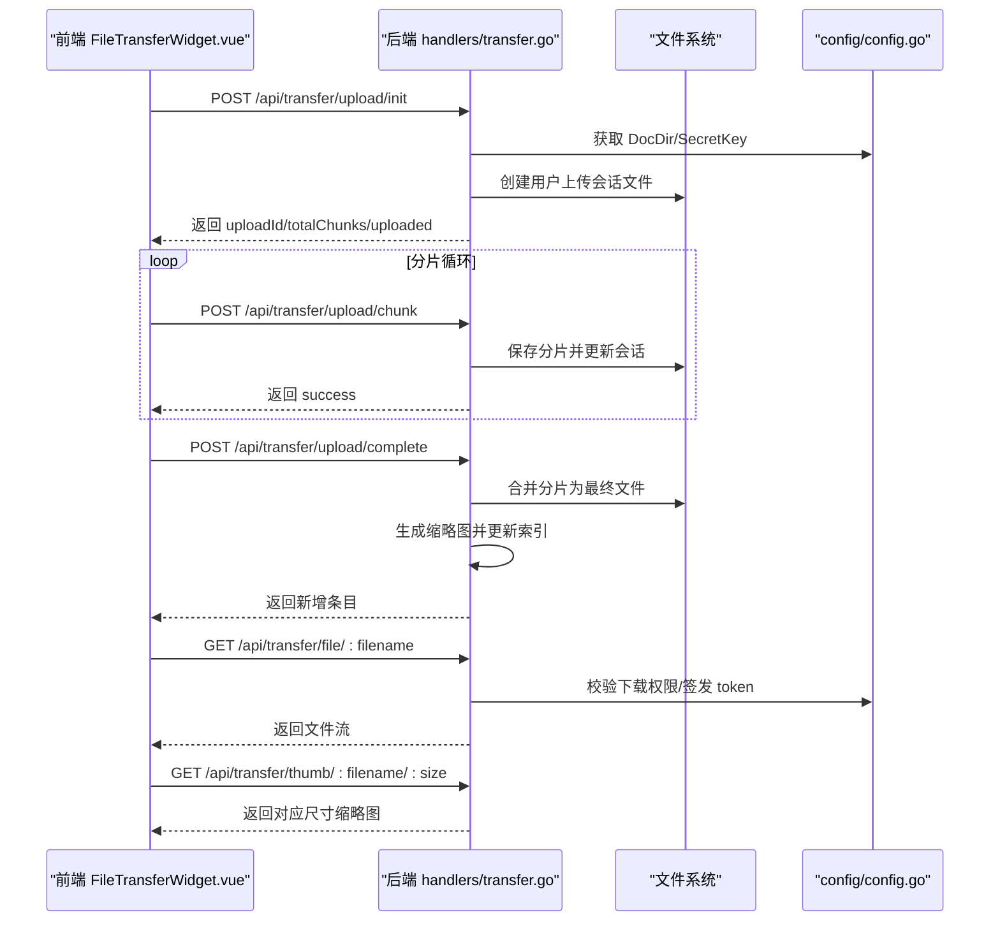
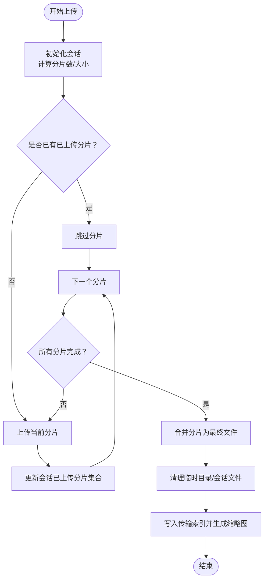
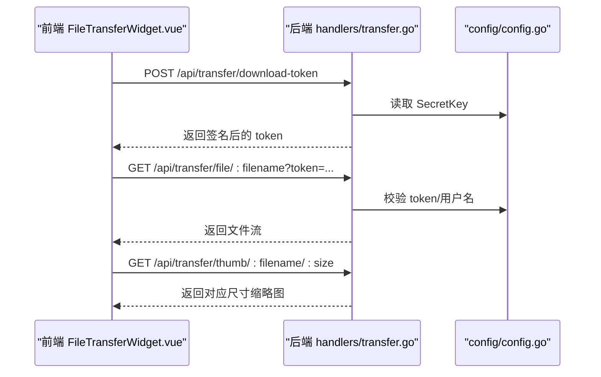
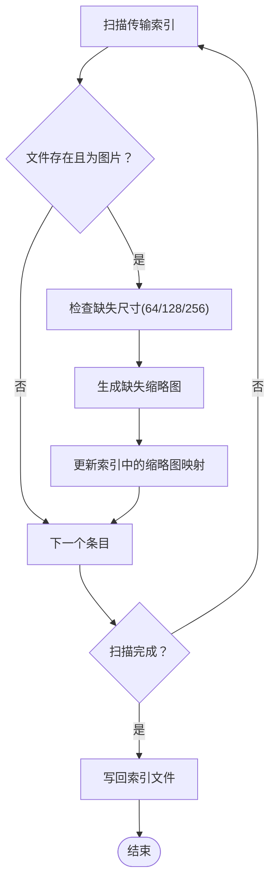
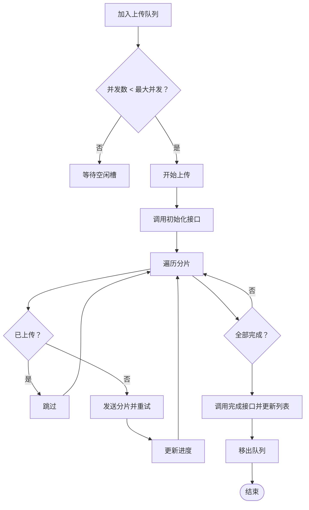
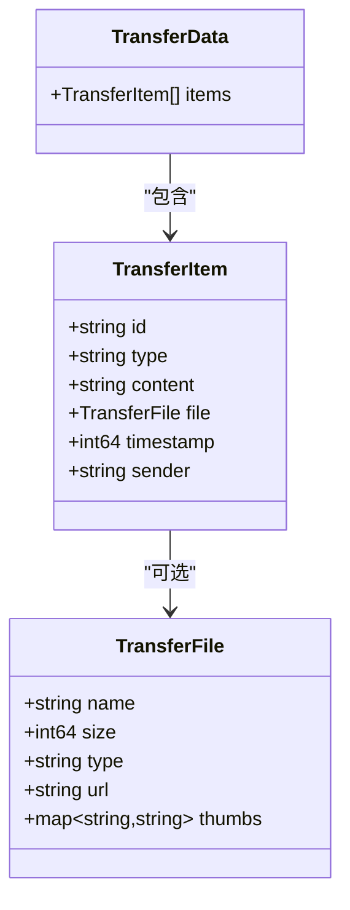
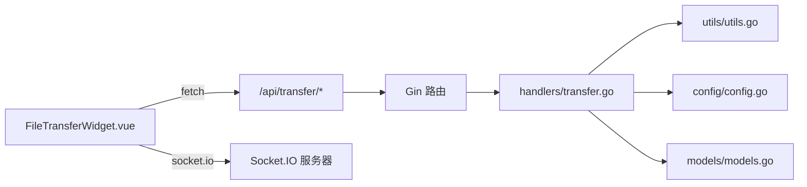

# 文件传输系统

<cite>
**本文档引用的文件**
- [backend/main.go](file://backend/main.go)
- [backend/handlers/transfer.go](file://backend/handlers/transfer.go)
- [backend/models/models.go](file://backend/models/models.go)
- [backend/utils/utils.go](file://backend/utils/utils.go)
- [backend/config/config.go](file://backend/config/config.go)
- [frontend/src/components/FileTransferWidget.vue](file://frontend/src/components/FileTransferWidget.vue)
- [frontend/src/stores/main.ts](file://frontend/src/stores/main.ts)
</cite>

## 目录
1. [简介](#简介)
2. [项目结构](#项目结构)
3. [核心组件](#核心组件)
4. [架构总览](#架构总览)
5. [详细组件分析](#详细组件分析)
6. [依赖关系分析](#依赖关系分析)
7. [性能考量](#性能考量)
8. [故障排除指南](#故障排除指南)
9. [结论](#结论)
10. [附录](#附录)

## 简介
本文件传输系统为 OFlatNas 提供了完整的文件上传、下载、预览与状态管理能力，支持：
- 断点续传：基于分片上传与会话记录，自动跳过已上传分片
- 多线程并发：前端上传队列并发控制，后端会话锁保障一致性
- 进度跟踪：实时更新上传进度，支持暂停/恢复
- 缩略图生成：图片上传后自动生成多尺寸缩略图，并支持按需生成
- 实时推送：通过 Socket.IO 实时推送传输事件，或回退轮询
- 权限与安全：基于 JWT 下载令牌与用户身份验证，防止未授权访问

## 项目结构
后端采用 Gin 框架，路由集中在 main.go 中注册；传输相关逻辑集中在 handlers/transfer.go；数据模型定义在 models.go；通用工具在 utils.go；配置在 config.go。前端使用 Vue 组件 FileTransferWidget.vue 负责 UI、上传队列与实时交互。

```mermaid
graph TB
subgraph "后端"
M["main.go<br/>路由与中间件"]
T["handlers/transfer.go<br/>传输处理"]
U["utils/utils.go<br/>文件锁与原子写"]
C["config/config.go<br/>路径与密钥"]
MD["models/models.go<br/>传输数据模型"]
end
subgraph "前端"
FW["FileTransferWidget.vue<br/>上传/预览/列表"]
MS["main.ts<br/>Socket/网络状态"]
end
FW --> |"HTTP"/api/transfer"| M
M --> T
T --> U
T --> C
T --> MD
MS --> |"Socket.IO"| M
```

图表来源
- [backend/main.go:165-254](file://backend/main.go#L165-L254)
- [backend/handlers/transfer.go:318-580](file://backend/handlers/transfer.go#L318-L580)
- [backend/utils/utils.go:16-75](file://backend/utils/utils.go#L16-L75)
- [backend/config/config.go:35-86](file://backend/config/config.go#L35-L86)
- [backend/models/models.go:98-117](file://backend/models/models.go#L98-L117)
- [frontend/src/components/FileTransferWidget.vue:343-382](file://frontend/src/components/FileTransferWidget.vue#L343-L382)
- [frontend/src/stores/main.ts:30-100](file://frontend/src/stores/main.ts#L30-L100)

章节来源
- [backend/main.go:165-254](file://backend/main.go#L165-L254)
- [backend/handlers/transfer.go:318-580](file://backend/handlers/transfer.go#L318-L580)
- [frontend/src/components/FileTransferWidget.vue:343-382](file://frontend/src/components/FileTransferWidget.vue#L343-L382)

## 核心组件
- 后端传输处理器：负责初始化上传、接收分片、完成合并、生成缩略图、提供下载与缩略图服务
- 传输数据模型：统一描述文本消息与文件条目，包含缩略图映射
- 通用工具：文件锁与原子写，保障并发场景下的索引一致性
- 配置模块：确定 DocDir、PublicDir 等目录，提供 SecretKey 用于签发下载令牌
- 前端传输组件：负责上传队列、并发控制、进度计算、预览与实时更新

章节来源
- [backend/handlers/transfer.go:318-580](file://backend/handlers/transfer.go#L318-L580)
- [backend/models/models.go:98-117](file://backend/models/models.go#L98-L117)
- [backend/utils/utils.go:16-75](file://backend/utils/utils.go#L16-L75)
- [backend/config/config.go:35-86](file://backend/config/config.go#L35-L86)
- [frontend/src/components/FileTransferWidget.vue:622-764](file://frontend/src/components/FileTransferWidget.vue#L622-L764)

## 架构总览
后端通过 Gin 注册 /api/transfer 下的全部接口；前端通过 fetch 调用接口，同时在登录且启用 Socket 模式时，通过 Socket.IO 实时接收传输更新事件。



图表来源
- [backend/handlers/transfer.go:331-580](file://backend/handlers/transfer.go#L331-L580)
- [backend/config/config.go:35-86](file://backend/config/config.go#L35-L86)
- [frontend/src/components/FileTransferWidget.vue:649-764](file://frontend/src/components/FileTransferWidget.vue#L649-L764)

## 详细组件分析

### 上传流程（断点续传）
- 初始化：前端计算分片数量与大小，调用初始化接口，后端创建会话文件并返回可用分片集合
- 分片上传：前端并发上传未完成分片，后端以文件锁保护会话文件，确保已上传分片不会重复写入
- 完成合并：完成后端按顺序读取各分片并写入最终文件，清理临时目录与会话文件
- 索引更新：将新条目写入传输索引，图片类型自动生成缩略图



图表来源
- [backend/handlers/transfer.go:331-580](file://backend/handlers/transfer.go#L331-L580)
- [frontend/src/components/FileTransferWidget.vue:649-764](file://frontend/src/components/FileTransferWidget.vue#L649-L764)

章节来源
- [backend/handlers/transfer.go:331-580](file://backend/handlers/transfer.go#L331-L580)
- [frontend/src/components/FileTransferWidget.vue:649-764](file://frontend/src/components/FileTransferWidget.vue#L649-L764)

### 下载与预览
- 下载令牌：后端签发带过期时间的 HS256 JWT，前端通过 token 参数访问受保护资源
- 缩略图：支持 64/128/256 三档尺寸，按需生成或从磁盘命中
- 图片预览：前端根据缩略图 URL 渲染占位图，点击后懒加载原图 Blob URL



图表来源
- [backend/handlers/transfer.go:582-720](file://backend/handlers/transfer.go#L582-L720)
- [backend/config/config.go:206-208](file://backend/config/config.go#L206-L208)
- [frontend/src/components/FileTransferWidget.vue:169-203](file://frontend/src/components/FileTransferWidget.vue#L169-L203)

章节来源
- [backend/handlers/transfer.go:582-720](file://backend/handlers/transfer.go#L582-L720)
- [frontend/src/components/FileTransferWidget.vue:169-203](file://frontend/src/components/FileTransferWidget.vue#L169-L203)

### 传输索引与缩略图同步
- 传输索引：记录所有传输条目，包含文件元信息与缩略图映射
- 缩略图生成：图片上传后自动生成多尺寸缩略图；支持按需生成与批量同步
- 同步策略：后台定时器周期性扫描索引，补齐缺失缩略图并写回索引



图表来源
- [backend/handlers/transfer.go:800-967](file://backend/handlers/transfer.go#L800-L967)
- [backend/handlers/transfer.go:140-192](file://backend/handlers/transfer.go#L140-L192)

章节来源
- [backend/handlers/transfer.go:800-967](file://backend/handlers/transfer.go#L800-L967)
- [backend/handlers/transfer.go:140-192](file://backend/handlers/transfer.go#L140-L192)

### 前端上传队列与并发控制
- 并发上限：默认最大并发 2，避免过多分片同时占用带宽
- 重试机制：单个分片最多重试 3 次，间隔随次数递增
- 进度计算：累计已发送字节，除以总大小得到进度百分比
- 会话恢复：根据后端返回的已上传分片集合，跳过分片



图表来源
- [frontend/src/components/FileTransferWidget.vue:622-764](file://frontend/src/components/FileTransferWidget.vue#L622-L764)

章节来源
- [frontend/src/components/FileTransferWidget.vue:622-764](file://frontend/src/components/FileTransferWidget.vue#L622-L764)

### 数据模型
传输条目支持文本与文件两类，文件条目包含名称、大小、类型与缩略图映射。



图表来源
- [backend/models/models.go:98-117](file://backend/models/models.go#L98-L117)

章节来源
- [backend/models/models.go:98-117](file://backend/models/models.go#L98-L117)

## 依赖关系分析
- 后端依赖
  - Gin 路由与中间件：CORS、Gzip、日志、恢复
  - Socket.IO：实时事件推送
  - JWT：下载令牌签发
  - 图像库：缩略图生成
- 前端依赖
  - Socket.IO 客户端：实时监听传输更新
  - ObjectURL：预览图片时的内存管理
  - AbortController：上传中断与暂停



图表来源
- [backend/main.go:165-254](file://backend/main.go#L165-L254)
- [backend/handlers/transfer.go:318-580](file://backend/handlers/transfer.go#L318-L580)
- [frontend/src/components/FileTransferWidget.vue:343-382](file://frontend/src/components/FileTransferWidget.vue#L343-L382)

章节来源
- [backend/main.go:165-254](file://backend/main.go#L165-L254)
- [backend/handlers/transfer.go:318-580](file://backend/handlers/transfer.go#L318-L580)
- [frontend/src/components/FileTransferWidget.vue:343-382](file://frontend/src/components/FileTransferWidget.vue#L343-L382)

## 性能考量
- 分片大小：前端默认 5MB，可根据网络状况调整
- 并发控制：默认最大并发 2，避免拥塞；可根据 CPU/磁盘 IO 调整
- 缓存与压缩：后端启用 Gzip 压缩，减少网络传输体积
- 缩略图生成：使用高质量插值缩放，生成多尺寸以适配不同场景
- 内存管理：前端使用 ObjectURL 管理预览资源，离开可视区域自动释放

## 故障排除指南
- 上传失败
  - 检查初始化响应是否包含 uploadId 与 totalChunks
  - 确认分片 index 有效且未越界
  - 查看后端日志中“保存分片”或“更新会话”的错误
- 断点续传异常
  - 确认后端会话文件存在且用户名匹配
  - 检查 uploaded 数组是否正确返回
- 下载无权限
  - 确认 token 有效且未过期
  - 检查用户名与文件归属是否一致
- 缩略图缺失
  - 尝试调用按需生成接口
  - 观察后台缩略图同步任务是否运行
- 实时更新不生效
  - 检查 Socket 连接状态与网络代理配置
  - 回退轮询：关闭 LAN 模式或禁用 Socket

章节来源
- [backend/handlers/transfer.go:331-580](file://backend/handlers/transfer.go#L331-L580)
- [backend/handlers/transfer.go:582-720](file://backend/handlers/transfer.go#L582-L720)
- [backend/handlers/transfer.go:874-967](file://backend/handlers/transfer.go#L874-L967)
- [frontend/src/components/FileTransferWidget.vue:322-341](file://frontend/src/components/FileTransferWidget.vue#L322-L341)

## 结论
该文件传输系统通过分片上传、断点续传与并发控制实现了稳定高效的文件传输体验；结合缩略图生成与实时推送，提供了良好的预览与交互能力。后端通过文件锁与原子写保障了高并发场景下的数据一致性，前端则通过队列与重试机制提升了鲁棒性。建议在生产环境中根据网络与存储条件进一步调优分片大小与并发数，并开启必要的缓存与压缩策略。

## 附录

### 后端 API 接口文档
- 获取传输条目
  - 方法：GET
  - 路径：/api/transfer/items
  - 查询参数：type（all/photo/file/text）、limit（默认 100）
  - 认证：可选
  - 响应：success + items[]
- 发送文本
  - 方法：POST
  - 路径：/api/transfer/text
  - 请求体：{ text }
  - 认证：必须
  - 响应：success + item
- 初始化上传
  - 方法：POST
  - 路径：/api/transfer/upload/init
  - 请求体：{ fileName, size, mime, fileKey, chunkSize }
  - 认证：必须
  - 响应：success + uploadId + chunkSize + totalChunks + uploaded[]
- 上传分片
  - 方法：POST
  - 路径：/api/transfer/upload/chunk
  - 表单：uploadId, index, chunk
  - 认证：必须
  - 响应：success
- 完成上传
  - 方法：POST
  - 路径：/api/transfer/upload/complete
  - 请求体：{ uploadId }
  - 认证：必须
  - 响应：success + item
- 下载令牌
  - 方法：POST
  - 路径：/api/transfer/download-token
  - 请求体：{ url }
  - 认证：必须
  - 响应：success + token
- 删除条目
  - 方法：DELETE
  - 路径：/api/transfer/items/:id
  - 认证：必须
  - 响应：success
- 生成缩略图（按需）
  - 方法：POST
  - 路径：/api/transfer/generate-thumb/:filename/:size
  - 认证：可选
  - 响应：success + thumbs
- 批量缩略图同步
  - 方法：POST
  - 路径：/api/transfer/regenerate-thumbs
  - 认证：必须
  - 响应：success + processed/generated/errors

章节来源
- [backend/main.go:237-246](file://backend/main.go#L237-L246)
- [backend/handlers/transfer.go:200-280](file://backend/handlers/transfer.go#L200-L280)
- [backend/handlers/transfer.go:282-316](file://backend/handlers/transfer.go#L282-L316)
- [backend/handlers/transfer.go:331-467](file://backend/handlers/transfer.go#L331-L467)
- [backend/handlers/transfer.go:469-580](file://backend/handlers/transfer.go#L469-L580)
- [backend/handlers/transfer.go:582-622](file://backend/handlers/transfer.go#L582-L622)
- [backend/handlers/transfer.go:624-671](file://backend/handlers/transfer.go#L624-L671)
- [backend/handlers/transfer.go:724-794](file://backend/handlers/transfer.go#L724-L794)
- [backend/handlers/transfer.go:796-872](file://backend/handlers/transfer.go#L796-L872)