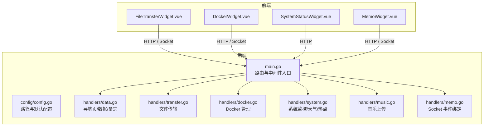
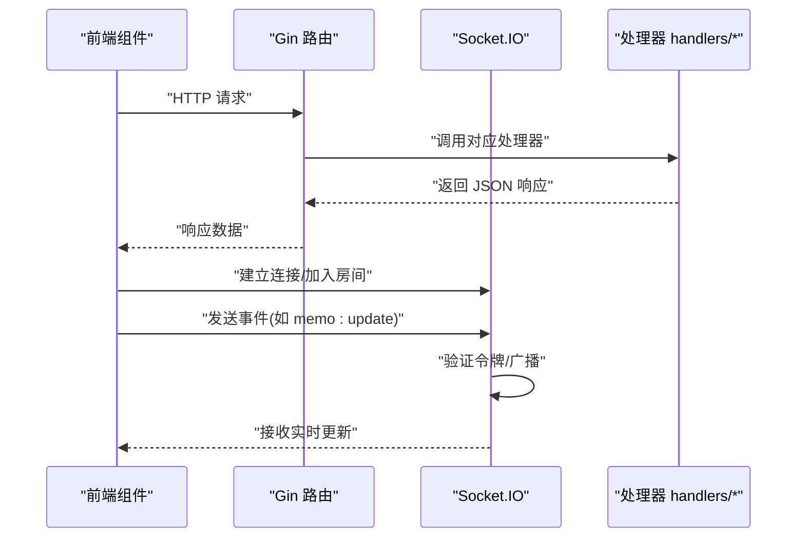
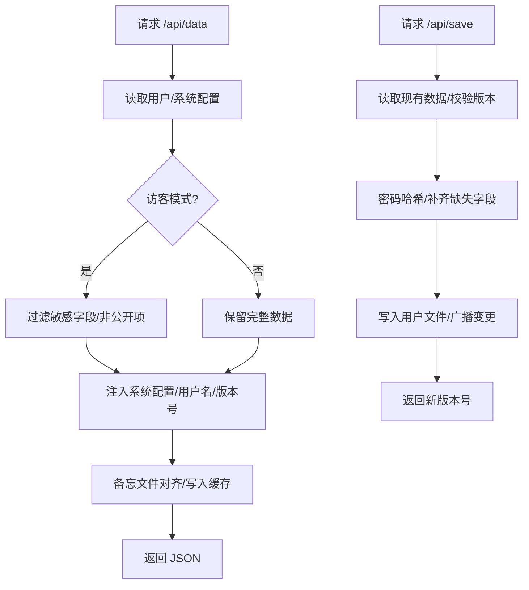
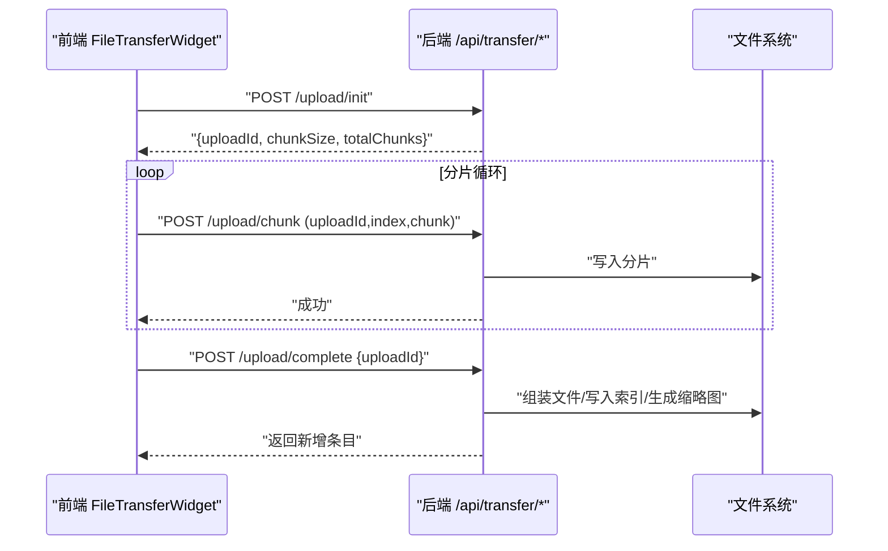
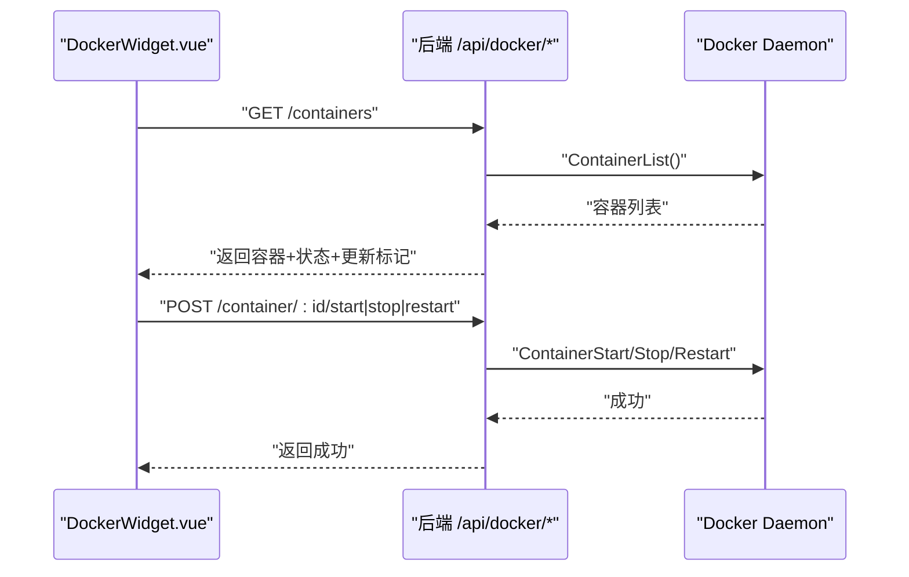
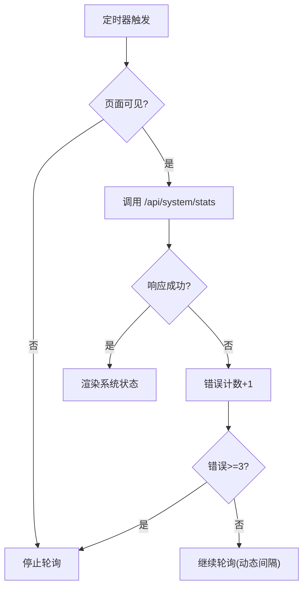
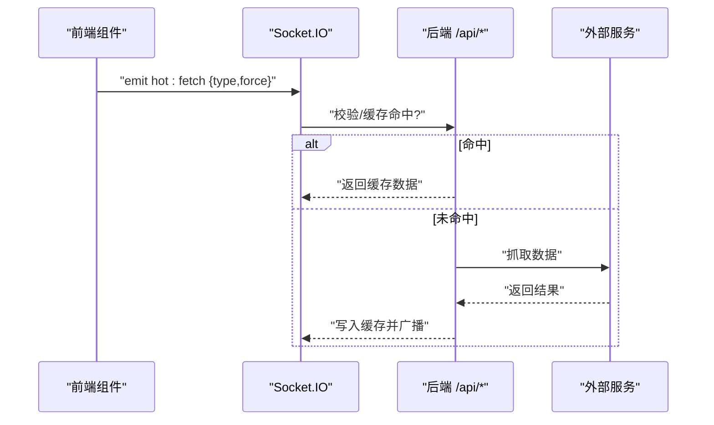
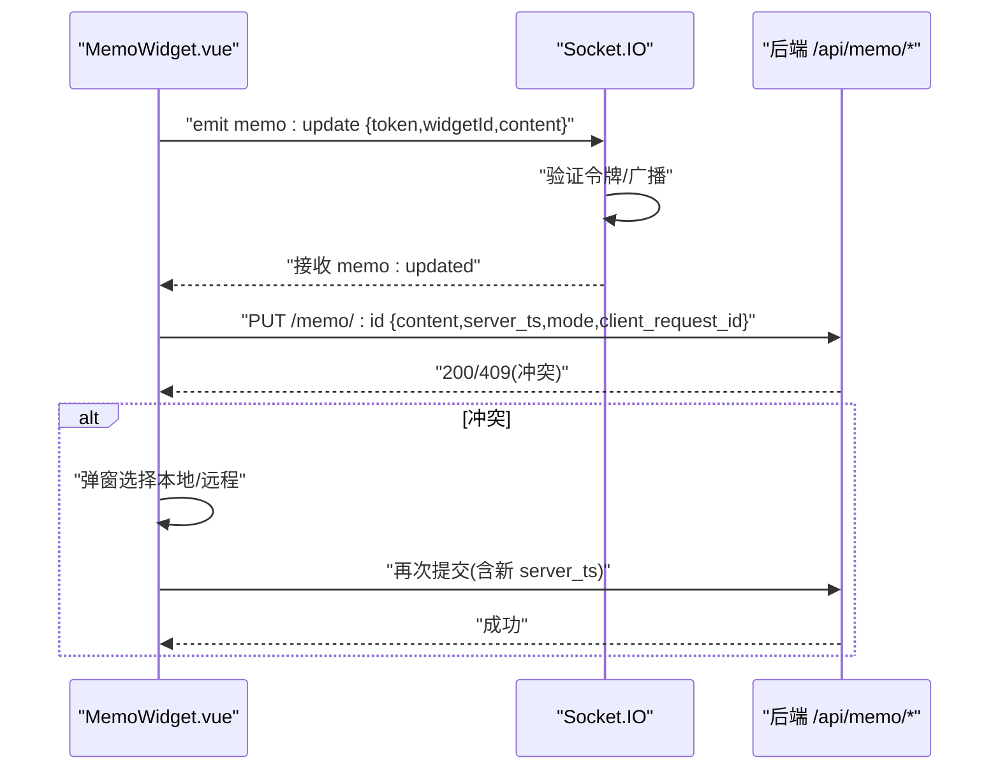
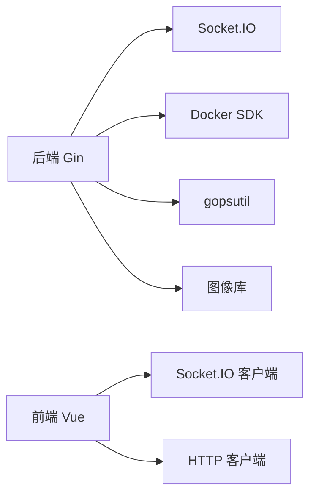

# 核心功能

<cite>
**本文档引用的文件**
- [backend/main.go](file://backend/main.go)
- [backend/config/config.go](file://backend/config/config.go)
- [backend/handlers/data.go](file://backend/handlers/data.go)
- [backend/handlers/transfer.go](file://backend/handlers/transfer.go)
- [backend/handlers/docker.go](file://backend/handlers/docker.go)
- [backend/handlers/system.go](file://backend/handlers/system.go)
- [backend/handlers/music.go](file://backend/handlers/music.go)
- [backend/handlers/memo.go](file://backend/handlers/memo.go)
- [backend/handlers/rss.go](file://backend/handlers/rss.go)
- [backend/handlers/weather.go](file://backend/handlers/weather.go)
- [backend/handlers/hot.go](file://backend/handlers/hot.go)
- [frontend/src/components/FileTransferWidget.vue](file://frontend/src/components/FileTransferWidget.vue)
- [frontend/src/components/DockerWidget.vue](file://frontend/src/components/DockerWidget.vue)
- [frontend/src/components/SystemStatusWidget.vue](file://frontend/src/components/SystemStatusWidget.vue)
- [frontend/src/components/MemoWidget.vue](file://frontend/src/components/MemoWidget.vue)
</cite>

## 目录
1. [简介](#简介)
2. [项目结构](#项目结构)
3. [核心组件](#核心组件)
4. [架构总览](#架构总览)
5. [详细组件分析](#详细组件分析)
6. [依赖关系分析](#依赖关系分析)
7. [性能考虑](#性能考虑)
8. [故障排查指南](#故障排查指南)
9. [结论](#结论)
10. [附录](#附录)

## 简介
本文件面向 OFlatNas 的核心功能模块，系统化梳理导航页管理、文件传输系统、媒体管理、Docker 管理、系统监控、内容服务等六大主题。文档既提供设计理念与实现原理，也给出跨模块协作关系、数据流转过程、使用案例与最佳实践，帮助不同用户群体（普通用户、高级用户、开发者）高效上手并深度定制。

## 项目结构
后端采用 Go Gin 框架，提供 REST API 与 Socket.IO 实时通信；前端基于 Vue3 + TypeScript，通过组件化实现各功能模块。配置与数据目录由后端统一初始化，静态资源与公共文件托管于 /public。

图表来源
- [backend/main.go:25-267](file://backend/main.go#L25-L267)
- [backend/config/config.go:35-86](file://backend/config/config.go#L35-L86)
- [frontend/src/components/FileTransferWidget.vue:1-120](file://frontend/src/components/FileTransferWidget.vue#L1-L120)
- [frontend/src/components/DockerWidget.vue:1-120](file://frontend/src/components/DockerWidget.vue#L1-L120)
- [frontend/src/components/SystemStatusWidget.vue:1-120](file://frontend/src/components/SystemStatusWidget.vue#L1-L120)
- [frontend/src/components/MemoWidget.vue:1-120](file://frontend/src/components/MemoWidget.vue#L1-L120)

章节来源
- [backend/main.go:25-267](file://backend/main.go#L25-L267)
- [backend/config/config.go:35-86](file://backend/config/config.go#L35-L86)

## 核心组件
- 导航页管理与数据持久化：后端统一读取用户配置与系统配置，支持访客模式过滤与缓存；前端组件负责渲染与交互。
- 文件传输系统：分片上传、断点续传、缩略图生成与预览、下载令牌鉴权。
- 媒体管理：音乐文件上传与列表展示，背景图管理与轮播。
- Docker 管理：容器列表、状态采集、动作控制、更新检查、端口探测与可视化。
- 系统监控：CPU/内存/磁盘/网络/温度/运行时长等指标采集与展示。
- 内容服务：热点榜单、天气预报、RSS 聚合、Socket 事件广播。

章节来源
- [backend/handlers/data.go:159-343](file://backend/handlers/data.go#L159-L343)
- [backend/handlers/transfer.go:200-280](file://backend/handlers/transfer.go#L200-L280)
- [backend/handlers/docker.go:354-421](file://backend/handlers/docker.go#L354-L421)
- [backend/handlers/system.go:51-203](file://backend/handlers/system.go#L51-L203)
- [backend/handlers/weather.go:114-146](file://backend/handlers/weather.go#L114-L146)
- [backend/handlers/rss.go:82-135](file://backend/handlers/rss.go#L82-L135)
- [backend/handlers/hot.go:31-79](file://backend/handlers/hot.go#L31-L79)

## 架构总览
后端通过 Gin 提供 REST API，同时承载 Socket.IO 服务，实现低延迟实时通信。静态资源与公共页面由 Gin 静态托管。前端组件通过 HTTP 与 Socket 两种通道与后端交互，形成“离线可读、在线可写”的双通道设计。

图表来源
- [backend/main.go:79-115](file://backend/main.go#L79-L115)
- [backend/handlers/memo.go:25-39](file://backend/handlers/memo.go#L25-L39)

章节来源
- [backend/main.go:79-115](file://backend/main.go#L79-L115)

## 详细组件分析

### 导航页管理与数据持久化
- 设计理念
  - 用户配置与系统配置分离，支持单用户与多用户模式切换。
  - 访客模式下对敏感字段与非公开项进行过滤，保护隐私。
  - 前端首次加载与后续增量更新采用缓存与版本号机制，降低带宽与服务器压力。
- 关键流程
  - GetData：读取用户与系统配置，合并注入，访客模式过滤，备忘文件对齐，写入缓存。
  - SaveData：全量覆盖写入，版本号校验，密码哈希，兼容历史字段。
  - GetMemo/SaveMemo：备忘文件与内存态双向同步，幂等保存与冲突检测。
- 数据模型要点
  - 用户数据结构包含 groups/widgets/appConfig/rssFeeds 等顶层键。
  - 备忘数据包含 content/server_ts/mode/simple/rich 等字段。

图表来源
- [backend/handlers/data.go:159-343](file://backend/handlers/data.go#L159-L343)
- [backend/handlers/data.go:638-744](file://backend/handlers/data.go#L638-L744)
- [backend/handlers/data.go:505-636](file://backend/handlers/data.go#L505-L636)

章节来源
- [backend/handlers/data.go:159-343](file://backend/handlers/data.go#L159-L343)
- [backend/handlers/data.go:638-744](file://backend/handlers/data.go#L638-L744)
- [backend/handlers/data.go:505-636](file://backend/handlers/data.go#L505-L636)

### 文件传输系统
- 设计理念
  - 分片上传与断点续传，提升大文件稳定性；缩略图按需生成与缓存，兼顾性能与体验。
  - 下载令牌鉴权，避免直接暴露存储路径；支持 Socket 与轮询两种拉取方式。
- 关键流程
  - 初始化：UploadInit 返回 uploadId、分片大小与总数。
  - 上传：UploadChunk 写入分片并更新会话；UploadComplete 汇总并写入索引，生成缩略图。
  - 拉取：GetTransferItems 支持类型筛选与数量限制；ServeFile/ServeThumb 提供直链与缩略图。
  - 删除：DeleteItem 校验权限并清理文件与缩略图。
- 前端交互
  - 支持拖拽、粘贴、队列并发与进度反馈；预览图片与链接化文本；批量操作与上下文菜单。

图表来源
- [backend/handlers/transfer.go:331-381](file://backend/handlers/transfer.go#L331-L381)
- [backend/handlers/transfer.go:383-467](file://backend/handlers/transfer.go#L383-L467)
- [backend/handlers/transfer.go:469-580](file://backend/handlers/transfer.go#L469-L580)
- [frontend/src/components/FileTransferWidget.vue:622-764](file://frontend/src/components/FileTransferWidget.vue#L622-L764)

章节来源
- [backend/handlers/transfer.go:200-280](file://backend/handlers/transfer.go#L200-L280)
- [backend/handlers/transfer.go:331-381](file://backend/handlers/transfer.go#L331-L381)
- [backend/handlers/transfer.go:383-467](file://backend/handlers/transfer.go#L383-L467)
- [backend/handlers/transfer.go:469-580](file://backend/handlers/transfer.go#L469-L580)
- [frontend/src/components/FileTransferWidget.vue:622-764](file://frontend/src/components/FileTransferWidget.vue#L622-L764)

### 媒体管理（音乐）
- 设计理念
  - 音乐文件上传校验格式，统一存放于音乐目录；后端提供列表接口供前端播放器使用。
- 关键流程
  - UploadMusic：校验扩展名并保存至音乐目录。
  - GetMusicList：遍历目录生成相对路径列表。

章节来源
- [backend/handlers/music.go:13-56](file://backend/handlers/music.go#L13-L56)
- [backend/handlers/system.go:594-619](file://backend/handlers/system.go#L594-L619)

### Docker 管理
- 设计理念
  - 通过 Docker API 列表容器、采集运行时指标、执行启停重启等动作；支持自动升级检查与失败统计。
- 关键流程
  - ListContainers：拉取容器列表并注入状态与更新标记。
  - ContainerAction：执行 start/stop/restart。
  - TriggerUpdateCheck：拉取镜像并比对镜像 ID，统计可更新容器。
  - GetDockerInfo/GetDockerDebug：诊断信息导出。
- 前端交互
  - 轮询刷新、错误降频、端口探测与可视化链接生成。

图表来源
- [backend/handlers/docker.go:354-421](file://backend/handlers/docker.go#L354-L421)
- [backend/handlers/docker.go:438-483](file://backend/handlers/docker.go#L438-L483)
- [backend/handlers/docker.go:664-758](file://backend/handlers/docker.go#L664-L758)
- [frontend/src/components/DockerWidget.vue:279-386](file://frontend/src/components/DockerWidget.vue#L279-L386)

章节来源
- [backend/handlers/docker.go:354-421](file://backend/handlers/docker.go#L354-L421)
- [backend/handlers/docker.go:438-483](file://backend/handlers/docker.go#L438-L483)
- [backend/handlers/docker.go:664-758](file://backend/handlers/docker.go#L664-L758)
- [frontend/src/components/DockerWidget.vue:279-386](file://frontend/src/components/DockerWidget.vue#L279-L386)

### 系统监控
- 设计理念
  - 采集 CPU/内存/磁盘/网络/温度/运行时长等指标，按页面可见性与错误次数动态调整轮询频率。
- 关键流程
  - GetSystemStats：调用 gopsutil 采集指标，计算速率与百分比。
  - 前端 SystemStatusWidget：按布局自适应展示，错误达到阈值后停止轮询。

图表来源
- [backend/handlers/system.go:51-203](file://backend/handlers/system.go#L51-L203)
- [frontend/src/components/SystemStatusWidget.vue:47-154](file://frontend/src/components/SystemStatusWidget.vue#L47-L154)

章节来源
- [backend/handlers/system.go:51-203](file://backend/handlers/system.go#L51-L203)
- [frontend/src/components/SystemStatusWidget.vue:47-154](file://frontend/src/components/SystemStatusWidget.vue#L47-L154)

### 内容服务（热点/天气/RSS）
- 设计理念
  - 通过 Socket 事件与 HTTP 接口提供热点、天气与 RSS 聚合；内置缓存与异步刷新，降低外部依赖压力。
- 关键流程
  - 热点：按源与 TTL 缓存，支持强制刷新与异步刷新。
  - 天气：支持 OpenMeteo 与高德天气，内置缓存与 TTL 控制。
  - RSS：统一结构输出，支持多源与代理访问。

图表来源
- [backend/handlers/hot.go:31-79](file://backend/handlers/hot.go#L31-L79)
- [backend/handlers/weather.go:114-146](file://backend/handlers/weather.go#L114-L146)
- [backend/handlers/rss.go:82-135](file://backend/handlers/rss.go#L82-L135)

章节来源
- [backend/handlers/hot.go:31-79](file://backend/handlers/hot.go#L31-L79)
- [backend/handlers/weather.go:114-146](file://backend/handlers/weather.go#L114-L146)
- [backend/handlers/rss.go:82-135](file://backend/handlers/rss.go#L82-L135)

### 备忘录协同（Memo）
- 设计理念
  - 支持简单/富文本两种模式；前后端双向同步，冲突检测与解决；Socket 广播与 HTTP 轮询双通道兜底。
- 关键流程
  - Socket：memo:update 事件广播，后端验证令牌并广播。
  - HTTP：/api/memo/:id 获取/保存，支持幂等键与冲突提示。
  - 前端：编辑态输入节流、广播去抖、冲突弹窗、版本快照与回滚。

图表来源
- [backend/handlers/memo.go:25-39](file://backend/handlers/memo.go#L25-L39)
- [backend/handlers/data.go:505-636](file://backend/handlers/data.go#L505-L636)
- [frontend/src/components/MemoWidget.vue:308-462](file://frontend/src/components/MemoWidget.vue#L308-L462)

章节来源
- [backend/handlers/memo.go:25-39](file://backend/handlers/memo.go#L25-L39)
- [backend/handlers/data.go:505-636](file://backend/handlers/data.go#L505-L636)
- [frontend/src/components/MemoWidget.vue:308-462](file://frontend/src/components/MemoWidget.vue#L308-L462)

## 依赖关系分析
- 后端依赖
  - Gin：路由与中间件
  - Socket.IO：实时事件
  - Docker SDK：容器管理
  - gopsutil：系统指标
  - 图像库：缩略图生成
- 前端依赖
  - Vue3 + TypeScript：组件化与类型安全
  - Socket.IO 客户端：实时通信
  - 对象 URL：图片预览与缓存

图表来源
- [backend/main.go:3-23](file://backend/main.go#L3-L23)
- [backend/handlers/docker.go:22-26](file://backend/handlers/docker.go#L22-L26)
- [backend/handlers/system.go:23-28](file://backend/handlers/system.go#L23-L28)
- [frontend/src/components/FileTransferWidget.vue:1-10](file://frontend/src/components/FileTransferWidget.vue#L1-L10)

章节来源
- [backend/main.go:3-23](file://backend/main.go#L3-L23)
- [backend/handlers/docker.go:22-26](file://backend/handlers/docker.go#L22-L26)
- [backend/handlers/system.go:23-28](file://backend/handlers/system.go#L23-L28)
- [frontend/src/components/FileTransferWidget.vue:1-10](file://frontend/src/components/FileTransferWidget.vue#L1-L10)

## 性能考虑
- 缓存与压缩
  - GetData 使用内存缓存与版本对比，减少 IO 与序列化开销。
  - 后端启用 Gzip 压缩与静态资源缓存策略。
- 并发与限流
  - 传输系统并发上传上限与分片大小可调；Docker 轮询动态降频与错误容忍。
- I/O 优化
  - 缩略图按需生成与缓存；系统指标计算仅在必要时进行。
- 网络鲁棒性
  - Socket 与 HTTP 双通道互补；外网隧道场景下 HTTP 轮询兜底。

## 故障排查指南
- Docker 未启用/连接失败
  - 检查系统配置 enableDocker 与 DOCKER_HOST；查看 GetDockerDebug 输出。
  - 前端显示“Docker 不可用”时，按“重试连接”或等待宽容期结束。
- 传输失败
  - 查看分片上传日志与会话文件；确认权限与磁盘空间；使用下载令牌访问文件。
- 备忘录冲突
  - 选择“保留本地/使用远程”；确认 server_ts 是否更新；必要时重试保存。
- 系统监控无数据
  - 页面隐藏时会暂停轮询；检查错误计数与网络状态；确认 gopsutil 可用。

章节来源
- [backend/handlers/docker.go:572-575](file://backend/handlers/docker.go#L572-L575)
- [backend/handlers/docker.go:664-758](file://backend/handlers/docker.go#L664-L758)
- [backend/handlers/transfer.go:624-671](file://backend/handlers/transfer.go#L624-L671)
- [backend/handlers/data.go:505-636](file://backend/handlers/data.go#L505-L636)
- [frontend/src/components/SystemStatusWidget.vue:112-143](file://frontend/src/components/SystemStatusWidget.vue#L112-L143)

## 结论
OFlatNas 通过清晰的模块划分与双通道（HTTP/Socket）设计，在保证易用性的同时兼顾了性能与可靠性。导航页管理、文件传输、媒体管理、Docker 管理、系统监控与内容服务六大模块相互协作，形成完整的个人 NAS 生态。建议在生产环境中结合缓存策略、错误降频与令牌鉴权，持续优化用户体验与系统稳定性。

## 附录
- 配置与目录
  - BASE_DIR 自动识别仓库根目录；DataDir/UsersDir/DocDir/MusicDir 等路径统一初始化。
- 最佳实践
  - 传输：合理设置分片大小与并发度；缩略图按需生成；下载令牌有效期控制。
  - Docker：容器命名规范；端口映射与网络模式；定期检查更新。
  - 备忘录：开启冲突提示；利用版本快照；在弱网环境使用 HTTP 轮询。
  - 系统监控：根据页面可见性动态调整轮询；错误计数阈值控制。

章节来源
- [backend/config/config.go:35-86](file://backend/config/config.go#L35-L86)
- [backend/config/config.go:102-151](file://backend/config/config.go#L102-L151)
- [backend/config/config.go:182-204](file://backend/config/config.go#L182-L204)
- [backend/config/config.go:210-256](file://backend/config/config.go#L210-L256)