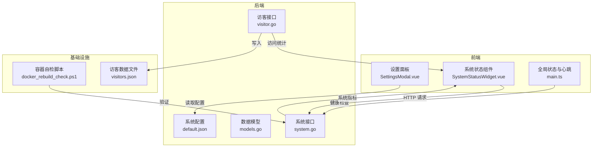
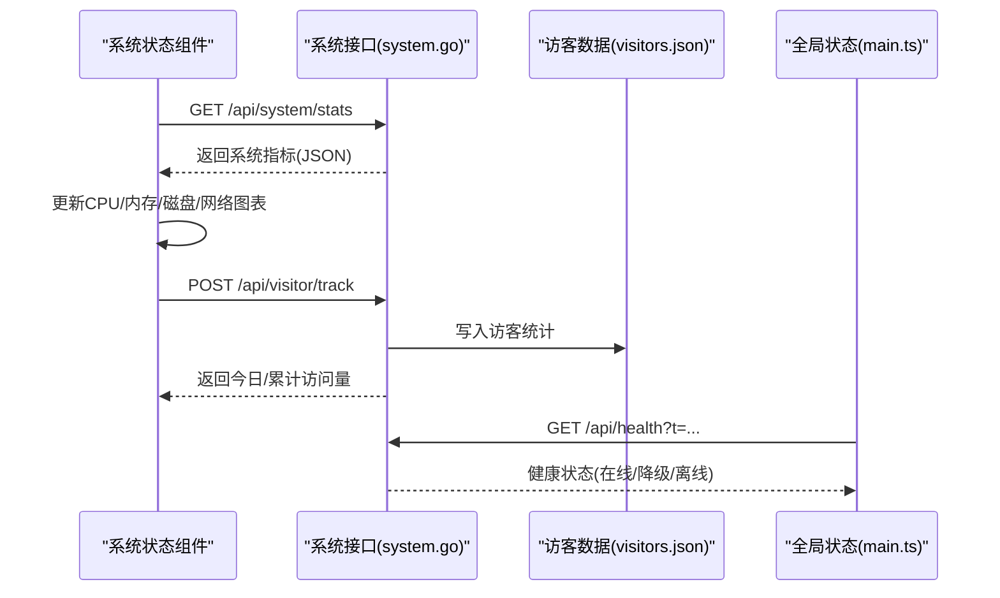
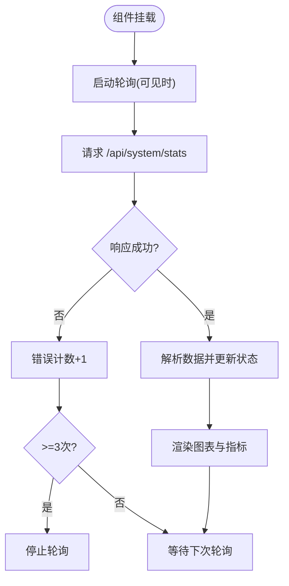
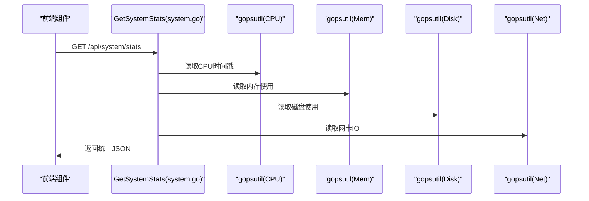
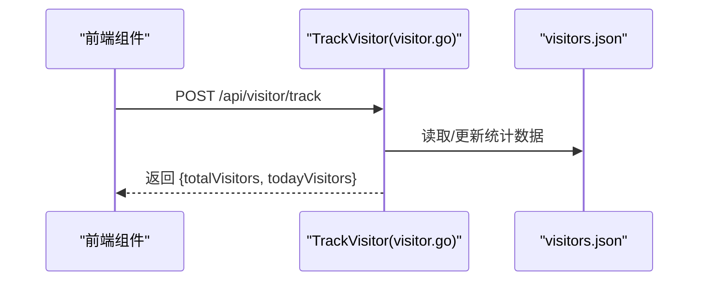
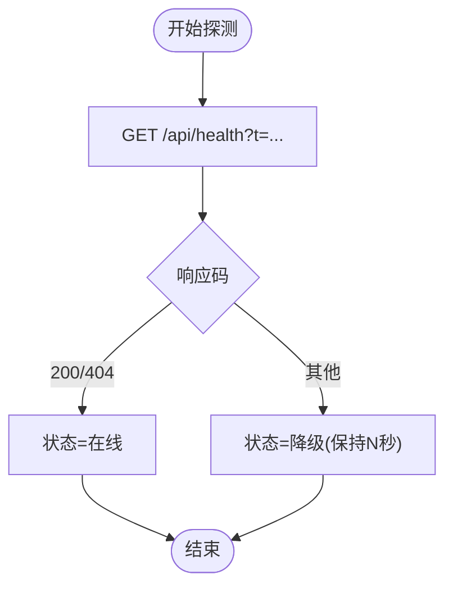
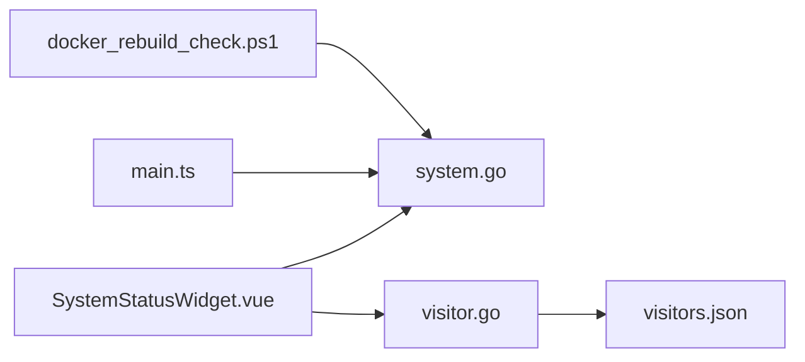

# 系统监控

<cite>
**本文引用的文件**
- [SystemStatusWidget.vue](file://frontend/src/components/SystemStatusWidget.vue)
- [system.go](file://backend/handlers/system.go)
- [visitor.go](file://backend/handlers/visitor.go)
- [models.go](file://backend/models/models.go)
- [main.ts](file://frontend/src/stores/main.ts)
- [SettingsModal.vue](file://frontend/src/components/SettingsModal.vue)
- [default.json](file://backend/config/default.json)
- [docker_rebuild_check.ps1](file://docker_rebuild_check.ps1)
- [visitors.json](file://server/data/visitors.json)
</cite>

## 目录
1. [简介](#简介)
2. [项目结构](#项目结构)
3. [核心组件](#核心组件)
4. [架构总览](#架构总览)
5. [详细组件分析](#详细组件分析)
6. [依赖关系分析](#依赖关系分析)
7. [性能考虑](#性能考虑)
8. [故障排查指南](#故障排查指南)
9. [结论](#结论)
10. [附录](#附录)

## 简介
本文件面向 OFlatNas 的系统监控能力，围绕以下目标展开：
- 系统信息采集机制：CPU 使用率、内存占用、磁盘空间、网络流量、温度与运行时长等
- 可视化展示：前端组件如何渲染系统指标并实现按需刷新
- 访客统计：访问量统计、来源分析与行为追踪
- 健康检查：服务状态检测、异常告警与降级策略
- 数据存储与查询：指标持久化、历史记录与报表生成
- 性能优化与配置指南：轮询策略、缓存与阈值设置

## 项目结构
后端采用 Go Gin 框架，前端基于 Vue3 Composition API，通过 REST 接口进行数据交互。监控相关的关键位置如下：
- 后端接口：系统状态、访客统计、健康检查等
- 前端组件：系统状态仪表板、设置面板、全局网络状态检测
- 配置文件：默认系统配置与应用配置
- 测试脚本：容器自检流程，验证关键端点可用性

**图示来源**
- [SystemStatusWidget.vue](file://frontend/src/components/SystemStatusWidget.vue)
- [system.go](file://backend/handlers/system.go)
- [visitor.go](file://backend/handlers/visitor.go)
- [models.go](file://backend/models/models.go)
- [main.ts](file://frontend/src/stores/main.ts)
- [default.json](file://backend/config/default.json)
- [docker_rebuild_check.ps1](file://docker_rebuild_check.ps1)
- [visitors.json](file://server/data/visitors.json)

**章节来源**
- [SystemStatusWidget.vue](file://frontend/src/components/SystemStatusWidget.vue)
- [system.go](file://backend/handlers/system.go)
- [visitor.go](file://backend/handlers/visitor.go)
- [models.go](file://backend/models/models.go)
- [main.ts](file://frontend/src/stores/main.ts)
- [default.json](file://backend/config/default.json)
- [docker_rebuild_check.ps1](file://docker_rebuild_check.ps1)
- [visitors.json](file://server/data/visitors.json)

## 核心组件
- 系统状态组件：负责轮询后端接口、解析响应、渲染 CPU/内存/磁盘/网络等指标，并支持“模拟数据”模式用于演示
- 系统接口处理器：封装 gopsutil 调用，计算 CPU 使用率、内存使用、磁盘使用率、网络 IO 速率等
- 访客统计处理器：维护访客计数与日期边界，提供访问量统计接口
- 全局网络状态检测：周期性探测健康端点，判定在线/降级/离线状态
- 设置面板：控制系统状态组件的显示、公开访问、移动端显示以及健康检查阈值

**章节来源**
- [SystemStatusWidget.vue](file://frontend/src/components/SystemStatusWidget.vue)
- [system.go](file://backend/handlers/system.go)
- [visitor.go](file://backend/handlers/visitor.go)
- [main.ts](file://frontend/src/stores/main.ts)
- [SettingsModal.vue](file://frontend/src/components/SettingsModal.vue)

## 架构总览
系统监控由“前端轮询 + 后端采集 + 文件存储 + 健康检查”构成闭环：
- 前端组件以固定间隔轮询后端系统状态接口，解析成功后更新本地状态
- 后端通过 gopsutil 采集系统指标，计算 CPU/网络等指标，返回统一格式
- 访客统计写入本地 JSON 文件，便于持久化与快速读取
- 健康检查通过定时探测后端健康端点，结合阈值与降级策略，反馈网络状态

**图示来源**
- [SystemStatusWidget.vue](file://frontend/src/components/SystemStatusWidget.vue)
- [system.go](file://backend/handlers/system.go)
- [visitor.go](file://backend/handlers/visitor.go)
- [visitors.json](file://server/data/visitors.json)
- [main.ts](file://frontend/src/stores/main.ts)

## 详细组件分析

### 系统状态组件（SystemStatusWidget）
- 轮询策略：页面可见时按固定间隔轮询，隐藏时停止轮询；连续错误达到阈值后停止轮询
- 模拟数据：可切换为模拟数据模式，便于演示与开发调试
- 指标渲染：CPU 用户态/内核态占比、内存活跃使用、磁盘使用率、网络收发速率、系统运行时长与主机信息
- 响应解析：对后端返回的 success 字段进行判断，失败时递增错误计数并触发退避逻辑

**图示来源**
- [SystemStatusWidget.vue](file://frontend/src/components/SystemStatusWidget.vue)

**章节来源**
- [SystemStatusWidget.vue](file://frontend/src/components/SystemStatusWidget.vue)

### 系统接口处理器（system.go）
- CPU 使用率：基于两次 CPU 时间戳差值计算总负载、用户态与内核态占比
- 内存使用：返回总内存、已用、活跃、可用等指标
- 磁盘使用：根据 BaseDir 所在卷计算总大小、已用与使用率
- 网络 IO：计算每秒接收/发送字节数，按网卡名称排序输出
- 主机信息：发行版、内核版本、主机名、架构、运行时长
- 健康检查：提供 /api/health 端点供前端探测

**图示来源**
- [system.go](file://backend/handlers/system.go)

**章节来源**
- [system.go](file://backend/handlers/system.go)

### 访客统计（visitor.go + visitors.json）
- 统计维度：累计访问量、当日访问量、最后访问日期
- 幂等写入：加锁保证并发安全；跨日自动清零当日计数
- 接口：POST /api/visitor/track 返回最新统计数据
- 存储：本地 JSON 文件，便于快速读写与备份

**图示来源**
- [visitor.go](file://backend/handlers/visitor.go)
- [visitors.json](file://server/data/visitors.json)

**章节来源**
- [visitor.go](file://backend/handlers/visitor.go)
- [visitors.json](file://server/data/visitors.json)

### 健康检查与网络状态（main.ts + system.go）
- 健康端点：/api/health，前端定期探测，成功或 404 视为在线，其他视为降级
- 降级保持：在一定窗口内维持降级状态，避免抖动
- 在线/离线事件：监听浏览器 online/offline 事件，即时调整状态
- 心跳机制：结合网络模式（自动/局域网/WAN/延迟）动态调整心跳间隔与超时

**图示来源**
- [main.ts](file://frontend/src/stores/main.ts)
- [system.go](file://backend/handlers/system.go)

**章节来源**
- [main.ts](file://frontend/src/stores/main.ts)
- [system.go](file://backend/handlers/system.go)

### 设置面板与配置（SettingsModal.vue + default.json）
- 系统状态组件开关：启用/禁用、公开访问、移动端显示
- 健康检查阈值：延迟阈值输入校验与应用
- 系统配置：读取/更新系统配置（如认证模式），影响后端行为

**章节来源**
- [SettingsModal.vue](file://frontend/src/components/SettingsModal.vue)
- [default.json](file://backend/config/default.json)

## 依赖关系分析
- 前端组件依赖后端接口返回的数据结构；系统状态组件依赖全局状态模块进行健康检查
- 后端接口依赖 gopsutil 库采集系统指标；访客统计依赖文件系统进行持久化
- 容器自检脚本验证关键端点可用性，确保部署后服务正常

**图示来源**
- [SystemStatusWidget.vue](file://frontend/src/components/SystemStatusWidget.vue)
- [system.go](file://backend/handlers/system.go)
- [visitor.go](file://backend/handlers/visitor.go)
- [visitors.json](file://server/data/visitors.json)
- [docker_rebuild_check.ps1](file://docker_rebuild_check.ps1)

**章节来源**
- [SystemStatusWidget.vue](file://frontend/src/components/SystemStatusWidget.vue)
- [system.go](file://backend/handlers/system.go)
- [visitor.go](file://backend/handlers/visitor.go)
- [visitors.json](file://server/data/visitors.json)
- [docker_rebuild_check.ps1](file://docker_rebuild_check.ps1)

## 性能考虑
- 轮询频率与可见性：仅在页面可见时轮询，减少不必要的请求
- 错误退避：连续错误达到阈值后停止轮询，避免雪崩效应
- 指标计算：CPU/网络指标基于时间差计算，避免频繁系统调用
- 健康检查：根据网络模式动态调整心跳间隔与超时，降低带宽与资源消耗
- 存储优化：访客统计采用轻量 JSON 文件，读写简单高效

[本节为通用指导，不直接分析具体文件]

## 故障排查指南
- 系统状态组件停止轮询：检查后端 /api/system-stats 是否返回成功；查看前端错误计数与控制台日志
- 健康检查异常：确认 /api/health 可达；检查网络模式与延迟阈值设置
- 访客统计未更新：确认 /api/visitor/track 调用成功；检查 visitors.json 权限与磁盘空间
- 容器自检失败：参考 docker_rebuild_check.ps1 中的端点检查与日志输出定位问题

**章节来源**
- [SystemStatusWidget.vue](file://frontend/src/components/SystemStatusWidget.vue)
- [system.go](file://backend/handlers/system.go)
- [visitor.go](file://backend/handlers/visitor.go)
- [docker_rebuild_check.ps1](file://docker_rebuild_check.ps1)

## 结论
OFlatNas 的系统监控以“前端轮询 + 后端采集 + 文件存储 + 健康检查”为核心，具备实时性与可运维性。通过组件化的前端展示与后端指标聚合，能够满足日常系统状态观测与健康度评估需求。建议结合实际环境调优轮询频率、健康检查阈值与存储策略，以获得更佳的性能与稳定性。

[本节为总结性内容，不直接分析具体文件]

## 附录

### 监控数据存储与查询
- 访客统计：写入 server/data/visitors.json，字段包含累计访问量、当日访问量与最后访问日期
- 系统指标：后端实时采集并返回，前端按需轮询更新
- 报表生成：当前代码未提供内置报表功能，可通过导出访客统计 JSON 或二次开发实现

**章节来源**
- [visitor.go](file://backend/handlers/visitor.go)
- [visitors.json](file://server/data/visitors.json)

### 配置指南
- 系统配置：通过 /api/system-config 获取与更新系统配置（如认证模式）
- 健康检查阈值：在设置面板中配置延迟阈值，范围 20–30000 ms，默认值可重置
- 系统状态组件：可在设置中启用/禁用、控制公开访问与移动端显示

**章节来源**
- [default.json](file://backend/config/default.json)
- [SettingsModal.vue](file://frontend/src/components/SettingsModal.vue)
- [main.ts](file://frontend/src/stores/main.ts)