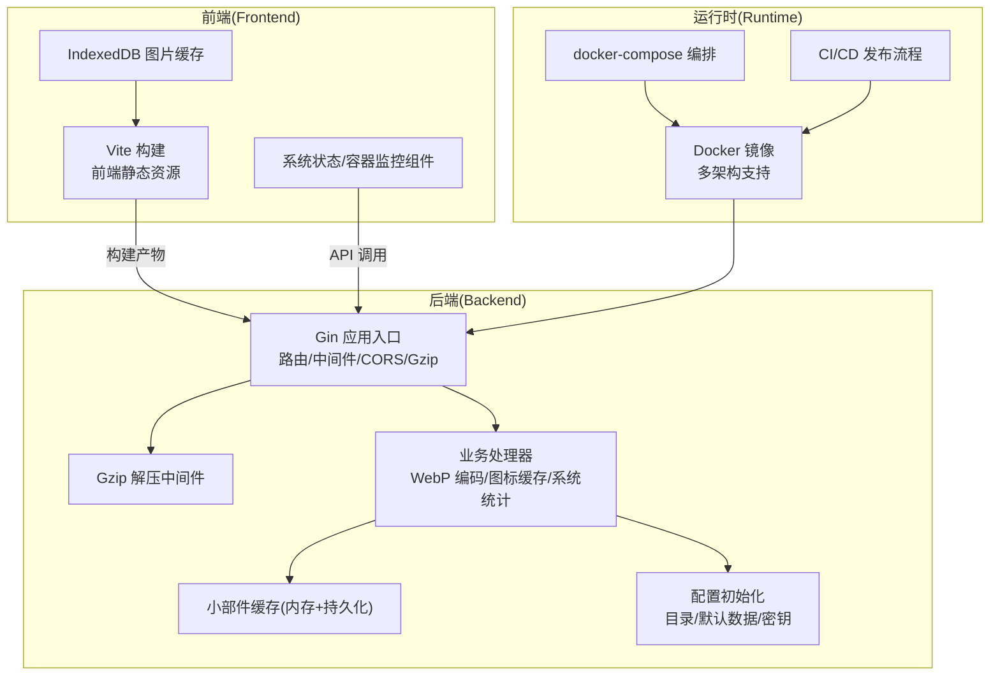
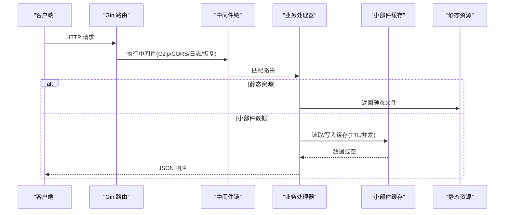
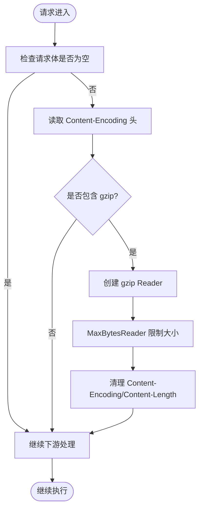
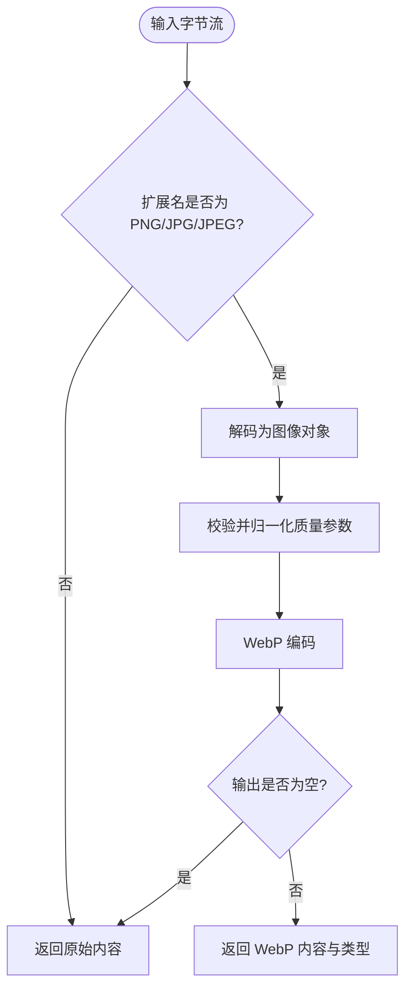
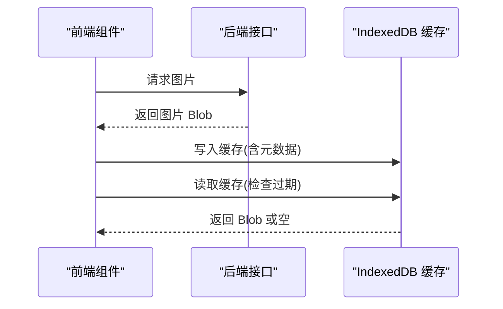
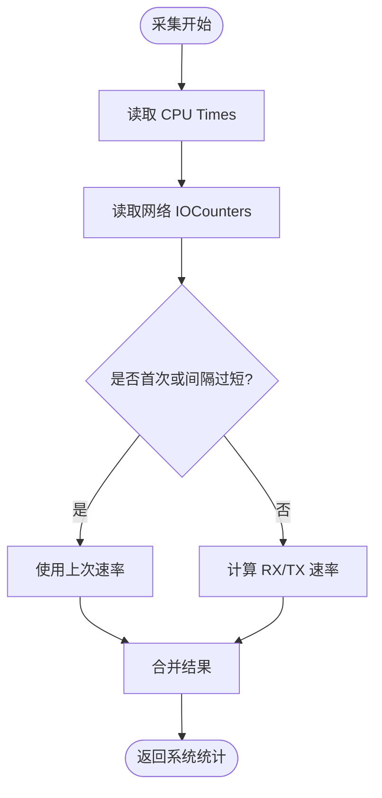
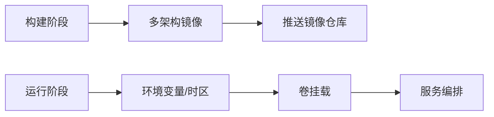
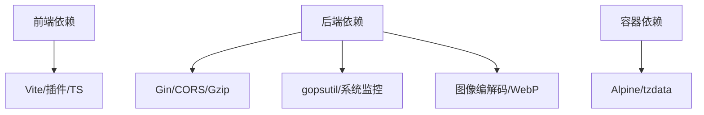

# 性能优化

<cite>
**本文档引用的文件**
- [backend/main.go](file://backend/main.go)
- [backend/middleware/gzip_decompress.go](file://backend/middleware/gzip_decompress.go)
- [backend/handlers/webp_encode.go](file://backend/handlers/webp_encode.go)
- [backend/handlers/webp_stub_arm.go](file://backend/handlers/webp_stub_arm.go)
- [backend/handlers/icons.go](file://backend/handlers/icons.go)
- [backend/handlers/widget_cache.go](file://backend/handlers/widget_cache.go)
- [backend/handlers/system.go](file://backend/handlers/system.go)
- [backend/config/config.go](file://backend/config/config.go)
- [backend/config/default.json](file://backend/config/default.json)
- [frontend/vite.config.ts](file://frontend/vite.config.ts)
- [frontend/src/utils/imageCache.ts](file://frontend/src/utils/imageCache.ts)
- [frontend/src/components/SystemStatusWidget.vue](file://frontend/src/components/SystemStatusWidget.vue)
- [frontend/src/components/DockerWidget.vue](file://frontend/src/components/DockerWidget.vue)
- [Dockerfile](file://Dockerfile)
- [docker-compose.yml](file://docker-compose.yml)
- [.github/workflows/docker-publish.yml](file://.github/workflows/docker-publish.yml)
</cite>

## 目录
1. [简介](#简介)
2. [项目结构](#项目结构)
3. [核心组件](#核心组件)
4. [架构总览](#架构总览)
5. [详细组件分析](#详细组件分析)
6. [依赖分析](#依赖分析)
7. [性能考虑](#性能考虑)
8. [故障排查指南](#故障排查指南)
9. [结论](#结论)
10. [附录](#附录)

## 简介
本指南面向 OFlatNas 的性能优化实践，覆盖前端资源优化、后端响应优化、数据库查询优化、图像编码与压缩、缓存策略、容器性能调优、前端构建与懒加载、系统资源监控与瓶颈识别、性能测试方法，以及针对不同硬件平台（尤其是 ARM 架构）的专项优化建议，并给出负载均衡与高可用部署思路。

## 项目结构
OFlatNas 采用前后端分离架构：前端基于 Vue 3 + Vite，后端基于 Go Gin，静态资源由后端统一提供。Dockerfile 支持多架构构建，docker-compose 提供本地编排，GitHub Actions 实现 CI/CD 自动化镜像发布。



图示来源
- [backend/main.go:34-164](file://backend/main.go#L34-L164)
- [backend/middleware/gzip_decompress.go:11-37](file://backend/middleware/gzip_decompress.go#L11-L37)
- [backend/handlers/webp_encode.go:13-45](file://backend/handlers/webp_encode.go#L13-L45)
- [backend/handlers/widget_cache.go:41-154](file://backend/handlers/widget_cache.go#L41-L154)
- [backend/config/config.go:35-86](file://backend/config/config.go#L35-L86)
- [Dockerfile:1-93](file://Dockerfile#L1-L93)
- [docker-compose.yml:1-17](file://docker-compose.yml#L1-L17)
- [.github/workflows/docker-publish.yml:21-80](file://.github/workflows/docker-publish.yml#L21-L80)

章节来源
- [backend/main.go:34-164](file://backend/main.go#L34-L164)
- [Dockerfile:1-93](file://Dockerfile#L1-L93)
- [docker-compose.yml:1-17](file://docker-compose.yml#L1-L17)
- [.github/workflows/docker-publish.yml:21-80](file://.github/workflows/docker-publish.yml#L21-L80)

## 核心组件
- 后端入口与中间件链：Gzip 压缩、CORS、Gzip 请求体解压、日志与恢复中间件。
- 图像处理：按需将 PNG/JPG/JPEG 转换为 WebP，ARM 平台降级处理。
- 小部件缓存：统一内存缓存 + 异步落盘，带 TTL 与并发刷新控制。
- 配置与默认数据：自动初始化系统配置、默认模板与密钥。
- 前端构建与缓存：Vite 构建配置、IndexedDB 图片缓存与懒加载策略。
- 系统监控：CPU/内存/磁盘/网络/主机信息采集与速率计算。
- 容器化：多架构镜像构建、服务编排与 CI/CD 流程。

章节来源
- [backend/main.go:34-164](file://backend/main.go#L34-L164)
- [backend/middleware/gzip_decompress.go:11-37](file://backend/middleware/gzip_decompress.go#L11-L37)
- [backend/handlers/webp_encode.go:13-45](file://backend/handlers/webp_encode.go#L13-L45)
- [backend/handlers/webp_stub_arm.go:5-8](file://backend/handlers/webp_stub_arm.go#L5-L8)
- [backend/handlers/widget_cache.go:41-154](file://backend/handlers/widget_cache.go#L41-L154)
- [backend/config/config.go:35-86](file://backend/config/config.go#L35-L86)
- [frontend/vite.config.ts:1-57](file://frontend/vite.config.ts#L1-L57)
- [frontend/src/utils/imageCache.ts:1-132](file://frontend/src/utils/imageCache.ts#L1-L132)
- [backend/handlers/system.go:51-203](file://backend/handlers/system.go#L51-L203)

## 架构总览
后端以 Gin 为核心，统一注册静态资源、Socket.IO、CORS、Gzip 中间件与路由组。业务层通过图标缓存、WebP 编码、系统统计等处理器提供功能，同时维护小部件缓存与配置文件。



图示来源
- [backend/main.go:34-164](file://backend/main.go#L34-L164)
- [backend/handlers/widget_cache.go:80-123](file://backend/handlers/widget_cache.go#L80-L123)

## 详细组件分析

### 后端中间件与响应优化
- Gzip 压缩：全局启用 gzip 压缩，显著降低传输体积，适合内网/慢速网络场景。
- Gzip 请求体解压：自动识别并解压 gzip 请求体，防止上游未解压导致的解析错误。
- 请求体大小限制：提升至 50MB，满足大配置文件上传需求。
- CORS：灵活配置允许来源，支持凭据与缓存控制。
- 日志与恢复：统一日志记录与 panic 恢复，保障稳定性。



图示来源
- [backend/middleware/gzip_decompress.go:11-37](file://backend/middleware/gzip_decompress.go#L11-L37)

章节来源
- [backend/main.go:34-77](file://backend/main.go#L34-L77)
- [backend/middleware/gzip_decompress.go:11-37](file://backend/middleware/gzip_decompress.go#L11-L37)

### 图像编码优化（WebP）
- 条件转换：仅对 PNG/JPG/JPEG 进行 WebP 转换，GIF/SVG/ICO 保持原格式。
- 质量控制：质量参数限定在 1-100，避免异常值。
- ARM 兼容：ARM 32 位平台直接回退，跳过转换。
- 动态开关：通过环境变量控制强制开启与质量阈值。



图示来源
- [backend/handlers/webp_encode.go:13-45](file://backend/handlers/webp_encode.go#L13-L45)
- [backend/handlers/webp_stub_arm.go:5-8](file://backend/handlers/webp_stub_arm.go#L5-L8)
- [backend/handlers/icons.go:89-92](file://backend/handlers/icons.go#L89-L92)

章节来源
- [backend/handlers/webp_encode.go:13-45](file://backend/handlers/webp_encode.go#L13-L45)
- [backend/handlers/webp_stub_arm.go:5-8](file://backend/handlers/webp_stub_arm.go#L5-L8)
- [backend/handlers/icons.go:89-92](file://backend/handlers/icons.go#L89-L92)

### 缓存策略（小部件缓存）
- 结构化缓存：按 kind/key 维度管理，支持 TTL 控制与并发刷新去重。
- 异步落盘：写入后异步保存到 JSON 文件，降低阻塞。
- 状态标记：可更新源状态（成功/失败），便于前端展示与重试策略。

```mermaid
classDiagram
class WidgetCache {
-filePath string
-cache map[string]map[string]*WidgetCacheItem
-refreshing map[string]bool
+Get(kind,key,out) (bool,bool,*WidgetCacheItem,error)
+Set(kind,key,data,ttl,status) error
+MarkStatus(kind,key,status) error
+StartRefresh(tag) bool
+EndRefresh(tag) void
-load() void
-saveAsync() void
}
class WidgetCacheItem {
+Data interface{}
+UpdatedAt int64
+TTL int64
+SourceStatus string
}
WidgetCache --> WidgetCacheItem : "持有"
```

图示来源
- [backend/handlers/widget_cache.go:19-154](file://backend/handlers/widget_cache.go#L19-L154)

章节来源
- [backend/handlers/widget_cache.go:41-154](file://backend/handlers/widget_cache.go#L41-L154)

### 配置与默认数据初始化
- 自动定位 BaseDir，设置各子目录（数据、用户、文档、音乐、背景、图标缓存、公共目录、配置版本）。
- 初始化系统配置与默认数据文件，确保首次运行可用。
- 密钥生成与持久化，保证鉴权安全。

章节来源
- [backend/config/config.go:35-86](file://backend/config/config.go#L35-L86)
- [backend/config/config.go:102-180](file://backend/config/config.go#L102-L180)
- [backend/config/config.go:182-204](file://backend/config/config.go#L182-L204)
- [backend/config/default.json:1-147](file://backend/config/default.json#L1-L147)

### 前端构建与图片缓存
- Vite 构建：按平台选择输出目录与 publicDir，生产环境输出 dist，开发环境指向 server/public 或 debian/server/public。
- IndexedDB 图片缓存：限制最大条目数与缓存时间，定期裁剪过期条目，结合 localStorage 快速过期检查。
- 组件侧轮询：系统状态组件定时拉取系统统计，遇到错误自动退避并停止轮询。



图示来源
- [frontend/src/utils/imageCache.ts:72-131](file://frontend/src/utils/imageCache.ts#L72-L131)
- [frontend/src/components/SystemStatusWidget.vue:108-134](file://frontend/src/components/SystemStatusWidget.vue#L108-L134)

章节来源
- [frontend/vite.config.ts:1-57](file://frontend/vite.config.ts#L1-L57)
- [frontend/src/utils/imageCache.ts:1-132](file://frontend/src/utils/imageCache.ts#L1-L132)
- [frontend/src/components/SystemStatusWidget.vue:108-134](file://frontend/src/components/SystemStatusWidget.vue#L108-L134)

### 系统资源监控与网络统计
- CPU/内存/磁盘/网络/主机信息：聚合 gopsutil 数据，计算 CPU 使用率与网络速率。
- 速率计算：基于两次采样间隔的时间差，计算每接口 RX/TX 速率，避免频繁采集造成抖动。
- 错误处理：接口不可用或多次失败时，自动停止轮询，降低无效请求。



图示来源
- [backend/handlers/system.go:51-203](file://backend/handlers/system.go#L51-L203)

章节来源
- [backend/handlers/system.go:51-203](file://backend/handlers/system.go#L51-L203)
- [frontend/src/components/SystemStatusWidget.vue:108-134](file://frontend/src/components/SystemStatusWidget.vue#L108-L134)

### 容器性能调优与部署
- 多架构构建：支持 linux/amd64, linux/arm64, linux/arm/v7，适配不同硬件平台。
- 缓存加速：启用 GitHub Actions 缓存，提升构建速度。
- 运行时参数：GIN_MODE=release，时区设置，最小基础镜像，减少镜像体积。
- 卷挂载：映射数据、音乐、背景、文档、Docker Socket，便于外部访问与容器管理。



图示来源
- [.github/workflows/docker-publish.yml:77-80](file://.github/workflows/docker-publish.yml#L77-L80)
- [Dockerfile:64-93](file://Dockerfile#L64-L93)
- [docker-compose.yml:10-16](file://docker-compose.yml#L10-L16)

章节来源
- [.github/workflows/docker-publish.yml:21-80](file://.github/workflows/docker-publish.yml#L21-L80)
- [Dockerfile:64-93](file://Dockerfile#L64-L93)
- [docker-compose.yml:1-17](file://docker-compose.yml#L1-L17)

## 依赖分析
- 前端依赖：Vue 3、Vite、TypeScript、插件生态，按需引入与别名配置。
- 后端依赖：Gin、CORS、Gzip、Socket.IO、gopsutil、图像编解码库、跨平台构建工具链。
- 容器依赖：Alpine 基础镜像、tzdata、时区配置、最小权限运行。



图示来源
- [frontend/vite.config.ts:1-57](file://frontend/vite.config.ts#L1-L57)
- [backend/main.go:15-23](file://backend/main.go#L15-L23)
- [backend/handlers/system.go:23-28](file://backend/handlers/system.go#L23-L28)
- [Dockerfile:64-71](file://Dockerfile#L64-L71)

章节来源
- [frontend/vite.config.ts:1-57](file://frontend/vite.config.ts#L1-L57)
- [backend/main.go:15-23](file://backend/main.go#L15-L23)
- [backend/handlers/system.go:23-28](file://backend/handlers/system.go#L23-L28)
- [Dockerfile:64-71](file://Dockerfile#L64-L71)

## 性能考虑
- 前端资源优化
  - 构建产物按平台选择输出目录，生产环境输出 dist，减少不必要的拷贝。
  - 使用 Vite 的按需导入与别名，配合 RollupOptions 的 onwarn 过滤常见警告，避免打包中断。
  - IndexedDB 图片缓存限制最大条目与过期时间，定期裁剪，降低存储压力。
- 后端响应优化
  - 全局启用 Gzip 压缩，显著降低传输体积。
  - Gzip 请求体解压中间件，兼容上游未解压场景。
  - 请求体大小限制提升至 50MB，满足大配置文件上传。
  - CORS 凭据与缓存控制，减少重复握手。
- 数据库查询优化
  - 当前后端未直接使用数据库，系统通过 JSON 文件与配置文件进行数据持久化，避免复杂查询开销。
  - 若未来引入数据库，建议：
    - 对高频查询字段建立索引；
    - 使用连接池与超时控制；
    - 分页查询与只读事务；
    - 缓存热点数据（已有小部件缓存模式可借鉴）。
- 图像编码与压缩
  - WebP 转换仅对静态光栅图生效，避免对矢量/动画格式的不必要处理。
  - ARM 平台降级处理，保证兼容性。
  - 通过环境变量动态调整质量，兼顾体积与画质。
- 缓存策略
  - 小部件缓存支持 TTL 与并发刷新去重，异步落盘降低阻塞。
  - 前端 IndexedDB 缓存与 localStorage 元数据结合，快速过期检查。
- 容器性能调优
  - 多架构镜像构建，适配不同硬件平台。
  - 最小基础镜像与时区配置，减少启动与运行时开销。
  - 卷挂载优化 I/O 访问路径，避免不必要的拷贝。
- 前端构建与懒加载
  - Vite 默认按需打包，结合组件级懒加载与路由级分割，减少首屏体积。
  - 生产环境关闭 sourcemap，避免额外体积与安全风险。
- 系统资源监控与瓶颈识别
  - 后端提供系统统计接口，前端组件定时轮询并具备错误退避机制。
  - 通过 CPU/内存/磁盘/网络指标识别瓶颈，结合日志与中间件链定位问题。
- 性能测试方法
  - 前端：Vite 开发服务器与生产构建对比，使用 Lighthouse/Chrome DevTools 进行性能分析。
  - 后端：Gzip 压缩效果验证、请求体大小上限测试、并发场景下的缓存命中率与落盘延迟。
  - 容器：多架构镜像构建时间与镜像体积对比，卷挂载 I/O 压测。
- 不同硬件平台优化建议
  - ARM 架构：优先使用预编译二进制，避免在设备上进行重型编译；WebP 转换降级处理；合理设置 CPU/内存限制。
  - x86_64：充分利用多核与内存，适当提高并发与缓存容量；启用更激进的压缩策略。
- 负载均衡与高可用
  - 建议使用反向代理（Nginx/Traefik）实现健康检查与会话亲和；
  - 多实例部署时共享配置与缓存（如 Redis）以避免状态不一致；
  - 使用容器编排（Kubernetes/Docker Swarm）实现滚动升级与弹性伸缩。

## 故障排查指南
- 图像转换失败
  - 检查扩展名是否为 PNG/JPG/JPEG；
  - 校验质量参数范围；
  - ARM 平台确认是否降级处理。
- 缓存未命中或过期
  - 前端 IndexedDB 是否正确写入与删除过期项；
  - localStorage 元数据是否同步更新；
  - 后端小部件缓存 TTL 是否合理。
- 系统统计接口异常
  - 检查 gopsutil 依赖是否可用；
  - 网络速率计算间隔是否过短导致零值；
  - 组件轮询错误次数是否达到阈值而停止。
- 容器启动异常
  - 确认时区与权限；
  - 卷挂载路径是否存在；
  - 多架构镜像是否匹配目标平台。

章节来源
- [backend/handlers/webp_encode.go:13-45](file://backend/handlers/webp_encode.go#L13-L45)
- [backend/handlers/webp_stub_arm.go:5-8](file://backend/handlers/webp_stub_arm.go#L5-L8)
- [frontend/src/utils/imageCache.ts:72-131](file://frontend/src/utils/imageCache.ts#L72-L131)
- [backend/handlers/widget_cache.go:80-123](file://backend/handlers/widget_cache.go#L80-L123)
- [backend/handlers/system.go:51-203](file://backend/handlers/system.go#L51-L203)
- [Dockerfile:64-93](file://Dockerfile#L64-L93)

## 结论
通过在前端构建、图像编码、缓存策略、后端中间件链与容器化等方面的系统性优化，OFlatNas 在不同硬件平台与部署环境下均能获得稳定且高效的性能表现。建议在实际部署中结合监控指标持续迭代，逐步引入数据库与分布式缓存，以支撑更大规模的业务场景。

## 附录
- 关键环境变量与配置项
  - ICON_CACHE_FORCE_WEBP：强制启用 WebP 转换（默认开启）
  - ICON_CACHE_WEBP_QUALITY：WebP 质量阈值（默认 82）
  - PORT：后端监听端口（默认 3000）
  - BASE_DIR：应用根目录（自动推断）
  - CORS_ALLOW_ORIGINS：允许的跨域来源列表
- 常见优化清单
  - 前端：启用生产构建、关闭 sourcemap、按需导入、组件懒加载；
  - 后端：启用 Gzip、合理设置请求体大小、使用小部件缓存；
  - 容器：多架构镜像、最小基础镜像、卷挂载优化、资源限制。