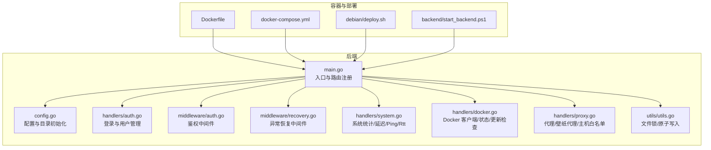
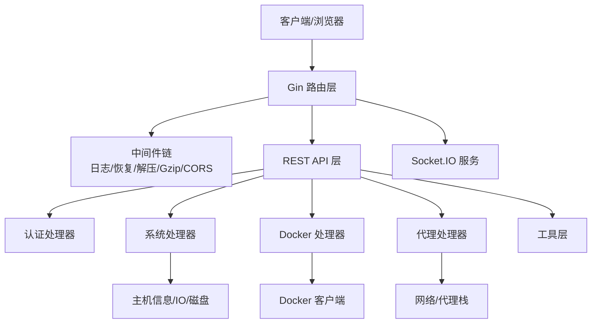
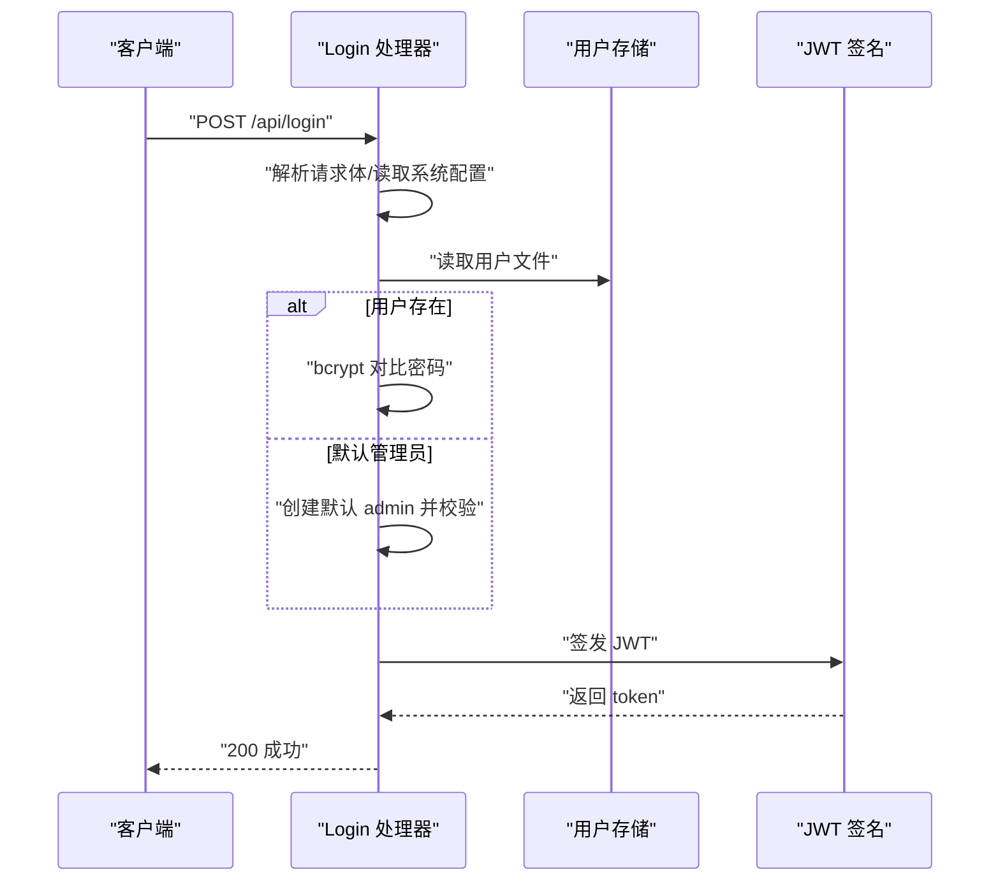
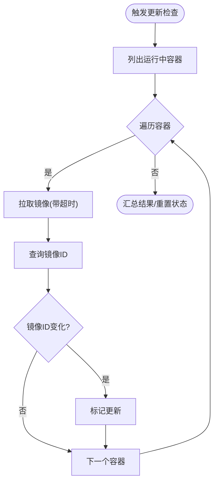
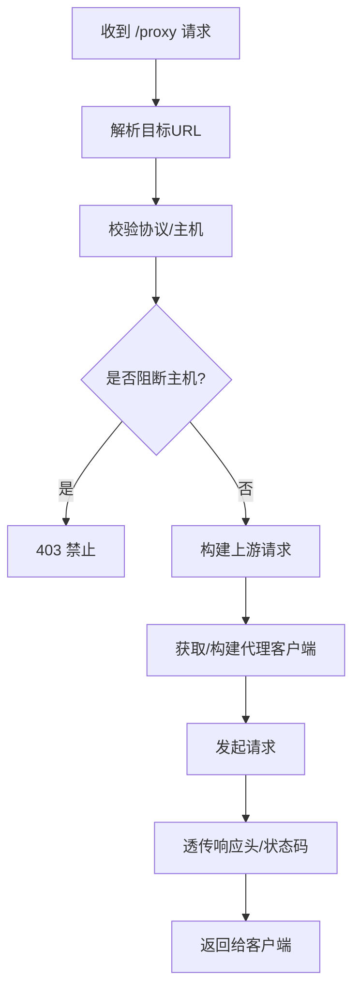
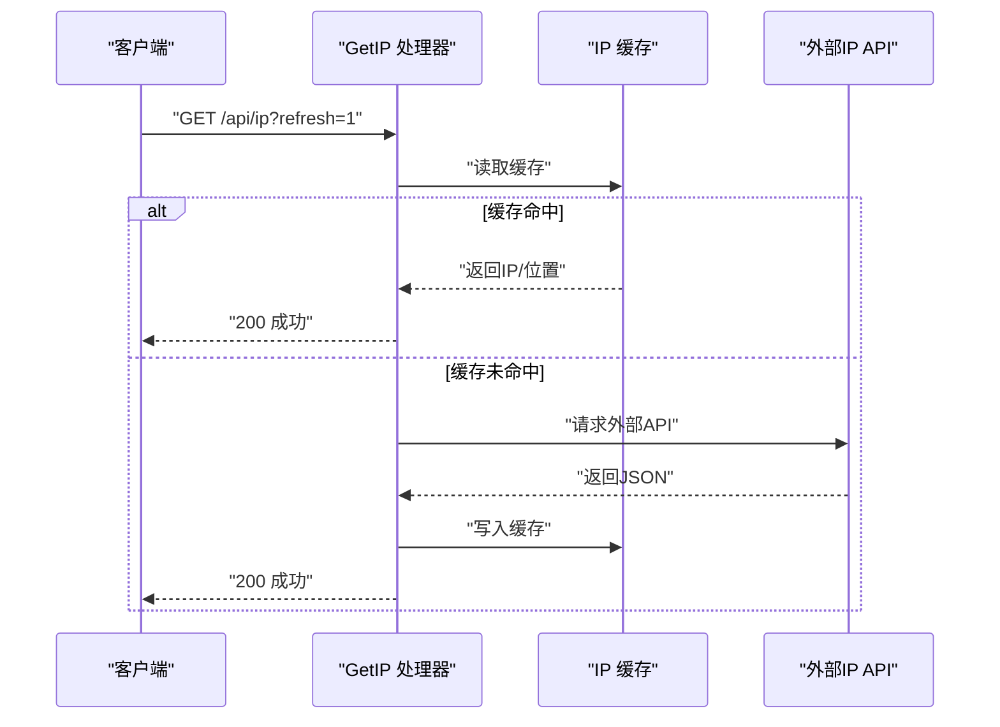
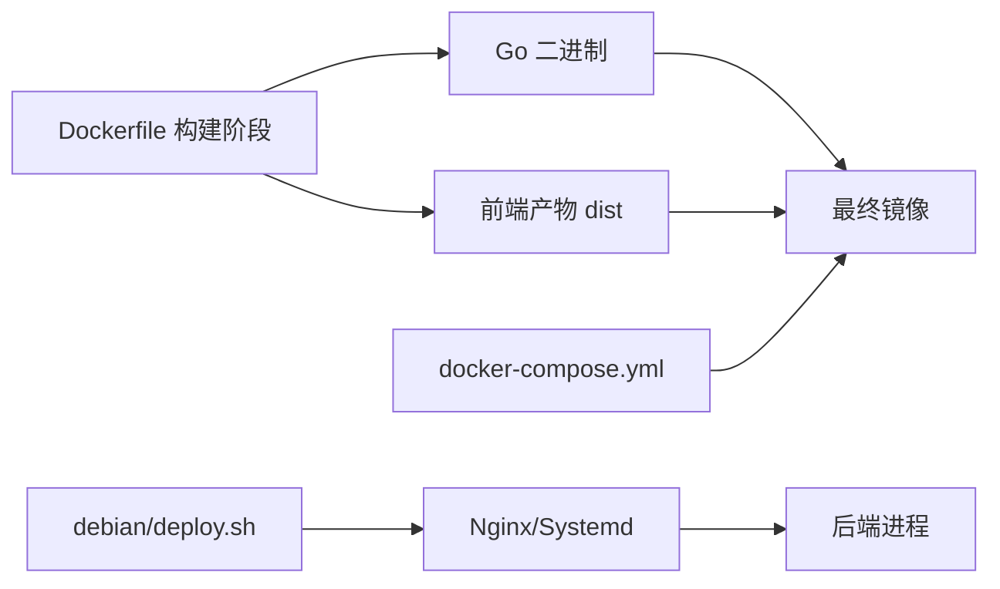

# 故障排除

<cite>
**本文引用的文件**
- [backend/main.go](file://backend/main.go)
- [backend/config/config.go](file://backend/config/config.go)
- [backend/handlers/auth.go](file://backend/handlers/auth.go)
- [backend/middleware/auth.go](file://backend/middleware/auth.go)
- [backend/middleware/recovery.go](file://backend/middleware/recovery.go)
- [backend/handlers/system.go](file://backend/handlers/system.go)
- [backend/handlers/docker.go](file://backend/handlers/docker.go)
- [backend/handlers/proxy.go](file://backend/handlers/proxy.go)
- [backend/utils/utils.go](file://backend/utils/utils.go)
- [Dockerfile](file://Dockerfile)
- [docker-compose.yml](file://docker-compose.yml)
- [debian/deploy.sh](file://debian/deploy.sh)
- [backend/start_backend.ps1](file://backend/start_backend.ps1)
</cite>

## 目录
1. [简介](#简介)
2. [项目结构](#项目结构)
3. [核心组件](#核心组件)
4. [架构总览](#架构总览)
5. [详细组件分析](#详细组件分析)
6. [依赖分析](#依赖分析)
7. [性能考虑](#性能考虑)
8. [故障排除指南](#故障排除指南)
9. [结论](#结论)
10. [附录](#附录)

## 简介
本指南面向运维与开发人员，围绕 OFlatNas 的启动、连接、认证、代理、Docker、系统资源与性能等常见问题，提供系统化的诊断方法、日志分析技巧、错误代码解读与根因分析流程，并给出应急响应与快速恢复策略。文档中的建议均基于仓库中实际实现与配置文件。

## 项目结构
后端采用 Go + Gin 框架，提供 REST API、WebSocket（Socket.IO）、静态资源托管与系统信息采集；前端静态资源由后端统一提供；Dockerfile 与 docker-compose.yml 支持容器化部署；debian/deploy.sh 提供 Debian/Nginx 部署流程。

**图表来源**
- [backend/main.go:25-267](file://backend/main.go#L25-L267)
- [backend/config/config.go:35-86](file://backend/config/config.go#L35-L86)
- [backend/handlers/auth.go:18-114](file://backend/handlers/auth.go#L18-L114)
- [backend/middleware/auth.go:33-61](file://backend/middleware/auth.go#L33-L61)
- [backend/middleware/recovery.go:9-16](file://backend/middleware/recovery.go#L9-L16)
- [backend/handlers/system.go:51-203](file://backend/handlers/system.go#L51-L203)
- [backend/handlers/docker.go:42-66](file://backend/handlers/docker.go#L42-L66)
- [backend/handlers/proxy.go:199-342](file://backend/handlers/proxy.go#L199-L342)
- [backend/utils/utils.go:16-76](file://backend/utils/utils.go#L16-L76)
- [Dockerfile:1-93](file://Dockerfile#L1-L93)
- [docker-compose.yml:1-17](file://docker-compose.yml#L1-L17)
- [debian/deploy.sh:168-274](file://debian/deploy.sh#L168-L274)
- [backend/start_backend.ps1:1-5](file://backend/start_backend.ps1#L1-L5)

**章节来源**
- [backend/main.go:25-267](file://backend/main.go#L25-L267)
- [Dockerfile:1-93](file://Dockerfile#L1-L93)
- [docker-compose.yml:1-17](file://docker-compose.yml#L1-L17)
- [debian/deploy.sh:168-274](file://debian/deploy.sh#L168-L274)

## 核心组件
- 入口与路由：注册中间件、CORS、Socket.IO、静态资源、API 路由与 NoRoute 处理。
- 配置与目录：根据 BASE_DIR 自动推断工作目录，确保 data/music/PC/APP/doc/icon-cache 等目录存在，生成 secret.key。
- 认证与授权：JWT 登录、可选鉴权中间件、管理员权限控制。
- 系统监控：CPU/内存/磁盘/网络 IO 统计、Ping/Rtt、公网 IP 获取与缓存。
- Docker 集成：Docker 客户端初始化、主机解析、容器列表/状态、更新检查、日志导出调试快照。
- 代理与安全：通用代理、壁纸代理、主机白名单、阻断私有/回环地址。
- 文件工具：文件锁、原子写入，保障并发安全。

**章节来源**
- [backend/main.go:34-267](file://backend/main.go#L34-L267)
- [backend/config/config.go:35-257](file://backend/config/config.go#L35-L257)
- [backend/handlers/auth.go:18-114](file://backend/handlers/auth.go#L18-L114)
- [backend/middleware/auth.go:33-61](file://backend/middleware/auth.go#L33-L61)
- [backend/handlers/system.go:51-203](file://backend/handlers/system.go#L51-L203)
- [backend/handlers/docker.go:42-66](file://backend/handlers/docker.go#L42-L66)
- [backend/handlers/proxy.go:199-342](file://backend/handlers/proxy.go#L199-L342)
- [backend/utils/utils.go:16-76](file://backend/utils/utils.go#L16-L76)

## 架构总览
后端通过 Gin 提供 REST API 与 Socket.IO 实时通道，静态资源由后端统一托管；Docker 与代理模块为可选能力；系统监控模块用于诊断性能与网络状况。

**图表来源**
- [backend/main.go:34-164](file://backend/main.go#L34-L164)
- [backend/middleware/auth.go:33-61](file://backend/middleware/auth.go#L33-L61)
- [backend/middleware/recovery.go:9-16](file://backend/middleware/recovery.go#L9-L16)
- [backend/handlers/docker.go:158-167](file://backend/handlers/docker.go#L158-L167)
- [backend/handlers/proxy.go:247-312](file://backend/handlers/proxy.go#L247-L312)
- [backend/handlers/system.go:51-203](file://backend/handlers/system.go#L51-L203)

## 详细组件分析

### 认证与授权
- 登录流程：解析请求体，按系统配置选择用户名，读取用户文件，bcrypt 对比密码，签发 JWT。
- 中间件：鉴权中间件校验 JWT 并注入用户名；可选鉴权中间件允许匿名访问但可选注入。
- 管理员权限：部分 Docker/容器操作要求管理员身份。

**图表来源**
- [backend/handlers/auth.go:18-114](file://backend/handlers/auth.go#L18-L114)
- [backend/middleware/auth.go:33-61](file://backend/middleware/auth.go#L33-L61)

**章节来源**
- [backend/handlers/auth.go:18-114](file://backend/handlers/auth.go#L18-L114)
- [backend/middleware/auth.go:33-61](file://backend/middleware/auth.go#L33-L61)

### Docker 集成
- 初始化：根据 EnableDocker 与 DockerHost/环境变量解析 Docker 主机，创建客户端。
- 列表与状态：列出容器，按需收集运行中容器的 CPU/内存/网络/块 IO 统计，带 TTL 缓存。
- 更新检查：并发拉取镜像，对比镜像 ID，记录更新可用与失败项。
- 调试：导出调试快照（启用状态、主机解析、客户端可用性、Ping 结果、初始化错误）。

**图表来源**
- [backend/handlers/docker.go:664-759](file://backend/handlers/docker.go#L664-L759)

**章节来源**
- [backend/handlers/docker.go:42-66](file://backend/handlers/docker.go#L42-L66)
- [backend/handlers/docker.go:292-352](file://backend/handlers/docker.go#L292-L352)
- [backend/handlers/docker.go:664-759](file://backend/handlers/docker.go#L664-L759)

### 代理与网络
- 通用代理：支持 HTTP/HTTPS/SOCKS5，自动解析 PROXY_URL/HTTP_PROXY 等环境变量，复用共享客户端。
- 壁纸代理：对目标主机进行白名单校验，支持 User-Agent 注入与响应头透传。
- 主机白名单：内置预设与可扩展白名单，阻断 localhost/私有/链路本地等地址。
- 代理状态：检测代理可用性。

**图表来源**
- [backend/handlers/proxy.go:132-198](file://backend/handlers/proxy.go#L132-L198)
- [backend/handlers/proxy.go:199-342](file://backend/handlers/proxy.go#L199-L342)

**章节来源**
- [backend/handlers/proxy.go:199-342](file://backend/handlers/proxy.go#L199-L342)

### 系统监控与网络诊断
- 系统统计：CPU/内存/磁盘/网络 IO，按接口聚合速率，线程安全计算。
- Ping/Rtt：跨平台 Ping，解析延迟输出；Rtt 返回纳秒时间戳用于前端测速。
- 公网 IP：定时缓存，支持刷新，多源回退。

**图表来源**
- [backend/handlers/system.go:288-347](file://backend/handlers/system.go#L288-L347)
- [backend/handlers/system.go:349-465](file://backend/handlers/system.go#L349-L465)

**章节来源**
- [backend/handlers/system.go:51-203](file://backend/handlers/system.go#L51-L203)
- [backend/handlers/system.go:288-347](file://backend/handlers/system.go#L288-L347)
- [backend/handlers/system.go:349-465](file://backend/handlers/system.go#L349-L465)

### 配置与目录初始化
- 自动推断 BaseDir，兼容 backend/frontend/win 等目录结构。
- 确保 data/users/doc/music/PC/APP/icon-cache/public/config_versions 等目录存在。
- 初始化 system.json、data.json、secret.key、访客与自定义脚本等文件。

**章节来源**
- [backend/config/config.go:35-257](file://backend/config/config.go#L35-L257)

### 文件工具与并发安全
- 文件锁：基于 sync.Map 的按文件粒度互斥。
- 原子写入：先写 tmp 再重命名，避免部分写入。

**章节来源**
- [backend/utils/utils.go:16-76](file://backend/utils/utils.go#L16-L76)

## 依赖分析
- 运行时依赖：Gin、Socket.IO、gopsutil、bcrypt、JWT、Docker SDK。
- 构建时依赖：前端构建（Node）、Go 模块（go.mod）。
- 部署依赖：Nginx（Debian 部署脚本），Docker（compose）。

**图表来源**
- [Dockerfile:35-93](file://Dockerfile#L35-L93)
- [docker-compose.yml:1-17](file://docker-compose.yml#L1-L17)
- [debian/deploy.sh:168-274](file://debian/deploy.sh#L168-L274)

**章节来源**
- [Dockerfile:35-93](file://Dockerfile#L35-L93)
- [docker-compose.yml:1-17](file://docker-compose.yml#L1-L17)
- [debian/deploy.sh:168-274](file://debian/deploy.sh#L168-L274)

## 性能考虑
- 压缩与缓存：Gzip 中间件、静态资源缓存、Socket.IO 事件分发。
- Docker 统计：并发抓取 + TTL 缓存，避免频繁调用。
- 网络诊断：Ping/Rtt 与公网 IP 缓存，降低外部依赖抖动影响。
- 文件写入：原子写入与文件锁，避免并发写入冲突。

[本节为通用指导，无需特定文件来源]

## 故障排除指南

### 启动失败
- 现象
  - 容器无法启动或退出
  - 本地二进制启动报错
  - Debian 部署后 Nginx/服务未监听
- 诊断步骤
  - 查看容器日志与退出码（compose）
  - 查看 systemd 日志（Debian）
  - 检查端口占用与权限
  - 验证 PUBLIC_DIR/BASE_DIR 环境变量
- 快速修复
  - 使用 compose 或 deploy 脚本重建
  - 确认端口未被占用
  - 以 root 权限执行部署脚本

**章节来源**
- [docker-compose.yml:1-17](file://docker-compose.yml#L1-L17)
- [debian/deploy.sh:276-321](file://debian/deploy.sh#L276-L321)
- [backend/main.go:256-265](file://backend/main.go#L256-L265)

### 连接超时与网络问题
- 现象
  - /api/ping 无响应或延迟异常
  - /api/ip 获取失败
  - 代理请求 502
- 诊断步骤
  - 使用 /api/rtt 与 /api/ping 验证连通性
  - 检查代理环境变量（PROXY_URL/HTTP_PROXY 等）
  - 校验目标主机是否在白名单或被阻断
  - 查看上游 DNS 解析与防火墙
- 快速修复
  - 配置正确的代理 URL
  - 将目标域名加入壁纸代理白名单
  - 临时禁用代理以排除代理链问题

**章节来源**
- [backend/handlers/system.go:534-592](file://backend/handlers/system.go#L534-L592)
- [backend/handlers/system.go:349-465](file://backend/handlers/system.go#L349-L465)
- [backend/handlers/proxy.go:199-342](file://backend/handlers/proxy.go#L199-L342)

### 权限错误与认证失败
- 现象
  - 401 Unauthorized
  - 管理员权限拒绝
  - 登录成功但接口仍提示未授权
- 诊断步骤
  - 确认 Authorization 头或 token 查询参数格式正确
  - 检查系统配置中的 authMode 与用户文件是否存在
  - 确认管理员身份（用户名=admin）执行受限操作
- 快速修复
  - 重新登录获取有效 token
  - 单用户模式下 admin 密码回退逻辑
  - 确保用户文件权限可读

**章节来源**
- [backend/middleware/auth.go:33-61](file://backend/middleware/auth.go#L33-L61)
- [backend/handlers/auth.go:18-114](file://backend/handlers/auth.go#L18-L114)

### Docker 相关问题
- 现象
  - Docker 不可用或初始化失败
  - 列表为空或状态异常
  - 更新检查失败
- 诊断步骤
  - 使用 /api/docker/debug 获取调试快照
  - 检查 EnableDocker 与 DockerHost/环境变量
  - 校验 Docker 守护进程可达性与权限
- 快速修复
  - 修正 DOCKER_HOST 或系统配置
  - 确保 docker.sock 权限与挂载正确
  - 重试更新检查或手动拉取镜像

**章节来源**
- [backend/handlers/docker.go:42-66](file://backend/handlers/docker.go#L42-L66)
- [backend/handlers/docker.go:572-575](file://backend/handlers/docker.go#L572-L575)
- [docker-compose.yml:16-16](file://docker-compose.yml#L16-L16)

### 系统资源与性能瓶颈
- 现象
  - CPU/内存/磁盘占用高
  - 网络 IO 波动大
  - 页面加载缓慢
- 诊断步骤
  - 使用 /api/system/stats 获取实时指标
  - 观察 Docker 容器统计（CPU/内存/网络）
  - 检查静态资源缓存与压缩
- 快速修复
  - 清理不必要的容器/镜像
  - 调整容器资源限制
  - 优化前端静态资源与缓存策略

**章节来源**
- [backend/handlers/system.go:51-203](file://backend/handlers/system.go#L51-L203)
- [backend/handlers/docker.go:292-352](file://backend/handlers/docker.go#L292-L352)

### 日志分析与错误解读
- 关键日志来源
  - systemd/journald（Debian）
  - 容器日志（compose）
  - 后端标准输出（Gin Logger）
- 常见错误信号
  - 401/403：认证/权限问题
  - 400：请求参数无效（URL/协议/主机）
  - 502：上游代理失败
  - 500：内部错误（panic 恢复中间件返回）
- 建议
  - 结合 /api/docker/debug 与 /api/config/proxy-status 辅助定位
  - 使用 /api/rtt 与 /api/ping 进行端到端验证

**章节来源**
- [backend/middleware/recovery.go:9-16](file://backend/middleware/recovery.go#L9-L16)
- [backend/handlers/proxy.go:123-130](file://backend/handlers/proxy.go#L123-L130)
- [backend/handlers/docker.go:572-575](file://backend/handlers/docker.go#L572-L575)

### 应急响应与快速恢复
- 立即动作
  - 检查服务状态与端口监听
  - 查看最近日志与错误码
  - 临时关闭代理或 Docker 以隔离问题
- 恢复步骤
  - 重启服务（systemd 或 compose）
  - 重新部署（Debian 脚本）
  - 回滚配置（system.json/data.json）或删除缓存文件

**章节来源**
- [debian/deploy.sh:461-467](file://debian/deploy.sh#L461-L467)
- [docker-compose.yml:1-17](file://docker-compose.yml#L1-L17)

## 结论
本指南提供了从启动、网络、认证、Docker 到系统资源与性能的全链路故障排除方法。建议在日常运维中结合健康检查接口与调试快照，建立标准化的应急流程，以缩短故障定位与恢复时间。

## 附录

### 常用接口与诊断要点
- /api/ping：验证网络连通性
- /api/rtt：前端测速
- /api/ip：公网 IP 获取与缓存
- /api/system/stats：系统资源统计
- /api/docker/debug：Docker 调试快照
- /api/config/proxy-status：代理可用性
- /api/docker/status：更新可用性

**章节来源**
- [backend/handlers/system.go:534-592](file://backend/handlers/system.go#L534-L592)
- [backend/handlers/system.go:51-203](file://backend/handlers/system.go#L51-L203)
- [backend/handlers/docker.go:423-436](file://backend/handlers/docker.go#L423-L436)
- [backend/handlers/proxy.go:123-130](file://backend/handlers/proxy.go#L123-L130)