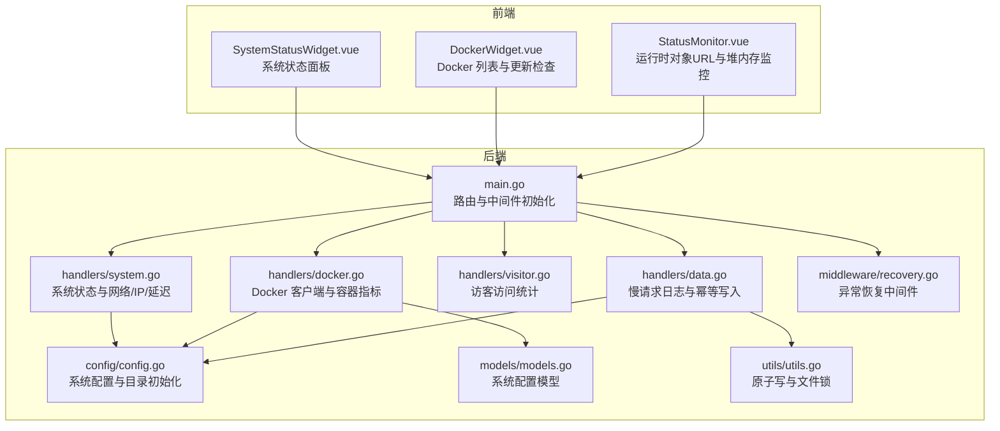
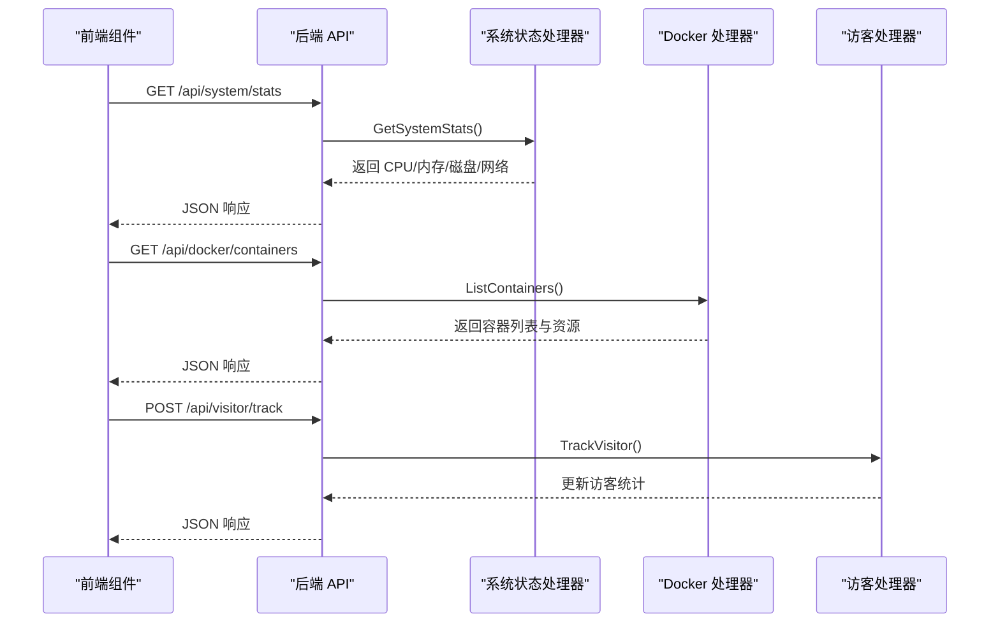
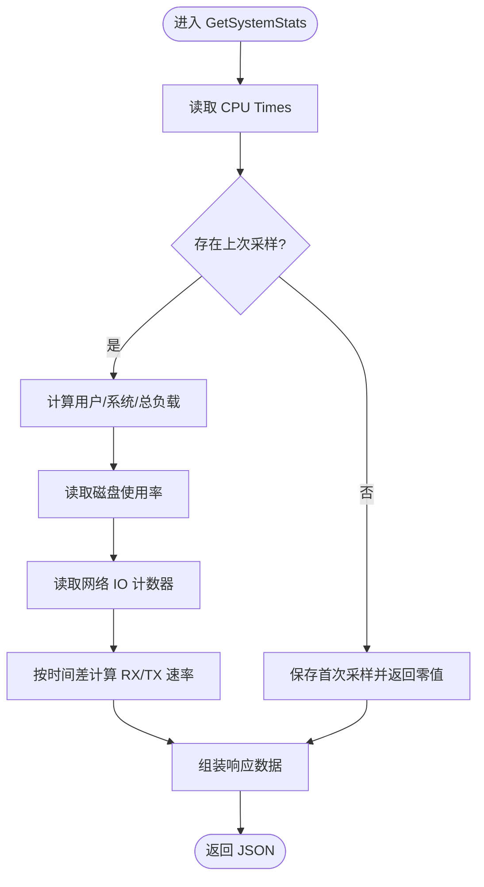
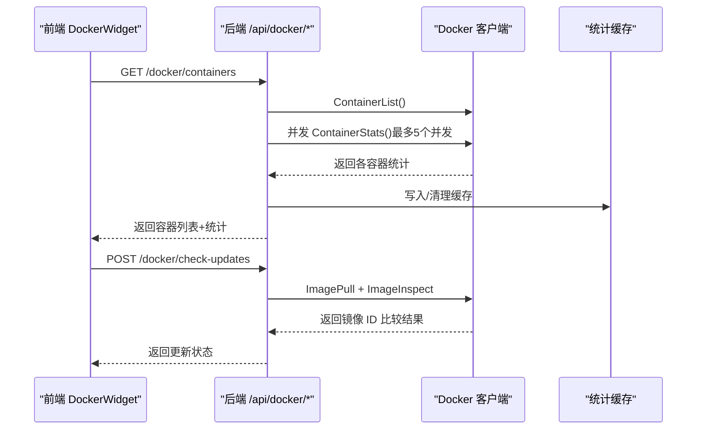
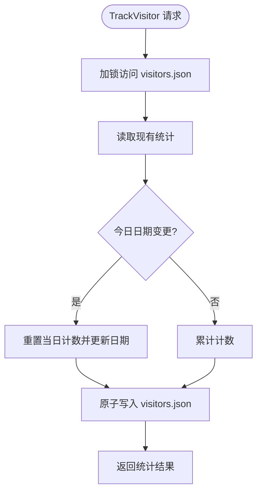
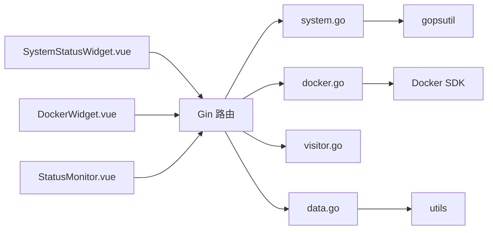

# 监控管理

<cite>
**本文档引用的文件**
- [backend/main.go](file://backend/main.go)
- [backend/handlers/system.go](file://backend/handlers/system.go)
- [backend/handlers/docker.go](file://backend/handlers/docker.go)
- [backend/handlers/visitor.go](file://backend/handlers/visitor.go)
- [backend/handlers/data.go](file://backend/handlers/data.go)
- [backend/middleware/recovery.go](file://backend/middleware/recovery.go)
- [backend/config/config.go](file://backend/config/config.go)
- [backend/models/models.go](file://backend/models/models.go)
- [backend/utils/utils.go](file://backend/utils/utils.go)
- [frontend/src/components/SystemStatusWidget.vue](file://frontend/src/components/SystemStatusWidget.vue)
- [frontend/src/components/DockerWidget.vue](file://frontend/src/components/DockerWidget.vue)
- [frontend/src/components/StatusMonitor.vue](file://frontend/src/components/StatusMonitor.vue)
- [backend/go.mod](file://backend/go.mod)
</cite>

## 目录
1. [简介](#简介)
2. [项目结构](#项目结构)
3. [核心组件](#核心组件)
4. [架构总览](#架构总览)
5. [详细组件分析](#详细组件分析)
6. [依赖关系分析](#依赖关系分析)
7. [性能考量](#性能考量)
8. [故障排查指南](#故障排查指南)
9. [结论](#结论)
10. [附录](#附录)

## 简介
本文件面向 OFlatNas 监控管理系统，系统性梳理其运行状态监控、性能指标采集、健康检查、Docker 容器监控、资源统计、访客访问记录、日志与错误追踪、告警与可视化、以及基于监控数据的性能优化与容量规划建议。文档同时给出与第三方监控平台对接的思路与实践路径。

## 项目结构
后端采用 Go + Gin 框架，提供 REST API；前端采用 Vue3 + TypeScript，通过组件化实现系统状态、Docker 容器与运行时状态的可视化展示。监控数据来源包括系统资源、Docker 容器指标、访客访问统计等。

**图表来源**
- [backend/main.go:25-267](file://backend/main.go#L25-L267)
- [backend/handlers/system.go:51-203](file://backend/handlers/system.go#L51-L203)
- [backend/handlers/docker.go:42-167](file://backend/handlers/docker.go#L42-L167)
- [backend/handlers/visitor.go:17-51](file://backend/handlers/visitor.go#L17-L51)
- [backend/handlers/data.go:638-744](file://backend/handlers/data.go#L638-L744)
- [backend/config/config.go:35-86](file://backend/config/config.go#L35-L86)
- [backend/models/models.go:81-85](file://backend/models/models.go#L81-L85)
- [backend/utils/utils.go:16-75](file://backend/utils/utils.go#L16-L75)
- [backend/middleware/recovery.go:9-15](file://backend/middleware/recovery.go#L9-L15)
- [frontend/src/components/SystemStatusWidget.vue:145-154](file://frontend/src/components/SystemStatusWidget.vue#L145-L154)
- [frontend/src/components/DockerWidget.vue:501-510](file://frontend/src/components/DockerWidget.vue#L501-L510)
- [frontend/src/components/StatusMonitor.vue:114-130](file://frontend/src/components/StatusMonitor.vue#L114-L130)

**章节来源**
- [backend/main.go:25-267](file://backend/main.go#L25-L267)
- [backend/config/config.go:35-86](file://backend/config/config.go#L35-L86)

## 核心组件
- 系统状态监控：采集 CPU、内存、磁盘、网络接口速率等指标，提供系统信息与运行时数据。
- Docker 容器监控：连接 Docker 守护进程，拉取容器列表、状态、资源使用与更新检查。
- 访客访问记录：记录访客总数与当日访客数，便于流量统计与趋势分析。
- 日志与错误追踪：慢请求日志、异常恢复中间件、前端错误捕获与 Overlay 处理。
- 性能与可视化：前端组件负责指标展示、动态轮询与可视化呈现。

**章节来源**
- [backend/handlers/system.go:51-203](file://backend/handlers/system.go#L51-L203)
- [backend/handlers/docker.go:354-421](file://backend/handlers/docker.go#L354-L421)
- [backend/handlers/visitor.go:17-51](file://backend/handlers/visitor.go#L17-L51)
- [backend/handlers/data.go:728-734](file://backend/handlers/data.go#L728-L734)
- [backend/middleware/recovery.go:9-15](file://backend/middleware/recovery.go#L9-L15)
- [frontend/src/components/SystemStatusWidget.vue:145-154](file://frontend/src/components/SystemStatusWidget.vue#L145-L154)
- [frontend/src/components/DockerWidget.vue:501-510](file://frontend/src/components/DockerWidget.vue#L501-L510)
- [frontend/src/components/StatusMonitor.vue:114-130](file://frontend/src/components/StatusMonitor.vue#L114-L130)

## 架构总览
后端通过 Gin 初始化路由、中间件与静态资源服务，暴露系统状态、Docker、访客统计等 API。前端组件通过定时轮询获取数据并渲染可视化面板。Docker 监控依赖 Docker 守护进程连接，系统状态监控依赖 gopsutil 库。

**图表来源**
- [backend/main.go:165-254](file://backend/main.go#L165-L254)
- [backend/handlers/system.go:51-203](file://backend/handlers/system.go#L51-L203)
- [backend/handlers/docker.go:354-421](file://backend/handlers/docker.go#L354-L421)
- [backend/handlers/visitor.go:17-51](file://backend/handlers/visitor.go#L17-L51)

## 详细组件分析

### 系统状态监控（CPU/内存/磁盘/网络）
- 指标采集
  - CPU：计算当前负载、用户态与系统态占比，结合上次采样差分得到瞬时值。
  - 内存：活跃使用量、总容量、可用量。
  - 磁盘：卷使用率与挂载点。
  - 网络：按网卡聚合的接收/发送速率，带去抖与时间窗控制。
- 数据来源与实现要点
  - 使用 gopsutil 采集 CPU、内存、磁盘、网络 IO。
  - 通过互斥锁保护上次采样状态，避免并发竞争。
  - 对首次运行或请求过于频繁的情况，返回上一次计算结果，保证稳定性。
- 前端展示
  - SystemStatusWidget.vue 定时轮询 /api/system/stats，按可见性与错误次数调整轮询频率，支持 Mock 数据。

**图表来源**
- [backend/handlers/system.go:51-203](file://backend/handlers/system.go#L51-L203)

**章节来源**
- [backend/handlers/system.go:51-203](file://backend/handlers/system.go#L51-L203)
- [frontend/src/components/SystemStatusWidget.vue:145-154](file://frontend/src/components/SystemStatusWidget.vue#L145-L154)

### Docker 容器监控与健康检查
- Docker 客户端初始化
  - 支持从系统配置与环境变量解析 DOCKER_HOST，兼容 Windows/npipe 与类 Unix 的 unix socket。
  - 提供 GetDockerInfo、GetDockerStatus、ListContainers、ContainerAction、ContainerInspectLite、TriggerUpdateCheck、ExportDockerLogs 等接口。
- 指标采集与缓存
  - 对运行中容器并发抓取资源统计，使用 TTL 缓存与并发信号量限流，避免过度拉取。
  - 计算 CPU 百分比、内存使用与限制、网络 IO、块设备 IO。
- 健康检查与更新检查
  - 触发镜像更新检查，记录成功/失败容器与最后检查时间。
  - 提供调试导出接口，输出 Docker 客户端状态、更新状态与已更新容器列表。
- 前端交互
  - DockerWidget.vue 定时轮询容器列表，动态调整轮询间隔，支持 Mock 数据与错误提示。
  - 自动升级开关与禁用列表，按容器 ID 控制是否参与自动升级。

**图表来源**
- [backend/handlers/docker.go:354-421](file://backend/handlers/docker.go#L354-L421)
- [backend/handlers/docker.go:664-758](file://backend/handlers/docker.go#L664-L758)
- [frontend/src/components/DockerWidget.vue:501-510](file://frontend/src/components/DockerWidget.vue#L501-L510)

**章节来源**
- [backend/handlers/docker.go:42-167](file://backend/handlers/docker.go#L42-L167)
- [backend/handlers/docker.go:214-290](file://backend/handlers/docker.go#L214-L290)
- [backend/handlers/docker.go:292-352](file://backend/handlers/docker.go#L292-L352)
- [backend/handlers/docker.go:664-758](file://backend/handlers/docker.go#L664-L758)
- [frontend/src/components/DockerWidget.vue:501-510](file://frontend/src/components/DockerWidget.vue#L501-L510)

### 访客访问记录与日志管理
- 访客统计
  - TrackVisitor 接口原子更新访客总数与当日计数，按日期归零当日计数。
- 日志与错误追踪
  - SaveData 对慢请求进行日志告警（超过 5 秒）。
  - Recovery 中间件兜底返回统一错误结构，避免泄露内部细节。
  - 前端 overlay.ts 捕获开发期错误与 Overlay 消失超时，辅助诊断构建问题。
- 文件写入保障
  - utils.AtomicWriteFile 使用临时文件 + 原子重命名，避免写入中断导致的数据损坏。

**图表来源**
- [backend/handlers/visitor.go:17-51](file://backend/handlers/visitor.go#L17-L51)
- [backend/handlers/data.go:728-734](file://backend/handlers/data.go#L728-L734)
- [backend/middleware/recovery.go:9-15](file://backend/middleware/recovery.go#L9-L15)
- [backend/utils/utils.go:43-55](file://backend/utils/utils.go#L43-L55)

**章节来源**
- [backend/handlers/visitor.go:17-51](file://backend/handlers/visitor.go#L17-L51)
- [backend/handlers/data.go:728-734](file://backend/handlers/data.go#L728-L734)
- [backend/middleware/recovery.go:9-15](file://backend/middleware/recovery.go#L9-L15)
- [backend/utils/utils.go:43-55](file://backend/utils/utils.go#L43-L55)
- [frontend/src/components/StatusMonitor.vue:114-130](file://frontend/src/components/StatusMonitor.vue#L114-L130)

### 健康检查与延迟测试
- 健康检查
  - GetDockerStatus 返回是否存在可更新容器的状态位，便于前端快速判断。
  - GetDockerInfo 返回 Docker 版本与守护进程信息，辅助诊断连接问题。
- 延迟测试
  - RTT 提供毫秒级往返时间戳，用于前端测速与网络质量评估。
  - Ping 通过系统 ping 命令探测目标地址延迟，跨平台兼容。

**章节来源**
- [backend/handlers/docker.go:423-436](file://backend/handlers/docker.go#L423-L436)
- [backend/handlers/docker.go:485-510](file://backend/handlers/docker.go#L485-L510)
- [backend/handlers/system.go:621-628](file://backend/handlers/system.go#L621-L628)
- [backend/handlers/system.go:534-592](file://backend/handlers/system.go#L534-L592)

### 性能监控指标与阈值建议
以下为系统与容器监控的关键指标及建议阈值（可根据实际场景调整）：
- CPU 使用率
  - 建议：平均 < 70%，峰值 < 90%；持续 > 95% 触发告警。
- 内存使用率
  - 建议：活跃使用占比 < 80%；可用内存 < 2GB 时预警。
- 磁盘使用率
  - 建议：使用率 < 85%；剩余空间 < 10% 触发告警。
- 网络 RX/TX 速率
  - 建议：单接口速率 < 上行/下行带宽的 80%；异常突增需检查应用或外部流量。
- Docker 容器 CPU/内存
  - 建议：容器 CPU > 90% 或内存接近 Limit 且持续 > 80% 时告警。
- 访客访问
  - 建议：日均 UV 增长率异常或单日峰值异常波动时关注。

[本节为通用指导，无需特定文件引用]

## 依赖关系分析
- 后端依赖
  - gopsutil：系统资源采集。
  - Docker SDK：容器与镜像管理。
  - Gin：HTTP 路由与中间件。
  - Socket.IO：实时事件推送（非监控主链路）。
- 前端依赖
  - Vue3 + @vueuse：响应式与工具函数。
  - 组件通过定时器轮询后端 API，渲染可视化面板。

**图表来源**
- [backend/go.mod:59-82](file://backend/go.mod#L59-L82)
- [backend/handlers/system.go:23-27](file://backend/handlers/system.go#L23-L27)
- [backend/handlers/docker.go:22-25](file://backend/handlers/docker.go#L22-L25)
- [backend/main.go:3-23](file://backend/main.go#L3-L23)

**章节来源**
- [backend/go.mod:59-82](file://backend/go.mod#L59-L82)
- [backend/main.go:3-23](file://backend/main.go#L3-L23)

## 性能考量
- 后端
  - 系统状态轮询：CPU/网络采样使用互斥锁与上次采样时间差，避免重复计算与竞态。
  - Docker 统计并发：限制最大并发为 5，使用 TTL 缓存降低重复抓取压力。
  - 慢请求日志：SaveData 对超过 5 秒的写入进行告警，便于定位瓶颈。
- 前端
  - SystemStatusWidget 与 DockerWidget 根据可见性与错误次数动态调整轮询间隔，降低无效请求。
  - DockerWidget 支持 Mock 数据，便于开发与演示阶段验证 UI 逻辑。
- 文件写入
  - utils.AtomicWriteFile 使用临时文件 + 原子重命名，提升写入可靠性。

**章节来源**
- [backend/handlers/system.go:59-74](file://backend/handlers/system.go#L59-L74)
- [backend/handlers/system.go:89-148](file://backend/handlers/system.go#L89-L148)
- [backend/handlers/docker.go:318-352](file://backend/handlers/docker.go#L318-L352)
- [backend/handlers/data.go:728-734](file://backend/handlers/data.go#L728-L734)
- [backend/utils/utils.go:43-55](file://backend/utils/utils.go#L43-L55)

## 故障排查指南
- Docker 未启用/连接失败
  - 现象：/api/docker/containers 返回“Docker not available”，前端显示错误。
  - 排查：检查 EnableDocker 与 DOCKER_HOST 配置，确认 Docker 守护进程可达。
  - 参考：GetDockerDebug 导出调试快照，包含客户端可用性、Ping 结果与初始化错误。
- 系统状态接口异常
  - 现象：/api/system/stats 返回失败或为空。
  - 排查：确认 gopsutil 依赖可用，检查 CPU/内存/磁盘驱动与权限。
- 访客统计异常
  - 现象：访客计数不更新。
  - 排查：检查 visitors.json 是否被删除或权限不足；确认 TrackVisitor 写入成功。
- 前端错误捕获
  - 开发期 Overlay 异常：overlay.ts 捕获错误并记录日志，必要时延长等待时间。
- 异常恢复
  - Recovery 中间件统一返回 500 错误结构，避免泄露内部栈信息。

**章节来源**
- [backend/handlers/docker.go:572-575](file://backend/handlers/docker.go#L572-L575)
- [backend/handlers/docker.go:531-570](file://backend/handlers/docker.go#L531-L570)
- [backend/handlers/visitor.go:17-51](file://backend/handlers/visitor.go#L17-L51)
- [frontend/src/utils/overlay.ts:38-83](file://frontend/src/utils/overlay.ts#L38-L83)
- [backend/middleware/recovery.go:9-15](file://backend/middleware/recovery.go#L9-L15)

## 结论
OFlatNas 的监控体系以“后端指标采集 + 前端可视化 + 健康检查与日志告警”为核心，覆盖系统资源、Docker 容器与访客访问三大维度。通过合理的并发控制、缓存与轮询策略，系统在保证可观测性的同时兼顾性能与稳定性。建议结合阈值策略与可视化面板进行容量规划与性能优化，并按需接入第三方监控平台实现统一告警与趋势分析。

[本节为总结性内容，无需特定文件引用]

## 附录

### 监控数据可视化与趋势分析
- 系统状态面板：SystemStatusWidget.vue 展示 CPU/内存/磁盘/网络，支持宽屏布局与多列排布。
- Docker 面板：DockerWidget.vue 展示容器列表、状态、资源与更新检查进度，支持 Mock 数据与错误提示。
- 运行时监控：StatusMonitor.vue 展示对象 URL 与 JS Heap 使用趋势，便于前端性能诊断。

**章节来源**
- [frontend/src/components/SystemStatusWidget.vue:157-329](file://frontend/src/components/SystemStatusWidget.vue#L157-L329)
- [frontend/src/components/DockerWidget.vue:1-800](file://frontend/src/components/DockerWidget.vue#L1-L800)
- [frontend/src/components/StatusMonitor.vue:1-177](file://frontend/src/components/StatusMonitor.vue#L1-L177)

### 告警机制配置与阈值
- 建议阈值参考（见“性能监控指标与阈值建议”）。
- 前端延迟阈值：SettingsModal.vue 支持自定义延迟阈值（20–30000ms），便于网络模式切换与体验优化。

**章节来源**
- [frontend/src/components/SettingsModal.vue:38-100](file://frontend/src/components/SettingsModal.vue#L38-L100)

### 监控工具集成与第三方平台对接
- 指标导出
  - Docker 调试导出：ExportDockerLogs 输出包含 Docker 客户端状态、更新状态与已更新容器列表的 JSON。
  - 系统状态：/api/system/stats 返回标准化指标，便于外部系统消费。
- 接入建议
  - Prometheus：通过 HTTP 抓取 /api/system/stats 与 /api/docker/containers，结合服务发现与标签化。
  - Grafana：基于 Prometheus 数据源构建仪表盘，展示 CPU/内存/磁盘/网络与容器资源趋势。
  - 告警：结合阈值规则（CPU/内存/磁盘/网络/容器资源）触发通知。
  - 日志：结合 SaveData 慢请求日志与 Recovery 中间件错误，接入日志平台进行检索与聚合。

**章节来源**
- [backend/handlers/docker.go:577-606](file://backend/handlers/docker.go#L577-L606)
- [backend/handlers/system.go:51-203](file://backend/handlers/system.go#L51-L203)
- [backend/middleware/recovery.go:9-15](file://backend/middleware/recovery.go#L9-L15)