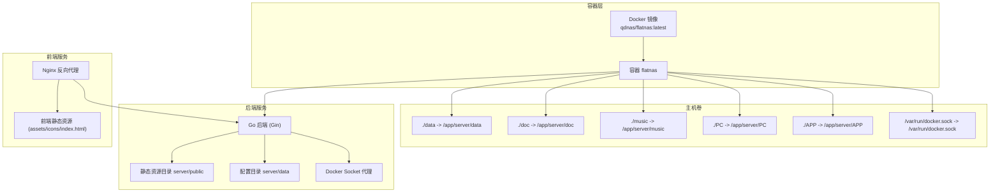
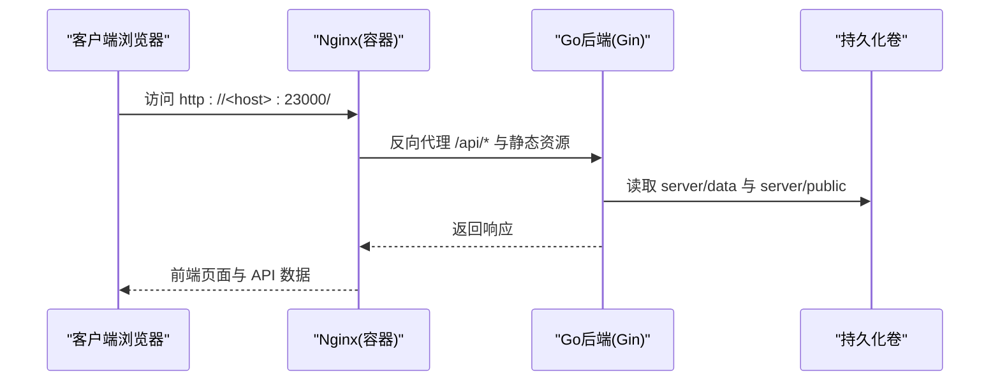
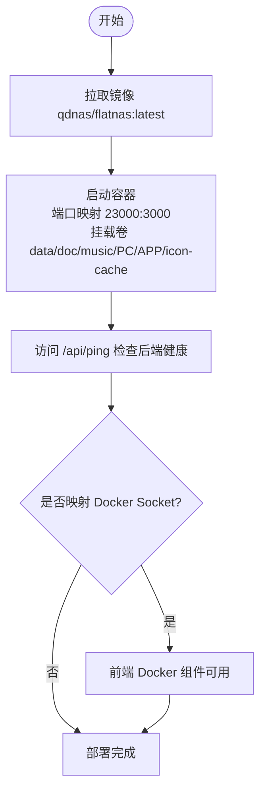
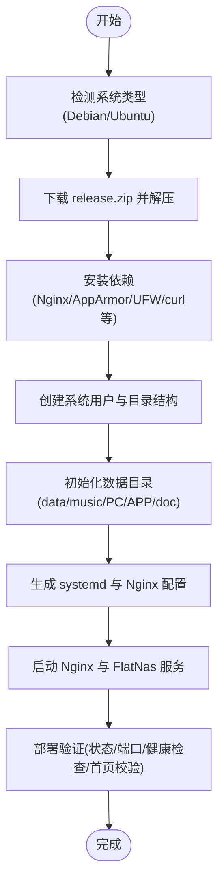
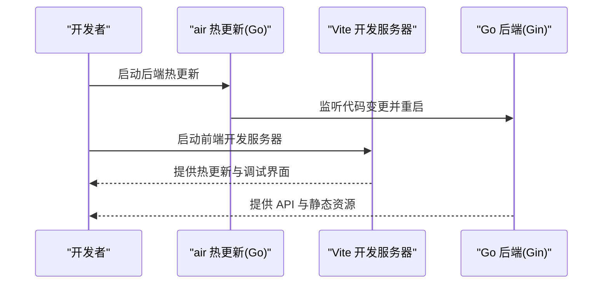
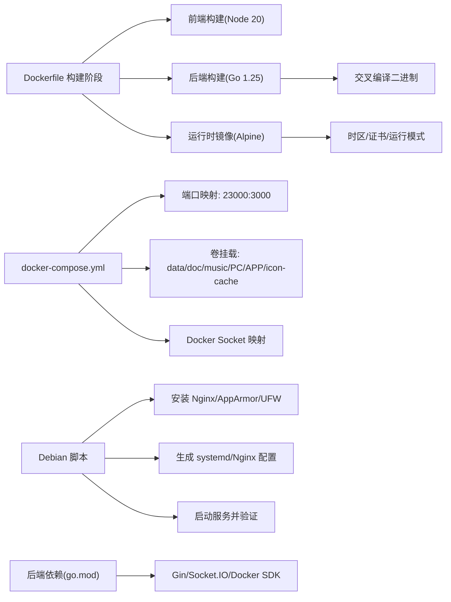

# 部署方式

<cite>
**本文档引用的文件**
- [Dockerfile](file://Dockerfile)
- [docker-compose.yml](file://docker-compose.yml)
- [deploy_debian.sh](file://deploy_debian.sh)
- [debian/deploy.sh](file://debian/deploy.sh)
- [manage.sh](file://manage.sh)
- [backend/start_backend.ps1](file://backend/start_backend.ps1)
- [frontend/start_frontend.ps1](file://frontend/start_frontend.ps1)
- [backend/.air.toml](file://backend/.air.toml)
- [backend/main.go](file://backend/main.go)
- [backend/config/config.go](file://backend/config/config.go)
- [backend/config/default.json](file://backend/config/default.json)
- [backend/go.mod](file://backend/go.mod)
- [README.md](file://README.md)
</cite>

## 目录
1. [简介](#简介)
2. [项目结构](#项目结构)
3. [核心组件](#核心组件)
4. [架构总览](#架构总览)
5. [详细组件分析](#详细组件分析)
6. [依赖关系分析](#依赖关系分析)
7. [性能考虑](#性能考虑)
8. [故障排查指南](#故障排查指南)
9. [结论](#结论)
10. [附录](#附录)

## 简介
本文件面向希望部署 OFlatNas 的用户，提供三种主要部署方式的完整说明：Docker 部署、Debian/Ubuntu 一键部署以及本地安装部署。内容涵盖前置条件、安装步骤、配置要点、Docker Compose 服务配置与卷挂载、Debian 脚本的使用与自定义选项、本地开发环境的启动与调试方法，并包含部署验证、常见问题排查与环境兼容性说明，帮助用户根据自身需求选择最合适的部署方案。

## 项目结构
OFlatNas 采用前后端分离架构：
- 后端：Go 语言（Gin 框架），负责 API、静态资源托管、Docker 管理、WebSocket、代理与系统配置等。
- 前端：Vue 3 + Vite，构建产物输出到后端的静态目录，由后端统一提供。
- 部署层：Docker 镜像、Compose 编排、Debian/Ubuntu 一键脚本、本地 Release 包。

图表来源
- [Dockerfile:1-93](file://Dockerfile#L1-L93)
- [docker-compose.yml:1-17](file://docker-compose.yml#L1-L17)

章节来源
- [Dockerfile:1-93](file://Dockerfile#L1-L93)
- [docker-compose.yml:1-17](file://docker-compose.yml#L1-L17)

## 核心组件
- Docker 镜像与 Compose
  - Dockerfile 完成前端构建（Node 20）与后端构建（Go 1.25），最终镜像暴露 3000 端口，挂载必要卷，运行后端二进制。
  - docker-compose.yml 定义服务名称、端口映射（宿主 23000:3000）、卷挂载（data/doc/music/PC/APP/icon-cache 等）与 Docker Socket 映射。
- Debian/Ubuntu 一键部署脚本
  - deploy_debian.sh：自动下载 Release、安装依赖、创建用户与目录、生成 systemd 与 Nginx 配置、初始化数据目录、启动服务并进行部署验证。
  - debian/deploy.sh：传统 Debian 部署脚本，功能类似但更精简。
  - manage.sh：部署后的管理面板，支持查看状态、修改端口、配置 HTTPS、查看日志、卸载等。
- 本地安装与开发
  - Release 包：直接运行后端二进制，访问 http://<服务器IP>:3000。
  - 本地开发：Windows 下使用 PowerShell 启动脚本，配合 air 热更新与 Vite 开发服务器。

章节来源
- [Dockerfile:1-93](file://Dockerfile#L1-L93)
- [docker-compose.yml:1-17](file://docker-compose.yml#L1-L17)
- [deploy_debian.sh:1-783](file://deploy_debian.sh#L1-L783)
- [debian/deploy.sh:1-472](file://debian/deploy.sh#L1-L472)
- [manage.sh:1-537](file://manage.sh#L1-L537)
- [backend/start_backend.ps1:1-5](file://backend/start_backend.ps1#L1-L5)
- [frontend/start_frontend.ps1:1-2](file://frontend/start_frontend.ps1#L1-L2)
- [backend/.air.toml:1-25](file://backend/.air.toml#L1-L25)

## 架构总览
下图展示 Docker 部署的整体架构：容器内的后端服务监听 3000 端口，Nginx 作为反向代理对外提供 23000 端口访问；容器通过卷挂载持久化数据与静态资源；同时映射 Docker Socket 以支持 Docker 管理功能。

图表来源
- [docker-compose.yml:8-16](file://docker-compose.yml#L8-L16)
- [Dockerfile:86-89](file://Dockerfile#L86-L89)

章节来源
- [docker-compose.yml:1-17](file://docker-compose.yml#L1-L17)
- [Dockerfile:1-93](file://Dockerfile#L1-L93)

## 详细组件分析

### Docker 部署
- 前置条件
  - 已安装 Docker 与 Docker Compose。
  - 确保宿主机开放 23000 端口（或自定义映射端口）。
  - 如需 Docker 管理功能，确保宿主机已安装 Docker 并允许访问 Docker Socket。
- 安装步骤
  - 使用 docker run 命令或 docker-compose.yml 启动容器。
  - 端口映射：宿主 23000:3000。
  - 卷挂载：data、doc、music、PC、APP、icon-cache 等目录映射到 /app/server 下对应位置；/var/run/docker.sock 映射到容器内。
- 配置要点
  - 环境变量：可通过环境变量配置代理（参考 README 的代理配置说明）。
  - 时区与运行模式：镜像设置时区为 Asia/Shanghai，运行模式为 release。
- 部署验证
  - 访问 http://<宿主IP>:23000，检查页面与静态资源加载。
  - 通过 /api/ping 接口验证后端健康状态。
  - 若启用 Docker 管理，可在前端 Docker 组件中查看容器状态。

图表来源
- [docker-compose.yml:1-17](file://docker-compose.yml#L1-L17)
- [Dockerfile:74-76](file://Dockerfile#L74-L76)

章节来源
- [docker-compose.yml:1-17](file://docker-compose.yml#L1-L17)
- [README.md:161-174](file://README.md#L161-L174)
- [README.md:176-195](file://README.md#L176-L195)

### Debian/Ubuntu 一键部署
- 前置条件
  - Debian/Ubuntu 系统。
  - 网络可访问 GitHub Releases，以下载最新 release.zip。
  - Root 权限执行脚本。
- 安装步骤
  - 下载 deploy_debian.sh 并赋予执行权限。
  - 运行脚本，按提示输入前端端口（默认 23000）与后端端口（默认 3000）。
  - 脚本自动安装 Nginx、AppArmor、UFW 等依赖，创建系统用户与目录，初始化数据目录，生成 systemd 与 Nginx 配置，启动服务并进行部署验证。
- 配置要点
  - 端口：前端端口与后端端口必须不同。
  - HTTPS：可通过 manage.sh 配置证书与 HTTPS。
  - 防火墙：脚本会配置 UFW 放通端口。
- 部署验证
  - systemctl 状态检查、端口监听检查、/api/ping 健康检查、前端首页拉取与静态资源完整性检查。
- 管理面板
  - 使用 manage.sh 查看状态、修改端口、配置 HTTPS、查看日志、重启服务、卸载。

图表来源
- [deploy_debian.sh:514-677](file://deploy_debian.sh#L514-L677)
- [manage.sh:420-449](file://manage.sh#L420-L449)

章节来源
- [deploy_debian.sh:1-783](file://deploy_debian.sh#L1-L783)
- [debian/deploy.sh:1-472](file://debian/deploy.sh#L1-L472)
- [manage.sh:1-537](file://manage.sh#L1-L537)
- [README.md:108-143](file://README.md#L108-L143)

### 本地安装部署（Release 包）
- 前置条件
  - 已能访问服务器，具备上传与执行权限。
- 安装步骤
  - 从 GitHub Releases 下载 release.zip，上传至服务器并解压到任意目录（如 /opt/flatnas）。
  - 进入目录，赋予后端二进制执行权限并启动。
  - 访问 http://<服务器IP>:3000。
- 配置要点
  - 默认密码为 admin，登录后应在设置中修改。
  - 数据文件位于 server/data/data.json，音乐文件放入 server/music。
- 部署验证
  - 页面加载正常，/api/ping 可用，静态资源可访问。

章节来源
- [README.md:145-159](file://README.md#L145-L159)

### 本地开发环境
- Windows 开发启动
  - 后端：使用 PowerShell 脚本启动 air 热更新，无需每次手动编译。
  - 前端：使用 PowerShell 脚本启动 Vite 开发服务器。
- 环境变量与代理
  - 可通过环境变量配置代理（参考 README 的代理配置说明）。
- 配置文件
  - 后端配置初始化逻辑在 config.Init() 中，自动创建基础目录与默认配置文件。

图表来源
- [backend/start_backend.ps1:1-5](file://backend/start_backend.ps1#L1-L5)
- [frontend/start_frontend.ps1:1-2](file://frontend/start_frontend.ps1#L1-L2)
- [backend/.air.toml:1-25](file://backend/.air.toml#L1-L25)

章节来源
- [backend/start_backend.ps1:1-5](file://backend/start_backend.ps1#L1-L5)
- [frontend/start_frontend.ps1:1-2](file://frontend/start_frontend.ps1#L1-L2)
- [backend/.air.toml:1-25](file://backend/.air.toml#L1-L25)
- [backend/config/config.go:35-86](file://backend/config/config.go#L35-L86)

## 依赖关系分析
- Docker 镜像构建阶段
  - 前端构建：Node 20 slim，使用 Vite 构建并输出到 server/public。
  - 后端构建：Go 1.25，交叉编译生成二进制，支持代理与 Go Modules。
  - 运行时：Alpine 基础镜像，安装时区与证书，设置时区与运行模式。
- Compose 服务依赖
  - 端口映射与卷挂载明确，Docker Socket 映射用于 Docker 管理。
- Debian/Ubuntu 部署依赖
  - 自动安装 Nginx、AppArmor、UFW、curl、lsof 等工具。
  - 生成 systemd 服务与 Nginx 配置，设置防火墙规则。
- 后端依赖
  - Gin、Socket.IO、Docker SDK、系统监控等第三方库。

图表来源
- [Dockerfile:1-93](file://Dockerfile#L1-L93)
- [docker-compose.yml:1-17](file://docker-compose.yml#L1-L17)
- [backend/go.mod:1-83](file://backend/go.mod#L1-L83)

章节来源
- [Dockerfile:1-93](file://Dockerfile#L1-L93)
- [docker-compose.yml:1-17](file://docker-compose.yml#L1-L17)
- [backend/go.mod:1-83](file://backend/go.mod#L1-L83)

## 性能考虑
- 前端构建
  - 使用 Vite 构建，生产构建时启用压缩与缓存策略，减少传输体积。
- 后端性能
  - Gin 模式设为 release，启用 Gzip 压缩，合理设置请求体大小上限。
  - Docker 管理与系统监控模块按需启用，避免不必要的开销。
- 部署性能
  - Docker Compose 与 Debian 脚本均提供最小化依赖安装与高效启动流程，缩短部署时间。

## 故障排查指南
- Docker 部署
  - 端口冲突：确认宿主机端口未被占用，或调整映射端口。
  - 卷挂载权限：确保映射目录存在且权限正确。
  - Docker Socket 权限：确认宿主机 Docker 服务可访问，且 Socket 映射正确。
  - 健康检查：访问 /api/ping，查看后端日志。
- Debian/Ubuntu 部署
  - 服务状态：systemctl status flatnas 与 systemctl status nginx。
  - 端口监听：ss -ltnH 检查端口监听状态。
  - 静态资源：确认 /api/ping 与首页加载正常，避免开发版前端产物被误部署。
  - HTTPS：通过 manage.sh 配置证书并检查 Nginx 配置。
- 本地安装
  - 默认密码：admin，登录后立即修改。
  - 数据文件：server/data/data.json，音乐文件放入 server/music。
- 代理与网络
  - 代理配置：参考 README 的代理配置说明，检查 PROXY_URL 格式与可用性。
  - 网络环境：后端具备智能网络环境检测，自动切换内外网访问策略。

章节来源
- [README.md:90-97](file://README.md#L90-L97)
- [README.md:106-159](file://README.md#L106-L159)
- [manage.sh:420-449](file://manage.sh#L420-L449)
- [deploy_debian.sh:450-499](file://deploy_debian.sh#L450-L499)

## 结论
OFlatNas 提供了灵活的多部署方式：Docker 适合快速上线与容器化管理；Debian/Ubuntu 一键脚本适合传统 Linux 服务器；本地安装适合已有服务器环境的快速部署；本地开发脚本则便于前端与后端协同调试。用户可根据自身环境与运维习惯选择最适合的部署方式，并结合本文档的配置与排障建议，顺利完成部署与维护。

## 附录
- 环境兼容性
  - Docker：支持多平台镜像构建与运行。
  - Debian/Ubuntu：脚本内置系统检测与依赖安装。
  - Windows：提供 PowerShell 启动脚本与 air 热更新。
- 常用配置项
  - 端口：前端端口（默认 23000）、后端端口（默认 3000）。
  - 代理：PROXY_URL 环境变量。
  - 时区：Asia/Shanghai（镜像默认）。
  - 运行模式：release（镜像默认）。