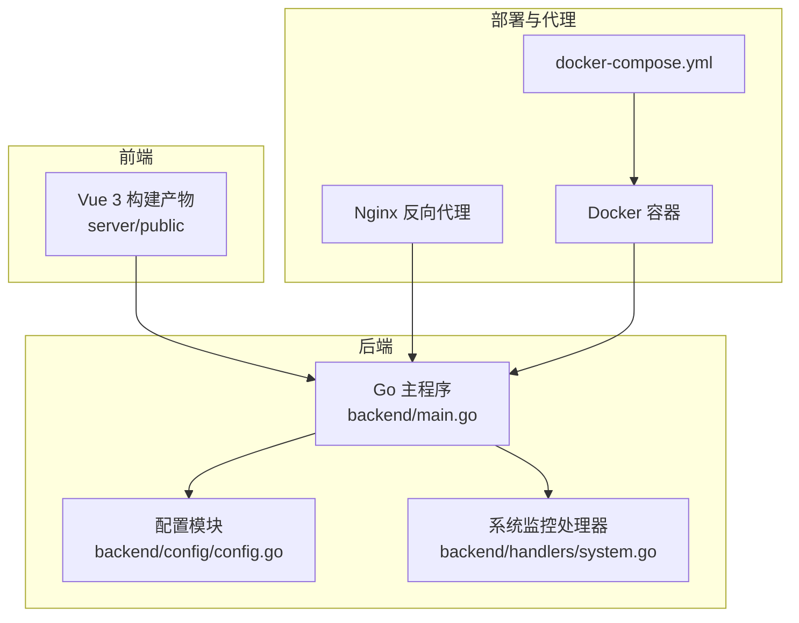
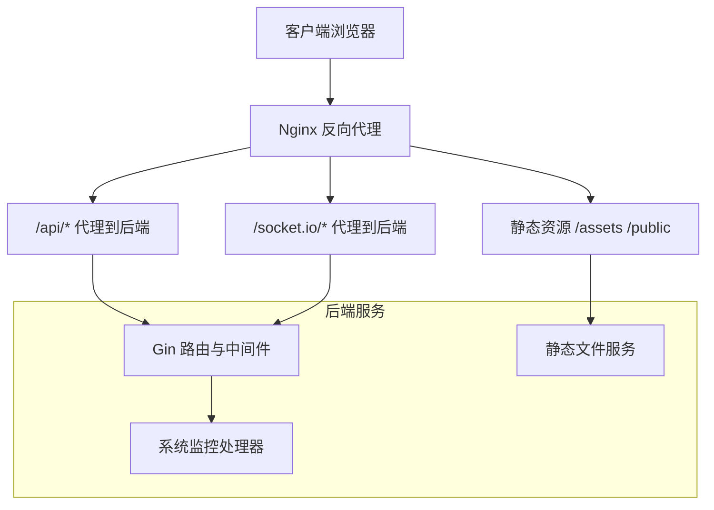
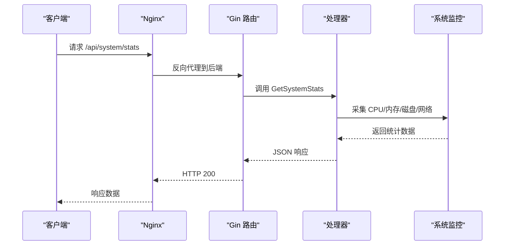
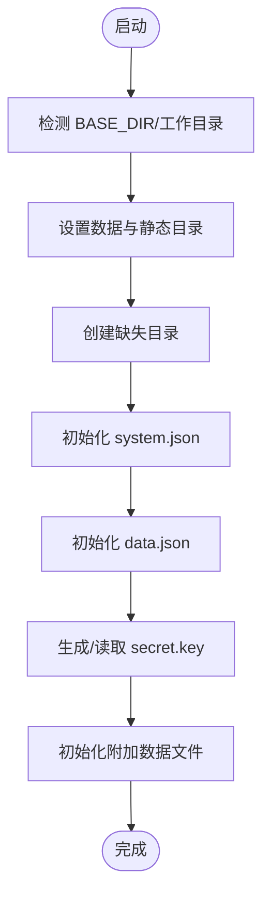
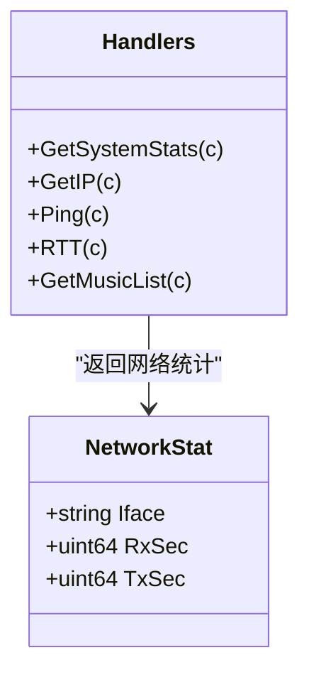
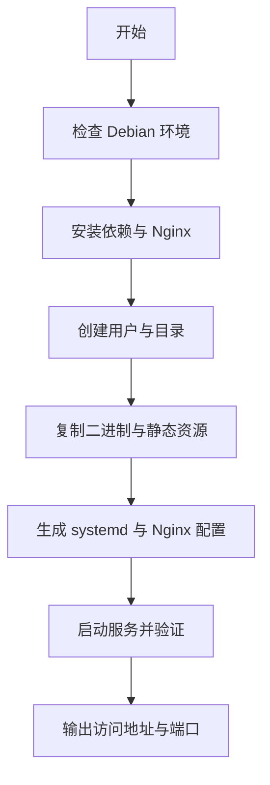
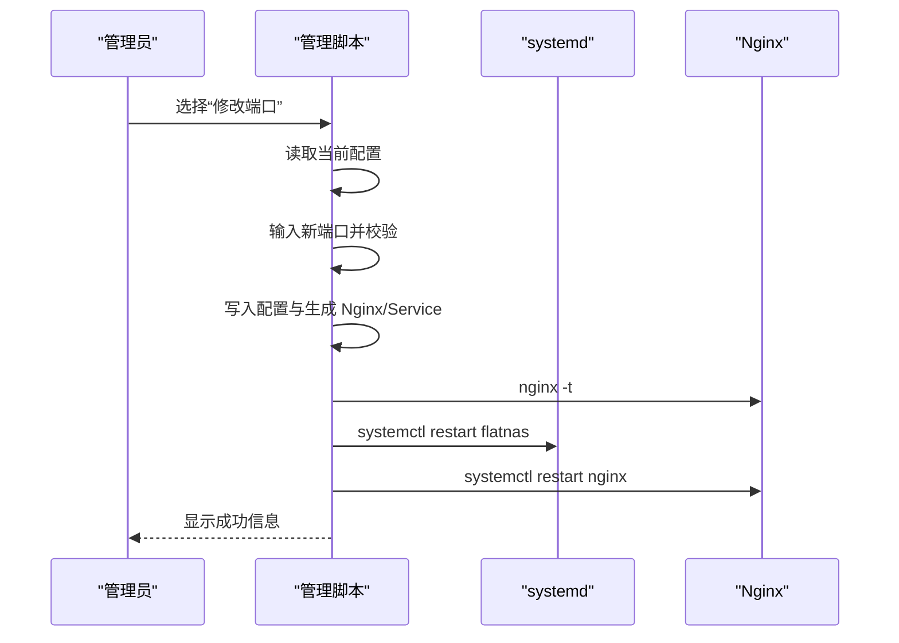
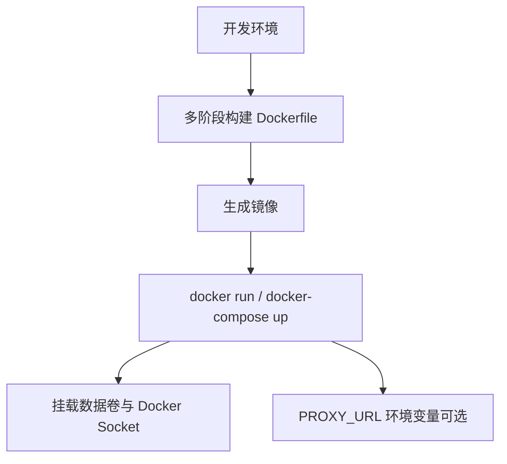
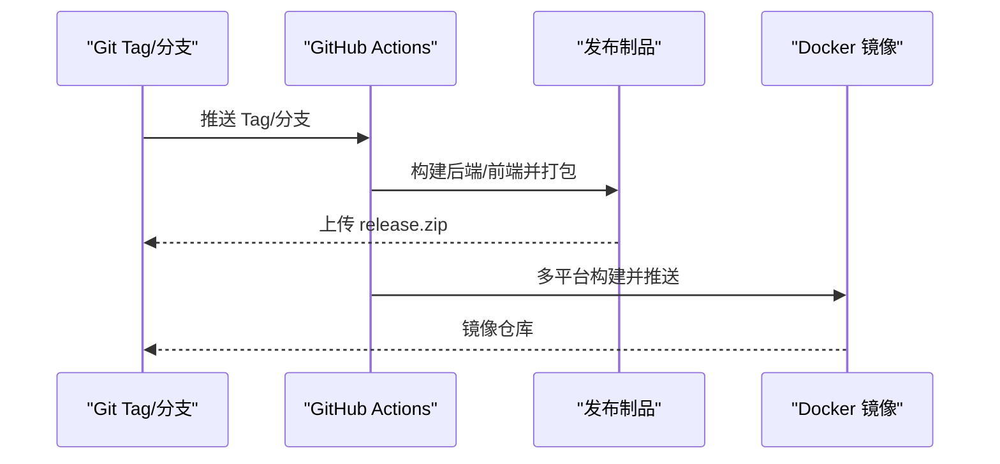
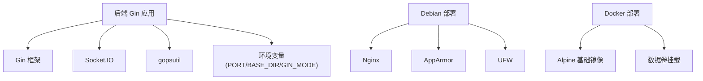

# 部署运维

<cite>
**本文档引用的文件**
- [README.md](file://README.md)
- [Dockerfile](file://Dockerfile)
- [docker-compose.yml](file://docker-compose.yml)
- [backend/main.go](file://backend/main.go)
- [backend/config/config.go](file://backend/config/config.go)
- [backend/handlers/system.go](file://backend/handlers/system.go)
- [debian/deploy.sh](file://debian/deploy.sh)
- [manage.sh](file://manage.sh)
- [deploy_debian.sh](file://deploy_debian.sh)
- [.github/workflows/docker-publish.yml](file://.github/workflows/docker-publish.yml)
- [.github/workflows/release.yml](file://.github/workflows/release.yml)
- [backend/start_backend.ps1](file://backend/start_backend.ps1)
- [frontend/start_frontend.ps1](file://frontend/start_frontend.ps1)
- [backend/.air.toml](file://backend/.air.toml)
- [debian/sync-packaged-artifacts.ps1](file://debian/sync-packaged-artifacts.ps1)
</cite>

## 目录
1. [简介](#简介)
2. [项目结构](#项目结构)
3. [核心组件](#核心组件)
4. [架构总览](#架构总览)
5. [详细组件分析](#详细组件分析)
6. [依赖关系分析](#依赖关系分析)
7. [性能考虑](#性能考虑)
8. [故障排除指南](#故障排除指南)
9. [结论](#结论)
10. [附录](#附录)

## 简介
本文件面向系统管理员与运维工程师，提供 OFlatNas 的生产级部署与运维指南。内容涵盖：
- 生产环境部署流程（Debian/Ubuntu 一键部署、Docker 部署、Docker Compose）
- Docker 配置优化与 Nginx 反向代理设置
- 不同部署方式的优缺点与适用场景
- 系统监控、日志管理与故障排除
- 性能调优建议、安全加固与备份恢复策略
- 自动化部署流程与 CI/CD 集成
- 运维脚本使用说明与自定义方法

## 项目结构
OFlatNas 采用前后端分离架构：
- 后端（Go + Gin）：提供 API、静态资源托管、系统监控、Docker 管理、代理转发等能力
- 前端（Vue 3）：构建后的静态资源放置于 server/public，由后端统一提供
- 部署支持：
  - Debian/Ubuntu 一键部署脚本（Nginx + systemd）
  - Docker 镜像与 Compose 编排
  - GitHub Actions 自动发布与镜像推送

图表来源
- [backend/main.go:1-267](file://backend/main.go#L1-L267)
- [backend/config/config.go:1-257](file://backend/config/config.go#L1-L257)
- [backend/handlers/system.go:1-629](file://backend/handlers/system.go#L1-L629)
- [Dockerfile:1-93](file://Dockerfile#L1-L93)
- [docker-compose.yml:1-17](file://docker-compose.yml#L1-L17)
- [debian/deploy.sh:1-472](file://debian/deploy.sh#L1-L472)

章节来源
- [README.md:106-196](file://README.md#L106-L196)
- [Dockerfile:1-93](file://Dockerfile#L1-L93)
- [docker-compose.yml:1-17](file://docker-compose.yml#L1-L17)
- [backend/main.go:1-267](file://backend/main.go#L1-L267)
- [backend/config/config.go:1-257](file://backend/config/config.go#L1-L257)
- [backend/handlers/system.go:1-629](file://backend/handlers/system.go#L1-L629)
- [debian/deploy.sh:1-472](file://debian/deploy.sh#L1-L472)

## 核心组件
- 后端主程序
  - 初始化配置、注册路由、CORS/Gzip 中间件、Socket.IO 服务、静态资源托管
  - 端口可通过环境变量 PORT 指定，默认 3000
- 配置模块
  - 自动解析 BASE_DIR，推导 server/data、server/public 等目录
  - 初始化系统配置、默认数据文件、密钥文件与附加数据文件
- 系统监控处理器
  - CPU/内存/磁盘/网络/主机信息采集与速率计算
  - 公网 IP 采集与缓存，支持刷新
- Debian 部署脚本
  - 自动安装 Nginx、创建用户与目录、生成 systemd 与 Nginx 配置、健康检查
- 管理脚本
  - 端口修改、HTTPS 配置、日志查看、服务重启、卸载
- Docker 与 CI/CD
  - Dockerfile 多阶段构建、多平台镜像推送、GitHub Actions 自动发布

章节来源
- [backend/main.go:25-267](file://backend/main.go#L25-L267)
- [backend/config/config.go:35-257](file://backend/config/config.go#L35-L257)
- [backend/handlers/system.go:51-203](file://backend/handlers/system.go#L51-L203)
- [debian/deploy.sh:168-263](file://debian/deploy.sh#L168-L263)
- [manage.sh:292-320](file://manage.sh#L292-L320)
- [.github/workflows/docker-publish.yml:1-80](file://.github/workflows/docker-publish.yml#L1-L80)
- [.github/workflows/release.yml:1-91](file://.github/workflows/release.yml#L1-L91)

## 架构总览
OFlatNas 的生产部署通常采用“Nginx + Go 后端 + 数据卷”的组合：
- Nginx 作为反向代理与静态资源服务器，负责 gzip、缓存、SPA 路由回退
- 后端提供 API、静态资源、系统监控、Docker 管理、代理转发等
- 数据卷挂载 server/data、server/music、server/PC、server/APP、server/doc 等目录

图表来源
- [debian/deploy.sh:198-249](file://debian/deploy.sh#L198-L249)
- [backend/main.go:116-164](file://backend/main.go#L116-L164)
- [backend/handlers/system.go:51-203](file://backend/handlers/system.go#L51-L203)

章节来源
- [debian/deploy.sh:198-249](file://debian/deploy.sh#L198-L249)
- [backend/main.go:116-164](file://backend/main.go#L116-L164)

## 详细组件分析

### 后端主程序（Gin 路由与中间件）
- 初始化顺序：配置初始化、Docker 初始化、IP 采集器、数据预热、缩略图同步
- 中间件：日志、恢复、Gzip 解压、CORS（可配置允许来源）、Socket.IO
- 静态资源：/assets、/icons、/music、/backgrounds、/mobile_backgrounds、/icon-cache、/public
- API 分组：
  - /api（公开接口：登录、数据、版本、系统配置、IP、热点、RSS、天气、自定义脚本、Docker 状态、代理状态、图片、音乐列表等）
  - /api（鉴权接口：用户管理、保存数据、系统统计、Docker 管理、壁纸、背景、传输、配置版本）

图表来源
- [backend/main.go:165-254](file://backend/main.go#L165-L254)
- [backend/handlers/system.go:51-203](file://backend/handlers/system.go#L51-L203)

章节来源
- [backend/main.go:25-267](file://backend/main.go#L25-L267)
- [backend/handlers/system.go:51-203](file://backend/handlers/system.go#L51-L203)

### 配置模块（目录与文件初始化）
- 自动推导 BaseDir，生成 DataDir、PublicDir、MusicDir、DocDir、BackgroundsDir、MobileBackgroundsDir、IconCacheDir、ConfigVersionsDir
- 确保目录存在，初始化 system.json、data.json、secret.key、amap_stats.json、visitors.json、custom_scripts.json、widget_cache.json
- SecretKey 自动生成并持久化

图表来源
- [backend/config/config.go:35-257](file://backend/config/config.go#L35-L257)

章节来源
- [backend/config/config.go:35-257](file://backend/config/config.go#L35-L257)

### 系统监控处理器（CPU/内存/磁盘/网络/主机）
- CPU：计算用户/系统/总负载，核数、品牌、主频
- 内存：总量、使用量、活跃、可用
- 磁盘：卷路径、类型、容量、使用率
- 网络：按网卡统计 RX/TX 速率，带锁并发安全
- 主机：发行版、内核版本、主机名、架构、运行时长
- 公网 IP：定时缓存，支持刷新

图表来源
- [backend/handlers/system.go:30-45](file://backend/handlers/system.go#L30-L45)
- [backend/handlers/system.go:51-203](file://backend/handlers/system.go#L51-L203)

章节来源
- [backend/handlers/system.go:51-203](file://backend/handlers/system.go#L51-L203)

### Debian 一键部署脚本（Nginx + Go）
- 自动安装 Nginx、curl、iproute2、lsof
- 创建系统用户、目录结构、复制二进制与静态资源
- 生成 systemd 服务与 Nginx 配置（gzip、静态缓存、SPA 路由、API/Socket.IO 代理）
- 健康检查：后端端口监听、/api/ping、前端首页校验
- 权限设置：目录属主与权限修正

图表来源
- [deploy_debian.sh:514-677](file://deploy_debian.sh#L514-L677)
- [debian/deploy.sh:168-263](file://debian/deploy.sh#L168-L263)

章节来源
- [deploy_debian.sh:514-677](file://deploy_debian.sh#L514-L677)
- [debian/deploy.sh:168-263](file://debian/deploy.sh#L168-L263)

### 管理脚本（端口、HTTPS、日志、卸载）
- 端口修改：前端端口与后端端口独立配置，生成 Nginx 与 systemd 配置并重启服务
- HTTPS 配置：证书与私钥拷贝到 /etc/nginx/ssl/flatnas，生成 HTTPS 配置并重启
- 日志查看：journalctl 实时跟踪后端服务日志
- 卸载：停止服务、删除配置与文件、删除用户、重启 Nginx

图表来源
- [manage.sh:343-382](file://manage.sh#L343-L382)
- [manage.sh:172-290](file://manage.sh#L172-L290)

章节来源
- [manage.sh:343-382](file://manage.sh#L343-L382)
- [manage.sh:172-290](file://manage.sh#L172-L290)

### Docker 部署与优化
- 多阶段构建：前端构建（Node 20.19-alpine）、后端构建（Go Alpine）、最终镜像（Alpine + 时区 + GIN_MODE=release + EXPOSE 3000）
- 环境变量：TZ、GIN_MODE、BASE_DIR、CORS_ALLOW_ORIGINS、PORT
- 卷映射：/app/server/data、/app/server/music、/app/server/PC、/app/server/APP、/app/server/doc、/var/run/docker.sock
- Compose 示例：端口映射 23000:3000，挂载数据卷

图表来源
- [Dockerfile:1-93](file://Dockerfile#L1-L93)
- [docker-compose.yml:1-17](file://docker-compose.yml#L1-L17)

章节来源
- [Dockerfile:1-93](file://Dockerfile#L1-L93)
- [docker-compose.yml:1-17](file://docker-compose.yml#L1-L17)

### CI/CD 自动化
- 发布流水线：构建后端（Linux amd64）、构建前端、打包 release.zip、上传到 GitHub Release
- 镜像流水线：多平台（amd64/arm64/arm/v7）构建与推送 Docker Hub，带标签（tag/raw、VERSION、latest）

图表来源
- [.github/workflows/release.yml:1-91](file://.github/workflows/release.yml#L1-L91)
- [.github/workflows/docker-publish.yml:1-80](file://.github/workflows/docker-publish.yml#L1-L80)

章节来源
- [.github/workflows/release.yml:1-91](file://.github/workflows/release.yml#L1-L91)
- [.github/workflows/docker-publish.yml:1-80](file://.github/workflows/docker-publish.yml#L1-L80)

## 依赖关系分析
- 后端依赖
  - Gin、Socket.IO、CORS、Gzip、gopsutil（系统监控）
  - 环境变量：PORT、BASE_DIR、GIN_MODE、PUBLIC_DIR、CORS_ALLOW_ORIGINS
- Debian 部署依赖
  - Nginx、curl、iproute2、lsof、AppArmor、UFW
- Docker 依赖
  - Alpine 基础镜像、时区数据、Docker Socket 权限

图表来源
- [backend/main.go:15-47](file://backend/main.go#L15-L47)
- [backend/handlers/system.go:23-28](file://backend/handlers/system.go#L23-L28)
- [deploy_debian.sh:612-618](file://deploy_debian.sh#L612-L618)
- [Dockerfile:65-92](file://Dockerfile#L65-L92)

章节来源
- [backend/main.go:15-47](file://backend/main.go#L15-L47)
- [deploy_debian.sh:612-618](file://deploy_debian.sh#L612-L618)
- [Dockerfile:65-92](file://Dockerfile#L65-L92)

## 性能考虑
- 压缩与缓存
  - 后端启用 Gzip 压缩，减少传输体积
  - Nginx 启用 gzip 与静态资源缓存（expires 1y/30d）
- 端口与并发
  - systemd LimitNOFILE=65535，提升文件描述符上限
  - GIN_MODE=release，生产模式优化
- 系统监控
  - 网络 RX/TX 速率按接口统计，避免频繁系统调用
  - CPU/内存/磁盘采样间隔合理，避免高开销
- 前端产物
  - 使用 release.zip 的 server/public，避免开发版 Vite 资源混入

章节来源
- [backend/main.go:42-47](file://backend/main.go#L42-L47)
- [debian/deploy.sh:209-217](file://debian/deploy.sh#L209-L217)
- [manage.sh:246-253](file://manage.sh#L246-L253)
- [deploy_debian.sh:486-496](file://deploy_debian.sh#L486-L496)

## 故障排除指南
- 健康检查
  - 后端：/api/ping、/api/rtt
  - 前端：访问根路径，检查 /assets 引用
- 日志定位
  - systemd 日志：journalctl -u flatnas -n 50 -f
  - Nginx 访问/错误日志：/var/log/flatnas/nginx-access.log、/var/log/flatnas/nginx-error.log
- 常见问题
  - 端口占用：lsof -iTCP:<port> -sTCP:LISTEN
  - 静态资源 403/404：检查 PUBLIC_DIR 权限与 Nginx root 配置
  - Docker Socket 权限：确保 /var/run/docker.sock 可读
  - 代理配置：PROXY_URL 格式与可用性，查看后端日志中的 [Proxy Error]
- 卸载与回滚
  - 卸载：停止服务、删除配置与文件、删除用户、重启 Nginx
  - 回滚：使用 deploy_debian.sh rollback，从 /var/backups/flatnas 恢复

章节来源
- [debian/deploy.sh:276-321](file://debian/deploy.sh#L276-L321)
- [manage.sh:420-449](file://manage.sh#L420-L449)
- [deploy_debian.sh:679-727](file://deploy_debian.sh#L679-L727)
- [README.md:90-97](file://README.md#L90-L97)

## 结论
OFlatNas 提供了灵活的部署方式与完善的运维工具链。生产环境推荐使用 Debian 一键部署（Nginx + systemd）或 Docker 方案，结合 CI/CD 自动化发布与镜像推送。通过合理的 Nginx 代理、Gzip 压缩、系统监控与日志管理，可实现稳定可靠的运行与维护。

## 附录

### 部署方式对比与适用场景
- Debian 一键部署
  - 优点：简单、可控、便于二次定制、日志与权限清晰
  - 缺点：需自行维护 Nginx 与 systemd
  - 适用：对部署细节有要求、需要与现有基础设施集成的场景
- Docker 部署
  - 优点：隔离性好、跨平台、易于横向扩展
  - 缺点：网络与卷管理复杂度上升
  - 适用：容器化平台、微服务编排、快速扩容
- Docker Compose
  - 优点：编排简单、一键启动
  - 缺点：生产环境建议配合 systemd/Nginx
  - 适用：开发测试、演示环境

章节来源
- [README.md:106-196](file://README.md#L106-L196)
- [docker-compose.yml:1-17](file://docker-compose.yml#L1-L17)

### Nginx 代理配置要点
- gzip 与静态缓存
- SPA 路由回退到 index.html
- API 与 /socket.io 代理到后端 127.0.0.1:PORT
- HTTPS（可选）：301 跳转与证书配置

章节来源
- [debian/deploy.sh:198-249](file://debian/deploy.sh#L198-L249)
- [manage.sh:172-290](file://manage.sh#L172-L290)

### Docker 配置优化建议
- 环境变量：设置 TZ、GIN_MODE=release、BASE_DIR、CORS_ALLOW_ORIGINS
- 端口映射：避免与宿主冲突，建议固定映射
- 卷权限：确保数据卷属主为非 root 用户
- 多平台镜像：arm64/v7 与 amd64 并存，满足不同硬件

章节来源
- [Dockerfile:73-92](file://Dockerfile#L73-L92)
- [docker-compose.yml:8-16](file://docker-compose.yml#L8-L16)

### 自动化部署与 CI/CD 集成
- 发布制品：release.zip 包含后端二进制与 server/public
- 镜像推送：多平台标签管理，latest 与版本标签
- 一键部署：deploy_debian.sh 支持安装、卸载、回滚

章节来源
- [.github/workflows/release.yml:54-88](file://.github/workflows/release.yml#L54-L88)
- [.github/workflows/docker-publish.yml:59-62](file://.github/workflows/docker-publish.yml#L59-L62)
- [deploy_debian.sh:514-677](file://deploy_debian.sh#L514-L677)

### 运维脚本使用说明
- deploy_debian.sh
  - install：从 GitHub 下载 release.zip，安装并启动服务
  - uninstall：完全卸载
  - rollback：从备份回滚
- manage.sh
  - 端口修改、HTTPS 配置、日志查看、服务重启、卸载
- 同步脚本（Windows）
  - 同步前端构建产物到 debian/server/public，便于离线包

章节来源
- [deploy_debian.sh:768-782](file://deploy_debian.sh#L768-L782)
- [manage.sh:497-531](file://manage.sh#L497-L531)
- [debian/sync-packaged-artifacts.ps1:1-49](file://debian/sync-packaged-artifacts.ps1#L1-L49)

### 开发调试辅助
- air 热更新：go run github.com/air-verse/air@latest
- 前端开发：npm run dev
- 后端开发：.air.toml 配置排除目录与延迟

章节来源
- [backend/start_backend.ps1:1-5](file://backend/start_backend.ps1#L1-L5)
- [frontend/start_frontend.ps1:1-2](file://frontend/start_frontend.ps1#L1-L2)
- [backend/.air.toml:1-25](file://backend/.air.toml#L1-L25)