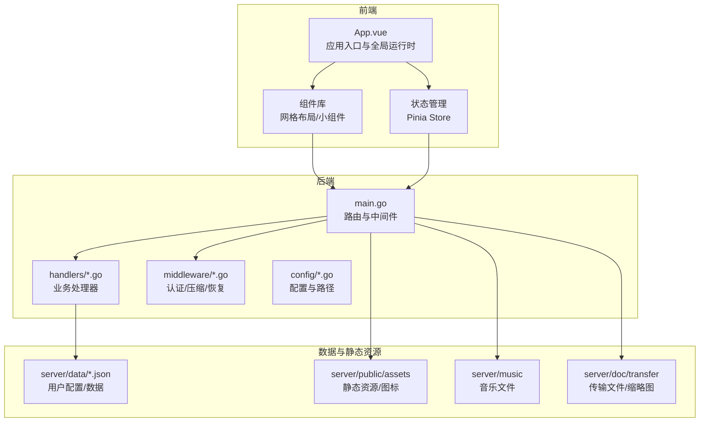
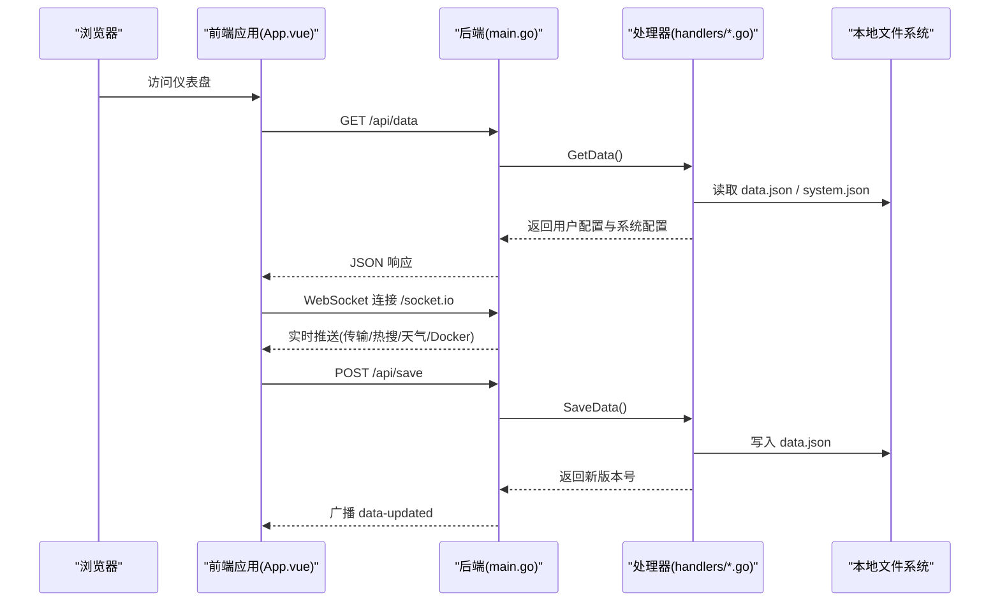
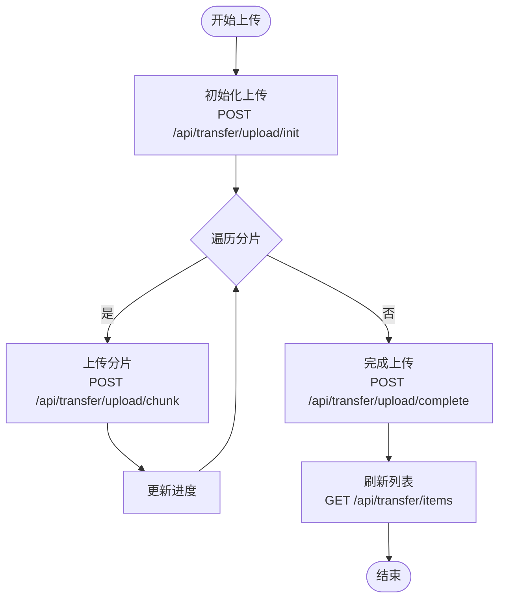
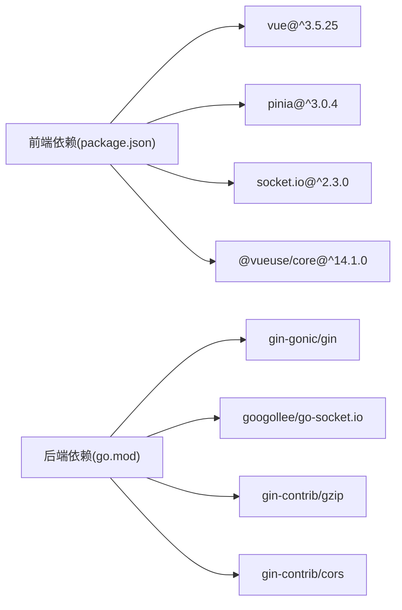

# 功能特性概览

<cite>
**本文档引用的文件**
- [README.md](file://README.md)
- [frontend/src/App.vue](file://frontend/src/App.vue)
- [backend/main.go](file://backend/main.go)
- [frontend/package.json](file://frontend/package.json)
- [frontend/src/components/BookmarkWidget.vue](file://frontend/src/components/BookmarkWidget.vue)
- [frontend/src/components/ClockWeatherWidget.vue](file://frontend/src/components/ClockWeatherWidget.vue)
- [frontend/src/components/FileTransferWidget.vue](file://frontend/src/components/FileTransferWidget.vue)
- [frontend/src/components/MusicWidget.vue](file://frontend/src/components/MusicWidget.vue)
- [frontend/src/components/RssWidget.vue](file://frontend/src/components/RssWidget.vue)
- [frontend/src/components/HotWidget.vue](file://frontend/src/components/HotWidget.vue)
- [frontend/src/components/DockerWidget.vue](file://frontend/src/components/DockerWidget.vue)
- [frontend/src/components/SystemStatusWidget.vue](file://frontend/src/components/SystemStatusWidget.vue)
- [backend/handlers/data.go](file://backend/handlers/data.go)
</cite>

## 目录
1. [简介](#简介)
2. [项目结构](#项目结构)
3. [核心组件](#核心组件)
4. [架构总览](#架构总览)
5. [详细组件分析](#详细组件分析)
6. [依赖关系分析](#依赖关系分析)
7. [性能考虑](#性能考虑)
8. [故障排除指南](#故障排除指南)
9. [结论](#结论)
10. [附录](#附录)

## 简介
OFlatNas 是一个轻量级、高度可定制的个人导航页与仪表盘系统，基于 Vue 3 与 Go(Gin) 构建，面向 NAS 用户、极客与开发者，提供多端统一入口、文件传输、媒体管理、Docker 管理、系统监控、内容服务等核心能力。项目强调本地数据可控、智能网络环境检测、可视化组件生态与低资源占用。

## 项目结构
- 前端采用 Vue 3 + TypeScript，通过 Vite 构建，提供响应式布局与丰富的小组件生态。
- 后端采用 Go Gin 框架，提供 API、静态资源服务、Socket.IO 实时通信与代理转发能力。
- 数据持久化于本地目录，支持配置与数据的导入导出、版本控制与备份。

**图表来源**
- [frontend/src/App.vue:1-666](file://frontend/src/App.vue#L1-L666)
- [backend/main.go:1-267](file://backend/main.go#L1-L267)

**章节来源**
- [README.md:1-292](file://README.md#L1-L292)
- [frontend/package.json:1-77](file://frontend/package.json#L1-L77)

## 核心组件
- 仪表盘与布局：网格布局、分组管理、响应式设计、所见即所得编辑模式。
- 文件与媒体能力：文件传输助手、音乐播放器、壁纸管理。
- 内外网智能切换：自动识别网络环境并路由到最佳地址。
- 本地数据可控：配置与数据存储在本地目录，支持导入导出与版本控制。
- 可视化组件生态：内置多种小组件，支持自定义 CSS/JS 扩展。
- Docker 管理：查看、启动、停止、重启容器，升级镜像与健康状态监控。
- 系统监控：CPU、内存、磁盘、网络、温度与系统信息展示。
- 内容服务：RSS 订阅、热搜榜单、天气与时钟、书签组件等。

**章节来源**
- [README.md:13-70](file://README.md#L13-L70)

## 架构总览
系统采用前后端分离架构，前端负责 UI 与交互，后端提供 API、静态资源与实时通信。Socket.IO 用于实时推送（如传输更新、RSS/热搜刷新、Docker 状态变化）。后端还提供代理转发能力，解决内网服务访问外网资源的问题。

**图表来源**
- [backend/main.go:165-254](file://backend/main.go#L165-L254)
- [backend/handlers/data.go:159-322](file://backend/handlers/data.go#L159-L322)

**章节来源**
- [backend/main.go:1-267](file://backend/main.go#L1-L267)
- [backend/handlers/data.go:1-1007](file://backend/handlers/data.go#L1-L1007)

## 详细组件分析

### 仪表盘与布局管理
- 网格布局：支持拖拽排序、自由组合不同尺寸组件，适配桌面与移动端。
- 分组管理：支持创建多个分组，分类管理应用与书签。
- 响应式设计：针对不同屏幕尺寸优化显示与交互。
- 编辑模式：提供直观的所见即所得编辑体验，支持增删改组件与分组。

**章节来源**
- [README.md:23-29](file://README.md#L23-L29)

### 文件传输助手
- 跨设备传输：支持发送文本、文件与图片，具备断点续传与大文件上传能力。
- 图片视图：自动归类并生成缩略图，提供专属图片浏览体验。
- 实时同步：通过 Socket.IO 实时推送传输状态与新增项。
- 安全与鉴权：支持令牌鉴权，保障传输安全。

**图表来源**
- [frontend/src/components/FileTransferWidget.vue:622-764](file://frontend/src/components/FileTransferWidget.vue#L622-L764)

**章节来源**
- [README.md:35-36](file://README.md#L35-L36)
- [frontend/src/components/FileTransferWidget.vue:1-800](file://frontend/src/components/FileTransferWidget.vue#L1-L800)

### 书签组件
- 快速访问常用网站，支持自定义图标与分类管理。
- 搜索与导入：支持关键词搜索与浏览器书签 HTML 导入。
- 安全拦截：未登录状态下禁止访问内网资源，提升安全性。
- 本地备份：支持本地备份与恢复，避免数据丢失。

**章节来源**
- [README.md:36-37](file://README.md#L36-L37)
- [frontend/src/components/BookmarkWidget.vue:1-574](file://frontend/src/components/BookmarkWidget.vue#L1-L574)

### 时钟与天气
- 实时显示时间、日期与当地天气，支持自动定位与手动城市设置。
- 多种天气源：支持高德/和风等多种天气源，具备回退机制。
- 动态背景：根据天气类型动态切换背景与动画效果。
- 本地缓存：自动定位结果短期缓存，降低请求频率。

**章节来源**
- [README.md:37-38](file://README.md#L37-L38)
- [frontend/src/components/ClockWeatherWidget.vue:1-777](file://frontend/src/components/ClockWeatherWidget.vue#L1-L777)

### RSS 订阅
- 多源订阅：支持多个 RSS 源，拖拽排序与启用/禁用管理。
- 自动刷新：定时轮询与可见性感知，避免后台浪费。
- 超时与错误处理：请求超时与失败提示，支持手动重试。

**章节来源**
- [README.md:40-40](file://README.md#L40-L40)
- [frontend/src/components/RssWidget.vue:1-347](file://frontend/src/components/RssWidget.vue#L1-L347)

### 热搜榜单
- 微博/新闻/哔哩哔哩热搜：三类榜单轮播展示。
- 热度标识：前 3 名高亮显示，支持热度数值展示。
- 轮询刷新：定时刷新与可见性感知，保证时效性。

**章节来源**
- [README.md:41-41](file://README.md#L41-L41)
- [frontend/src/components/HotWidget.vue:1-276](file://frontend/src/components/HotWidget.vue#L1-L276)

### 音乐播放器
- 内置迷你播放器：支持播放服务器端本地音乐文件。
- 播放控制：播放/暂停、上一首/下一首、音量调节。
- 视觉效果：支持歌词、频谱分析、抽象动画与黑胶封面等视觉模式。
- 多端同步：支持全局音频元素，跨分组共享播放状态。

**章节来源**
- [README.md:43-43](file://README.md#L43-L43)
- [frontend/src/components/MusicWidget.vue:1-800](file://frontend/src/components/MusicWidget.vue#L1-L800)

### Docker 管理
- 容器管理：查看、启动、停止、重启容器，支持批量操作。
- 状态监控：CPU、内存、网络与块 IO 统计，健康状态指示。
- 端口映射：自动识别常用 Web 端口，支持 LAN/公网地址跳转。
- 自动升级：支持定时检查镜像更新并重建容器，具备磁盘保护与灰度验证。

**章节来源**
- [README.md:44-44](file://README.md#L44-L44)
- [frontend/src/components/DockerWidget.vue:1-1326](file://frontend/src/components/DockerWidget.vue#L1-L1326)

### 系统监控
- 系统信息：CPU 使用率、内存使用、磁盘占用、网络流量与温度。
- 设备信息：操作系统、内核、主机名与运行时长。
- 轮询策略：根据可见性与错误次数动态调整轮询频率，降低资源消耗。

**章节来源**
- [README.md:45-45](file://README.md#L45-L45)
- [frontend/src/components/SystemStatusWidget.vue:1-346](file://frontend/src/components/SystemStatusWidget.vue#L1-L346)

### 多端统一入口与智能网络环境检测
- 多端统一入口：聚合常用网站、内网服务与工具，提供一致的访问体验。
- 智能网络检测：结合客户端 IP、访问域名与网络延迟，自动切换内外网访问策略，实现无感切换。

**章节来源**
- [README.md:15-15](file://README.md#L15-L15)
- [README.md:98-105](file://README.md#L98-L105)

### 本地数据可控与安全
- 本地存储：配置与数据存储在本地目录，便于迁移与备份。
- 密码保护：默认密码可在设置中修改，保护隐私配置。
- 数据安全：支持导入导出、版本控制与冲突解决，防止数据丢失。

**章节来源**
- [README.md:65-68](file://README.md#L65-L68)
- [backend/handlers/data.go:638-744](file://backend/handlers/data.go#L638-L744)

## 依赖关系分析
- 前端依赖：Vue 3、Pinia、Socket.IO、VueUse、Grid Layout Plus 等，提供响应式与交互能力。
- 后端依赖：Gin、Socket.IO、CORS、Gzip 压缩等，提供高性能 API 与实时通信。
- 数据与静态资源：本地 JSON 文件、静态资源目录、音乐与传输文件目录。

**图表来源**
- [frontend/package.json:22-47](file://frontend/package.json#L22-L47)
- [backend/main.go:15-23](file://backend/main.go#L15-L23)

**章节来源**
- [frontend/package.json:1-77](file://frontend/package.json#L1-L77)
- [backend/main.go:1-267](file://backend/main.go#L1-L267)

## 性能考虑
- 前端：使用响应式布局与虚拟滚动，减少 DOM 节点；组件懒加载与按需渲染，降低首屏压力。
- 后端：启用 Gzip 压缩与 CORS 配置，减少网络传输；Socket.IO 优化连接与事件广播；缓存策略（如 GetData 缓存）降低重复读取开销。
- 资源占用：NAS 端内存占用约 100MB，访问端真实内存占用不到 80MB，适合低资源环境运行。

**章节来源**
- [README.md:20-21](file://README.md#L20-L21)
- [backend/main.go:42-46](file://backend/main.go#L42-L46)
- [backend/handlers/data.go:193-218](file://backend/handlers/data.go#L193-L218)

## 故障排除指南
- 代理开关不显示：检查后端日志，确认 PROXY_URL 格式正确；访问 /api/config/proxy-status 查看代理可用状态。
- 请求失败：检查 PROXY_URL 指向的代理服务器可达性；确认目标 URL 未触发 SSRF 防护规则；查看后端日志 [Proxy Error] 获取详细错误信息。
- 传输失败：检查分片大小与网络稳定性；确认缩略图生成与权限；关注实时保存失败提示与错误码。
- Docker 连接失败：确认 /var/run/docker.sock 已挂载；检查 dockerHost 配置；Windows 需管理员权限访问 Docker 引擎。

**章节来源**
- [README.md:90-97](file://README.md#L90-L97)
- [frontend/src/components/FileTransferWidget.vue:384-394](file://frontend/src/components/FileTransferWidget.vue#L384-L394)
- [frontend/src/components/DockerWidget.vue:169-189](file://frontend/src/components/DockerWidget.vue#L169-L189)

## 结论
OFlatNas 通过前后端分离架构与丰富的小组件生态，为用户提供了一个轻量、可定制、本地可控的个人导航页与仪表盘解决方案。其多端统一入口、智能网络环境检测与强大的 Docker/系统监控能力，使其特别适合 NAS 场景与开发者使用。配合灵活的自定义扩展与低资源占用，OFlatNas 能够在保证易用性的同时满足多样化的使用需求。

## 附录

### 功能对比表
- 多端统一入口：✓ 支持
- 文件与媒体能力：✓ 支持（传输/音乐/壁纸）
- 内外网智能切换：✓ 支持
- 本地数据可控：✓ 支持
- 可视化组件生态：✓ 支持（15+ 内置组件）
- Docker 管理：✓ 支持
- 系统监控：✓ 支持
- 代理配置：✓ 支持
- 自定义 CSS/JS：✓ 支持
- 资源内存占用：✓ 低占用（NAS 端约 100MB）

**章节来源**
- [README.md:13-70](file://README.md#L13-L70)