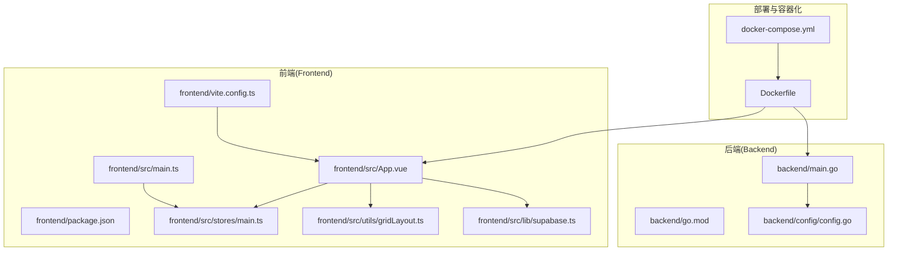
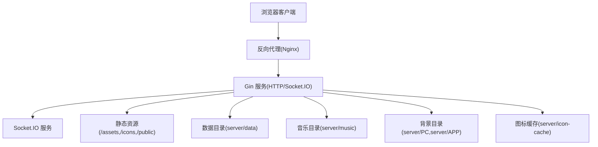
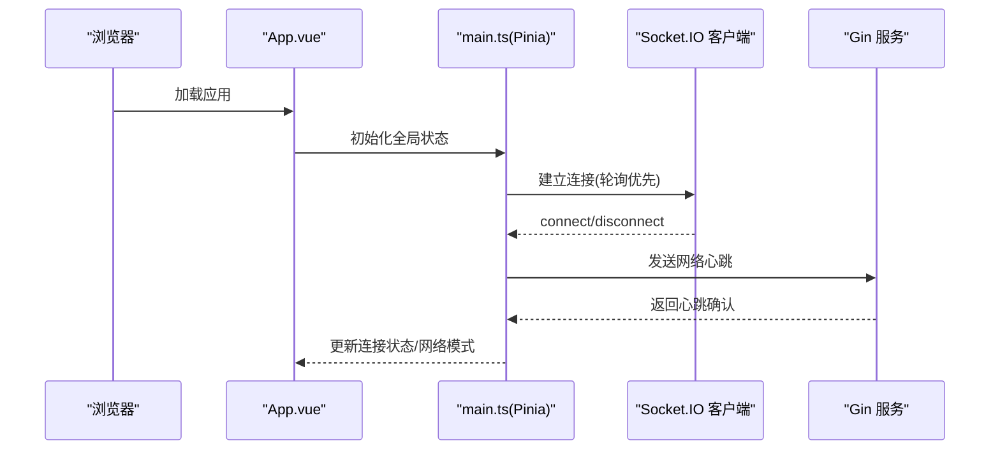
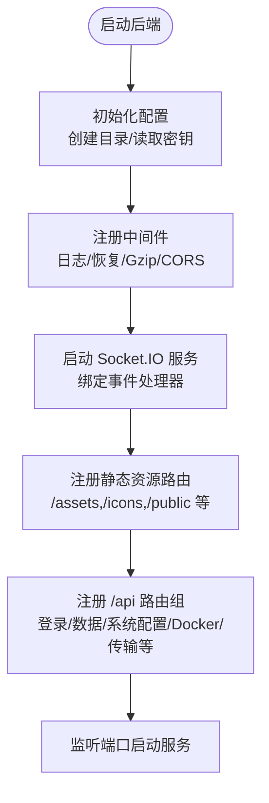
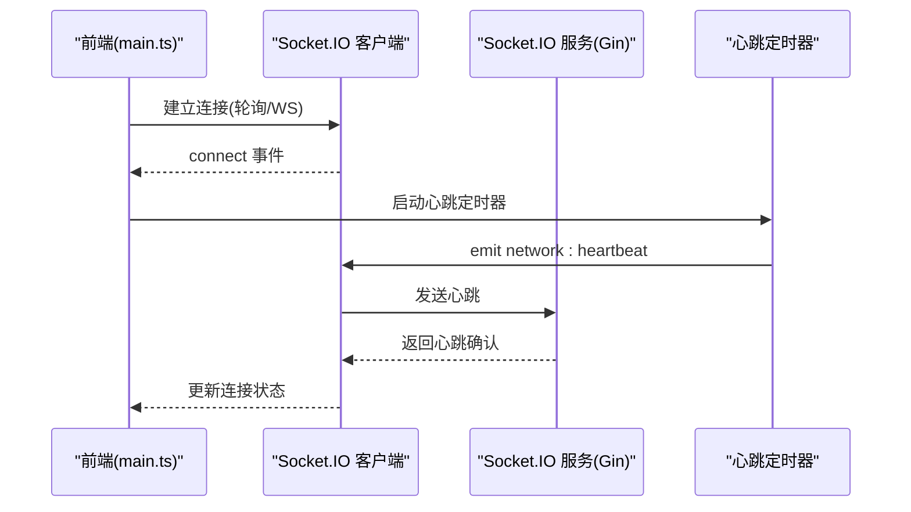
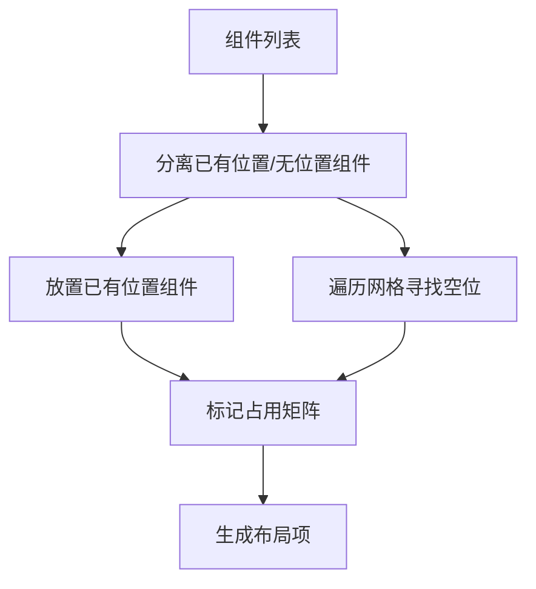
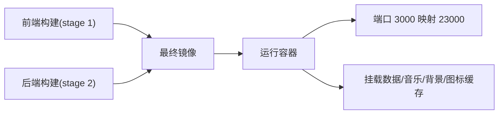
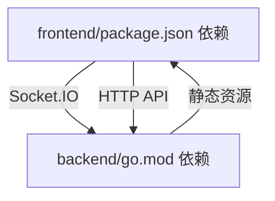

# 技术栈说明

<cite>
**本文档引用的文件**
- [frontend/package.json](file://frontend/package.json)
- [backend/go.mod](file://backend/go.mod)
- [Dockerfile](file://Dockerfile)
- [docker-compose.yml](file://docker-compose.yml)
- [frontend/vite.config.ts](file://frontend/vite.config.ts)
- [frontend/src/main.ts](file://frontend/src/main.ts)
- [backend/main.go](file://backend/main.go)
- [frontend/src/stores/main.ts](file://frontend/src/stores/main.ts)
- [frontend/src/utils/gridLayout.ts](file://frontend/src/utils/gridLayout.ts)
- [frontend/src/lib/supabase.ts](file://frontend/src/lib/supabase.ts)
- [frontend/src/App.vue](file://frontend/src/App.vue)
- [backend/config/config.go](file://backend/config/config.go)
- [frontend/src/components/GridPanel.vue](file://frontend/src/components/GridPanel.vue)
</cite>

## 目录
1. [简介](#简介)
2. [项目结构](#项目结构)
3. [核心组件](#核心组件)
4. [架构总览](#架构总览)
5. [详细组件分析](#详细组件分析)
6. [依赖关系分析](#依赖关系分析)
7. [性能考量](#性能考量)
8. [故障排查指南](#故障排查指南)
9. [结论](#结论)
10. [附录](#附录)

## 简介
本项目采用前后端分离架构，前端基于 Vue 3 + TypeScript + Vite 构建现代化单页应用，后端使用 Go 语言配合 Gin 框架实现高性能 API 服务。项目通过 Socket.IO 实现实时通信，使用 Pinia 进行状态管理，并采用 Grid Layout Plus 提供灵活的仪表盘布局能力。整体技术栈强调开发体验、运行效率与可维护性，结合容器化与反向代理实现稳定部署。

## 项目结构
项目采用多模块组织方式：
- 前端模块：位于 frontend 目录，包含 Vue 应用、TypeScript 类型、构建配置与工具库
- 后端模块：位于 backend 目录，包含 Go 服务、路由与中间件、配置与工具
- 部署与容器化：根目录包含 Dockerfile、docker-compose.yml 以及相关部署脚本
- 公共静态资源：server/public 与 debian/server/public 提供静态文件与图标资源

**图表来源**
- [frontend/src/main.ts:1-37](file://frontend/src/main.ts#L1-L37)
- [frontend/src/App.vue:1-666](file://frontend/src/App.vue#L1-L666)
- [frontend/src/stores/main.ts:1-120](file://frontend/src/stores/main.ts#L1-L120)
- [frontend/src/utils/gridLayout.ts:1-113](file://frontend/src/utils/gridLayout.ts#L1-L113)
- [frontend/src/lib/supabase.ts:1-343](file://frontend/src/lib/supabase.ts#L1-L343)
- [backend/main.go:1-267](file://backend/main.go#L1-L267)
- [backend/config/config.go:1-257](file://backend/config/config.go#L1-L257)
- [Dockerfile:1-93](file://Dockerfile#L1-L93)
- [docker-compose.yml:1-17](file://docker-compose.yml#L1-L17)

**章节来源**
- [frontend/package.json:1-77](file://frontend/package.json#L1-L77)
- [backend/go.mod:1-83](file://backend/go.mod#L1-L83)
- [Dockerfile:1-93](file://Dockerfile#L1-L93)
- [docker-compose.yml:1-17](file://docker-compose.yml#L1-L17)

## 核心组件
- 前端框架与构建
  - Vue 3：提供响应式与组合式 API，支持 TypeScript
  - TypeScript：增强类型安全与开发体验
  - Vite：快速开发与高效打包，支持按需动态导入与热更新
- 状态管理
  - Pinia：轻量级状态管理，支持模块化与类型推导
- 实时通信
  - Socket.IO：WebSocket 与轮询双通道，保障弱网与反代环境下的连通性
- 布局系统
  - Grid Layout Plus：提供拖拽与响应式网格布局能力
- 工具与生态
  - VueUse：常用组合式工具集
  - Axios：HTTP 客户端
  - TailwindCSS：原子化样式工具
  - Partytown：跨域脚本异步执行优化

**章节来源**
- [frontend/package.json:22-47](file://frontend/package.json#L22-L47)
- [frontend/src/main.ts:1-37](file://frontend/src/main.ts#L1-L37)
- [frontend/src/stores/main.ts:30-120](file://frontend/src/stores/main.ts#L30-L120)
- [frontend/src/utils/gridLayout.ts:1-113](file://frontend/src/utils/gridLayout.ts#L1-L113)
- [frontend/vite.config.ts:1-57](file://frontend/vite.config.ts#L1-L57)

## 架构总览
系统采用前后端分离与容器化部署策略：
- 前端通过 Vite 开发，构建产物静态托管于后端 public 目录
- 后端使用 Gin 提供 REST API 与静态资源服务，集成 Socket.IO 实现实时事件
- Dockerfile 采用多阶段构建，分别构建前端与后端二进制，最终镜像精简
- docker-compose 将容器暴露端口并挂载持久化目录，便于部署与运维

**图表来源**
- [backend/main.go:116-135](file://backend/main.go#L116-L135)
- [backend/main.go:165-254](file://backend/main.go#L165-L254)
- [Dockerfile:64-93](file://Dockerfile#L64-L93)
- [docker-compose.yml:8-16](file://docker-compose.yml#L8-L16)

## 详细组件分析

### 前端技术栈与初始化流程
- 初始化入口
  - main.ts 创建应用实例，注册 Pinia，初始化全局状态并挂载
- 状态管理
  - main.ts 中定义 Pinia Store，建立 Socket.IO 连接，处理连接/断开与心跳
- 构建配置
  - vite.config.ts 支持 Docker/Vercel 构建输出，设置 publicDir 与 outDir，启用 Vue DevTools 开发模式
- 组件与布局
  - App.vue 作为根组件，承载 GridPanel 与状态监控等
  - GridPanel.vue 使用 Grid Layout Plus 实现拖拽布局，结合自定义算法生成布局
- Supabase 集成
  - supabase.ts 提供认证、用户数据与 RSS 订阅的实时订阅能力

**图表来源**
- [frontend/src/main.ts:22-37](file://frontend/src/main.ts#L22-L37)
- [frontend/src/stores/main.ts:30-120](file://frontend/src/stores/main.ts#L30-L120)
- [backend/main.go:79-115](file://backend/main.go#L79-L115)

**章节来源**
- [frontend/src/main.ts:1-37](file://frontend/src/main.ts#L1-L37)
- [frontend/src/stores/main.ts:1-120](file://frontend/src/stores/main.ts#L1-L120)
- [frontend/vite.config.ts:1-57](file://frontend/vite.config.ts#L1-L57)
- [frontend/src/App.vue:1-666](file://frontend/src/App.vue#L1-L666)
- [frontend/src/components/GridPanel.vue:1-800](file://frontend/src/components/GridPanel.vue#L1-L800)
- [frontend/src/lib/supabase.ts:1-343](file://frontend/src/lib/supabase.ts#L1-L343)

### 后端技术栈与路由设计
- 服务启动
  - main.go 初始化配置、中间件与静态资源，注册 Socket.IO 并绑定事件处理器
- 中间件与安全
  - 日志、恢复、Gzip 压缩、CORS 与可选认证中间件
- 路由与静态资源
  - /api 路由组提供登录、数据、系统配置、Docker、音乐、壁纸、传输等接口
  - 静态资源映射 /assets、/icons、/music、/backgrounds、/icon-cache、/public
- 配置管理
  - config/config.go 负责目录初始化、系统配置与密钥生成

**图表来源**
- [backend/main.go:25-267](file://backend/main.go#L25-L267)
- [backend/config/config.go:35-257](file://backend/config/config.go#L35-L257)

**章节来源**
- [backend/main.go:1-267](file://backend/main.go#L1-L267)
- [backend/config/config.go:1-257](file://backend/config/config.go#L1-L257)

### 实时通信与心跳机制
- 前端
  - main.ts 中通过 Socket.IO 客户端建立连接，开启网络心跳定时器，根据网络模式调整心跳间隔与超时
- 后端
  - main.go 启动 Socket.IO 服务，绑定网络模式与心跳事件，广播网络模式变更
- 业务事件
  - handlers 中绑定热点、天气、RSS、备忘录、待办、网络等事件，实现跨端同步

**图表来源**
- [frontend/src/stores/main.ts:437-467](file://frontend/src/stores/main.ts#L437-L467)
- [backend/main.go:79-115](file://backend/main.go#L79-L115)

**章节来源**
- [frontend/src/stores/main.ts:430-470](file://frontend/src/stores/main.ts#L430-L470)
- [backend/main.go:79-115](file://backend/main.go#L79-L115)

### 布局系统与网格算法
- Grid Layout Plus
  - GridPanel.vue 使用 GridLayout 与 GridItem 组件实现拖拽布局
- 自定义布局算法
  - gridLayout.ts 提供网格布局生成算法，支持缩放、占位检测与垂直压缩

**图表来源**
- [frontend/src/utils/gridLayout.ts:11-113](file://frontend/src/utils/gridLayout.ts#L11-L113)
- [frontend/src/components/GridPanel.vue:714-800](file://frontend/src/components/GridPanel.vue#L714-L800)

**章节来源**
- [frontend/src/utils/gridLayout.ts:1-113](file://frontend/src/utils/gridLayout.ts#L1-L113)
- [frontend/src/components/GridPanel.vue:1-800](file://frontend/src/components/GridPanel.vue#L1-L800)

### 容器化与部署
- Dockerfile
  - 多阶段构建：前端使用 node:20.19，后端使用 golang:alpine，最终镜像仅包含二进制与静态资源
  - 设置时区、Gin 模式与必要运行时依赖
- docker-compose
  - 映射端口与持久化目录，支持 Docker Socket 透传

**图表来源**
- [Dockerfile:1-93](file://Dockerfile#L1-L93)
- [docker-compose.yml:8-16](file://docker-compose.yml#L8-L16)

**章节来源**
- [Dockerfile:1-93](file://Dockerfile#L1-L93)
- [docker-compose.yml:1-17](file://docker-compose.yml#L1-L17)

## 依赖关系分析
- 前端依赖
  - Vue 3、TypeScript、Vite、Pinia、Socket.IO、Grid Layout Plus、TailwindCSS 等
- 后端依赖
  - Gin、Socket.IO、JWT、Docker SDK、gopsutil、图像处理与网络库等
- 关键耦合点
  - 前端通过 Socket.IO 与后端实时通信
  - 后端通过 Gin 路由与静态资源目录提供前端构建产物

**图表来源**
- [frontend/package.json:22-47](file://frontend/package.json#L22-L47)
- [backend/go.mod:5-17](file://backend/go.mod#L5-L17)

**章节来源**
- [frontend/package.json:1-77](file://frontend/package.json#L1-L77)
- [backend/go.mod:1-83](file://backend/go.mod#L1-L83)

## 性能考量
- 前端
  - 动态导入与按需加载，减少首屏体积
  - Vite 构建关闭 Source Map 以减小产物体积
  - TailwindCSS 在 Docker 构建时禁用原生特性以提升兼容性
- 后端
  - Gzip 压缩中间件减少传输体积
  - 请求体大小限制适配大配置文件
  - Socket.IO 双传输通道保障弱网与反代环境可用性
- 部署
  - 多阶段 Docker 构建与精简最终镜像
  - 时区与运行模式配置优化启动与运行时行为

**章节来源**
- [frontend/vite.config.ts:27-39](file://frontend/vite.config.ts#L27-L39)
- [backend/main.go:42-46](file://backend/main.go#L42-L46)
- [backend/main.go:116-135](file://backend/main.go#L116-L135)
- [Dockerfile:64-93](file://Dockerfile#L64-L93)

## 故障排查指南
- Socket 连接问题
  - 前端优先使用轮询传输，检查 CORS 配置与 Origin 白名单
  - 后端检查 /socket.io 路由转发与 CheckOrigin 回调
- 静态资源加载失败
  - 确认 publicDir 与 outDir 配置，Docker/Vercel 构建差异
  - 检查 /public 与 /index.html 缓存控制头
- 数据同步冲突
  - 前端通过版本号与冲突对话框处理多端编辑冲突
  - 后端提供网络模式广播与心跳事件
- Supabase 集成
  - 确认环境变量配置，否则热新闻与用户数据不可用

**章节来源**
- [frontend/src/stores/main.ts:510-560](file://frontend/src/stores/main.ts#L510-L560)
- [backend/main.go:79-115](file://backend/main.go#L79-L115)
- [frontend/src/lib/supabase.ts:3-8](file://frontend/src/lib/supabase.ts#L3-L8)
- [frontend/vite.config.ts:13-23](file://frontend/vite.config.ts#L13-L23)

## 结论
本项目通过现代前端技术栈与 Go + Gin 的后端实现，结合 Socket.IO 实时通信与容器化部署，形成了高可用、易扩展的桌面端仪表盘平台。技术选型在开发效率、运行性能与可维护性之间取得平衡，适合在家庭与小型团队环境中稳定运行。

## 附录
- 版本与兼容性
  - Node.js：^20.19.0 或 >=22.12.0（参考前端引擎要求）
  - Go：1.25.5（后端模块）
  - Docker：官方多阶段构建镜像
- 最佳实践
  - 生产环境建议启用 Gzip 与合适的缓存策略
  - 反向代理需正确配置 WebSocket 与静态资源路径
  - 定期备份 server/data 目录以保护用户配置与数据