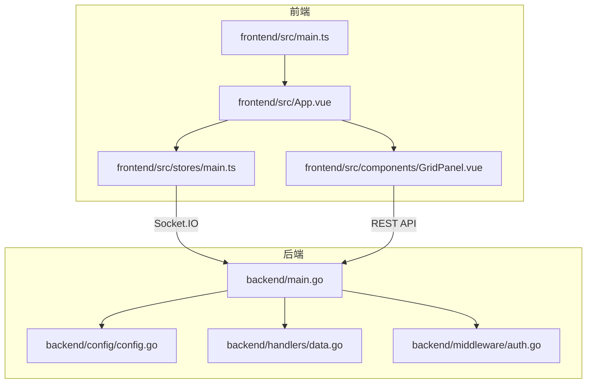
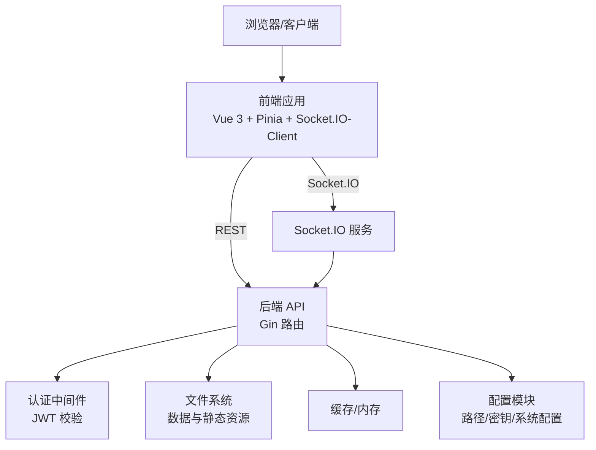
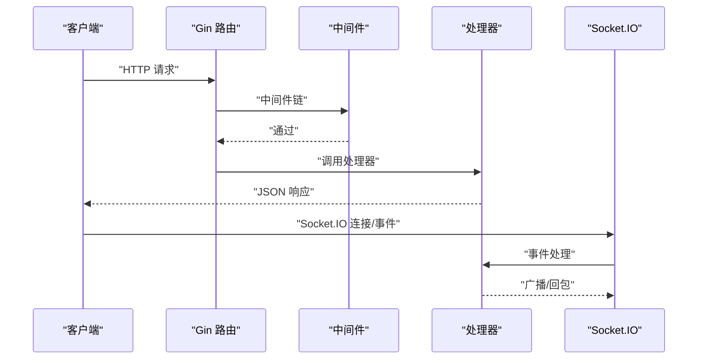
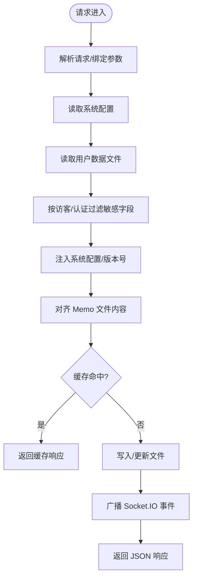
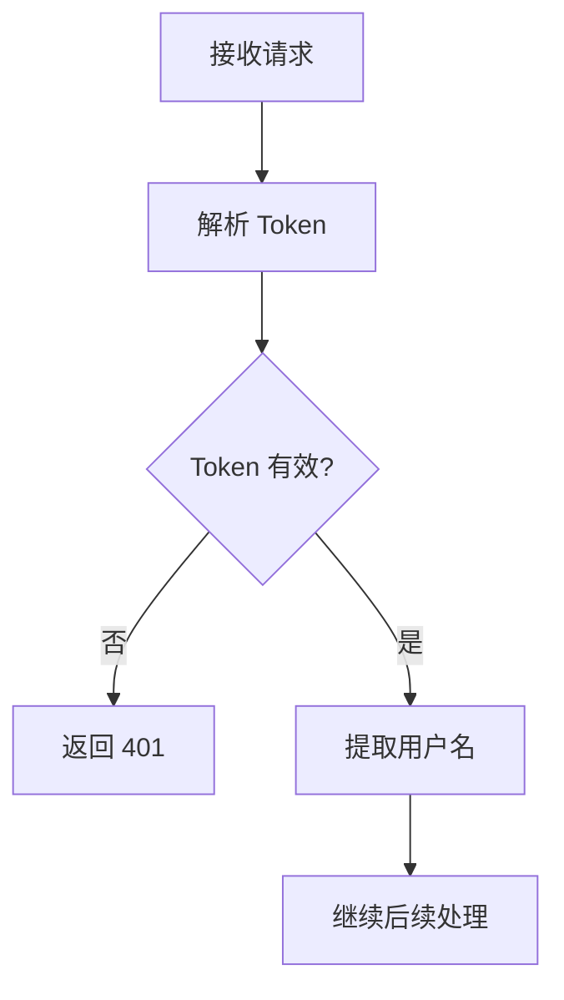
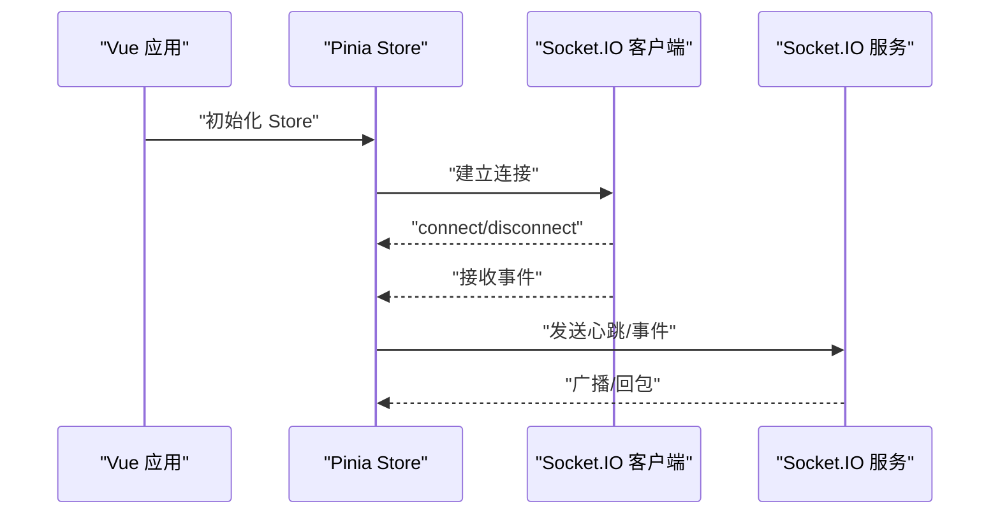
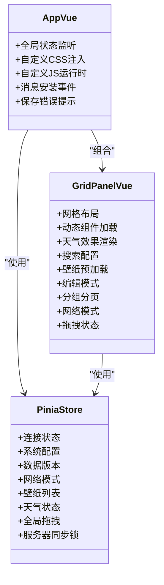
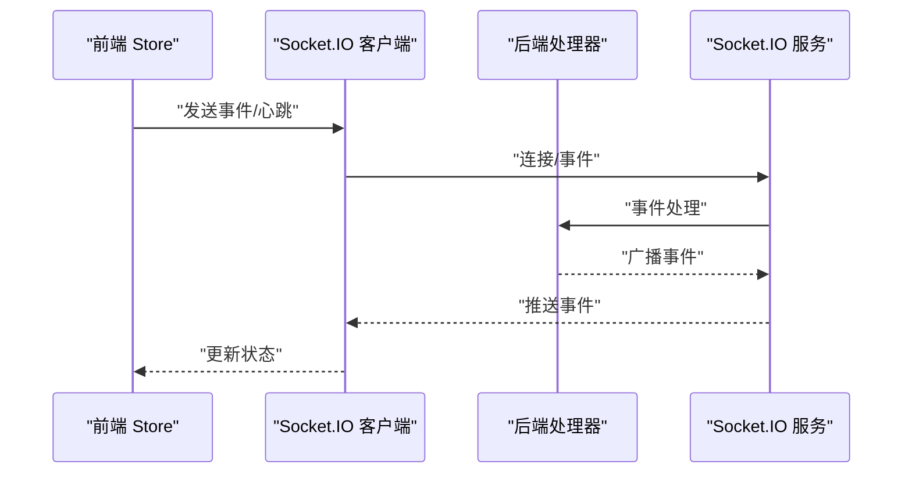
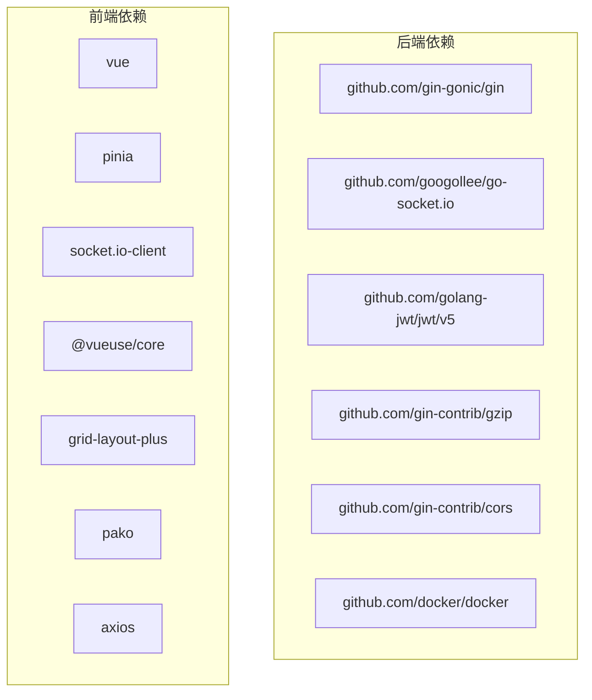

# 架构设计理念

<cite>
**本文档引用的文件**
- [backend/main.go](file://backend/main.go)
- [backend/config/config.go](file://backend/config/config.go)
- [backend/handlers/data.go](file://backend/handlers/data.go)
- [backend/handlers/hot.go](file://backend/handlers/hot.go)
- [backend/middleware/auth.go](file://backend/middleware/auth.go)
- [frontend/src/main.ts](file://frontend/src/main.ts)
- [frontend/src/App.vue](file://frontend/src/App.vue)
- [frontend/src/stores/main.ts](file://frontend/src/stores/main.ts)
- [frontend/src/components/GridPanel.vue](file://frontend/src/components/GridPanel.vue)
- [frontend/vite.config.ts](file://frontend/vite.config.ts)
- [backend/go.mod](file://backend/go.mod)
- [frontend/package.json](file://frontend/package.json)
- [README.md](file://README.md)
</cite>

## 目录
1. [引言](#引言)
2. [项目结构](#项目结构)
3. [核心组件](#核心组件)
4. [架构总览](#架构总览)
5. [详细组件分析](#详细组件分析)
6. [依赖关系分析](#依赖关系分析)
7. [性能考虑](#性能考虑)
8. [故障排除指南](#故障排除指南)
9. [结论](#结论)
10. [附录](#附录)

## 引言
本项目采用前后端分离架构，后端基于 Go 语言与 Gin 框架，前端基于 Vue 3 与 Vite，配合 Socket.IO 实现实时通信。系统强调组件化设计、状态管理、实时性与可扩展性，支持自定义组件、主题与插件扩展。

## 项目结构
- 后端（Go + Gin + Socket.IO）
  - 配置初始化与目录结构管理
  - HTTP 路由与中间件（认证、CORS、Gzip）
  - Socket.IO 事件绑定与广播
  - 数据持久化与缓存
- 前端（Vue 3 + Pinia + Socket.IO-Client）
  - 应用入口与全局状态初始化
  - 组件化布局与动态加载
  - 实时状态同步与网络心跳
  - 自定义 CSS/JS 扩展与市场组件

图表来源
- [backend/main.go:25-115](file://backend/main.go#L25-L115)
- [backend/config/config.go:35-86](file://backend/config/config.go#L35-L86)
- [backend/handlers/data.go:159-322](file://backend/handlers/data.go#L159-L322)
- [backend/middleware/auth.go:33-60](file://backend/middleware/auth.go#L33-L60)
- [frontend/src/main.ts:22-31](file://frontend/src/main.ts#L22-L31)
- [frontend/src/App.vue:1-666](file://frontend/src/App.vue#L1-L666)
- [frontend/src/stores/main.ts:30-96](file://frontend/src/stores/main.ts#L30-L96)
- [frontend/src/components/GridPanel.vue:1-800](file://frontend/src/components/GridPanel.vue#L1-L800)

章节来源
- [backend/main.go:25-115](file://backend/main.go#L25-L115)
- [backend/config/config.go:35-86](file://backend/config/config.go#L35-L86)
- [frontend/src/main.ts:22-31](file://frontend/src/main.ts#L22-L31)
- [frontend/src/App.vue:1-666](file://frontend/src/App.vue#L1-L666)
- [frontend/src/stores/main.ts:30-96](file://frontend/src/stores/main.ts#L30-L96)
- [frontend/src/components/GridPanel.vue:1-800](file://frontend/src/components/GridPanel.vue#L1-L800)

## 核心组件
- 后端入口与路由
  - 初始化配置、中间件链、CORS、Gzip、静态文件托管、Socket.IO 服务注册与事件绑定
- 配置模块
  - 基础目录、数据文件、密钥与系统配置的初始化与校验
- 数据处理与持久化
  - 用户数据读取/写入、版本控制、缓存命中、敏感字段过滤、Memo 文件对齐
- 认证中间件
  - JWT 解析与校验，支持可选认证与强制认证
- 前端入口与状态
  - 应用初始化、Pinia Store 全局挂载、Socket.IO 客户端连接与事件监听
- 前端应用与组件
  - 主应用组件、网格布局组件、动态组件加载、自定义 CSS/JS 扩展、市场组件安装

章节来源
- [backend/main.go:25-115](file://backend/main.go#L25-L115)
- [backend/config/config.go:35-86](file://backend/config/config.go#L35-L86)
- [backend/handlers/data.go:159-322](file://backend/handlers/data.go#L159-L322)
- [backend/middleware/auth.go:33-60](file://backend/middleware/auth.go#L33-L60)
- [frontend/src/main.ts:22-31](file://frontend/src/main.ts#L22-L31)
- [frontend/src/App.vue:1-666](file://frontend/src/App.vue#L1-L666)
- [frontend/src/stores/main.ts:30-96](file://frontend/src/stores/main.ts#L30-L96)
- [frontend/src/components/GridPanel.vue:1-800](file://frontend/src/components/GridPanel.vue#L1-L800)

## 架构总览
系统采用典型的前后端分离模式：
- 前端负责用户界面与交互，通过 REST API 与 Socket.IO 与后端通信
- 后端提供 HTTP 接口与实时事件通道，负责业务逻辑、数据持久化与缓存
- 中间件层提供认证、CORS、压缩与恢复处理
- 配置模块集中管理路径、密钥与系统参数

图表来源
- [backend/main.go:25-115](file://backend/main.go#L25-L115)
- [backend/middleware/auth.go:33-60](file://backend/middleware/auth.go#L33-L60)
- [backend/config/config.go:35-86](file://backend/config/config.go#L35-L86)
- [frontend/src/stores/main.ts:30-96](file://frontend/src/stores/main.ts#L30-L96)

章节来源
- [backend/main.go:25-115](file://backend/main.go#L25-L115)
- [backend/middleware/auth.go:33-60](file://backend/middleware/auth.go#L33-L60)
- [backend/config/config.go:35-86](file://backend/config/config.go#L35-L86)
- [frontend/src/stores/main.ts:30-96](file://frontend/src/stores/main.ts#L30-L96)

## 详细组件分析

### 后端入口与路由（Gin + Socket.IO）
- 初始化顺序：配置 -> 组件初始化 -> 启动 IP/数据预热与缩略图同步
- 中间件链：日志、恢复、Gzip 解压、Gzip 压缩、CORS（可配置来源）
- 静态文件：/assets、/icons、/music、/backgrounds、/mobile_backgrounds、/icon-cache、/public
- Socket.IO：注册连接、断开、加入房间事件，绑定热榜、天气、RSS、Memo、Todo、网络事件处理器，广播数据更新
- REST 路由：登录、数据获取/保存、版本、系统配置、代理、访客统计、文件传输、音乐列表、Docker 管理、壁纸、背景、RSS、天气、热搜等

图表来源
- [backend/main.go:25-115](file://backend/main.go#L25-L115)
- [backend/handlers/data.go:159-322](file://backend/handlers/data.go#L159-L322)

章节来源
- [backend/main.go:25-115](file://backend/main.go#L25-L115)
- [backend/handlers/data.go:159-322](file://backend/handlers/data.go#L159-L322)

### 配置模块（路径与密钥）
- 自动推断 BaseDir，确保 server/data、users、doc、music、PC、APP、icon-cache、public、config_versions 等目录存在
- 系统配置 system.json 默认值与兼容性处理
- data.json 默认模板初始化
- secret.key 加载或生成随机密钥
- 额外数据文件：amap_stats.json、visitors.json、custom_scripts.json、widget_cache.json

章节来源
- [backend/config/config.go:35-86](file://backend/config/config.go#L35-L86)
- [backend/config/config.go:210-256](file://backend/config/config.go#L210-L256)

### 数据处理与持久化（MVC 思想体现）
- 控制器（Handlers）：GetData、SaveData、GetMemo、SaveMemo、GetWidget 等
- 模型（Models）：系统配置结构
- 视图（Response）：JSON 输出，敏感字段过滤，版本号对齐
- 缓存（Cache）：GetData 响应缓存、Memo 幂等缓存、热榜缓存
- 幂等性：Memo 保存基于请求 ID 与 TTL 的去重缓存

图表来源
- [backend/handlers/data.go:159-322](file://backend/handlers/data.go#L159-L322)
- [backend/handlers/data.go:535-636](file://backend/handlers/data.go#L535-L636)

章节来源
- [backend/handlers/data.go:159-322](file://backend/handlers/data.go#L159-L322)
- [backend/handlers/data.go:535-636](file://backend/handlers/data.go#L535-L636)

### 认证中间件（MVC 中间件模式）
- 解析 Authorization 头或查询参数 token
- 使用 HS256 校验 JWT，提取用户名并注入上下文
- 提供可选认证与强制认证两种中间件

图表来源
- [backend/middleware/auth.go:12-46](file://backend/middleware/auth.go#L12-L46)

章节来源
- [backend/middleware/auth.go:12-46](file://backend/middleware/auth.go#L12-L46)

### 前端入口与状态管理（Vue 3 + Pinia + Socket.IO）
- 应用初始化：创建 Vue 应用、挂载 Pinia、全局初始化 Store
- Socket.IO 客户端：连接后启动网络心跳，监听连接/断开/错误事件，接收 lucky:stun、lucky:stun 等事件
- Store 管理：连接状态、系统配置、数据版本、网络模式、壁纸列表、天气网络状态、全局拖拽状态、服务器同步锁等
- 网络心跳：定期发送 network:heartbeat，检测网络活动状态，切换同步模式

图表来源
- [frontend/src/main.ts:22-31](file://frontend/src/main.ts#L22-L31)
- [frontend/src/stores/main.ts:30-96](file://frontend/src/stores/main.ts#L30-L96)

章节来源
- [frontend/src/main.ts:22-31](file://frontend/src/main.ts#L22-L31)
- [frontend/src/stores/main.ts:30-96](file://frontend/src/stores/main.ts#L30-L96)

### 前端应用与组件（组件化设计）
- App.vue：全局状态监听、自定义 CSS 注入、自定义 JS 运行时、消息安装事件、保存错误提示、回到顶部、状态监控组件、全局音频元素
- GridPanel.vue：网格布局、动态组件异步加载、天气效果渲染（Canvas/WebGL）、搜索引擎配置、壁纸预加载、编辑模式、分组分页、网络模式切换、拖拽与全局拖拽状态
- 组件通信：通过 Pinia Store 共享状态，通过 Socket.IO 实时事件驱动 UI 更新

图表来源
- [frontend/src/App.vue:1-666](file://frontend/src/App.vue#L1-L666)
- [frontend/src/components/GridPanel.vue:1-800](file://frontend/src/components/GridPanel.vue#L1-L800)
- [frontend/src/stores/main.ts:30-96](file://frontend/src/stores/main.ts#L30-L96)

章节来源
- [frontend/src/App.vue:1-666](file://frontend/src/App.vue#L1-L666)
- [frontend/src/components/GridPanel.vue:1-800](file://frontend/src/components/GridPanel.vue#L1-L800)
- [frontend/src/stores/main.ts:30-96](file://frontend/src/stores/main.ts#L30-L96)

### 实时性设计（WebSocket + Socket.IO）
- 后端：Socket.IO 服务注册、连接/断开回调、加入房间、事件绑定（热榜、天气、RSS、Memo、Todo、网络）
- 前端：Socket.IO 客户端连接、事件监听、心跳发送、断线重连、广播事件处理
- 数据同步：SaveData 成功后广播 data-updated，Memo 保存后广播 memo:updated

图表来源
- [backend/handlers/data.go:736-741](file://backend/handlers/data.go#L736-L741)
- [backend/handlers/data.go:626-631](file://backend/handlers/data.go#L626-L631)
- [frontend/src/stores/main.ts:360-364](file://frontend/src/stores/main.ts#L360-L364)

章节来源
- [backend/handlers/data.go:736-741](file://backend/handlers/data.go#L736-L741)
- [backend/handlers/data.go:626-631](file://backend/handlers/data.go#L626-L631)
- [frontend/src/stores/main.ts:360-364](file://frontend/src/stores/main.ts#L360-L364)

### 可扩展性设计（插件、自定义组件、主题）
- 插件系统：自定义 CSS/JS 注入，支持模块化与非模块化脚本，带代理能力
- 自定义组件：通过自定义 CSS 组件实现 HTML/CSS 扩展，支持导入/导出
- 主题系统：全局自定义 CSS，支持媒体查询增强语法（mobile/desktop/dark/light）
- 市场组件：通过消息安装事件安装组件，支持 JS 安全免责声明

章节来源
- [frontend/src/App.vue:107-367](file://frontend/src/App.vue#L107-L367)
- [frontend/src/App.vue:385-421](file://frontend/src/App.vue#L385-L421)
- [README.md:215-283](file://README.md#L215-L283)

## 依赖关系分析
- 后端依赖
  - Gin、Socket.IO、JWT、Gzip、CORS、Docker SDK、图像处理等
- 前端依赖
  - Vue 3、Pinia、Socket.IO-Client、VueUse、Grid Layout Plus、Pako、Axios 等

图表来源
- [backend/go.mod:5-17](file://backend/go.mod#L5-L17)
- [frontend/package.json:22-47](file://frontend/package.json#L22-L47)

章节来源
- [backend/go.mod:5-17](file://backend/go.mod#L5-L17)
- [frontend/package.json:22-47](file://frontend/package.json#L22-L47)

## 性能考虑
- 网络传输优化
  - 后端启用 Gzip 压缩，请求体大小限制提升至 50MB
  - 前端资源版本缓存与按需加载，减少首屏与增量加载压力
- 缓存策略
  - GetData 响应缓存、Memo 幂等缓存、热榜缓存 TTL 控制
- 实时性与心跳
  - Socket.IO 心跳与断线重连，降低网络抖动影响
- 前端渲染
  - 动态组件异步加载，Canvas/WebGL 天气效果按需初始化

## 故障排除指南
- CORS 问题：检查环境变量 CORS_ALLOW_ORIGINS，确认 Allow-Origin 函数返回值
- 认证失败：确认 Authorization 头格式与签名算法，检查 secret.key 一致性
- Socket.IO 连接失败：检查后端日志与前端连接事件，确认 CheckOrigin 回调
- 文件传输/缩略图：确认 /icon-cache、/music、/backgrounds、/mobile_backgrounds 目录权限
- 自定义 JS：确认已同意免责声明，脚本模块化与非模块化加载差异

章节来源
- [backend/main.go:48-77](file://backend/main.go#L48-L77)
- [backend/middleware/auth.go:12-46](file://backend/middleware/auth.go#L12-L46)
- [frontend/src/App.vue:398-404](file://frontend/src/App.vue#L398-L404)

## 结论
本项目通过前后端分离与 MVC 思想，结合中间件模式与 Socket.IO 实时通信，实现了高可定制、低耦合、易扩展的个人导航与仪表盘系统。组件化设计与 Pinia 状态管理提升了前端可维护性，配置模块与缓存策略保障了后端稳定性与性能。

## 附录
- 部署与开发
  - 支持 Docker、Debian 一键部署、本地 Release 包与开发模式
  - 前端开发服务器与后端 API 服务并行启动
- 扩展与定制
  - 自定义 CSS/JS、市场组件、Iframe 集成、静态资源托管

章节来源
- [README.md:106-196](file://README.md#L106-L196)
- [frontend/README.md:81-135](file://frontend/README.md#L81-L135)