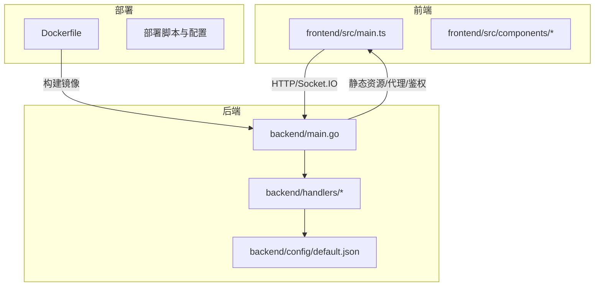
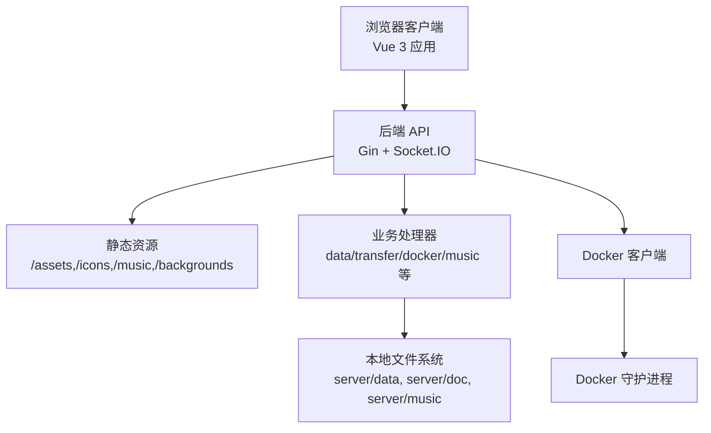
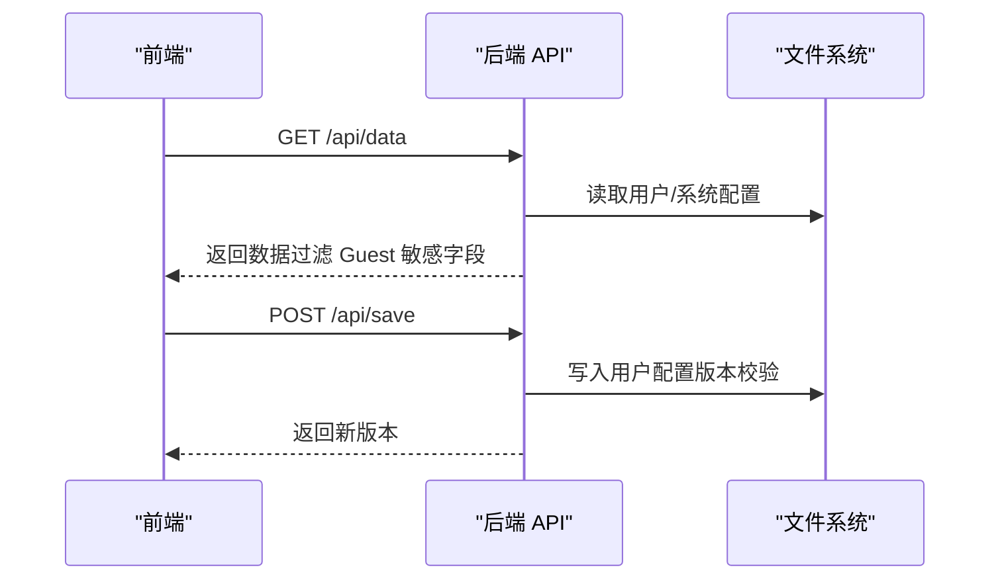
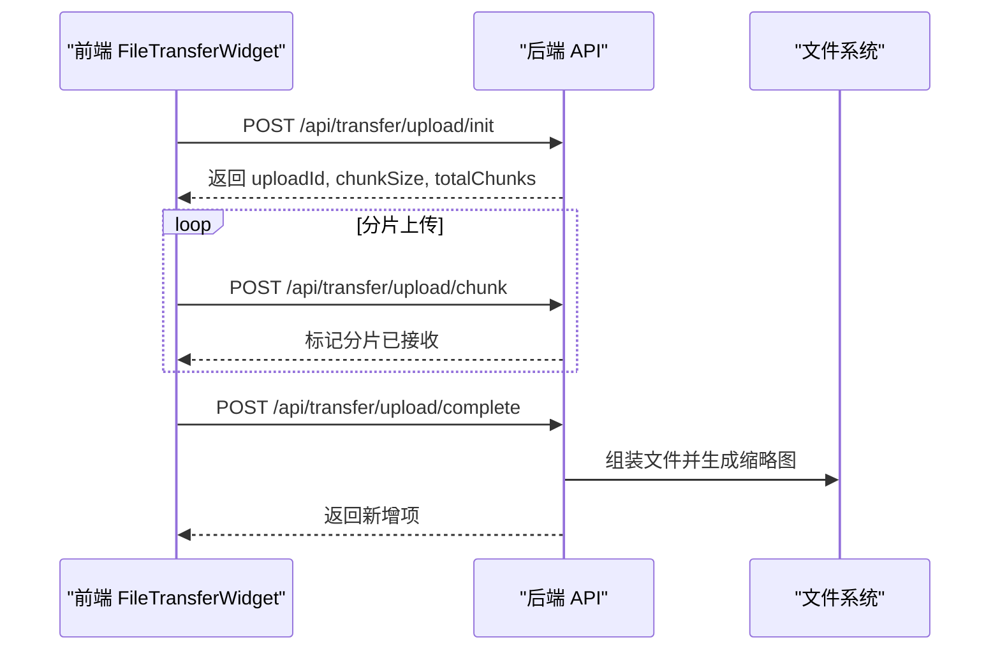
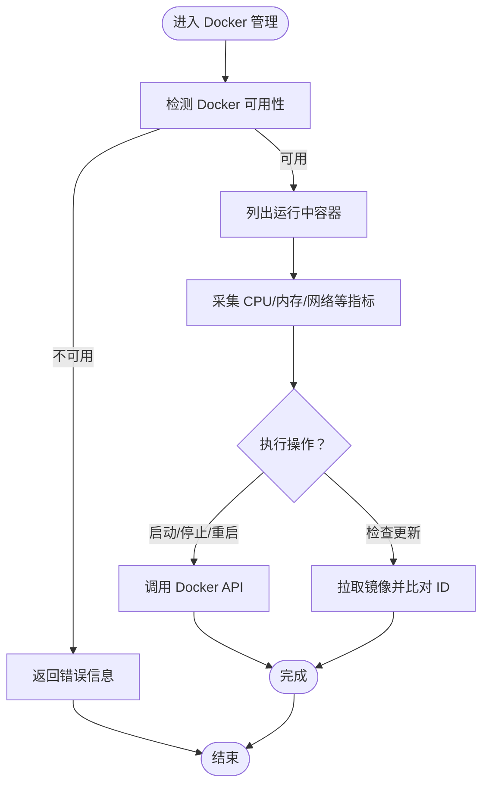
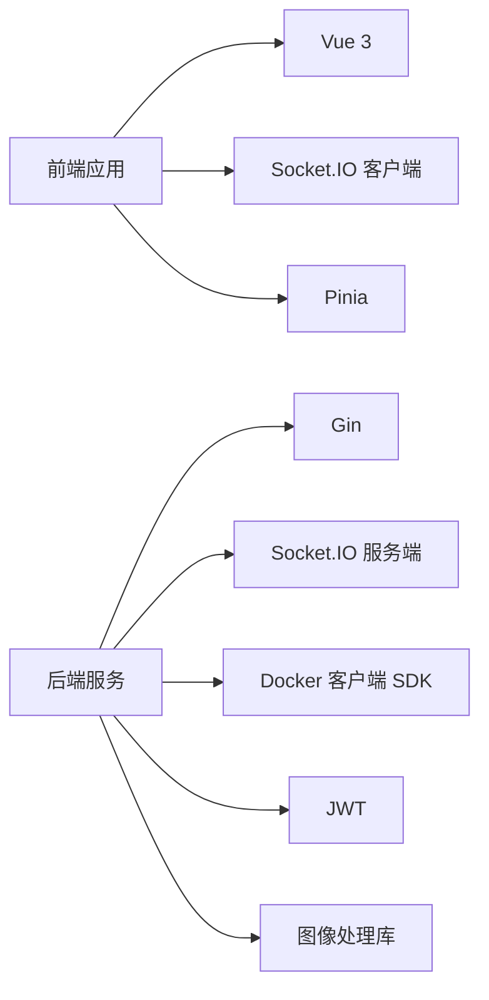

# 项目介绍

<cite>
**本文档引用的文件**
- [README.md](file://README.md)
- [backend/main.go](file://backend/main.go)
- [backend/config/default.json](file://backend/config/default.json)
- [Dockerfile](file://Dockerfile)
- [backend/handlers/data.go](file://backend/handlers/data.go)
- [backend/handlers/docker.go](file://backend/handlers/docker.go)
- [backend/handlers/music.go](file://backend/handlers/music.go)
- [backend/handlers/transfer.go](file://backend/handlers/transfer.go)
- [frontend/src/components/FileTransferWidget.vue](file://frontend/src/components/FileTransferWidget.vue)
- [frontend/src/main.ts](file://frontend/src/main.ts)
</cite>

## 目录
1. [引言](#引言)
2. [项目结构](#项目结构)
3. [核心组件](#核心组件)
4. [架构总览](#架构总览)
5. [详细组件分析](#详细组件分析)
6. [依赖关系分析](#依赖关系分析)
7. [性能考虑](#性能考虑)
8. [故障排除指南](#故障排除指南)
9. [结论](#结论)
10. [附录](#附录)

## 引言
OFlatNas 是一个轻量级、高度可定制的个人导航页与仪表盘系统，专为 NAS 用户、极客与开发者打造。项目采用前后端分离架构：前端基于 Vue 3 + TypeScript，后端基于 Go (Gin)，通过 Socket.IO 实现实时通信，提供多端统一入口、文件与媒体能力、智能网络环境识别、Docker 管理、系统监控、可视化组件生态等特性。项目强调本地数据可控、资源占用低、可扩展性强，适合在家庭或小型办公环境中作为统一的起始页与工作台。

## 项目结构
项目采用模块化组织方式，分为前端、后端、配置与部署三大部分：
- 前端：Vue 3 应用，负责界面渲染、组件交互与实时通信。
- 后端：Go 服务，提供 REST API、静态资源托管、Socket.IO 服务、Docker 管理、文件传输与音乐上传等能力。
- 配置与部署：Dockerfile、docker-compose、安装脚本与默认配置文件，支持多平台部署与一键安装。

**图表来源**
- [frontend/src/main.ts:1-37](file://frontend/src/main.ts#L1-L37)
- [backend/main.go:1-267](file://backend/main.go#L1-L267)
- [backend/config/default.json:1-147](file://backend/config/default.json#L1-L147)
- [Dockerfile:1-93](file://Dockerfile#L1-L93)

**章节来源**
- [README.md:1-292](file://README.md#L1-L292)
- [backend/main.go:1-267](file://backend/main.go#L1-L267)
- [Dockerfile:1-93](file://Dockerfile#L1-L93)

## 核心组件
- 多端统一入口：通过浏览器统一访问常用网站、内网服务与工具，支持分组管理与响应式布局。
- 文件与媒体能力：内置文件传输助手（断点续传、大文件上传、图片缩略图生成）、音乐播放器（支持上传 MP3/FLAC/WAV/M4A/OGG）。
- 智能网络环境识别：自动识别局域网/公网并路由到最佳地址，提升访问体验。
- Docker 管理：查看、启动、停止、重启容器，检查镜像更新，导出调试日志。
- 系统监控：CPU、内存、磁盘、网络等系统信息展示。
- 可视化组件生态：时钟天气、RSS、热搜、待办、Docker、系统监控、Iframe、自定义组件等。
- 本地数据可控：配置与数据存储在本地目录，支持导入/导出与版本管理。
- 代理与隐私：支持后端代理转发与访问令牌授权，降低 SSRF 风险。

**章节来源**
- [README.md:13-70](file://README.md#L13-L70)
- [backend/handlers/transfer.go:1-800](file://backend/handlers/transfer.go#L1-L800)
- [backend/handlers/music.go:1-56](file://backend/handlers/music.go#L1-L56)
- [backend/handlers/docker.go:1-789](file://backend/handlers/docker.go#L1-L789)
- [backend/handlers/data.go:1-800](file://backend/handlers/data.go#L1-L800)

## 架构总览
系统采用前后端分离架构，后端提供 REST API 与 Socket.IO 实时通道，前端通过 HTTP 与 WebSocket 与后端交互。Dockerfile 支持多阶段构建与跨平台编译，便于在不同环境中部署。

**图表来源**
- [backend/main.go:34-164](file://backend/main.go#L34-L164)
- [backend/handlers/transfer.go:46-800](file://backend/handlers/transfer.go#L46-L800)
- [backend/handlers/docker.go:42-167](file://backend/handlers/docker.go#L42-L167)
- [Dockerfile:64-93](file://Dockerfile#L64-L93)

**章节来源**
- [backend/main.go:34-164](file://backend/main.go#L34-L164)
- [Dockerfile:64-93](file://Dockerfile#L64-L93)

## 详细组件分析

### 数据与配置管理
- 用户数据与系统配置分离，支持单用户与多用户模式，Guest 访问时过滤敏感字段。
- 提供版本控制与冲突检测，确保并发编辑一致性。
- 默认模板保存与重置，便于快速恢复出厂设置。

**图表来源**
- [backend/handlers/data.go:159-322](file://backend/handlers/data.go#L159-L322)
- [backend/handlers/data.go:638-744](file://backend/handlers/data.go#L638-L744)

**章节来源**
- [backend/handlers/data.go:159-322](file://backend/handlers/data.go#L159-L322)
- [backend/handlers/data.go:638-744](file://backend/handlers/data.go#L638-L744)
- [backend/config/default.json:1-147](file://backend/config/default.json#L1-L147)

### 文件传输助手
- 支持文本消息、文件与图片传输，断点续传与分片上传，自动缩略图生成。
- 提供下载令牌授权，防止未授权访问。
- 前端组件支持拖拽上传、多选、上下文菜单、长按菜单等交互。

**图表来源**
- [frontend/src/components/FileTransferWidget.vue:649-764](file://frontend/src/components/FileTransferWidget.vue#L649-L764)
- [backend/handlers/transfer.go:331-580](file://backend/handlers/transfer.go#L331-L580)

**章节来源**
- [frontend/src/components/FileTransferWidget.vue:1-800](file://frontend/src/components/FileTransferWidget.vue#L1-L800)
- [backend/handlers/transfer.go:1-800](file://backend/handlers/transfer.go#L1-L800)

### 音乐播放器
- 支持上传多种音频格式，后端自动扫描 server/music 目录并在前端播放器中呈现。
- 前端播放器提供播放列表、播放控制与音量调节。

**章节来源**
- [backend/handlers/music.go:1-56](file://backend/handlers/music.go#L1-L56)
- [README.md:43-44](file://README.md#L43-L44)

### Docker 管理
- 自动检测 Docker 守护进程，支持列出容器、查看状态、执行启动/停止/重启操作。
- 支持镜像更新检查与调试日志导出，便于运维排障。

**图表来源**
- [backend/handlers/docker.go:354-421](file://backend/handlers/docker.go#L354-L421)
- [backend/handlers/docker.go:664-759](file://backend/handlers/docker.go#L664-L759)

**章节来源**
- [backend/handlers/docker.go:1-789](file://backend/handlers/docker.go#L1-L789)
- [README.md:21-22](file://README.md#L21-L22)

### 网络环境智能识别
- 后端结合客户端 IP、访问域名与网络延迟，自动判断局域网/公网并路由到最佳地址。
- 减少用户手动切换成本，提升跨网络环境访问体验。

**章节来源**
- [README.md:98-105](file://README.md#L98-L105)

### 代理与隐私保护
- 支持通过环境变量配置代理，前端可在组件中启用代理开关，所有请求经后端转发。
- 提供下载令牌授权，避免直接暴露文件路径。

**章节来源**
- [README.md:71-97](file://README.md#L71-L97)
- [backend/handlers/transfer.go:582-622](file://backend/handlers/transfer.go#L582-L622)

## 依赖关系分析
- 前端依赖：Vue 3、Socket.IO 客户端、Pinia 状态管理、@vueuse/core 工具库。
- 后端依赖：Gin Web 框架、Socket.IO 服务端、Docker 客户端 SDK、JWT、图像处理库等。
- 构建与运行：Docker 多阶段构建，支持跨平台编译与运行时依赖精简。

**图表来源**
- [frontend/src/main.ts:1-37](file://frontend/src/main.ts#L1-L37)
- [backend/main.go:1-267](file://backend/main.go#L1-L267)
- [backend/handlers/docker.go:22-26](file://backend/handlers/docker.go#L22-L26)
- [Dockerfile:35-63](file://Dockerfile#L35-L63)

**章节来源**
- [frontend/src/main.ts:1-37](file://frontend/src/main.ts#L1-L37)
- [backend/main.go:1-267](file://backend/main.go#L1-L267)
- [Dockerfile:35-63](file://Dockerfile#L35-L63)

## 性能考虑
- 前端：采用响应式布局与懒加载策略，减少首屏渲染压力；Socket.IO 与轮询双通道，保障实时性与兼容性。
- 后端：Gzip 压缩、静态资源缓存、Socket.IO 连接池与分片上传，降低带宽与 CPU 开销。
- Docker：并发统计采集与 TTL 缓存，避免频繁查询；更新检查异步执行，不影响主流程。
- 存储：文件传输与缩略图生成采用异步与缓存机制，避免阻塞主线程。

## 故障排除指南
- 代理不生效：检查后端日志与 PROXY_URL 格式，确认 /api/config/proxy-status 状态。
- 请求失败：核对代理可达性、目标 URL 是否触发 SSRF 规则，查看 [Proxy Error] 日志。
- Docker 无法连接：检查 DOCKER_HOST 配置、守护进程状态与权限，使用 /api/docker/debug 获取诊断快照。
- 文件传输失败：确认分片索引合法性、会话文件权限、磁盘空间与缩略图生成错误。
- 音乐无法播放：确认音频格式与 server/music 目录权限，刷新页面后重试。

**章节来源**
- [README.md:90-97](file://README.md#L90-L97)
- [backend/handlers/docker.go:572-575](file://backend/handlers/docker.go#L572-L575)
- [backend/handlers/transfer.go:383-467](file://backend/handlers/transfer.go#L383-L467)

## 结论
OFlatNas 以“轻量、可定制、可扩展”为核心理念，通过统一的导航页与仪表盘，整合文件传输、媒体播放、Docker 管理与系统监控等功能，满足 NAS 用户、极客与开发者的多样化需求。其开源与社区驱动的特性，鼓励用户参与贡献与二次开发，持续完善生态与体验。

## 附录
- 安装与部署：支持 Debian/Ubuntu 一键脚本、Release 包、Docker CLI 与 docker-compose 多种方式。
- 配置说明：默认密码、数据文件位置、Docker 自动升级策略与全局自定义 CSS/JS。
- 开源协议：GNU AGPLv3。

**章节来源**
- [README.md:106-288](file://README.md#L106-L288)