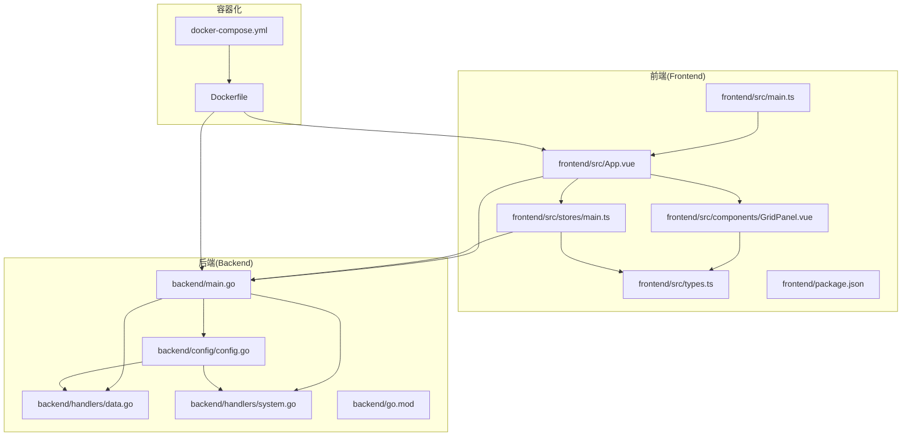
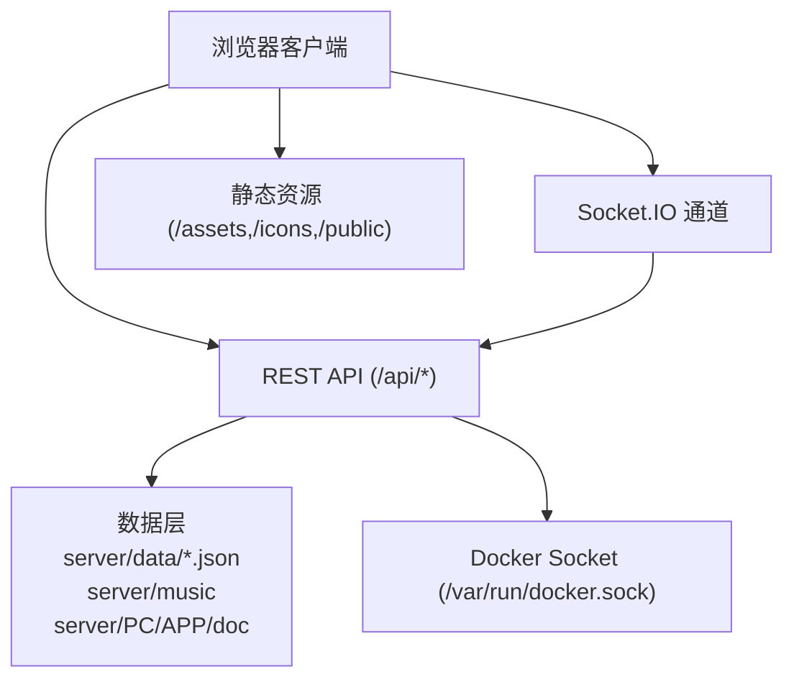
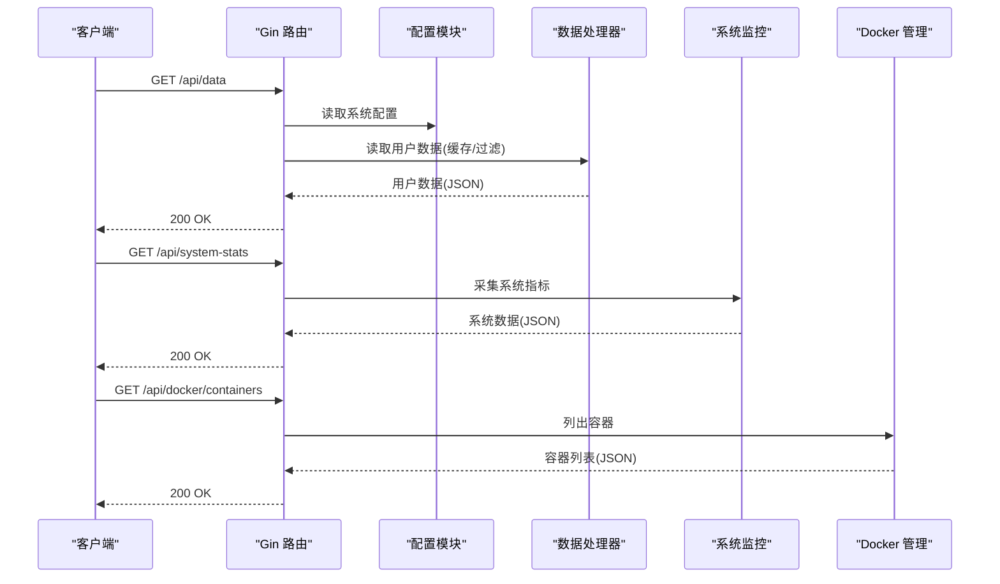
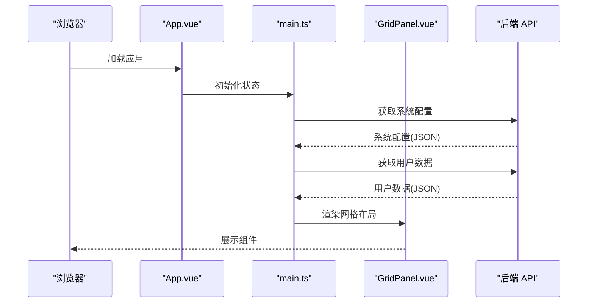
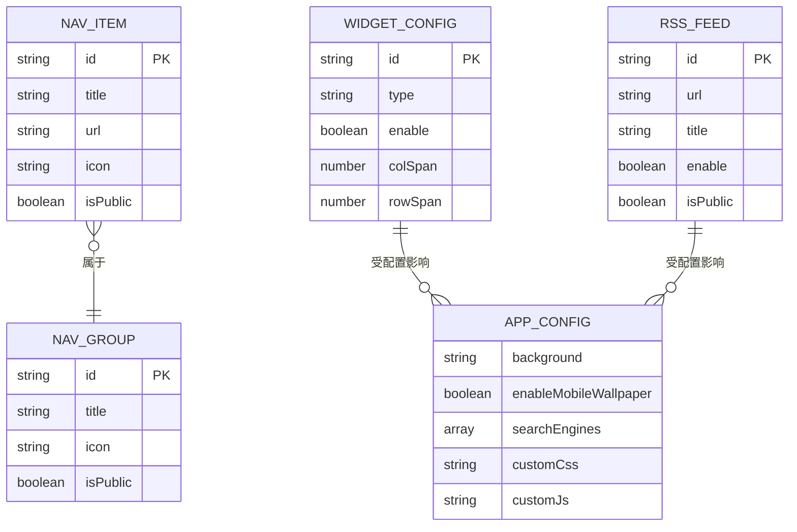
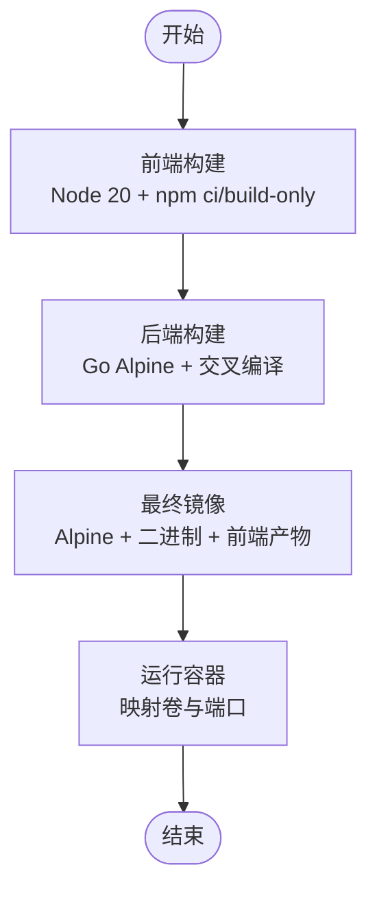
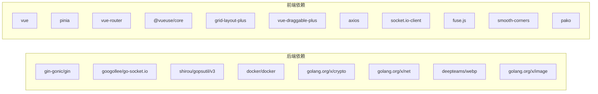

# 项目概述

<cite>
**本文档引用的文件**
- [README.md](file://README.md)
- [backend/main.go](file://backend/main.go)
- [backend/config/config.go](file://backend/config/config.go)
- [backend/handlers/data.go](file://backend/handlers/data.go)
- [backend/handlers/system.go](file://backend/handlers/system.go)
- [backend/go.mod](file://backend/go.mod)
- [frontend/src/main.ts](file://frontend/src/main.ts)
- [frontend/src/App.vue](file://frontend/src/App.vue)
- [frontend/src/components/GridPanel.vue](file://frontend/src/components/GridPanel.vue)
- [frontend/src/stores/main.ts](file://frontend/src/stores/main.ts)
- [frontend/src/types.ts](file://frontend/src/types.ts)
- [frontend/package.json](file://frontend/package.json)
- [Dockerfile](file://Dockerfile)
- [docker-compose.yml](file://docker-compose.yml)
</cite>

## 目录
1. [简介](#简介)
2. [项目结构](#项目结构)
3. [核心组件](#核心组件)
4. [架构总览](#架构总览)
5. [详细组件分析](#详细组件分析)
6. [依赖分析](#依赖分析)
7. [性能考虑](#性能考虑)
8. [故障排除指南](#故障排除指南)
9. [结论](#结论)
10. [附录](#附录)

## 简介
OFlatNas（原 FlatNas）是一个轻量级、高度可定制的个人导航页与仪表盘系统，定位为 NAS 用户、极客与开发者的浏览器起始页解决方案。项目采用 Vue 3 + Go(Gin) 技术栈构建，强调：
- 多端统一入口：聚合常用网站、内网服务与工具于同一仪表盘
- 文件与媒体能力：内置文件传输助手、音乐播放器与壁纸管理
- 智能网络环境识别与内外网自动切换
- 本地数据可控：配置与数据存储在本地，便于迁移与备份
- 可视化组件生态：内置多种组件，支持自定义 CSS/JS 深度扩展
- 资源占用极低：NAS 端约 100MB 内存，访问端真实内存占用不到 80MB
- Docker 管理：内置 Docker 管理组件，支持容器查看、启停、重启、升级镜像等

项目提供丰富的小组件（书签、时钟天气、待办、RSS、热搜、计算器、音乐播放器、Docker 管理、系统监控、iframe、自定义组件等），支持网格布局、分组管理、响应式设计与可视化编辑模式。

**章节来源**
- [README.md:1-292](file://README.md#L1-L292)

## 项目结构
项目采用前后端分离架构，后端使用 Go(Gin) 提供 REST API 与静态资源服务，前端使用 Vue 3 + Pinia 构建交互式仪表盘。Dockerfile 与 docker-compose.yml 提供容器化部署方案。

**图表来源**
- [frontend/src/main.ts:1-37](file://frontend/src/main.ts#L1-L37)
- [frontend/src/App.vue:1-666](file://frontend/src/App.vue#L1-L666)
- [frontend/src/components/GridPanel.vue:1-800](file://frontend/src/components/GridPanel.vue#L1-L800)
- [frontend/src/stores/main.ts:1-800](file://frontend/src/stores/main.ts#L1-L800)
- [frontend/src/types.ts:1-298](file://frontend/src/types.ts#L1-L298)
- [backend/main.go:1-267](file://backend/main.go#L1-L267)
- [backend/config/config.go:1-257](file://backend/config/config.go#L1-L257)
- [backend/handlers/data.go:1-800](file://backend/handlers/data.go#L1-L800)
- [backend/handlers/system.go:1-629](file://backend/handlers/system.go#L1-L629)
- [backend/go.mod:1-83](file://backend/go.mod#L1-L83)
- [Dockerfile:1-93](file://Dockerfile#L1-L93)
- [docker-compose.yml:1-17](file://docker-compose.yml#L1-L17)

**章节来源**
- [backend/main.go:1-267](file://backend/main.go#L1-L267)
- [frontend/src/main.ts:1-37](file://frontend/src/main.ts#L1-L37)
- [Dockerfile:1-93](file://Dockerfile#L1-L93)
- [docker-compose.yml:1-17](file://docker-compose.yml#L1-L17)

## 核心组件
- 后端服务（Go + Gin）
  - 路由与中间件：CORS、Gzip、恢复、静态文件、Socket.IO
  - 数据持久化：用户配置、系统配置、备忘录文件、图标缓存、自定义脚本
  - 系统监控：CPU、内存、磁盘、网络、主机信息
  - 文件传输与媒体：上传、分片、缩略图、音乐列表
  - Docker 管理：容器列表、信息、日志导出、镜像升级
  - 网络探测：IP 查询、Ping、RTT、代理状态
- 前端应用（Vue 3 + Pinia）
  - 主应用与状态管理：认证、系统配置、数据版本、网络心跳、壁纸轮播
  - 仪表盘网格：拖拽布局、分组分页、响应式列数、天气特效
  - 组件生态：书签、待办、时钟天气、RSS、热搜、音乐、Docker、系统监控、文件传输等
  - 自定义扩展：全局 CSS/JS 注入、组件市场安装、代理转发

**章节来源**
- [backend/main.go:165-254](file://backend/main.go#L165-L254)
- [backend/config/config.go:35-86](file://backend/config/config.go#L35-L86)
- [backend/handlers/data.go:159-322](file://backend/handlers/data.go#L159-L322)
- [backend/handlers/system.go:51-203](file://backend/handlers/system.go#L51-L203)
- [frontend/src/App.vue:1-666](file://frontend/src/App.vue#L1-L666)
- [frontend/src/stores/main.ts:30-154](file://frontend/src/stores/main.ts#L30-L154)
- [frontend/src/components/GridPanel.vue:1-800](file://frontend/src/components/GridPanel.vue#L1-L800)

## 架构总览
系统采用前后端分离架构，后端提供 REST API 与静态资源，前端通过 Socket.IO 实现实时通信与数据同步。后端负责配置管理、系统监控、Docker 管理、文件传输与媒体处理，前端负责布局渲染、组件交互与用户体验。

**图表来源**
- [backend/main.go:116-164](file://backend/main.go#L116-L164)
- [backend/main.go:165-254](file://backend/main.go#L165-L254)
- [backend/config/config.go:68-80](file://backend/config/config.go#L68-L80)
- [docker-compose.yml:16](file://docker-compose.yml#L16)

**章节来源**
- [backend/main.go:1-267](file://backend/main.go#L1-L267)
- [docker-compose.yml:1-17](file://docker-compose.yml#L1-L17)

## 详细组件分析

### 后端服务（Go + Gin）
- 路由与中间件
  - CORS、Gzip、恢复、静态文件、SPA 回退、Socket.IO 集成
  - 动态静态文件回退：优先返回 server/public 下的静态资源，否则回退到 SPA
- 数据与配置
  - 用户配置：按用户隔离存储，支持公开项过滤、版本控制、幂等保存
  - 系统配置：认证模式、Docker 开关等
  - 备忘录：独立文件存储，支持富文本/纯文本模式与时间戳同步
- 系统监控
  - CPU、内存、磁盘、网络、主机信息，带速率计算与接口排序
- 文件与媒体
  - 上传/分片/缩略图生成、音乐列表扫描、壁纸代理与解析
- Docker 管理
  - 容器列表、信息、日志导出、镜像升级检查与清理
- 网络与代理
  - IP 查询缓存、Ping、RTT、代理状态检查

**图表来源**
- [backend/main.go:165-254](file://backend/main.go#L165-L254)
- [backend/handlers/data.go:159-322](file://backend/handlers/data.go#L159-L322)
- [backend/handlers/system.go:51-203](file://backend/handlers/system.go#L51-L203)

**章节来源**
- [backend/main.go:1-267](file://backend/main.go#L1-L267)
- [backend/config/config.go:35-86](file://backend/config/config.go#L35-L86)
- [backend/handlers/data.go:1-800](file://backend/handlers/data.go#L1-L800)
- [backend/handlers/system.go:1-629](file://backend/handlers/system.go#L1-L629)

### 前端应用（Vue 3 + Pinia）
- 应用初始化
  - 创建应用实例、注册 Pinia、初始化全局状态
- 主应用与状态
  - Socket 连接、系统配置、认证状态、网络心跳、壁纸列表、版本检查
- 仪表盘网格
  - 拖拽布局、分组分页、响应式列数、天气特效（雨/雾）、背景预加载
- 组件生态
  - 书签、待办、时钟天气、RSS、热搜、音乐、Docker、系统监控、文件传输等
- 自定义扩展
  - 全局 CSS/JS 注入、组件市场安装、代理转发

**图表来源**
- [frontend/src/main.ts:1-37](file://frontend/src/main.ts#L1-L37)
- [frontend/src/App.vue:1-666](file://frontend/src/App.vue#L1-L666)
- [frontend/src/stores/main.ts:30-154](file://frontend/src/stores/main.ts#L30-L154)
- [frontend/src/components/GridPanel.vue:1-800](file://frontend/src/components/GridPanel.vue#L1-L800)

**章节来源**
- [frontend/src/main.ts:1-37](file://frontend/src/main.ts#L1-L37)
- [frontend/src/App.vue:1-666](file://frontend/src/App.vue#L1-L666)
- [frontend/src/stores/main.ts:1-800](file://frontend/src/stores/main.ts#L1-L800)
- [frontend/src/components/GridPanel.vue:1-800](file://frontend/src/components/GridPanel.vue#L1-L800)

### 数据模型与类型
- 导航项与分组：标题、URL、图标、公开性、布局配置等
- 应用配置：背景、壁纸、搜索引擎、网络规则、自定义 CSS/JS、市场列表等
- 组件配置：类型、启用状态、网格布局、数据等
- RSS：订阅源、分类、标签等
- 类型定义集中于 TypeScript 接口，确保前后端一致性

**图表来源**
- [frontend/src/types.ts:1-298](file://frontend/src/types.ts#L1-L298)

**章节来源**
- [frontend/src/types.ts:1-298](file://frontend/src/types.ts#L1-L298)

### 容器化与部署
- Dockerfile
  - 前端构建阶段：使用 Node 20，设置代理与镜像源，构建到 dist
  - 后端构建阶段：使用 Go Alpine，交叉编译二进制
  - 最终镜像：Alpine 基础，复制二进制与前端产物，暴露 3000 端口
- docker-compose
  - 映射数据、音乐、PC/APP 背景、文档与 Docker Socket
  - 端口映射 23000:3000

**图表来源**
- [Dockerfile:1-93](file://Dockerfile#L1-L93)
- [docker-compose.yml:1-17](file://docker-compose.yml#L1-L17)

**章节来源**
- [Dockerfile:1-93](file://Dockerfile#L1-L93)
- [docker-compose.yml:1-17](file://docker-compose.yml#L1-L17)

## 依赖分析
- 后端依赖
  - Web 框架：Gin、Socket.IO
  - 系统监控：gopsutil
  - 图像处理：WEBP、image
  - 加密与网络：crypto、net
  - Docker 客户端：docker
- 前端依赖
  - 核心：Vue 3、Pinia、Vue Router
  - 工具：@vueuse/core、Fuse.js、Smooth Corners、pako
  - 布局：grid-layout-plus、vue-draggable-plus
  - 网络：axios、socket.io-client
  - 开发：Vite、TailwindCSS、TypeScript

**图表来源**
- [backend/go.mod:1-83](file://backend/go.mod#L1-L83)
- [frontend/package.json:21-47](file://frontend/package.json#L21-L47)

**章节来源**
- [backend/go.mod:1-83](file://backend/go.mod#L1-L83)
- [frontend/package.json:1-76](file://frontend/package.json#L1-L76)

## 性能考虑
- 后端
  - Gzip 压缩：大幅减少网络传输量，适应内网穿透/慢速网络
  - 请求体大小限制：提升大配置文件上传稳定性
  - 缓存与幂等：数据读取缓存、备忘录保存幂等，降低重复 IO
  - 系统指标采样：CPU/网络速率计算带锁与去抖，避免抖动
- 前端
  - 动态组件异步加载：按需加载，减少首屏体积
  - 背景预加载与缓存：提升切换体验
  - 仪表盘脉冲调度：统一轮询，减少分散请求
  - 响应式布局：根据设备与列数动态调整，优化渲染性能

**章节来源**
- [backend/main.go:42-46](file://backend/main.go#L42-L46)
- [backend/main.go:200-201](file://backend/main.go#L200-L201)
- [backend/handlers/data.go:22-34](file://backend/handlers/data.go#L22-L34)
- [frontend/src/stores/main.ts:470-507](file://frontend/src/stores/main.ts#L470-L507)
- [frontend/src/components/GridPanel.vue:676-754](file://frontend/src/components/GridPanel.vue#L676-L754)

## 故障排除指南
- 代理配置
  - 环境变量 PROXY_URL 格式正确且生效；通过 /api/config/proxy-status 检查代理可用状态
  - 请求失败排查：代理服务器可达性、目标 URL 触发 SSRF 防护规则、查看后端日志 [Proxy Error]
- 网络环境识别
  - 多维度识别：客户端 IP、访问域名、网络延迟；自动路由 LAN/WAN；无感切换
- Docker 自动升级
  - 每 2 小时检查镜像 ID，发现新版本自动重建；升级完成后清理旧镜像，默认保留 2 个版本
  - 磁盘保护：可用空间低于阈值跳过升级；可通过日志统计 pulls/updates/pruned/error
- 登录与认证
  - 默认密码：admin；首次登录后及时修改；系统配置支持单用户/多用户模式
- 静态资源与缓存
  - 资源版本号用于缓存失效；SPA 回退禁用强缓存避免引用旧 chunk 导致白屏

**章节来源**
- [README.md:71-97](file://README.md#L71-L97)
- [README.md:197-214](file://README.md#L197-L214)
- [backend/main.go:116-164](file://backend/main.go#L116-L164)

## 结论
OFlatNas 通过 Vue 3 与 Go(Gin) 的技术组合，提供了轻量、可定制、易部署的个人导航页与仪表盘解决方案。其核心优势在于：
- 本地数据可控与低资源占用，适合 NAS 场景
- 丰富的组件生态与可视化编辑，满足多样化需求
- 智能网络识别与代理支持，提升访问体验
- 完善的容器化与自动化运维能力，便于快速部署与维护

对于初学者，建议从默认配置与内置组件入手，逐步探索自定义 CSS/JS 与组件市场；对于开发者，可利用 Socket.IO 实时通信、系统监控与 Docker 管理能力进行二次开发与集成。

## 附录
- 开源协议：GNU AGPLv3
- 社区与交流：提供 QQ 群与多平台仓库链接
- 版本与更新：内置版本检测与 Docker 更新提示

**章节来源**
- [README.md:285-292](file://README.md#L285-L292)